# Chapter 15 Cloud 네트워크: DNS, 로드 밸런싱, IP주소

**이 챕터는 구글 Associate Cloud Engineer 인증 시험 과목 중, 아래 내용을 다룬다.**
* 2.4 네트워크 리소스 기획 및 구성
* 3.5 네트워크 리소스 배포 및 구현
* 4.5 네트워크 리소스 관리

이 챕터에서 네트워크 중에서 DNS 설정, 로드밸런싱, IP주소 관리를 다룬다. Cloud DNS는 신뢰할 수 있는 DNS를 제공하는 관리형 서비스이다. high availability, 저지연, 확장성을 위해 설계되었다. GCP의 로드밸런싱 서비스는 다양한 요구를 해결하기 위해 5가지 유형의 로드밸런서를 제공한다. 이 챕터에서는 HTTP(S), SSL Proxy, TCP Proxy, Network TCP/UDP, Internal TCP/UDP 네트워크 차이, 각각을 사용하는 시기를 확인할 수 있다. 클라우드 엔지니어는 IP 주소 관리하는 것, 특히 CIDR 블록을 관리하는 것, IP 주소를 선점하는 방법과 친숙해야 한다. 챕터 14화 함께 이 챕터는 Associate Cloud Enginner 시헙에서 다루는 네트워크 주제의 overview를 제공한다.

## Cloud DNS 구성

Cloud DNS는 도메인 이름 확인을 제공하는 Google 서비스이다. 가장 기본적인 수준에서, DNS 서비스는 example.com과 같은 도메인 이름과 35.20.24.107과 같은 IP주소를 매핑한다. 관리되는 zone은 aceesamdns1.com과 같은 DNS 이름 접미사와 관련된 DNS 레코드를 포함한다. DNS 레코드는 zone에 대한 특정 정보를 포함한다. 예를 들어, 레코드는 호스트 이름을 IPv4의 IP 주소에 매핑한다. AAAA 레코드는 이름을 IPv6 주소로 매핑하는 데 IPv6에서 사용된다. CNAME 레코드는 도메인의 alias 이름을 포함하는 정식 이름을 잡는다. 이 섹션에서, zone을 생성하고 레코드를 추가하는 GCP에서 DNS 서비스를 구성하는 방법에 대해 배울 것이다.

### Cloud Console을 사용하여 DNS 관리 zone 생성

Cloud Console을 사용하여 관리 zone을 생성하기 위해, 콘솔에서 Network Services 섹션을 연다. Cloud DNS를 클릭한다. 그림 15.1과 같은 양식이 표시된다.

Create Zone을 클릭하면 그림 15.2과 같은 양식이 표시된다.

첫번째, zone 타입을 선택한다. public이나 private이 될 수 있다.

Public zone은 인터넷을 통해 접근할 수 있다. 이 zone은 모든 source의 쿼리에 응답하는 네임 서버를 제공한다. Private zone은 VM와 로드밸런서 같은 GCP 리소스에 네임 서비스를 제공한다. Private zone은 zone과 동일한 프로젝트의 리소스에서 시작된 쿼리만 응답한다.

이 양식에서, zone 이름과 설명을 입력한다. aceexamdns1.com과 같은 DNS의 이름의 접미사가 되어야하는 DNS 이름을 지정한다.

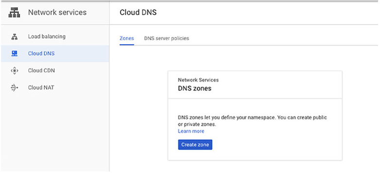

**그림 15.1** Network Services Cloud DNS 페이지

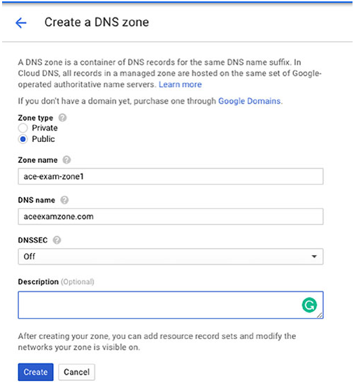

**그림 15.2** public DNS zone 생성

DNS Security인 DNSSEC을 활성화할 수 있다. DNS 서비스와 통신하는 클라이언트의 강력의 인증을 제공한다. DNSSEC은 spoofing(다른 클라이언트처럼 보이는 클라이언트)와 cache poisoning(DNS 서버를 업데이트하여 잘못된 정보를 보내는 클라이언트)를 예방하도록 설계되었다. 

private zone으로 생성하면 그림 15.3과 같은 양식이 표시된다.

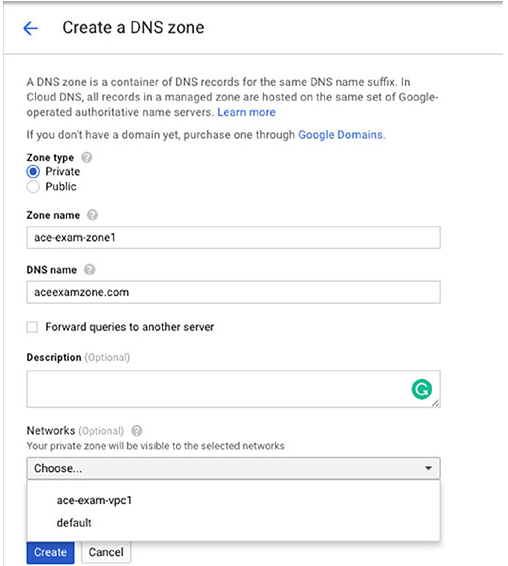

**그림 15.3** private DNS zone 생성

public zone을 위한 파라미터 셋 이외에도, private zone에 접근할 네트워크를 지정해야 한다.

zone을 생성한 후, Cloud DNS 페이지는 zone 리스트를 표시한다. (그림 15.4)

zone의 이름을 클릭하여 상세정보를 확인할 수 있다. 그림 15.5에서 보여지는 것처럼, zone 상세정보는 zone과 관련된 레코드의 리스트를 포함한다. zone이 생성되었을 때, NS와 SOA 레코드가 추가된다. NS는 zone 정보를 관리하는 공식 서버의 주소를 갖고 있는 네임 서버 레코드이다. SOA는 zone에 대해 공식 정보를 갖고 있는 Start Of Authority 레코드이다. A와 CNAME 레코드와 같은 다른 레코드를 추가할 수 있다.

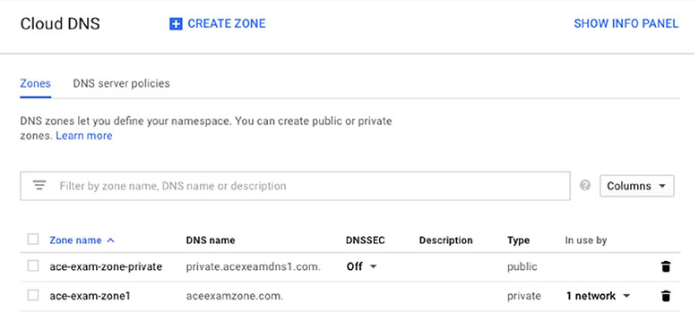

**그림 15.4** DNS zone의 리스트

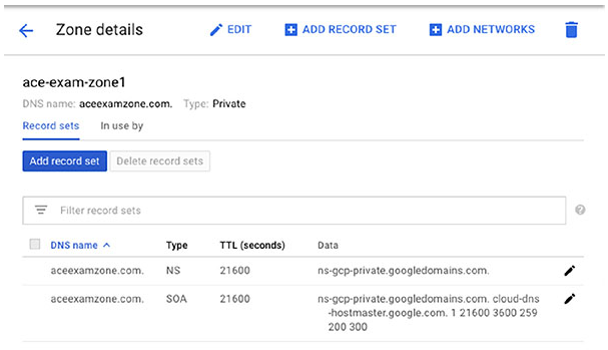

**그림 15.5** DNS zone에서 레코드의 리스트

A 레코드를 추가하기 위해, Add Record Set을 클릭하면 그림 15.6가 같은 양식이 표시된다.

리소스 레코드 타입에 A를 선택하고, zone의 도메인 이름을 IP 주소로 매핑하는 서버의 IPv4 주소를 입력한다.

time to live로 알려진 TTL와 TTL Unit 파라미터는 레코드가 캐시에서 얼마나 오래 남아있을 수 있는지 지정한다. DNS resolver가 다시 쿼리하기 전에 데이터를 캐시해야 하는 기간이다. DNS resolver는 도메인 이름을 IP주소에 메핑하는 조회 작업을 수행한다. 레코드에 다수의 IP 주소를 지정하려면, Add Item을 클릭하여 다른 IP 주소를 추가한다.

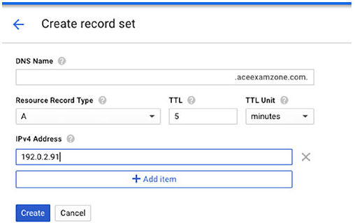

**그림 15.6** A 레코드 셋을 생성

또한 Add Record Set 양식을 사용하여 Canonical Name 레코드를 추가할 수 있다. 이 경우, Resource Record Type으로 CNAME을 선택한다. (그림 15.7)

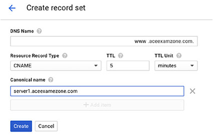

**그림 15.7** CNAME 레코드 생성

CNAME 레코드는 서버의 이름, alias를 갖는다. DNS 이름과 TTL 파라미터는 A 레코드 예시와 같다.

또한, DNS Forwarding은 Cloud VPN이나 Interconnect를 사용하는 경우 DNS 쿼리를 온프레미스 DNS 서버로 전달할 수 있다.

### gcloud를 사용하여 DNS 관리 zone 생성

DNS zone과 레코드를 추가하기 위해, `gcloud dns managed-zones`와 `gcloud dns recorde-set transaction`을 사용한다.

DNS 접미사 aceexamzone.com을 갖는 ace-exam-zone1의 관리형 public zone을 생성하기 위해 다음을 사용한다.

```bash
gcloud dns managed-zones create ace-exam-zone1 --description= --dns-name=aceexamzone.com.
```

private zone으로 만들기 위해, private을 설정하는 `--visibility`를 추가한다.

```bash
gcloud dns managed-zones create ace-exam-zone1 --description= --dns-name=aceexamzone.com. --visibility=private --networks=default
```

A 레코드를 추가하기 위해 transaction를 시작하고, A 레코드 정보를 추가하고, transaction을 실행한다.

Transaction은 `gcloud dns record-sets transaction start`로 시작된다. Record set은 `gcloud dns record-sets transaction add`를 사용하여 추가되고, transaction은 `gcloud dns record-sets transaction execute`를 사용하여 완료된다. 

```bash
gcloud dns record-sets transaction start --zone=ace-exam-zone1
gcloud dns record-sets transaction add 192.0.2.91 --name=aceexamzone.com. --ttl=300 --type=A --zone=ace-exam-zone1
gcloud dns record-sets transaction execute --zone=ace-exam-zone1
```

CNAME 레코드를 생성하기 위해, 위와 유사한 명령을 사용한다.

```bash
gcloud dns record-sets transaction start --zone=ace-exam-zone1
gcloud dns record-sets transaction add server1.aceexamezone.com. -- name=www2.aceexamzone.com. --ttl=300 --type=CNAME --zone=ace-exam-zone1
gcloud dns record-sets transaction execute --zone=ace-exam-zone1
```

## 로드밸런서 구성

로드밸런서는 어플리케이션을 실행하는 서버의 워크로드를 분산한다. 이 섹션에서, 로드밸런서의 다양한 타입과 구성하는 방법에 대해 논의한다.

### 로드밸런서의 타입

로드 밸런서는 하나의 region이나 다수의 region에 걸쳐서 로드를 분산할 수 있다. GCP에서 제공되는 일부 로드밸런서는 3가지 특징이 있다. 
* Global vs regional 로드밸런싱
* External vs internal 로드밸런싱
* HTTP와 TCP같은 트래픽 타입

Global 로드밸런서는 어플리케이션이 글로벌로 분산될 때 사용된다.

Regional 로드밸런서는 어플리케이션을 제공하는 리소스가 하나의 region에 있을 때 사용된다. 3가지 글로벌 로드밸런서가 있다.
* HTTP(S), 백엔드 인스턴스 세트에서 HTTP 및 HTTPS 로드를 밸런스
* SSL Proxy, 보안 소켓 레이어 연결인 SSL/TLS 연결을 종료. 이 타입은 non-HTTPS 트래픽에 사용된다.
* TCP Proxy, 로드 밸런서의 TCP 세션을 종료하고 백엔드 서버로 트래픽을 전달한다.

Regional 로드밸런서는 다음과 같다.
* Internal TCP/UDP, internal VM을 호스팅하는 private 네트워크의 TCP/UDP 트래픽을 밸런스
* Network TCP/UDP, IP 프로토콜, 주소, 포트를 기반으로 밸런싱. 이 로드밸런서는 SSL Proxy와 TCP Proxy 로드밸런서에서 지원되지 않는 SSL과 TCP 트래픽에 사용된다. 

External 로드밸런서는 인터넷 트래픽을 분산한다. 반면에 internal 로드밸런서는 GCP 내에서 시작되는 트래픽을 분산한다. Internal TCP/UDP 로드밸런서는 유일한 internal 로드밸러서이다. HTTP(S), SSL Proxy, TCP Proxy, Network TCP/UDP 로드밸런서는 모두 external이다. 

로드밸런서를 선택할 때 트래픽 타입도 고려해야 한다. HTTP와 HTTPS 트래픽은 external global 로드밸런싱을 사용해야 한다. TCP 트래픽은 external global, external regional, internal regional 로드밸런서를 사용할 수 있다. UDP 트래픽은 external regional이나 internal regional 로드밸런싱을 사용할 수 있다.

### Cloud Console을 사용하여 로드밸런서 구성

Cloud Console에서 로드 밸런서를 생성하기 위해, Network Services 섹션을 열고, Load Balancing을 선택한다. (그림 15.8)

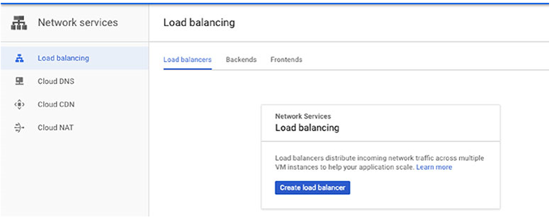

**그림 15.8** Network Services, Load Balancing 섹션

로드 밸런서를 생성하는 첫 단계는 타입을 결정하는 것이다. 이 예시에서, TCP 로드밸런서를 생성할 것이다. (그림 15.9)

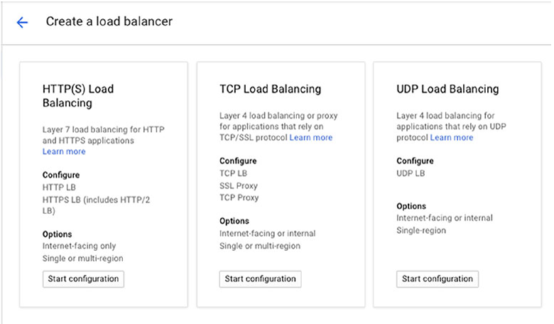

**그림 15.9** A 로드 밸런서 옵션 생성

TCP 로드밸런서 옵션을 선택한 후, 그림 15.10과 같은 양식이 나타난다. private 로드 밸런싱을 위해 Only Between My VM을 선택한다. 이 로드 밸런서는 하나의 region에서 사용되고, TCP나 SSL 프로세싱을 오프로드하지 않는다.

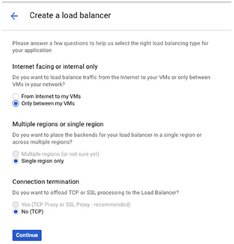

**그림 15.10** TCP 밸런서 생성

이제, 그림 15.11과 같이 3단계 프로세스를 시작할 것이다. 로드밸런서를 생성하기 전에 백엔드와 프론트엔드를 구성하고, 구성을 검토한다.

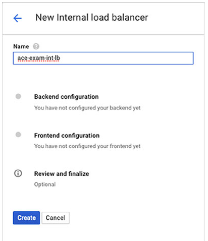

**그림 15.11** 로드밸런서를 구성하는 3단계 프로세스

백엔드를 구성하기 위해, 이름, region, 네트워크, 백엔드를 지정한다. 백엔드는 로드를 분산시킬 VM이다. 이 예시에서 2개의 기존 VM이 백엔드로 지정된다. (그림 15.12)

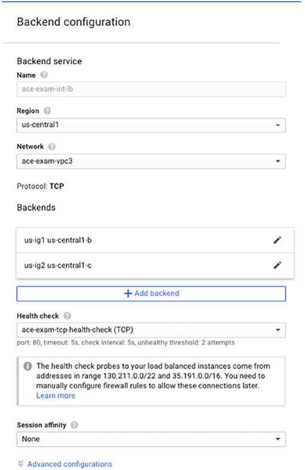

**그림 15.12** 백엔드 구성

백엔드의 health check를 구성할 수 있다. 이 것은 그림 15.13같이 별도의 양식을 가져온다.

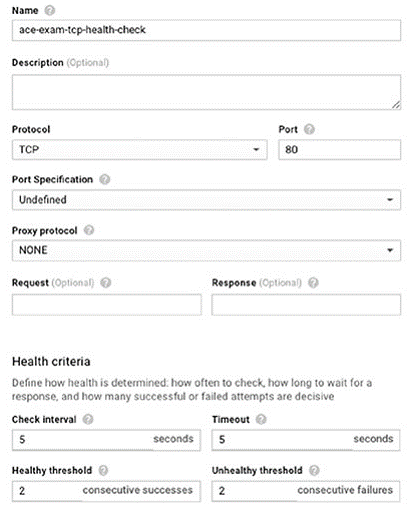

**그림 15.13** health check 생성

health check에서 이름, 프로토콜, 포트, health 기준의 집합을 지정한다. 이 케이스에서, 5초마다 백엔드를 확인하고, 5초까지 응답을 기다린다. health check 실패가 연속 2번 발생하면, 서버는 unhealthy로 간주하여 로드 밸런싱 순서에서 제거한다.

다음, 그림 15.14의 양식을 사용하여 프론트엔드를 구성한다. 이름, 서브네트워크, internal IP 구성을 지정한다. 이 케이스에서는 임시(ephemeral)이다.(아래의 "Managing IP Addresses"에서 IP 주소 타입의 상세 정보를 확인할 수 있다.) 또한 트래픽을 백엔드로 전달할 포트를 지정한다. 이 예시에서, 80번 포트에서 트래픽을 전달한다.

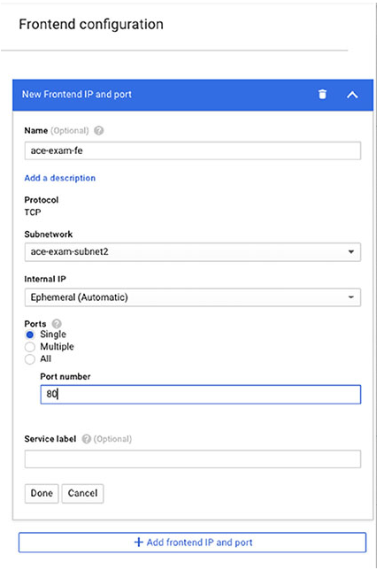

**그림 15.14** 프론트엔드 구성

프론트엔드를 생성하기 전 마지막 단계는 구성을 검토하는 것이다. (그림 15.15)

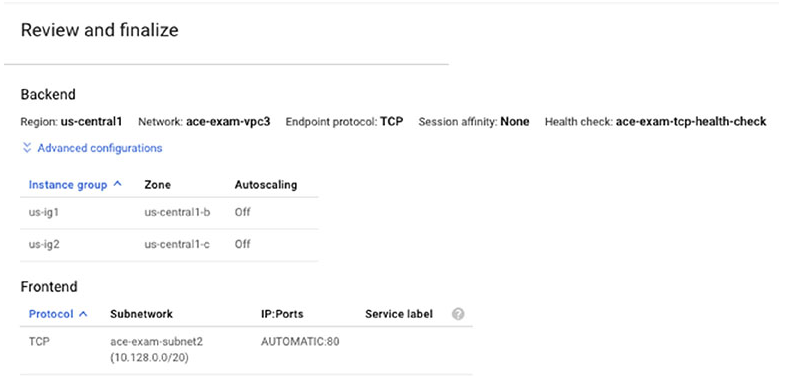

**그림 15.15** 로드밸런서 구성을 검토

로드 밸런서를 생성한 후, 콘솔에서 로드밸런서의 리스트를 확인할 수 있다. (그림 15.16)

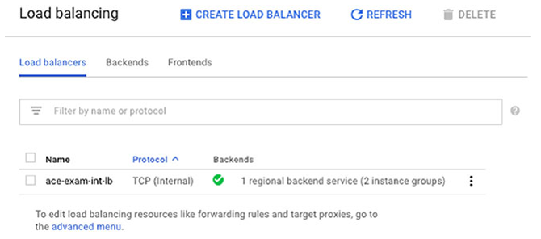

**그림 15.16** 로드밸런서 리스트

### gcloud를 사용하여 로드밸런서 구성

이 섹션에서는 네트워크 로드밸런서를 생성하는데 필요한 단계를 검토한다. HTTP(S)이외의 프로토콜을 로드밸런스해야할 때 좋은 옵션이다.

`gcloud compute forwarding-rules` 명령은 IP 주소와 일치하는 트래픽을 로드밸런서에 전달하는데 사용된다.

```bash
gcloud compute forwarding-rules create ace-exam-lb --port=80 --target-pool ace-exam-pool
```

이 명령은 `ace-exam-pool`의 모든 VM의 트래픽을 `ace-exam-lb` 로드밸런서로 라우팅한다.

Target poos은 `gcloud compute target-pools create` 명령을 사용하여 생성된다. 인스턴스는 `gcloud compute target-pools add-instances` 명령을 사용하여 target pool에 추가된다. 예를 들어, `ace-exam-pool` target pool에 VM `ig1`과 `ig2`를 추가하기 위해 다음 명령을 사용한다.

```bash
gcloud compute target-pools add-instances ace-exam-pool --instances ig1, ig2
```

## IP 주소 관리

