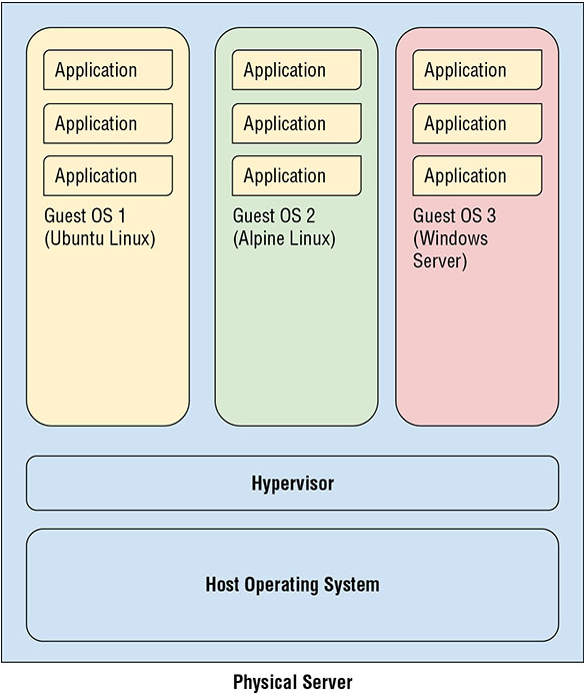
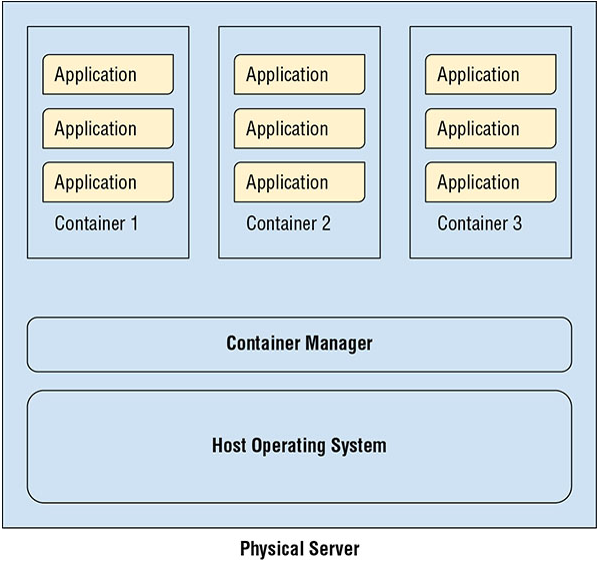

# Chapter 2 구글 클라우드 컴퓨팅 서비스

**이 챕터는 Google Associate Cloud Engineer 인증 시험에서 아래 과목을 다룬다.**

* 2.2 주어진 워크로드를 위해 적절한 컴퓨트 옵션 선택을 포함하여 컴퓨트 리소스를 기획하고 설정하는 것
* 3.4 제품을 사용한 데이터 시스템을 초기화을 포함하여 데이터 솔루션을 배포하고 구현하는 것

GPC는 다양한 컴퓨팅, 스토리지, 네트워킹 요구사항을 충족하는 거의 40개 이상의 서비스를 제공한다. 이 챕터에서는 가장 중요한 GCP 서비스의 overview를 제공하고, 이 서비스들의 중요한 사용 사례를 설명한다.

## GCP의 컴퓨팅 컴포넌트

GCP는 클라우드 컴퓨팅 고객의 광범위한 필요를 충적하기 위해 설게된 컴퓨트, 스토리지, 네트워킹 서비스를 포함한 클라우드 컴퓨팅 서비스이다. 작은 기업은 VM과 스토리지 서비스에 매력을 느낄 수 있다. 큰 기업과 다른 사이즈의 기업은 VM 클러스터의 높은 확장성, 다양한 관계형과 NoSQL 데이터베이스, 특별한 네트워킹 서비스, 고급 AI와 머신러닝 능력에 많은 흥미를 느낄수도 있다.

이 챕터는 GCP의 많은 서비스에 대한 overview를 제공한다. GCP에서 이용가능한 서비스의 범위는 계속 증가한다. 이 것을 읽는 시점에도 구글은 추가적인 서비스를 제공할지도 모른다. 서비스의 대부분은 몇 가지 핵심 분류로 그룹화될 수 있다.
* 컴퓨팅 리소스
* 스토리지 리소스
* 데이터베이스
* 네트워킹 서비스
* ID관리와 보안
* 개발 도구
* 관리 도구
* 특별 서비스

Associate Cloud Enginner 인증은 각 카테고리에 있는 서비스를 사용하는 방법과 각 카테고리의 다양한 서비스의 장단점에 익숙해야한다.

### 컴퓨팅 리소스

퍼블릭 클라우드 서비스는 넓은 컴퓨팅 서비스 옵션을 제공한다. 스펙트럼의 한쪽 끝에서, 고객들은 그들 스스로 VM을 생성하고 관리할 수 있다. 이 모델은 클라우드 사용자에게 모든 컴퓨팅 서비스의 가장 훌륭한 제어를 제공한다. 사용자들은 실행할 운영체제, 설치할 패키지, 백업할 시기, 다른 유지보수 작업을 수행을 선택할 수 있다. 이 컴퓨팅 서비스의 유형은 전형적으로 Infrastructure as a service(IaaS)로 언급된다.

다른 모델은 서버, 네트워크, 스토리지 시스템을 관리할 필요없이 어플리케이션을 실행할 런타임 환경을 제공하는 Platform as a service(PaaS)로 불린다. 

GCP의 IaaS 컴퓨팅 제품은 Compute Engine이라고 불리고, PaaS는 App Engine, CloudFunctions을 제공한다. 이외에도, 구글은 클러스터에서 컨테이너를 관리하기위한 서비스인 Kubernetes Engine을 제공한다. 이 서비스 유형은 VM의 개별 셋을 관리하는 것에 대체적으로 급격하게 유명해지고 있다.

#### Compute Engine

Compute Engine은 사용자가 VM을 생성하고, VM에 영구 스토리지를 추가하고, Cloud Storage와 같은 GCP의 다른 서비스를 사용할 수 있는 서비스이다.

VM은 물리적인 서버의 추상화이다. 이는 기본적으로 물리적인 서버를 모방하고, 개인 책상이나 데이터센터의 서버에서 좋아하는 운영체제를 실행하면 찾을 수 있었던 CPU, 메모리, 스토리지, 다른 서비스를 제공한다. VM들은 `하이퍼바이저`라고 불리는 로우레벨의 서비스에서 동작한다. GCP는 KVM 하이퍼바이스의 보안 강화 버전을 사용한다. KVM은 Kernel Virtual Machine을 의미하고 x86 하드웨어 위에서 동작하는 리눅스 시스템의 가상화를 제공한다.

하이퍼바이저는 리눅스나 윈도우 서버같은 운영체제 위에서 동작한다. 하이퍼바이저는 다른 `게스트 운영체제`라고 불리는 다양한 운영체제를 실행하는 동시에 각 운영체제의 활동을 다른 게스트 운영체제로부터 독립시킬 수 있다. 실행 중인 게스트 운영체제의 각 인스턴스는 VM 인스턴스이다. 그림 2.1은 물리적인 서버에서 실행하는 VM 인스턴스의 눈리적인 구성를 보여준다.



FIGURE 2.1 하이퍼바이저 내에서 동작하는 VM 인스턴스

VM은 미리 정의된 여러 가지 사이즈가 있지만, 커스텀 구성으로 생성할 수 있다. 인스턴스를 생성할 때, 아래와 같은 여러 가지 파라미터를 지정할 수 있다. 
* 운영체제
* 영구 스토리지의 사이즈
* 머신러닝과 같이 계산 집중적인 동작을 위한 GPU 추가
* 선점형 VM 생성

마지막 옵션인 "선점형 VM 생성하기"는 일반적인 VM보다 80퍼센트 정도 적게 비용이 발생할 수도 있지만, VM이 구글에 의해서 언제든지 종료될 수 있다. 선점형 VM이 최소 24시간동안 실행될 경우 종종 종료된다.

챕터 4는 Compute Engine VM을 관리하는 상세 정보에 대해서 설명할 것이다. Compute Engine을 탐색하기 위해서는 구글 Cloud Console에 로그인하고, 왼쪽 메인 메뉴에서 Compute Engine을 선택한다.

#### Kubernetes Engine

Kubernetes Engine은 사용자가 서버의 클러스터에서 컨테이너화된 어플리케이션을 쉽게 실행할 수 있도록 설계되었다. 컨테이너는 컴퓨팅 프로세스와 리소스를 독립시키기 위해서 사용되기 때문에 VM과 자주 비교된다. 컨테이너는 컴퓨팅 프로세스를 독립시키기 위해서 VM보다 다른 방식을 사용한다.

언급되었던것 처럼, VM은 물리서버 위에 게스트 OS에서 동작한다. 물리적인 서버는 하이퍼바이저와 함께 운영체제도 실행한다. 컴퓨팅 리소스를 독립시키기위한 또다른 방식은 프로세스와 리소스를 독립시키는 호스트 운영체제의 기능을 사용하는 것이다. 이 방식은 하이퍼바이저가 필요하지 않으므로 호스트 운영체제는 독립 상태를 유지한다. 컨테이너 매니저 위에서 실행하는 추가 혹은 게스트 OS가 없다. 그 대신, 컨테이너는호스트 운영체제 기능을 사용하는 동시에 운영체제와 컨테이너 매니저는 동작 중인 컨테이너간 독립을 보장한다. 그림 2.2는 컨테이너의 논리적인 구조를 보여준다.



FIGURE 2.2 물리 서버에서 동작하는 컨테이너

Kubernetes Engine은 사용자가 서비스를 실행할 수 있는 컴퓨트, 스토리지, 메모리 리소스를 설명할 수 있는 GCP 제품이다. Kubernetes Engine은 기본적인 리소스를 할당한다. 커맨드라인이나 GUI를 사용하면 Kubernetes 클러스터의 리소스를 추가하고 제거하기 쉽다.

게다가, Kubernetes는 클러스터에 있는 서버의 상태를 모니터링하고, 서버의 에러와 같은 문제를 자동적으로 해결한다. Kubernetes Engine은 또한 어플리케이션의 부하가 증가하면, Kubernetes Engine은 추가적인 리소스를 할당하기 위해서 오토스케일링을 지원한다.

챕터 7은 Kubernetes Engine을 기획하고 관리하기위한 상세정보에 대해 설명할 것이다. Kubernetes Engine을 탐색하기 위해서 구글 Cloud Console에 로그인하고, 왼쪽 메뉴에서 Kubernetes Engine을 선택한다.

#### App Engine

App Engine은 GCP의 컴퓨트 PaaS 상품이다. App Engine을 사용하는 개발자와 어플리케이션 관리자는 VM 구성이나 Kubernetes 클러스터 설정에 대해 관여할 필요가 없다. 그 대신, 개발자는 Java, Go, Python, Node.JS와 같은 언어로 어플리케이션을 만들고, 서버리스 어플리케이션 환경에 코드를 배포한다.

App Engine은 기본적인 컴퓨팅과 네트워크 인프라를 관리한다. VM이나 어플리케이션을 보호하는 강화된 네트워크를 설정할 필요가 없다. App Engine은 웹과 모바일 백엔드 어플리케이션에 적절하다. 

App Engine은 2가지 유형으로 이용할 수 있다: standard and flexible

standard 환경에서는 특정 언어별 샌드박스에서 어플리케이션을 실행하므로, 어플리케이션은 기본적인 서버의 운영체제뿐만 아니라 서버에서 동작하는 다른 어플리케이션으로부터 분리된다. standard 환경은 지왼되는 언어 중 하나로 만들어진 어플리케이션에 적합하고, 어플리케이션 코드와 함께 설치되어야하는 소프트웨어와 운영체제 패키지가 필요하지 않다. 

flexible 환경에서는 App Engine 환경에서 Docker 컨테이너를 실행한다. flexible 환경은 어플리케이션 코드를 갖고 있지만, 라이브러리나 다른 써드파티 소프트웨어가 필요한 경우 잘 동작한다. 이름에서 알수 있듯이, flexible 환경은 백그라운드 프로세스에서 작업하고 로컬 디스트에 작성하는 기능을 포함한 많은 옵션을 제공한다.

챕터 9는 App Engine 사용과 관리를 위한 상세정보를 소개할 것이다. App Engine을 탐색하기 위해서 구글 Cloud Console에서 왼쪽 메뉴 중, App Engine을 선택한다.

#### Cloud Functions

구글 Cloud Functions는 이벤트 중심 프로세싱에 적합한 가벼운 컴퓨팅 옵션이다. Cloud Functions은 Cloud Storage에 파일이 업로드되거나 메시지 큐에 메시지가 쓰여진것 처럼 이벤트를 응답하는 코드를 실행한다. Cloud Functions 환경에서 실행되는 코드는 짧게 동작해야하고, 이 컴퓨팅 서비스는 오래 동작하는 코드를 실행하도록 설계되지 않았다. 오래 동작하는 어플리케이션이나 업무를 지원해야할 필요가 있다면, Compute Engine, Kubernetes Engine, App Engine을 고려해야한다.

Cloud Functions은 써드파티 API나 자연어 번역 서비스같은 다른 GCP 서비스와 같은 다른 서비스를 호출하는데 자주 사용된다. 

App Engine처럼, Cloud Functions은 서버리스 제품이다. 사용자는 오직 코드를 제공해야한다; VM을 설정하거나 컨테이너를 생성할 필요가 없다. Cloud Functions은 부하 증가에따라서 자동적으로 확장한다.

4가지 주요 컴퓨팅 제품에 추가적으로 GCP는 스토리지 리소스를 제공한다.

챕터 10은 Cloud Functions 사용과 관리의 상세정보를 설명한다. Cloud Functions을 탐색하기위해서 구글 Cloud Console에 로그인하고 왼쪽 메뉴에서 Cloud Functions을 선택한다.

## GCP의 스토리지 컴포넌트

클라우드에서 동작하는 어플리케이션과 서비스는 저장소에 대한 넓은 범위의 요구사항을 충족해야한다.

### 스토리지 리소스

때때로 어플리케이션은 적당한 양의 데이터를 빠르게 읽고 쓰는게 필요하다. 경우에 따라 비즈니스 어플리케이션은 페타바이트의 저장소에 접근할 필요가 있을지도 모른다. 하지만 문서를 조회하는데 몇 분, 심지어 몇 시간까지 허용할 수 있다. GCP는 오브젝트와 파일을 저장하기위한 스토리지 리소스를 갖고 있다.

#### Cloud Storage

Cloud Storage는 GCP의 오브젝트 스토리지 시스템이다. 오브젝트는 파일이나 바이너리 오브젝트의 어떠한 유형일 수 있다. 오브젝트는 파일 시스템에서 디렉토리와 유사한 버킷에 구성된다. Cloud Storage가 파일 시스템이 아니라는 것을 기억해야한다. 분산된 스토리지 시스템으로터 파일이나 오브젝트를 수신하고, 저장하고, 조회하는 서비스이다. Cloud Storage는 영구 디스크가 추가되는 방식처럼 VM의 일부가 아니다. Cloud Storage는 VM(이나 다른 네트워크 장치)과 영구 디스크에 있는 완전한 파일 시스템에서 접근할 수 있다.

각 저장된 오브젝트는 URL에 의해서 유니크한 주소를 갖고 있다. 예를 들어, `ace-certification-exam-prep` 이름의 버킷에 저장된 이 챕터의 .pdf 버전인 chapter1.pdf는 아래와 같은 주소로 지정될 수 있다.
**https://storage.cloud.google.com/ace-certification-exam-prep/chapter1.pdf**

GCP 사용자와 다른 사람들은 버킷에 있는 오브젝트를 읽고 쓰는 권한을 얻을 수 있다. 종종, 어플리케이션은 버킷을 읽고 쓸 수 있는 권한을 IAM 정책을 통해서 얻게될 것이다.

Cloud Storage는 단일 데이터를 다루는 오브젝트를 저장하는데 유용하다. 예를 들어, 이미지는 오브젝트 스트리지를 위해 좋은 후보이다. 이미지는 일반적으로 갑작스럽게 읽고 쓰여진다. 이미지의 일부분만 조회할 필요는 거이 없다. 일반적으로, 갑작스럽게 오브젝트를 쓰거나 조회하고, 언제든지 동작되거나 동작되지 않을 수 있는 서버와 독립적으로 저장해야 한다면, Cloud Storage는 좋은 옵션이다.

Cloud Storage에는 다양한 등급이 있다. Reginal Storage는 하나의 구글 클라우드 `region`에 오브젝트의 사본을 저장한다. region은 여러 `zone`이나 배포 영역을 가질 수 있는 분명한 지리적 영역이다. zone은 단일 장애 도메인으로 간주된다. 즉, 어플리케이션의 모든 인스턴스가 하나의 zone에서 동작하고 장애가 발생한다면, 어플리케이션의 모든 인스턴스에 접근하지 못할 것이다. Regional Storage는 같은 region에서 동작하고, Cloud Storage에 있는 오브젝트로 접근하는데 지연시간이 낮아야 하는 어플리케이션을 위해서 적합하다.

Cloud Storage는 여러 region 지원과 같이 몇몇 유용한 고급기능을 갖고 있다. 이 기능은 여러 GCP region에 오브젝트의 복사본을 저장하는 것을 제공한다. 이는 높은 유용성, 지속성, 낮은 지연시간을 위해서 중요하다.

**실제 시나리오**
```text
us-east1 지역에 정전이 발생하고, 오브젝트가 해당 지역에만 저장되어 있다면, 정전동안 이 오브젝트에 접근할 수 없다. 그러나, 멀티리전 스토리지를 사용할 수 있다면 us-east1에 저장된 오브젝트는 us-west1과 같은 다른 리전에 저장되어있을 것이다.
```

높은 유용성, 지속성 이외에도 Multiregion storage는 사용자나 어플리케이션이 여러 지역에 걸쳐서 분산되어있을 때 데이터에 더 빠르게 접근할 수 있다. 

때때로 데이터는 드물게 접근하지만, 장기간동안 유지될 필요가 있다. 이런 경우에, nearling storage는 regional이나 multiregional storage보다 비용이 적고, 빈번하지 않은 접근에 최적화되어있기 때문에 좋은 옵션이다.

cold storage는 높은 지속성과 빈번하지않은 접근을 위해 설계된 저비용 저장소이다. 이 스토리지 등급은 1년에 한번도 접근을 하지 않는 데이터를 위해 적합하다.

Cloud Storage의 유용한 기능은 사전에 정의한 정책을 기반으로 자동적으로 오브젝트를 관리할 수 있는 lifecycle 관리 정책 기능이다. 예를 들어, 버킷에서 60일이 지난 모든 오브젝트를 nearline storage로 이동하거나 coldline storage 버킷에서 5년 이상된 오브젝트를 삭제하는 정책을 정의할 수 있다.

#### 영구 디스크(Persistent Disk)

영구 디스크는 Compute Engine이나 Kubernetes Engine에  추가되는 스토리지 서비스이다. 영구 디스크는 SSD와 HDD위에 블록 스토리지를 제공한다. SSD는 영구 디스크 성능이 중요한 저지연의 어플리케이션을 위해 종종 사용된다. SSD는 HDD보다 비싸다. 그래서 많은 양의 영구 디스크가 필요하지만, 더 긴 읽고 쓰기 시간을 허용할 수 있는 어플리케이션은 HDD를 사용하여 스토리지 요구사항을 충족시킬 수 있다.

GCP에서 영구 디스크의 장점은 성능 저하 없이 다양한 클라이언트가 디스크를 읽을 수 있다는 점이다. 여러 인스턴스가 단일 데이터의 사본을 읽을 수 있다. 디스크는 VM을 재기동할 필요 없이 사용하는 동안 필요에 따라서 사이즈를 조정할 수 있다.

영구 디스크는 SSD나 HDD를 사용하여 64TB까지 사이즈가 증가될 수 있다.

#### Cloud Storae for Firebase

모바일 앱 개발자는 Firebase용 Cloud Storage가 클라우드 오브젝트 스토리지의 최고의 조합이고, 좋지 않은 네크워크 연결상태의 모바일 디바이스로부터 업로드와 다운로드를 지원하는 기능이라고 생각할 수 있다.

Firebase API를 위한 Cloud Storage는 안전한 전송뿐만 아니라 잠재적으로 문제가 있을 수 있는 네트워크 품질을 다루는 recovery 메커니즘을 제공하도록 설계되었다. 사진이나 음악과 같은 파일이 Cloud Storage에 업로드 되면, Cloud Storage Cli와 SDK를 통해서 파일에 접근할 수 있다.

#### Cloud Filestore

때때로 개발자들은 네트워크 연결 스토리지에 저장된 파일시스템에 접근할 필요가 있다. 이러한 사용 사례로, Cloud Filestore 서비스는 Compute Engine와 Kubernetes Engine과 함께 사용할 수 있는 공유 파일시스템을 제공한다. 

Filestore는 높은 수의 초당 I/O 동작(IOPS)뿐만 아니라 다양한 스토리지 용량을 제공할 수 있다. 파일 시스템 관리자는 지정된 IOPS와 용량 요구사항에 충족하도록 Cloud Filestore를 설정할 수 있다.

Filestore는 네트워크 파일 시스템(NFS)프로토콜로 구현되어서 시스템 관리자는 가상 서버에 공유 파일 시스템을 쉽게 마운트할 수 있다.

스토리지 시스템은 파일같은 큰 덩어리의 물체를 저장하는데 사용된다. 데이터가 작은 구조이고, 리턴하는 데이터의 서브셋을 설명하는 쿼리를 사용하여 조회될 때, 데이터베이스 관리 시스템으로 가장 좋다.

챕터 11에는 스토리지 서비스 기획을 위한 상세정보와 가이드를 설명한다. 스토리지 옵션을 탐색하기 위해서 구글 클라우드 Console에 로그인하고 왼쪽 메뉴에서 Storage나 Filestore를 선택한다.

### 데이터베이스

GCP는 몇 개의 데이터베이스 옵션을 제공한다. 몇개는 관계형 데이터베이스이고, 몇개는 NoSQL 데이터베이스이다. 몇 개는 서버리스이고, 몇 개는 서버의 클러스터를 관리해야 한다. 몇 개는 최소한의 트랜잭션을 위한 지원을 제공하고, 몇 개는 일관성과 트랜잭션 요구사항이 덜 중요한 어플리케이션에 적합하다. GCP 사용자는 서비스를 선택하기 전에 어플리케이션의 요구사항에 대해서 이해해야한다. 이는 어플리케이션 스택에서 핵심 스토리지 서비스를 제공하는 데이터베이스를 선택할 때 특히 중요하다.

#### Cloud SQL

Cloud SQL은 사용자가 데이터베이스 백업이나 데이터베이스 소프트웨어 패치와 같은 데이터베이스 관리 업무를 시도해야하는 필요 없이 VM에 MySQL이나 PostgreSQL 데이터베이스를 설치하는 GCP의 관계형 데이터베이스 서비스이다. Cloud SQL은 다음과 같은 구성으로 제공된다.
* 1세대 MySQL 데이터베이스는 MySQL 5.5 혹은 5.6을 사용하고, 16GB RAM과 500GB 스토리지까지 사용할 수 있다.
* 2세대 MySQL 데이터베이스는 MySQL 5.6 혹은 5.7을 사용하고, 416GB RAM과 함께 10TB 스토리지까지 사용할 수 있따. 2세대 MySQL 데이터베이스는 필요에따라 스토리지를 자동적으로 추가도록 설정할 수 있다.
* PostgreSQL 9.6은 2세대 플랫폼 의에서 동작하고, 64CPUs/416RAM/10TB스토리지까지 설정할 수 있다. Cloud SQL의 PostgreSQL은 PostGIS, 분석을 위한 cubes, 단일 PostgreSQL 값에서 key-value 쌍을 저장하기 위한 hstore 같은 확장프로그램을 지원한다.

이 데이터베이스 서비스는 복제(replication) 관리를 포함하고, 가용성이 높은 데이터베이스를 위해 자동 failover를 제공한다.

관계형 데이터베이스는 비교적 일관된 데이터 구조의 요구사항을 같은 어플리케이션에 적합하다. 예를 들어, 은행 데이터베이스는 계좌번호, 고객 이름, 주소 등을 추적한다. 사실상 데이터베이스에서 모든 레코드는 같은 정보가 필요하기 때문에, 이 어플리케이션을 관계형 데이터베이스가 가장 적합하다.

#### Cloud Bigtable

Cloud Bietable은 십 억개의 행과 천개의 열까지 관리할 수 있는 페타바이트급의 어플리케이션을 위해 설계되었다. `wide-column data model`로 알려진 NoSQL 모델 기반이고, 관계형 데이터베이스를 지원하는 Cloud SQL와는 다르다. Bigtable은 저지연의 읽고쓰는 동작이 필요한 어플리케이션에 적합하다. 초당 백만개의 동작을 지원하도록 설계되었다.

Bigtable은 Cloud Storage, Cloud Pub/Sub, Cloud Dataflow, Cloud Dataproc과 같이 다른 구글 클라우드 서비스과 통합된다. 하둡 빅데이터에서 데이터 접근을 위한 API인 Hbase API를 지원한다. Bigtable은 또한 데이터 처리, 그래프 분석, 시계열 분석을 위한 오픈소스 도구와 통합된다. 

#### Cloud Spanner 

Cloud Spanner는 NoSQL 데이터베이스처럼 수평적인 확장 기능과 함께 높은 일관성과 트랙잭션과 같은 관계형 데이터베이스의 핵심 장점을 조합한 구글의 글로벌 분산 관계형 데이터베이스이다. Spanner는 99.999퍼센트의 SLA를 갖춘 고가용성 데이터베이스로, 확장가능하고, 고가용성의 관계형 데이터베이스를 요구하는 기업 어플리케이션을 위해 적합한 옵션이다.

Cloud Spanner는 또한 ID 기반의 접근 제어와 함께 유휴 암호화와 전송 중 암호화를 통혜 엔터프라이즈급 보안을 갖는다.

Cloud Spanner는 ANSI 2011 표준 SQL을 지원한다.

#### Cloud Datestore

Cloud Datsstore는 NoSQL 문서 데이터베이스이다. 이러한 종류의 데이터베이스는 문서 컨셉이나 key-value 쌍의 collection을 기본구성블록으로 사용한다. 문서는 유연한 스키마를 허용한다. 예를 들어, 책에 대한 문서는 저자, 제목, 출판일을 나열한 key-value 쌍을 갖을 수 있다. 몇몇 책은 회사 웹사이트와 다른 언어로 번역에 대한 정보를 갖을 수도 있다. 포함될수도 있는 키의 집합은 문서 데이터베이스에서 사용하기 전에 정의할 필요가 없다. 이 것은 어플리케이션이 설계 당시에 알려지지 않은 속성들을 수용하는데 유용하다.

Cloud Datastore는 Compute Engine, Kubernetes Engine, App Engine에서 동작하는 어플리케이션에서 사용될 수 있는 REST API를 통해 접근된다. 이 데이터베이스는 로드에 따라서 자동적으로 확장될 것이다. 또한, 성능을 유지하는 필요한 데이터를 `shard`나 파티션화 할 것이다. Cloud Datastore는 관리형 서비스이기 때문에, 복제(replication), 백업, 다른 데이터베이스 관리 업무를 받는다.

NoSQL 데이터베이스일지라도 Cloud Datastore는 트랜잭션, 인젝트, SQL같은 쿼리를 지원한다.

Cloud Datastore는 고가용성과 구조화 데이터를 요구하는 어플리케이션에 적합하고, 데이터를 읽을 때 항상 높은 일관성을 필요로하지 않는다. 제품 카탈로그, 유저 프로필, 사용자 사용 이력은 Cloud Datastore를 사용하는 어플리케이션의 예시이다.

#### Cloud Memorystore

Cloud Memorystore는 인메모리 캐시 서비스이다. GCP에서 제공되는 다른 데이터베이스들은 큰 용량의 데이터를 저장하고, 복잡한 쿼리를 지원하도록 설계되었지만, Cloud Memorystore는 메모리에서 자주 사용되는 데이터를 캐시하기위한 Redis 서비스이다. 캐시는 어플리케이션에서 데이터를 읽는데 필요한 시간을 줄이는데 사용한다. Cloud Memorystore는 밀리초 미만의 데이터 접근을 제공하도록 설계되었다.

관리형 서비스로서, Cloud Memorystore는 사용자가 캐시의 사이즈를 지정할 수 있도록 하고, 관리 업무를 구글에 맡길 수 있다. GCP는 고가용성, 패치, 자동 failover를 보장한다.

#### Cloud Filestore

Cloud Filestore는 확장성이 뛰어난 웹과 모바일 어플리케이션을 위한 백엔드로 설계된 또 다른 GCP의 관리형 NoSQL 데이터베이스 서비스이다. Cloud Filestore의 차별화 기능은 오프라인 지원, 동기화, 모바일, IoT 디바이스를 통한 데이터를 관리하기 위한 기능, 백엔드 데이터 저장소를 제공하는 클라이언트 라이브러리이다.

Cloud Firebase는 Datastore 모드가 포함되어있어 Datastore로 작성된 어플리케이션도 Cloud Firebase와 함께 동작할 수 있다. Native 모드로 동작할 때, Cloud Firestore는 실시간 데이터 동기화와 오프라인 지원을 제공한다.

챕터 12는 다양한 유형의 데이터베이스를 생성하는 방법뿐만 아니라 데이터를 로드하고, 삭제하고 쿼리하는 방법의 상세 정보에 대해 자세하게 다룬다. 각 데이터베이스들은 구글 클라우드 console의 메인 메뉴에서 접속할 수 있다. 거기에서 각각의 작동방식을 탐색하고 차이를 확인할 수 있다.

## GCP의 네트워킹 컴포넌트

이 섹션에서는 주요한 네트워킹 컴포넌트를 확인할 것이다. 네트워킹을 세팅하고 관리하는 상세 정보들은 챕터 14, 15에서 설명된다.

### 네트워킹 서비스

GCP는 사용자가 구글의 글로벌 네트워크 인프라 내의 가상 네트워크를 설정하고, 온프레미스 데이터센터와 구글의 네트워크를 연결하고, 컨텐츠 전달을 최적화하고, 네트워크 보안 서비스를 사용하여 클라우드 리소스를 보호하는 것이 가능하도록 설계된 몇 가지의 네트워킹 서비스를 제공한다.

#### Virtual Private Cloud(VPC)

기업이 자체 데이터 센터를 운영할 때, 물리적으로 데이터 센터의 위치한 것과 네트워크에 연결된 것을 제어한다. 이 인프라는 다른 데이터센터에서 동작하고있는 다른 조직과 물리적으로 독립된다. 이 조직이 퍼블릭 클라우드로 이동할 때, 퍼블릭 클라우드의 다른 고객과 인프라를 공유한다. 다양한 기업이 같은 클라우드 인프라를 사용할지라도, 각 기업은 VPC를 생성하여 클라우드 리소스를 논리적으로 독립할 수 있다.

GPC의 차별화 기능으로 VPC는 공인 인터넷에 의존하지않고 전세계로 확장할 수 있다. VPC에서 어떠한 서버로의 트래픽은 구글읠 글로벌 네트워크를 통해 해당 네트워크의 다른 지점으로 안전하게 라우팅될 수 있다.구글 네트워크 구조의 또 다른 장점은 자신의 백엔드 서버가 백엔드 서버를 위한 공인 IP 주소를 생성하지 않고, 머신러닝이나 IoT 서비스같은 구글 서비스에 접근할 수 있다는 것이다.

구글 클라우드의 VPC들은 Internet Protocal Security(IPSec)을 사용하여 온프레미스 가상 사설 네트워크에 연결될 수 있다.

VPC가 글로번일지라도, 기업을 조직 내에서 다른 부서나 그룹을 관리하도록 프로젝트와 과금 계정을 분리하여 사용할 수 있다. 방화벽도 VPC의 리소스로 접근하는데 엄격하게 사용될 수 있다.

#### 클라우드 로드밸런싱

구글은 클라우드 인프라를 전반에서 워크로드를 분산하는 글로벌 로드밸런싱을 제공한다. 단일 멀티캐스트 IP주소를 사용하여 Cloud Load Balancing은 리전 내 및 여러 리전간 워크로드를 분산하고, 장애가 발생하거나 성등이 저하된 서버에 적응하고, 워크로드의 변화를 수용하는 컴퓨트 리소스를 자동으로 확장할 수 있다. Cloud Load Balancing은 또한 내부 로드 밸런싱을 지원한다. 그래서 로드밸런싱의 장점을 얻기 위해서 IP주소가 인터넷에 노출될 필요가 없다.

Cloud Load Balancing은 HTTP, HTTPS, TCP/SSL, UDP 트래픽을 로드밸런스할 수 있는 소프트웨어 서비스이다.

#### Cloud Armor

인터넷에 노출된 서비스는 Distributed Denial-of-Service(DDoS) 공격의 타켓이 될 수 이따. Cloud Armor는 글로벌 HTTP(s) 로드밸런싱 서비스를 기반한 구글 네트워크 보안 서비스이다. Cloud Armor는 다음 기능을 포함한다.
* IP 주소 기반으로 접근을 허용하거나 제한하는 기능
* 사이트간 스크립팅 공격에 대응하기 위한 미리 정의된 규칙
* SQL injection 공격을 대응하기 위한 기능
* L3와 L7의 규칙을 정의하는 기능
* 인입되는 트래픽의 지리적 위치를 기반으로 접근을 허용하고 제한

#### Cloud CDN

Content Delevery Network(CDNs)로, 어느 곳에 있는 사용자는 다양한 리전에 분산된 시스템으로부터 컨텐츠를 요청할 수 있다. CDNs는 전 세계의 엔드포인트 세트에 컨텐츠를 캐시하여 이러한 요청에 대한 저지연으로 응답을 가능하게 한다. 현재 구글은 글로벌 리소스로 관리되는 90개 이상의 CDN 엔드포인트를 갖고 있다. 그래서 지역별로 구성을 유지할 필요가 없다.

CDNs는 많은 양의 정적 컨텐츠워 글로벌 고객의 분야를 위해서 특히 중요하다. 예를 들어, 뉴스 분야는 세계에서 어느 지점으로부터 오는 요청에 대해 빠른 응답을 보증하는 Cloud CDN 서비스를 사용할 수 있다.

#### Cloud Interconnect

Cloud Interconnect는 기존 네트워크를 구글 네트워크에 연결하기 위한 GCP 서비스 집합이다. Cloud Interconnect는 interconnects와 peering, 2가지 유형의 연결을 제공한다.

네트워크에 직접 접근하는 Interconnect는 VPC에 있는 디바이스에 연결기위해 Private Internet 표준(RFC1918)의 주소 할당을 사용한다. 직접적인 네트워크 연결은 온프레미스나 데이터센터와 북미, 남미, 유럽, 아시아, 호주에 위치한 구글의 시설 중 하나와 연결을 유지한다. 그 대신, 한 조직이 구글 시설과 직접적인 interconnect를 할 수 없다면, Partner Interconnect를 사용할 수 있다. 이 서비스는 업체의 데이터 센터와 구글 시설간 연결을 제공하는 써드파티 네트워크 제공업체에 의존한다.

직접적이거나 peer interconnect의 대역폭을 필요하지 않는 조직을 위해서 구글은 공인 인터넷을 사용하여 데이터센터와 구글 시설간 트래픽을 전송할 수 있는 VPN 서비스를 제공한다.

#### Cloud DNS

Cloud DNS는 GCP에서 제공되는 도메인 이름 서비스이다. Cloud DNS는 74.120.28.18과 같은 IP 주소를 example.com과 같은 도메인 이름으로 매핑하기 위한 고가용성, 저지연 서비스이다.

Cloud DNS는 자동적으로 확장되도록 설계되어서 사용자는 기본적인 인프라의 확장에 대한 걱정 없이 수 천, 수 만개의 주소를 보유할 수 있다. Cloud DNS는 또한 VM의 커스텀 이름을 생성할 수 있는 private zone을 제공한다.

### Identity Management

GCP의 Cloud Identity and Access Maangement(IAM) 서비스는 사용자가 클라우드 리소스에 세부적인 접근 제어를 정의할 수 있다. IAM은 사용자(users), 역할(roles), 관리자 권한(privileges)의 개념을 사용한다.

ID는 서비스의 사용자에 대한 추상화이다. ID가 로그인이나 다른 메커니즘을 통해 인증된 후에, 인증된 사용자는 리소스에 접근하고, ID에 부여된 권한을 기반으로 동작을 수행할 수 있다. 예를 들어, 사용자는 Cloud Storage에 버킷을 생성하거나 Compute Engine에 동작하고있는 VM을 삭제하는 권한을 갖을 수 있다.

사용자는 종종 유사한 권한(Permission)의 집합을 필요로 한다. VM을 생성하는 능력을 갖는 누군가는 VM을 수정하거나 삭제할 수 있기를 원할 것이다. 관련된 권한 그룹은 역할로 묶을 수 이따. 역할(roles)은 ID에 할당된 권한의 집합이다.

구글 Associate Cloud Engineer 인증에서 ID, 역할, 사용 권한, 조직과 프로젝트를 전반적으로 관리하는 방법에 대해서 친숙해져야 한다.

구글 클라우드 Console에서 IAM과 어드민 메뉴 아래에 identity management tools를 확인할 수 있다. 챕터 17은 ID, 역할에 대한 상세정보와 이런 관리를 위한 좋은 사례를 제공한다.

### Development Tools

GCP는 인프라에 대한 쉬운 접근과 데이터 관리 서비스뿐만 아니라 이를 지원하는 도구때문에 개발자와 소프트웨어 엔지니어에게 좋은 선택이다. 

Cloud SDK는 VM, 디스크 스토리지, 네트워크 방화벽, GCP에 배포될지도 모르는 다른 가상화 리소스를 포함하여 GCP 리소스를 관리하기 위한 커맨드라인 인터페이스이다. Cli 이외에도 Cloud SDK는 JAVA, Python, Node.JS, Ruby, GO, .NET, PHP를 위한 클라이언트 라이브러리를 갖는다.

GCP는 또한 Container Registry, Cloud Build, Cloud Source Repositories로 컨테이너화 어플리케이션 배포를 지원한다.

구글은 유명한 개발도구로 작업하기 쉽게 플러그인을 개발했다. 
* IntelliJ를 위한 Cloud Tool
* PowerShell을 위한 Cloud Tool
* Visual Studio를 위한 Cloud Tool
* Eclipse를 위한 Cloud Tool
* App Engine Gradle 플러그인
* App Engine Maven 플러그인

물론, GCP는 어플리케이션이 개발에서 상용으로 배포되고, 배포된 후에 어플리케이션을 모니터링하고 유지하는데 도움을 주는 추가적인 관리 도구를 제공한다.

## GCP의 추가적인 컴포넌트

관리 도구는 어플리케이션의 신뢰성, 가용성, 확장성을 보장하기위한 책임을 갖는 DevOps 전문가를 위해 설계되었다.

### 관리 도구

관리 도구 카테고리에서 가장 중요한 도구의 몇 가지이다.

**Stackdriver**는 어플리케이션과 인프라로부터 메트릭스, 로그, 이벤트 데이터를 수집하고, 데이터를 통합해서 DevOps 엔지니어가 모니터링하고, 평가하고, 운영적인 문제를 진단할 수 있는 서비스이다.

**Monitoring**은 GCP와 AWS 리소스, Nginx, Cassandra, Elasticsearch과 같이 유명한 오픈소스 시스템을 포함한 어플리케이션 계측으로부터 성능 데이터를 수집하여 Stackdriver의 기능을 확장한다.

**Logging**은 사용자가 GCP와 AWS 로그의 로그 데이터를 저장하고, 분석하고, 알람을 받을 수 있는 서비스이다.

**Error Reporting**은 중앙 집중식 인터페이스에 표시하기위한 어플리케이션 충돌 정보를 집계한다.

**Trace**는 어플리케이션에 지연 데이터를 캡처하여 성능 문제 지역을 식별하는데 도움을 주는 분산 추적 서비스이다.

**Debugger**는 개발자가 실행 중인 코드, 명령어 입력의 상태를 점검하고, 콜 스택 변수를 확인할 수 있다.

**Profiler**은 어플리케이션의 호출 계층의 전반적인 CPU와 메모리 활용 정보를 수집하는데 사용된다. Profiler는 어플리케이션 성능에 미치는 영향을 최소화하는 통계적인 샘플링을 사용한다.

관리 도구의 조합은 운영 시스템의 효과적인 모니터링과 분석하여 상용에서 동작하는 어플리케이션에 대한 인사이트를 제공한다.

### 특별한 서비스

IaaS와 Paas 제공 이외에도, GCP는 APIs, 데이터 분석, 머신러닝을 위한 특별한 서비스를 갖고있다.

#### Apigee API 플랫폼

Apigee API 플랫폼은 본인의 어플리케이션에 접근하는 API를 GCP 사용자들에게 제공하기위한 관리 서비스이다. Apigee 플랫폼은 개발자가 API를 배포하고, 모니터링하고, 보안하는 것을 허용한다. 또한 Open API Specification 기반으로 API 프록시를 생성한다.

API의 로드를 예측하기 어렵고, 때때로 사용량이 급증할 수 있다. 그 시간에 Apigee API 플랫폼은 사용자가 정의할 수 있는 정책을 기반으로 라우팅과 비율 제한을 제공한다.

API는 OAuth 2.0이나 SAML을 사용하여 인증될 수 있다. 데이터는 Apigee API 플랫폼에서 전송 중과 전송 중이지 않을 때 모두 암호화된다.

#### 데이터 분석

GCP는 배치와 스트리밍 모드의 빅데이터를 분석하기 위해 설계된 다양한 서비스를 갖고 있다. 서비스들에서 가장 중요한 도구들 중 몇가지는 아래와 같다.
* BigQuery, 데이터 웨어하우스를 위한 페타바이트 급 데이터베이스 분석 서비스
* Cloud Dataflow, 배치와 스트림 처리 파이프라인을 정의하기 위한 프레임워크
* Cloud Dataproc, 관리형 Hadoop과 Spark 서비스
* Cloud Dataprep, 분석가가 분석을 위한 데이터를 탐색하고 준비할 수 있는 서비스

종종, 데이터분석과 데이터 웨어하우스 프로젝트는 이런한 서비스를 함께 사용한다.

#### AI와 머신러닝

구글은 AI와 머신러닝의 리더이다. 그래서 GCP가 AI 서비스를 포함하는게 놀랍지 않다. 이 영역에 포함된 특별한 서비스는 아래와 같다.
* Cloud AutoML, 머신 러닝 경험 없는 개발자가 머신 러닝 모델을 개발할 수 있는 도구
* Cloud Machine Learning Engine, 확장 가능한 머신러닝 시스템을 상용에 구축하고 배포하기위한 플랫폼
* Cloud Natural Language Processing, 사람의 언어를 분석하고, 텍스트로부터 정보를 추출하기 위한 도구
* Cloud Vision, 메타데이터, 텍스트를 추출, 컨텐츠를 필터링을 사용하여 이미지에 표시하기 위한 이미지 분석 플랫폼

## 시험 필수 요소

**Compute Engine, Kubernetes Engine, App Engine, Cloud Functions간 차이를 이해한다.** Compute Engine은 구글의 VM 서비스이다. 사용자는 CPU, 메모리, 영구 디스크, 운영체제를 선택할 수 있다. 더 나아가 계산집중 동작을 위한 GPU를 추가하는 VM을  커스텀 할 수 있다. VM은 개별적이거나 비슷한 서버의 그룹으로 관리된다.

Kubernetes Engine은 가상서버와 컨테이너에서 동작하는 어플리케이션의 그룹을 관리한다. 컨테이너는 VM보다 가볍다. Kubernetes는 클러스터에 걸친 컨테이너를 분산하고, 클러스터의 상태를 모니터링하고, 설정에 의해서 확장하기 때문에 `orchestration service`라고 불린다.

App Engine은 구글의 PaaS이다. 개발자는 표준 환경을 사용할 때 언어별 샌드박스나 유영한 환경을 사용할 때 컨테이너에서 코드를 실행할 수 있다. App Engine은 서버리스 서비스이다. 그래서 사용자는 VM을 설정하거나 서버를 관리할 필요가 없다.

Cloud Functions는 파일 업로드나 메시지 큐에 메시지를 전송하는 것과 같은 이벤트를 수신하는 짧은 동작의 코드를 실행하도록 설계된 서버리스 서비스이다. Functions는 Node.js나 Python으로 작성될 수 있다.

**서버리스의 의미가 무엇인지 이해한다.** 서버리스는 설정, 모니터링, 서비스를 기반으로하는 컴퓨팅 리소스를 유지할 필요가 없는 서비스이다. 서버가 포함되지 않는다는 것을 의미하는 것은 아니다. 항상 어플리케이션, 함수, 다른 소프트웨어가 동작하는 물리적인 서버는 존재한다. 서버리스는 오직 기본적인 리소스를 관리할 필요가 없다는 것이다.

**오브젝트와 파일 스토리지의 차이를 이해한다.**오브젝트 저장소는 파일 기반의 리소스를 저장하고 접근하는데 사용된다. 이러한 오브젝트는 URL같은 유니크한 ID에 의해서 참조된다. 오브작트 저장소는 플록이나 파일시스템 서비스를 제공하지 않는다. 그래서 데이터베이스 스토리지를 위해 적합하지 않다. Cloud Storage는 GPC의 오브젝트 스토리지 서비스이다.

파일 스토리지는 파일에 블록기반 접근을 지원한다. 파일은 디렉토리와 서브디렉토리로 구성된다. 구글의 Filestore는 NFS 기반이다.

**다양한 종류의 데이터베이스를 알아야 한다.** 데이터베이스는 넓게 관계형과 NoSQL 데이터베이스로 나뉜다.

관계형 데이터베이스는 트랜잭션, 강한 일관성, SQL 쿼리를 지원한다. 관계형 데이터베이스는 전통적으로 수평적인 확장이 어렵다. Cloud Spanner는 이전에 NoSQL 데이터베이스에서만 찾을 수 있었던 확장성과 함께 관계형 데이터베이스의 장점을 제공하는 글로벌 관계형 데이터베이스이다.

NoSQL 데이터베이스는 수평적인 확장을 할 수 있게 설계되었다. 강한 일관성과 표준 SQL 지원과 같은 다른 기능은 확장성과 저지연 쿼리 응답을 달성하기위해 희생된다. NoSQL 데이터베이스는 Cloud Memorystore처럼 key-value 저장소, Cloud Datastore처럼 문서형 데이터베이스, Cloud Bigtable같은 넓은 열의 데이터베이스가 될 수 있다.

**Virtual Privete Cloud(VPC)를 이해한다.** VPC는 퍼블릭 클라우드 내에서 조직의 클라우드 리소스의 논리적인 독립이다. GCP에서 VPC는 글로벌이다. 단일 zone이나 region에 제한되지 않는다. GCP 서비스간 모든 트래픽은 공인 인터넷에서 트랙픽을 전송할 필요 없이 구글 네트워크에서 전송될 수 있다.

**로드밸런싱을 이해한다.** 로드밸런싱은 서버의 그룹 전반적인 워크로드를 분산하는 프로세스이다. 로드 밸런서는 네트워크 단이나 어플리케이션 단에서 워크로드를 라우트할 수 있다. GCP 로드밸런서는 글로벌하게 워크로드를 분산할 수 있다.

**개발자와 관리 도구를 이해한다.** 개발자 도구는 소프트웨어의 버전 컨트롤을 사용하는 것, 어플리케이션과 서비스를 실행하는 컨테이너를 빌드하는 것, Kubernetes Engine과 같은 오케스트레이션 시스템과 다른 개발자가 이용할 수 있는 컨테이너를 만드는 것을 포함한 소프트웨어 엔지니어링에서 공통적인 워크플로우를 지원한다. 

Stackdriver, 모니터링, 로깅와 같은 관리도구는 어플리케이션이 이용가능하고, 예상대로 동작하는 것을 보장하기 위한 책임을 갖는 개발자와 운영자에게 시스템 관리 정보를 제공하도록 설계되었다.

**GCP에서 제공되는 특별한 서비스의 종류를 알아야 한다. GCP는 데이터분석, AI, 머신러닝을 위한 특별한 서비스의 리스트가 증가하고 있다.**

**온프레미스와 퍼블링 클라우드 컴퓨팅간 주요 차이점을 알아야한다.** 온프레미스 컴퓨팅은 자체 사용을 위해 업체나 조직에 의해서 관리되는 인프라에서 발생하는 관련 서비스, 컴퓨팅, 스토리지, 네트워킹이다. 하드웨어는 업체 건물이나 써드파티의 공동 시설 내에 위치할 수도 있다. 공동 시설은 전력, 냉각시스템, 물리적인 보안을 제공하지만, 공동 시설 사용자는 모든 세팅과 인프라의 관리를 위한 책임을 져야한다.

퍼블릭 클라우드 컴퓨팅은 구글, AWS, 마이크로소프트와 같은 클라우드 제공업체에 의해서 제공되는 인프라와 서비스를 사용한다. 클라우드 제공업체는 모든 하드웨어와 시설을 관리한다. 사용자에 의해서 설정되고 유지되는 VM같은 서비스와 사용자가 어플리케이션 개발에 초점을 두고 이용할 수 있는 서버리스 제품을 제공하며, 클라우드 제공 업체는 기본적인 컴퓨트 인프라를 유지보수에 더 많은 책임을 진다.

[맨 위로](#chapter-2-%ea%b5%ac%ea%b8%80-%ed%81%b4%eb%9d%bc%ec%9a%b0%eb%93%9c-%ec%bb%b4%ed%93%a8%ed%8c%85-%ec%84%9c%eb%b9%84%ec%8a%a4)