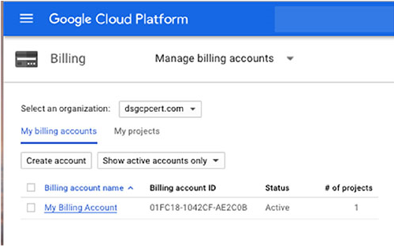

# Chapter 3 프로젝트, 서비스 계정, 과금

**이 챕터는 구글 Associate Cloud Engineer 인증 시험 과목 중, 아래 내용을 다룬다.**
* 1.1 클라우드 프로젝트와 계정 세팅
* 1.2 과금 설정 관리

컴퓨팅, 스토리지, 네트워킹 서비스를 탐구하기 전에, 우리는 어떻게 GCP가 리소스를 구성하고, 과금 시스템과 리소스의 사용을 연결하는지 논의할 필요가 있다. 이 챕터는 조직(organizations), 폴더(folders), 프로젝트(projects)으로 구성된 GCP의 구조적인 계층을 소개한다. 또한 사용자 대신 기능을 수행할 수 있도록 컴퓨팅 리소스에 역할을 할당하는 방법인 서비스 계정(service account)에 대해서 논의한다. 마지막으로, 이 챕터는 간단하게 과금을 논의한다.

## GCP의 프로젝트와 계정 구성 방법

GCP를 사용할 때, 가상머신이나 클러스터를 설치하고, 스토리지 오브젝트에 버킷을 생성할 수도 있고, App Engine과 Cloud Functions과 같은 서버리스 컴퓨팅 서비스를 사용할수도 있다. 사용하는 리소스의 리소트는 빠르게 증가할 수 있다. 또한 워크로드에 응답하는 서비스의 오토스케일링에 따라 동적이고, 예측이 불가능한 방법으로 변화할 수 있다.

당신의 부서에서 단일 어플리케이션이나 일부 서비스를 실행한다면, 사용 중인 리소스의 리스트를 확인하기 위해 모든 리소스를 추적해야 할지도 모른다. GCP의 범위가 넓어짐에 따라, 아마도 여러 개의 부서를 갖게 될 것이고, 각각의 부서는 다른 권한을 필요로하는 자체 관리자들을 갖게 될 것이다. GCP는 리소스를 그룹화하고, 단일 유닛으로 관리하는 방법을 제공한다. 이 것은 `resource hierarchy`라고 부른다. 리소스 계층에서 리소스에 대한 접근은 사용자가 정의할 수 있는 정책의 집합으로 제어된다.

### GCP 리소스 계층(resource hierarchy)

GCP 리소스를 관리하기위한 중요한 추상화는 리소스 계층이다. 이는 3가지 레벨로 구성된다.
* 조직(Organization)
* 폴더(Folder)
* 프로젝트(Project)

3가지 컴포넌트가 서로 어떤 연관이 있는지 설명해보자.

#### 조직(Organization)

조직은 리소스 계층의 루트이고, 전형적으로 회사나 조직과 일치한다. G-suite 도메인과 Cloud Identity 계정은 GCP 조직에 매핑한다. G Suite는 Gmail, Docs, Drive, Calendar, 다른 서비스를 포함하여 구글의 업무 상샌성 세트이다. 회사에서 G suite를 사용한다면, GCP 계층에 조직을 생성할 수 있다. 회사에서 G Suite를 사용하지 않는다면 Cloud Identity를 사용할 수 있다. 구글은 Identity as a Service(IDaaS)를 제공한다.(그럼 3.1)

**그림 3.1** Cloud Identity 계정을 생성하고, Identity & Organization 형식으로 G-Suite 사용자를 관리할 수 있다.

단일 Cloud identity는 최대 하나의 조직에 결부된다. Cloud identity는 최고 관리자가 있으며, 이러한 최고 관리자는 조직을 관리하는 사용자에게 조직 관리자 IAM 역할을 부여한다. 이외에도 GCP는 도메인의 모든 사용자에게 프로젝트 생성자와 과금 계정 생성자 IAM 역할을 자동적으로 부여한다. 이 것은 모든 사용자가 프로젝트를 생성하고, 리소스 사용의 비용을 위해 과금을 가능하게한다.

조직 관리자 IAM 역할을 갖는 사용자는 아래의 책임을 진다.
* 리소스 계층의 구조를 정의
* 리소스 계정위에 IAM 정책을 정의
* 다른 사용자의 다른 관리 권한을 위임

G Suite 조직/Cloud Identity 계정의 멤버가 과금 계정이나 프로젝트를 생성할 떄, GCP는 자동적으로 조직 리소스를 생성할 것이다. 모든 프로젝트와 과금 계정은 조직 리소스의 자식이 될 것이다. 이 외에도, 조직이 생성될 때, 이 조직의 모든 사용자는 프로젝트 생성자와 과금 계정 생성자 역할을 부여받는다. 그 시점부터 G Suite 사용자는 GCP 리소스에 접근할 수 있다.

#### 폴더(Folder)

폴더는 다층적인 조직 계층의 빌딩 블록이다. 조직은 폴더를 포함한다. 폴더는 다른 폴더나 프로젝트를 포함할 수 있다. 단일 폴더는 폴더와 프로젝트 모두 포함할 수도 있다. (그림 3.2) 폴더 구성은 보통 포함된 프로젝트의 리소스에서 제공되는 서비스의 종류와 폴더와 프로젝트를 관리하는 정책을 중심으로 구축된다.

**그림 3.2** 일반적인 조직 폴더 프로젝트

리소스 계층의 예시를 살펴보자. 조직은 4개의 부서를 갖고 있다: 회계, 마케팅, 소프트웨어 개발, 법무. 회계 부서는 받아야할 계정과 지불해야할 계정 리소스를 분리해서 가져야한다. 그래서 관리자는 회계 폴더 내에 2개의 폴더를 생성했다: Account Receivable, Accounts Payable. 소프트웨어 개발은 개발, 검증, 대기, 상용을 포함한 다양한 환경을 사용한다. 각 환경의 접근은 그 환경에 지정된 정책에 의해서 제어된다. 그래서 소유하고 있는 폴더 내에 각 환경을 구성했다. 마케팅과 법무는 부서의 멤버들 간에 그들의 모든 리소스를 공유한다. 그래서 단일 폴더는 두 부서에 모두 충분하다. 그림 3.3은 이 조직을 위한 조직 계층을 보여준다.

**그림 3.3** 조직 폴더 프로젝트의 예시

이제 조직을 정의하고, 부서와 일치하는 폴더를 설정했으며, 다양한 리소스 그룹에 액세스하는 방법을 설정할 것이고, 프로젝트를 생성할 수 있다.

#### 프로젝트(Project)

프로젝트는 어떤 면에서 계층의 가장 중요한 부분이다. 리소스 생성, GCP 서비스 사용, 권한 관리, 과금 옵션 관리는 프로젝트에 있다.

프로젝트에서 작업하는 첫 번째 단계는 프로젝트를 생성하는 것이다. `resourcemanager .projects. create` IAM 권한을 갖는 사용자는 누구나 프로젝트를 생성할 수 있다. 기본적으로 조직이 생성될 때, 도메인의 모든 사용자는 이 권한을 부여받는다.

조직은 생성할 수 있는 프로젝트의 할당량을 가질 것이다. 구글은 일반적인 사용량, 고객의 사용 이력, 기타 요인에 기반하여 프로젝트의 할당량을 결정한다. 프로젝트의 제한에 도달하여 다른 프로젝트를 시도한다면, 할당량 증가를 요청하라는 메시지를 받을 것이다. 추가적으로 필요한 프로젝트의 수와 그 프로젝트가 무엇에 사용될 것인지에 대한 정보를 제공해야 한다.

리소스 계층을 생성한 후에, 리소스를 제어하는 정책을 정의할 수 있다.

### Organization Policies

GCP는 Organization Policy Service를 제공한다. 이 서비스는 조직의 리소스에 대한 접근을 제어한다. Organization Policy Service는 IAM 서비스를 보완한다. IAM은 사용자나 역할들이 클라우드에서 지정된 동작을 수행할 수 있도록 사용 권한을 할당할 수 있다. Organization Policy Service는 리소스를 사용할 수 있는 방법에 대한 제한을 지정할 수 있다. 차이점을 생각하는 한 가지 방법으로 IAM은 누가 할 수 있는지를 지정하고, Organization Policy Service는 무엇을 할 수 있는지를 지정한다.

orginization policies는 리소스의 제약이라는 관점에서 정의된다.

#### 리소스 제약(Constraints)

Constraints는 서비스의 제한이다. GCP는 List constraint과 Boolean constraint을 갖는다.

List constraint는 리소스에 허용되거나 허용되지 않는 값의 리스트이다. list constraint의 몇 가지 유형은 아래와 같다.
* 특정 값의 모음을 허용
* 특정 값의 모음을 거부
* 한 값과 그 값의 모든 child 값을 거부
* 허용된 모든 값을 허용
* 모든 값을 거부

Boolean constraint는 true와 false를 평가하고, constraint가 적용될지 아닐지를 결정한다. 예를 들어, VM에 시리얼 포트로 접근하는 것을 거부하고 싶다면, `constraints/compute.disableSerialPortAccess`를 TRUE로 설정할 수 있다.

#### Policy Evaluation

Organizations는 클라우드에서 데이터와 리소스를 보호하기 위한 고정적인 정책을 갖을 수 있다. 예를 들어, organization에서 누가 service API를 사용하도록 설정하거나 service account를 생성하는지를 지시하는 규칙이 있을 수 있다. 정보보호 부서는 모든 VM이 시리얼 포트 접근을 사용하지않도록 설정할수도 있다. 각각의 VM에 대한 제어를 구현할 수 있지만, 효과적이지 않고, 실수하기 쉽다. 더 좋은 방법은 무엇을 할 수 있는지에 대한 제약을 정책으로 정의하고, 그 정책을 리소스 계층에서 object에 연결하는 것이다.

예를 들어, 정보보호 부서가 모든 VM에 시리얼포트 접근을 거부하기를 원하기 때문에, 시리얼 포트 접근을 제약하는 정책을 지정한 다음, 이 정책을 organization에 연결한다. organization 아래에 있는 모든 folder와 project는 해당 정책을 상속받을 것이다. 정책은 상속되고, 계층의 하위 object에 의해서 사용되지 않거나 재정의될 수 없기 때문에, 모든 조직 리소스에 정책을 적용하는 효과적인 방법이다.

정책들은 IAM & admin 형식에 있는 Organization Policies를 통해 관리된다. 그림3.4는 정책 모음의 예를 보여준다.

다양한 정책은 folder나 project에 유효할 수 있다. 예를 들어, organization은 시리얼 포트 접근에 대한 정책을 갖고 있고, project를 포함하는 folder는 누가 service account를 생성할 수 있는지 제한하는 정핵을 갖고 있다면, project는 두 가지 정책을 상속받을 것이고, project에서 리소스로 할 수 있는 일을 제약할 것이다.

**그림 3.4** Organizational policies는 IAM & admin console에서 관리된다.

### Project 관리

새로운 클라우드 계획을 시작할 때 수행할 첫 번째 업무 중 하나는 프로젝트를 세팅하는 것이다. 이 것은 구글 클라우드 Console에서 할 수 있다. GCP에 계정을 생성했다면 가정하면, [https://console.cloud.google.com](https://console.cloud.google.com)에서 Google Cloud Console을 찾고, 로그인한다. 그림 3.5와 같은 홈페이지가 보일 것이다.

**그림 3.5** console 홈페이지

왼쪽 위에 메뉴에서 IAM & admin을 선택하고, Manage Resoucce를 선택한다.(그림 3.6, 3.7)

**그림 3.6** 네비게이션 메뉴

**그림 3.7** Manage Resource 선택

페이지에서 Create Project를 선택하여 Create Project 화면이 표시된다. 프로젝트의 이름을 입력하고, 화면에서 organization을 선택할 수 있다.(그림 3.8, 3.9)

**그림 3.8** Creat Project 클릭

**그림 3.9** Create Project 화면

프로젝트를 생성할 때, 프로젝트의 남은 할당량은 표시된다. 추가적인 프로젝트가 필요하면 할당량 증가를 요청하는 Manage Quotas 링크를 클릭한다.

## Roles과 Identities

리소스 관리 이외에도, 클라우드 엔지니어로서 리소스에 대한 접근을 관리해야 할 것이다. 이 것은 role과 identities의 사용으로 가능하다.

### GCP에서 Roles

`role`은 사용 권한의 집합이다. Roles는 사용자에게 역할을 바인딩하여 사용자에게 부여된다. identities에 대해서 이야기하면, GCP에서 사용자나 서비스 계정을 나타내는데 사용하는 기록을 의미한다. 예를 들어, 앨리스 클라우드에서 어플리케이션을 개발하는 소프트웨어 엔지니어니고, alice@example.com과 같은 이름의 identity를 갖고 있다. Roles은 앨리스가 GCP에서 리소스를 생성, 수정, 삭제, 사용할 수 있게 GCP 내에서 alice@example.com에 할당된다.

GCP에서 role의 3가지 유형이다.
* Primitive roles
* Predefined roles
* Custom roles

Primitive roles는 Owner, Editor, Viewer를 포함한다. 이는 대부분의 리소스에 적용될 수 있는 기본적인 권한이다. 가능하면 predefined roles 대신에 primitive roles를 사용하는게 좋은 예시이다. Primitive roles는 사용자에 의해서 항상 필요하지 않을 수 있는 넓은 범위의 사용 권한을 부여한다. predefined roles를 사용하면, 사용자에게 기능을 수행하는데 필요한 사용 권한을 부여할 수 있다. 필요한 권한만 할당하고, 더 이상 할당하지 않는 관행을 `principle of least privilege(최소 권한 원칙)`이라고 알려져 있다. 이 것은 정보 보호에서 기본적인 예시 중 하나이다.

Predefined roles는 GCP 리소스에 세밀한 접근을 제공하고, GCP 제품에 한정된다. (그림 3.10) 예를 들어, App Engine roles는 아래 내용을 포함한다.
* `appengine.appAdmin`, 모든 어플리케이션 세팅의 읽고, 쓰고, 수정하는 기능을 identity에 부여한다.
* `appengine.ServiceAdmin`, 어플리케이션 세팅에 대한 read-only 접근 권한과 모듈 수준과 버전 수준 세팅에 대한 쓰기 수준의 접근 권한을 부여
* `appengine.appView`, 어플리케이션에 대한 read-only 접근 권한을 부여

**그림 3.10** GCP roles의 샘플 리스트

Custom roles은 클라우드 관리자가 자신의 role을 생성하고 관리할 수 있다. Custom roles는 IAM에 정의된 사용권한을 사용하여 구성된다. custom role에서 대부분의 사용권한을 사용할 수 있지만, `iam.ServiceAccounts.getAccessToken`과 같은 일부는 custom roles에서 이용할 수 없다.

IAM 콘솔에서 그림 3.11과 같이 사용권한 인터페이스를 표시할 프로젝트를 선택할 수 있다.

**그림 3.11** IAM Permissions

여기에서 Add 옵션을 선택하면 username과 role를 입력하는 화면이 표시된다.

**그림 3.12** 사용자 추가

## Service Account

identities는 보통 사용자 개별적으로 할당된다. 때때로 어플케이션이나 VM이 사용자를 대신하여 수행하거나 사용자에게 권한이 없는 동작을 수행하는 것은 도움이 된다.

예를 들어, 데이터베이스 접근이 필요한 어플리케이션을 갖을 수도 있지만, 어플리케이션의 사용자가 직접 데이터베이스를 접근하는 것을 원하지 않는다. 그 대신에, 데이터베이스에 대한 모든 사용자의 요청은 어플리케이션을 통해야 한다. service account는 데이터베이스에 접근하도록 생성될 수 있다. 그 service account는 어플리케이션에 할당될 수 있어서 어플리케이션은 사용자에게 데이터베이스 접근 권한을 부여하지 않아도 사용자를 대신하여 쿼리를 실행할 수 있다.

Service account는 때로는 리소스로 다루고, 때로는 identities로 취급한다는 점에서 다소 특이하다. service account에 role을 지정할 때, identity로 취급한다. 사용자에게 service account에 대한 접근 권한을 줄 때, 리소스로 취급한다.

service account에는 사용자가 관리하는 servic account와 구글이 관리하는 service account가 있다. 사용자는 프로젝트당 service account를 100개까지 생성할 수 있다. Compute Engine API를 이용하는 프로젝트를 생헝할 때, Compute Engine service account는 자동적으로 생성된다. 유사하게, 프로젝트에 App Engine 어플리케이션이 있다면, GCP는 자동적으로 App Engine service account를 생성할 것이다. Compute Engine과 App Engine service account는 모두 생성된 프로젝트에서 editor role을 부여받는다. 또한 프로젝트에 custom service account를 생성할 수 있다.

구글은 관리하는 service account를 생성할 수 있다. 이 account는 다양한 GCP 서비스와 사용된다.

Service account는 프로젝트 수준에서 account 그룹이나 service account 개별적인 수준으로 관리될 수 있다. 예를 들어, 특정 프로젝트 사용자에게 `iam.serviceAccountUser`를 부여한다면, 사용자는 프로젝트의 모든 service account를 관리할 수 있다. 특정 service account만 관리하도록 사용자를 제한하기를 선호한다면, 특정 service account에 `iam.serviceAccountUser` 권한을 부여할 수 있다.

service account는 리소스가 생성될 때 자동적으로 생성된다. 예를 들어, service account는 VM이 생성될 때 VM에 생성될 것이다. 어플리케이션 중 하나에 service account를 생성하고 싶은 상황이 있을지도 모른다. 이 경우에는 IAM & admin 콘솔에서 Service Account를 선택한다. 그림 3.13에서 보여지는 것처럼 위쪽에 Create Service Account를 클릭한다.

**그림 3.13** IAM & admin 콘솔에서 Service account 리스트

service account를 생성하는 데 필요한 정보를 입력하는 양식을 가져온다.

## Billing(과금)

VM, object storage, 특별한 서비스와 같은 리소스를 사용하는 것은 일반적으로 비용이 발생한다. GCP Billing API는 리소스 사용에 대해 어떻게 비용을 지불하는지 관리하는 방봅을 제공한다.

### Billing Accounts

Billing account는 리소스 사용에 대한 비용을 지불하는 방법에 대한 정보를 저장한다. billing account는 하나 이상의 프로젝트와 연관된다. 모든 프로젝트는 무료 서비스만 사용하지 않는다면 billing account를 반드시 가져야 한다.

Billing account는 리소스 계층과 비슷한 구조를 갖는다. 작은 기업에서 작업하는 경우, 단일 billing account만 갖을 수도 있다. 이 경우에는 모든 리소스 비용이 하나의 account로 과금된다. 이 챕터 초반에 있었던 회계, 마케팅, 법무, 소프트웨어 개발 부서 예시와 비슷한 회사인 경우, 다양한 billing account를 갖기를 원할 수도 있다. 각 부서별로 하나의 billing account를 갖지만, 그럴 필요는 없을 것이다. 회계, 마케팅, 법무 모두 회사의 예산에서 동일한 부분으로부터 클라우드 서비스에 대한 비용을 지불한다면, 하나의 billing account를 갖을 수 있다. 소프트웨어 개발 서비스가 회사 예산의 다른 부분으로부터 비용이 지불된다면, 다른 billing account를 사용할 수 있다.

구글 클라우드 콘솔의 메인에서 기존의 billing account를 나열한 Billing console을 찾을 수 있다. (그림 3.14)

**그림 3.14** 기존 billing account를 나열하는 Billing 메인 형식

여기에서 그림 3.15에서 보여지는 것처럼 새로운 billing account를 생성할 수 있다.

**그림 3.15** 새로운 billing account를 생성하는 양식

Billing overview 페이지에서 billing account와 연결된 프로젝트를 확인하고 수정할 수 있다.

billing account에는 2가지 유형이 있다: self-serve와 invoiced. Self-serve account는 신용카드나 은행 계좌로부터 직접 인출하여 지불한다. 비용은 자동적으로 부과된다. 다른 유형은 invoiced billing account로 사용자에게 영수증이나 인보이스를 전송한다. account의 유형은 기업이나 다른 대형 고객에 의해 공통적으로 사용된다.

몇몇 roles는 billing과 연관된다. 시험을 위해서 아래 내용을 아는 것은 중요하다.
* Billing Account Creator, 새로운 self-service billing account를 생성할 수 있다.
* Billing Account Administrator, billing account를 관리하지만, 생성할 순 없다.
* Billing Account User, 사용자가 프로젝트를 billing account에 연결할 수 있다.
* Billing Account Viewer, 사용자가 billing account 비용과 트랜잭션을 확인할 수 있다.

Billing Account Creator를 담당하는 사용자는 거의 없고, 이 사람은 조직에서 재무 역할을 담당할 가능성이 높다. 클라우드 어드민은 account를 관리하는 Billing Account Administrator를 맡을 수도 있다. 프로젝트를 생성할 수 있는 모든 사용자는 Billing Account User를 맡는다. 그래서 새로운 프로젝트는 관련된 billing account와 연결될 수 있다. Billing Account Viewer는 billing account 정보를 읽어야 하지만, 변경할 수 없는 감사 담당자 같은 일부 사람들에게 유용하다.

### Billing Budget and Alerts

GCP Billing 서비스는 예산을 정의하고 과금 알림을 설정하는 옵션을 포함한다. 콘솔의 메인 메뉴에서 Billing을 선택하고, Budget & alerts를 선택해서 예산 양식을 확인할 수 있다. (그림 3.16)

**그림 3.16** 예산 양식은 특정한 달에 예산의 일정 퍼센트를 지불한 경우 공지가 보내질 수 있다.

예산 양식에서 예산의 이름과 모니터링하는 billing account를 지정할 수 있다. 예산은 프로젝트가 아닌 billing account와 연관된다는 점을 기억해야 한다. 하나 이상의 프로젝트는 billing account와 연결될 수 있다. 그래서 지정한 예산과 알림은 billing account와 연결된 모든 프로젝트에서 쓰여질 것으로 예측되는 금액을 기준으로 해야한다.

특정 금액을 지정하거나 이전 달에 쓰여진 예산 금액으로 지정할 수 있다.

예산에서 3가지 퍼센트를 설정할 수 있다. 기본적으로 3개의 퍼센트로 50%, 90%, 100%를 설정한다. 이는 상황에 잘 맞게 퍼센트를 변경할 수 있다. 3가지 이상 알림을 받고 싶다면, Set Budget Alerts 영역에서 추가적인 알림 임계값을 추가하는 Add Item을 클릭한다.

예산의 설정한 퍼센트가 쓰여졌을 때, billing 관리자와 사용자는 이메일로 알림을 받을 것이다. 프로그램방식으로 알림을 받고 싶다면, Manage Notification 영역에서 체크박스를 선택하면 Pub/Sub 토픽이 전송된다.

### Exporting Billing Data

추후 분석이나 근거를 위해서 과금 데이터를 추출할 수 있다. 과금 데이터는 BigQuery 데이터베이스나 Cloud Storage 파일로 추출될 수 있다. 

BigQuery로 과금 데이터를 추출하기 위해, 콘솔에서 Billing 영역을 찾고, 해당 메뉴에서 Billing export를 선택한다. 나타나는 화면의 형식에서 추출하기 원하는 billing account를 선택하고, BigQuery Export나 File Export 중에서 하나를 선택한다. (그림 3.17)

**그림 3.17** Billing 추출 양식

BigQuery에서 Edit Setting을 선택한다. 포함하길 원하는 프로젝트를 선택한다. 데이터를 저장하기 위해서 BigQuery 데이터 셋을 생성할 필요가 있다. Go To BigQuery를 클릭해서 BigQuery 양식을 연다. 추출된 데이터를 저장하는데 사용되는 Billing export 데이터 셋을 생성한다. (그림 3.18) BigQuery를 사용한 추가 정보는 챕터 12에서 확인한다.

**그림 3.18** BigQuery로 추출

그 대신, Cloud Storage에 저장되는 파일로 billing 데이터를 추출할 수 있다. Billing Export 양식에서 그림 3.29에서 보이는 것처럼 File Export 탭을 선택한다.

**그림 3.19** 파일로 billing 데이터 추출

파일로 추출할 때, 버킨이름과 리포트의 prefix를 지정할 필요가 있다. CSV나 JSON 파일 포맷 중 하나를 선택하는 옵션이 있따. 가능한 파일 포맷 옵션에 대해서 궁금할 수 있지만, 2가지 옵션을 기억해라.

## Enaling API

GCP는 프로그램방식으로 접근이 가능한 서비스인 API를 사용한다. 예를 들어, VM이나 Cloud Storage 버킷을생성하는 양식을 사용할 때, 뒤에서 VM이나 버킷을 생성하는 API함수가 실행된다. 모든 GCP 서비스는 관련된 API를 갖고 있다. 그러나, 대부분 프로젝트에서 디폴트로 사용하지 않는다.

API 서비스를 사용하기 위해서 콘솔의 메인 메뉴에서 APIs & Services를 선택한다. 그림 3.20에서 보이는 것 처럼 대쉬보드를 볼 수 있다.

**그림 3.20** API 서비스 대쉬보드의 예

Enable API and Service 링크를 클릭하면, 그림 3.21처럼 사용할 수 있는 서비스의 리스트를 확인할 수 있다.

**그림 3.21** API를 사용할 수 있는 서비스

이 양식은 필요하다고 생각하는 API를 사용하는 편리한 방법이다. 사용할 수 없는 API가 요구되는 동작을 시도 한다면, API를 사용할 지 여부를 결정하는 메시지가 표시될 수 있다.

또한, 그림 3.20에서 API의 목록과 상태를 기억해라. 사용가능한 API는 Disable 옵션을 갖고 있고, disable the API를 틀릭할 수 있다. 리스트에서 API의 이름을 클릭하여 API 사용에 대한 상세 정보를 확인할 수 있다. (그림 3.22)

**그림 3.22** API 사용에 대한 상세 정보

## Provisionning Stackdriver Workspace

oraganization과 project를 설정할 때, identities 생성, roles 지정, billing account 설정과 같이 이 챕터에서 나열한 업무를 하는데 시간을 쓸 것이다. 해야 할 다른 것은 Stackdriver Workspaces를 생성하는 것이다. (이전에는 이 것을 Stackdriver account로 불렀다. 그래서 때때로 이 용어를 볼 수도 있다.)

Stackdriver는 어플리케이션과 리소스의 모니터링, 로깅, 추적, 디버깅을 위한 서비스 셋이다. (그림 3.23)Stackdriver에 저장되는 모니터링과 로깅 데이터를 저장하기 위해서 workspace를 생성해야 한다. 콘솔 메인 메뉴에서 Stackdriver를 선택하여 진행할 수 있다.

**그림 3.23** Stackdriver 대쉬보드

대쉬보드 위쪽에는 연재 프로젝트의 이름이 보여진다. 관리자 옵션 리스트를 확인하기 위해 프로젝트 이름 옆에 화살표를 클릭한다. (그림 3.24)

**그림 3.24** Stackdriver workspace 관리를 위한 관리 기능

Create Workspace를 클릭하면, 그림 3.25와 같은 양식이 나타난다. GCP 프로젝트 상자를 클릭한 다음 Create Workspace를 클릭할 때 나타나는 리스트로부터 프로젝트를 선택한다. workspace를 생성되고, 프로젝트와 연결된다. 프로젝트의 모니터링, 로깅, 다른 Stackdriver 서비스를 바로 사용할 수 있다.

챕터 18에서 Stackdriver에 대한 더 자세한 정보를 확인할 수 있다.

**그림 3.25** Create Workspace 

# 시험 필수 요소

**GCP 리소스 계층을 이해한다.** 모든 리소스는 리소스 계층 내에 구성된다. 하나의 organization과 다양한 folder와 project를 사용하여 리소스 계층을 정의할 수 있다. Folder는 부서를 그룹화하는데 유용하고, 다른 그룹은 그들의 프로젝트를 분리하여 관리한다. Project는 VM과 Cloud storage 버킷과 같은 리소스를 포함한다. Project는 무료 서비스보다 많이 사용하려면 관련된 billing account가 반드시 있어야 한다.

**organization 정책을 이해한다.** Organization 정책은 리소스 계층에서 리소스를 제한한다. 정책에는 리소스로 할 수 있거나 할 수 없는 것을 정의하는 규칙인 제약조건(constraint)을 포함한다. 예를 들어, 제약조건은 프로젝트에서 모든 VM에 시리얼 포트로 접근을 막는다고 설정할 수 있다. 또한, 정책 평가 과정과 상속된 정책을 재정의하는 방법을 이해한다.

**Service account와 사용하는 방법을 이해한다.** Service Account는 특정 사용자와 관련되지 않지만 VM같은 리소스와 할당할 수 있는 ID이다. service account가 할당된 리소스는 service account가 수행 권한을 갖는 동작을 수행할 수 있다. Service account와 생성하는 방법을 이해한다.

**GCP Billing을 이해한다.** GCP Billing은 무료 서비스를 넘어서 서비스와 리소스를 사용할 수 있어야 한다. Billing은 프로젝트에 신용카드나 인보이스 같은 과금 방법으로 연결된다. 프로젝트에서 리소스와 관련된 모든 비용은 프로젝트의 billing account로 청구된다. Billing account는 하나 이상의 프로젝트와 연결될 수 있다. Billing API를 통해서 billing을 관리한다.

**API를 사용하는 방법과 Stackdriver Workspace를 생성하는 방법을 안다.** 편리한 양식을 사용하면 필요한 API를 사용할 수 있다. 또한 API의 목록과 상태를 확인할 수 있다. Stackdriver는 어플리케이션과 리소스 모니터링, 로깅, 추적, 디버깅을 위한 서비스 셋이다. Stackdriver에 모니터링과 로그 데이터를 저장하기 위해 workspace를 생성해야 한다.

[맨 위로](#chapter-3-%ed%94%84%eb%a1%9c%ec%a0%9d%ed%8a%b8-%ec%84%9c%eb%b9%84%ec%8a%a4-%ea%b3%84%ec%a0%95-%ea%b3%bc%ea%b8%88)