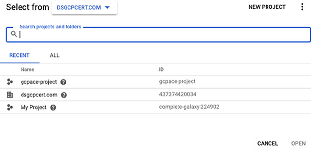

# Chapter 4 Google Cloud의 Computing 소개

**이 챕터는 구글 Associate Cloud Engineer 인증 시험 과목 중, 아래 내용을 다룬다.**
* 2.2 compute 리소스 계획과 설정
  
이 챕터에서는 GCP에서 사용할 수 있는 각 compute 옵션과 사용시기에 대해 배울 것이다. 또한 전반적인 컴퓨팅 비용을 줄이도록 도와주는 preemptible 가상머신에 대해서 논의할 것이다.

## Compute Engine

Compute Engine은 GCP에서 동작하는 VM을 제공하는 서비스이다. 일반적으로 동작 중인 VM을 `인스턴스`라고 언급한다. Compute Engine을 사용할 때, 하나 이상의 인스턴스를 생성하고 관리한다.

### 가상 머신 이미지

인스턴스는 OS, 라이브러리, 다른 코드를 포함한 이미지를 실행한다. 구글에 의해서 제공되는 퍼블릭 이미지를 실행하도록 선택할 수 있다. (그림 4.1) 리눅스와 윈도우 이미지 모두 사용할 수 있다. 구글에서 제공되는 이미지 이외에도, 오플소스 프로젝트나 3rd 파티 벤더에서 제공하는 다른 퍼블릭 이미지도 존재한다.

**그림 4.1** Compute Engine에서 사용할 수 있는 OS 이미지 일부분

퍼블릭 이미지는 CentOS, Container Optimized OS from Google, Debian, Red Hat Enterprise Linux, SUSE Enterprise Linux Server, Ubuntu, Windows Server와 같은 넓은 범위의 OS를 포함한다.

필요로하는 퍼블릭 이미지가 없다면, boot disk로부터 커스텀 이미지를 생성하거나 다른 이미지로 시작할 수 있다. 콘솔에서 VM을 생성하기 위해 Compute Engine을 찾은 다음 VM Instance를 찾는다. 그림 4.2와 비슷한 화면을 볼 수 있다.

**그림 4.2** Compute Engine에서 VM 생성

위 화면에서, VM을 생성하는 Create Instance를 클릭한다. 필요한 것과 가까운 이미지를 선택하고, VM을 생성한다. 그 다음 라이브러리나 다른 소프트웨어 패키지를 설치하는 것과 같이 이미지에 필요한 변경 사항을 수행한다. VM이 생성되고, 변경사항이 적용되었다면, Google Cloud Console의 Compute Engine 메뉴에서 Snapshot을 선택한다. (그림 4.3)

**그림 4.3** snapshot 생성하기의 첫 번째 단계

Create Snapshot를 클릭한다. 보이는 양식에서 스냅샷의 이름, 설명, 그리고 가장 중요하게 스냅샷을 위한 원본인 디스크를 지정할 수 있다. 그림 4.4에서, *myvm*이라고 되어있는 VM의 boot disk가 선택되었다. 옵션을 선택한 후에, 스냅샷을 저장하는 Create 버튼을 클릭한다. 이 이미지는 다른 VM의 이미지로 사용될 수 있다.

**그림 4.4** Compute Engine에서 스냅샷 생성하기

커스텀 이미지는 실행하는 VM의 각 인스턴스에 OS를 설정하고, 추가 소프트웨어를 설치해야하는 경우에 특히 유용하다. 각 인스턴스에 소프트웨어를 여러번 설정하고, 설치하는 것 대신에, 한번만 설정하고 설치한 다음 인스턴스의 boot disk에서 있는 커스텀 이미지로 생성할 수 있다. 다른 인스턴스를 기동할 때 커스텀 이미지를 지정하여서 추가적인 단계 없이 설정과 소프트웨어를 사용할 수 있을 것이다.

로컬 환경이나 데이터 센터에서 커스텀 이미지를 갖는 경우가 있을 수 있다. 구글에서 제공하는 가상 디스크 import 도구를 사용하여 이미지를 불러올 수 있다. 이 도구는 `gcloud` 커맨드라인 도구 중 하나이고, 다음 챕터에서 더 자세한 정보를 설명한다.

커스텀 이미지는 GCP와 반드시 호환되어야 한다. 작성 시, Compute Engine에서 실행되는 커스텀 이미지를 빌드하기 위해 다음과 같은 기본 운영체제를 사용할 수 있다.

* Linux OS
  * CentOS 6
  * CentOS 7
  * Debian 8
  * Debian 9
  * Red Hat Enterprise Linux 6
  * Red Hat Enterprise Linux 7
  * Ubuntu 14.04 LTS
  * Ubuntu 15.04 LTS
* Windows OS
  * Windows Server 2008 R2
  * Windows Server 2012 R2
  * Windows Server 2012 R2 Core
  * Windows Server 2016
  * Windows Server 2016 Core

### 프로젝트에 포함된 가상머신

인스턴스를 생성할 때, 인스턴스를 포함하는 프로젝트를 지정한다. 기억하겠지만, 프로젝트는 GCP 리소스 계층의 일부이다. 프로젝트는 계정에서 가장 하위 계층이다. 프로젝트는 공통 정책으로 관련 리소스를 관리할 수 있다. 

Google Cloud Console을 열 때, 그림 4.5에서 보여지는 것처럼 맨 위에 프로젝트 이름이나 Select a Project 문구중 하나가 표시될 것이다.

**그림 4.5** 현재 프로젝트 이름이나 선택 옵션 중 하나가 Google Cloud Console에서 보여진다.

Select a Project를 선택할 때, 그림 4.6처럼 양식이 나타난다. 거기에서 VM을 포함하여 리소스를 저장할 프로젝트를 선택할 수 있다.

**그림 4.6** 계정의 기존 프로젝트 중에서 프로젝트를 선택

### Zone 및 Region에서 가상머신 실행

프로젝트를 갖는 것 이외에도, VM 인스턴스틑 할당된 zone을 갖는다. Zone은 리소스 같은 데이터 센터이지만, 하나 이상의 밀접하게 연결된 데이터센터로 구성될 수 있다. Zone은 region 내에 위치한다. `region`은 asia-east1, europe-west2, us-east4와 같이 지리적 위치이다. region 내 zone은 저지연, 높은 대역폭의 네트워크 연결로 구성된다.

VM을 생성할 때 region과 zone을 지정한다. 그림 4.7에서 볼 수 있는 것처럼, Create VM 양식은 region과 zone을 선택할 수 있는 drop-down 리스트 양식을 포함한다.

**그림 4.7** Create VM 양식에서 region과 zone 선택하기

VM이 실행되는 장소를 선택할 때 고려할 몇 가지 요소는 아래와 같다.
* 비용, region 간 다를 수 있다.
* Data Locality regulation(데이터 지역적 규제), EU시민에 대한 데이터는 EU에 있어야 한다.
* High availability, 다양한 인스턴스가 실행 중이라면, 다른 zone과 가능하면 다른 region에 실행되길 원할 수도 있다. zone이나 regions중 하나에 접근할 수 없게 되면, 다른 zone과 region에 있는 인스턴스는 서비스를 제공할 수 있다.
* Latency, 전 세계의 다른 영역에서 사용자를 갖는 경우 중요하다. 인스턴스와 데이터가 지리적으로 어플리케이션 사용자와 가깝게 유지되는 것은 latency를 줄이는데 도움을 줄 수 있다.
* Need for specific hardware platform, region마다 다를 수 있다. 예를 들어, europe-west1에 쓸 당시에는 Intel Xeon E5와 Sandy Bridge 플랫폼으로 알려졌지만, Europe-west2는 그렇지 않다.

### 사용자들은 VM을 생성하는 권한이 필요

프로젝트에서 Compute Engine 리소스를 생성하기 위해서 사용자는 프로젝트나 특정 리소스의 팀 멤버여야 하고, 특정 업무를 수행하는 적절한 권한을 가져야 한다. 사용자는 아래와 같이 프로젝트와 연관될 수 있다.
* Individual User
* A Google group
* A G Suite domain
* A service account

사용자나 사용자 그룹이 프로젝트에 추가되면, 사용자나 사용자 그룹에 role를 부여하여 사용 권한을 할당할 수 있다. 이 프로세스는 챕터 17에 자세하게 설명한다. Predefined role은 사용자가 일련의 업무를 수행하는데 필요한 권한을 그룹화하기 때문에 특히 유용하다. 아래는 predefined role의 예시이다.

**Compute Engine Admin** Compute Engine 인스턴스 전체를 제어하는 역할을 갖는 사용자

**Compute Engine Network Admin** 대부분의 네트워킹 리소스를 생성, 수정, 삭제하고, 방화벽 규칙과 SSL 인증으로 read-only 접근을 제공하는 역할을 갖는 사용자. 이 role은 인스턴으를 생성하거나 대체하는 권한을 사용자에게 부여하지 않는다.

**Compute Engine Security Admin** SSL 인증과 방화벽 규칙을 생성, 수정, 삭제할 수 있는 역할을 갖는 사용자

**Compute Engine Viewer** Compute Engine 리소스를 확인할 수 있지만, 리소스의 데이터를 읽을 수 없는 역할의 사용자

권한이 프로젝트 단위로 사용자에게 부여될 때, 이 사용 권한은 프로젝트 내의 모든 리소스에 적용된다. 예를 들어, 사용자가 프로젝트 레벨에서 Compute Engine Admin role을 부여 받았다면, 프로젝트에서 모든 Compute Engine 인스턴스들을 관리할 수 있다. 그림 4.8은 사용자와 role의 리스트를 보여주는 예시이다.

**그림 4.8** 사용자와 role 리스트의 예시

사용 권한을 부여하는 대체 방법은 리소스에 직접적으로 IAM 정책을 추가한느 것이다. 이 방법에서, 권한은 프로젝트 내의 모든 리소스 대신에 특정 리소스에 맞출 수 있다. 예를 들어, 사용자 Alice는 하나의 인스턴스에 Compute Engine Admin role을 갖고, Bob은 다른 인스턴스에 같은 role을 지정할 수 있다. Alice와 Bob은 각자의 VM 인스턴스를 관리할 수 있지만, 다른 인스턴스를 관리할 수 없다.

### Preemptible VM

고가용성이 필요한 워크로드가 있는 경우 고려해야한다. Preemptible VM은 금융 모델링, 렌더링, 빅데이터, CI, 웹 크롤링을 수행하는 어플리케이션과 같은 워크로드 유형에 적합하게 짧게 기동되는 컴퓨트 인스턴스이다. 이런 VM은 일반적인 compute 인스턴스와 동일한 설정으로 제공하고, 24시간까지 유지된다. 어플리케이션이 장애 예방 기능(fault-tolerant)가 있고, 가능한 인스턴스 중단(경고 30초)을 견딜 수 있다면, Peemptible VM 인스턴스를 사용하는 것은 Google Compute Engine 비용을 크게 줄일 수 있다.

몇몇 빅데이터 분석 작업은 Hadoop과 Spark같은 소프트웨어를 실행하는 서버의 클러스터에서 동작한다. 플랫폼은 실패를 회복할 수 이쎅 설계되었다. 노드가 작업 중간에 중단되면, 플랫폼은 실패를 감지하고, 서버의 다른 노드로 워크로드를 이동시킨다. 신뢰있는 VM과 Preemptible VM의 조합으로 제대로 서비스를 제공하는 분석 작업이 있을 수 있다. 신뢰할 수 있는 VM의 몇 퍼센트는 제한 시간 내의 처리된 작업을 얻을 수 있지만, 적은 비용(Preemptible VM)을 추가하면, 더 빠르고 적은 비용으로 작업을 끝낼 수 있다.

#### Preemptible VM의 제한

Preemptible VM을 사용하는 곳을 결정할 때, GCP의 기존 VM 인스턴스와 비교하여 제한사항과 차이점에 유의해야 한다. Preemptible VM은 아래와 같은 특성이 있다.
* 언제든지 종료될 수 있다. 시작한지 10분 이내레 종료된다면, 비용이 발생하지 않는다.
* 24시간 내에 종료된다.
* 항상 이용하지 못할 수 있다. 이용 가능한지는 zone와 region에 따라 다르다.
* 일반적인 VM에 이관할 수 없다.
* 자동적으로 재시작하도록 설정할 수 없다.
* Service Level Agreement(SLA)를 보장하지 않는다.

### 커스텀 머신 유형

Compute Engine은 기본 유형, high-memory machine, high-CPU machines, shared core type, memory-optimized machines으로 그룹화된 25가지 이상의 predefined 머신 유형을 갖고 있다. 이러한 predefined 머신 유형은 가상 CPU(vCPUs)의 수와 메모리의 양이 다르다. 아래는 예시이다.
* n1-standard-1은 1개의 vCPU와 3.75GB의 메모리
* n1-standard-32는 32개의 vCPU와 120GB의 메모리
* n1-highmem-32는 32개의 vCPU와 208GB의 메모리
* n1-highcpu-32는 32개의 vCPU와 28.8GB의 메모리

VM의 predefined 옵션은 많은 예시의 요구를 충족하지만, 미리 정의되지 않은 설정에서 더 비용 효과적이고 더 빠르게 워크로드가 실행되는 경우가 있을 수 있다. 이 경우 커스텀 머신 유형을 사용할 수 있다.

커스텀 이미지를 생성하기 위해 콘솔에서 Create VM 옵션을 선택한다. Machine Type 영역에서 Customize 링크를 클릭한다. 그림 4.9처럼 Machine Type 영역에 확장된다. 거기에서 원하는 CPU의 수와 메모리의 양을 슬라이더로 증가시키거나 감소시킬 수 있다.

**그림 4.9** CPU 수와 메모리 양을 조정하여 VM을 커스터마이징

커스텀 머신 유형은 1에서 64사이의 vCPU와 vCPU당 6.5GB 메모리까지 가질 수 있다. 커스텀 설정의 가격은 할당된 vCPU 수와 메모리를 기반으로 한다.

### Compute Engine 가상 머신의 사용 사례

Compute Engine은 VM 인스턴스 위에서 최대의 제어가 필요할 때 좋은 옵션이다. Compute Engine으로 할 수 있는 것은 아래와 같다.
* 인스턴스에서 실행할 특정 이미지를 선택
* 소프트웨어 패키지나 커스텀 라이브러리를 설치
* 인스턴스에 대한 사용 권한을 가진 사용자가가 세부적으로 제어
* 인스턴스를 위해 SSL 인증과 방화벽 정책에서 제어

GCP의 다른 computing 서비스와 상대적으로, 구글 Compute Engine은 최소한의 관리만 제공한다. 구글은 공인 이미지와 VM 설정 세트를 제공한다. 하지만, 관리자로서 사용할 이미지, CPU 수, 할당할 메모리 양, 영구 저장소 설정 방법, 네트워크 설정 방법에 대해서 선택해야 한다.

일반적으로, GCP에서 리소스에 대한 더 많은 제어할 수록, 리소스를 구성하고 관리해야하는 책임이 더 커진다.

## App Engine

App Engine은 어플리케이션을 실행하기 위한 관리형 플랫폼을 제공하는 PaaS compute 서비스이다. App Engine을 사용할 때, 어플리케이션을 실행하는 VM이 아닌 어플리케이션에 초점을 두어야한다. VM 설정 대신에, 어플리케이션 코드와 함께 기본적인 리소스 요구사항을 지정하고, 구글은 코드를 실행하는데 필요한 리소스를 관리할 것이다. 이는 App Engine 사용자는 관리할 일이 줄어들지만, 어플리케이션을 실행하는데 사용되는 compute 리소스에 대한 제어도 줄어든다는 것을 의미한다.

VM 인스턴스처럼, App Engine의 어플리케이션을 프로젝트 내에 생성된다.

### App Engine 어플리케이션의 구조

App Engine 어플리케이션은 공통적인 구조를 갖고, 서비스로 구성된다. 서비스는 유통 웹 어플리케이션에서 판매 세금을 계산하거나 제품이 사이트에서 판매되었을 때 창고를 업데이트 하는 것처럼 특정 기능을 제공한다. 서비스는 버전이 있고, 이를 통해 여러 버전이 동시에 실행될 수 있다. 서비스의 각 버전은 App Engine에 의해서 관리되는 인스턴스에서 실행된다. (그림 4.10)

**그림 4.10** App Engine 어플리케이션의 구조

어플리케이션을 제공하는데 사용되는 인스턴스의 수는 어플리케이션의 설정과 어플리케이션의 현재 로드에 따라 달라진다. 로드가 증가하면, 구글은 필요한만큼 인스턴스를 추가할 수 있다. 비슷하게, 로드가 줄어들면, 인스턴스를 종료하여 사용하지 않는 인스턴스의 비용을 절감할 수 있다. 이러한 종류의 인스턴스는 dynamic 인스턴스와 함께 사용될 수 있다.

dynamic 인스턴스 이외에도, App Engine은 resident 인스턴스를 제공한다. 이러한 인스턴스는 지속적으로 실행된다. 수작업으로 resident 인스턴스를 추가하거나 제거할 수 있다.

배포된 인스턴스의 수가 자주 변할 때, 실행 중인 인스턴스의 비용을 측정하는 것은 어려울 수 있다. 다행히, GCP는 사용자에게 일별로 비용 제한을 세팅할 수 있을 뿐만 아니라 예산을 생성하고, 알람을 설정할 수 있도록 제공한다.

### App Engine Standard와 Flexible 환경

App Engine은 2가지 실행 환경을 제공한다: standard와 flexible. standard 환경은 language rumtimes를 제공하는 반면, flexible 환경은 더 일반화된 컨테이너 실행 플랫폼이다. 

#### App Engine Standard 환경

standard 환경은 기본적인 App Engine 환경이다. 이는 사전에 정의된 언어별 런타임으로 구성된다. 현재 standard 환경에는 2가지 generation이 있다. second generation은 first generation의 성능을 개선하고, 제한이 거의 없다.

현재, App Engine standard 환경 사용자는 지원되는 언어에 따라서 선택할 수 있다.

**First Generation**
* Python 2.7
* PHP 5.5
* Go 1,9

**Second Generation**
* Java 8
* Python 3.7(beta)
* PHP 2.7(beta)
* Node.js 8 (beta) and 10 (beta)
* Go 1.11(beta)

second-generation standard 환경에서, 개발자들은 모든 언어 extension을 사용할 수 있지만, first generation에서는 화이트리스트 extension과 라이브러리 중에서 선택된 종류만 허용된다. first generation에서는 네트워크 접근아 제한되지만, second generation에서는 사용자가 모든 네트워크 접근을 한다.

#### App Engine Flexible 환경

App Engine Flexible 환경은 App Engine처럼 PaaS의 장섬을 원하는 개발자들에게 더 많은 옵션과 제어를 제공한다. 하지만, App Engine standard 환경의 언어와 커스텀에 제약은 없다. (그림 4.11)

App Engine Flexible 환경은 기본적인 빌딩 블록 추상화로 컨테이너를 사용한다. 사용자는 컨테이너를 설정해서 실행 환경을 커스텀할 수 있다. flexible 환경은 Docker 컨테이너를 사용한다. 그래서 Docker 파일과 친숙한 개발자들은 기본 OS 이미지, 추가 라이브러리와 툴, 커스텀 툴을 지정할 수 있다. 또한 Java 8, Eclipse Jetty 9, Python 2.7, Python 3.6, Node.js, Ruby, PHP, .NET core, Go를 지원한다.

어떤 면에서 App Engine flexible 환경은 다음 섹션에서 논의되는 Kubernetes Engine과 비슷하다. 이러한 2가지 구글 제품(App Engine Flexible 환경, Kubernetes Engine)은 커스텀화된 Docker 컨테이너를 실행할 수 있다. App Engnie flexible 환경은 완전한 관리형 PaaS를 제공하고, 작은 컨테이너에 어플리케이션과 서비스를 패키지할 때 좋은 옵션이다. 곧 알게 되겠지만, Kubernetes Engine은 제어하는 클러스터에서 실행하는 컨테이너를 관리하도록 설계되었다. Kubernetes Engine으로 클러스터를 제어할 수 있지만, Stackdriver 모니터링과 오토스케일링 같은 툴을 사용하여 클러스터를 모니터링하고 관리해야 한다. App Engine flexible 환경을 사용하면 App Engine 서버의 상태는 구글에 의해서 모니터링 되고, 어떠한 개입 없이 필요에 따라 수정된다.

**그림 4.11** Kubernetes Engine에서 Kubernetes 클러스터를 생성하는 인터페이스

### App Engine 사용 사례

App Engine 제품은 기본적은 OS나 스토리지 시스템을 설정하거나 제어할 필요가 거의 없을 때 computing 플랫폼을 위한 좋은 선택이다. App Engine은 기본적인 VM과 컨테이너를 관리하고, 개발자들과 DevOps 전문가들에게 패치와 모니터링 서버처럼 몇몇 일반적인 시스템의 관리자 업무를 덜어준다.

#### App Engine standard 환경을 사용할 시기

App Engine standard 환경은 지원되는 언어 중 하나로 작성된 어플리케이션을 위해 설계되었다. Standard 환경은 그 나름의 제약조건을 따르는 언어별 런타임을 제공한다. 제약조건은 second-generation App Engine standard 환경에서 더 적다.

**Notice**

새로운 개발을 시작하고, App Engine standard 환경을 사용할 계획이라면, second-generation 인스턴스를 선택하는게 가장 좋다. First-generation 인스턴스는 지속적으로 지원될 예정이지만, 그런 종류의 인스턴스는 오직 이미 존재하는 어플리케이션을 위해 사용되어야 하고, 그런 플랫폼을 위해 설계되었다.

#### App Engine Flexible 환경을 사용할 시기

App Engine flexible 환경은 서비스가 분리될 수 있고, 서비스가 컨테이너화될 수 있는 어플리케이션에 잘 맞는다. 예를 들어, 한 서비스 어플리케이션 UI를 제공하는 Django 어플리케이션을 사용할 수 있고, 또 다른 것은 데이터 저장소를 위해 비즈니스 로직을 포함할 수 있고, 또 다른 시비스는 어플리케이션을 통해 업로드된 데이터의 배치 처리를 스케줄링할 수 있다. 시작하는 동안 추가적인 소프트웨어를 설치하거나 명령어를 실행할 필요가 있다면, Dockerfile을 지정할 수 있다. 예를 들어, 설치된 패키지의 최신 버전을 얻는 `apt-get update`를 실행하기 위해 Dockerfile에 `run` 명령어를 추가할 수 있다. Dockerfile은 함께 시작하는 기본 이미지를 지정하고, 설치하는 패키지를 위해 `apt-get`과 `yum`같은 패키지 관리 명령어를 지정하는 것과 같이 컨테이너를 설정하기 위한 명령어로 이루어진 텍스트 파일이다.

App Engine standard 환경은 로드가 없는 경우 실행 중이지 않는 인스턴스를 중지한다. 하지만, flexible 환경에서는 그렇지 않는다. 서비스를 위해서 항상 최소 하나의 컨테이너가 실행되고, 시스템에 로드가 없어도 해당 시간만큼 비용이 발생한다.

## Kubernetes Engine

Compute Engine은 개별적으로나 `instance group`이라고 불리는 그룹으로 VM을 생성하고 관리한다. 인스턴스 그룹은 유사한 VM을 단일 유닛으로 관리한다. 이 것은 똑같은 소프트웨어를 실행하고, 같은 운영 lifecycle을 갖는 한 무리의 서버가 있는 경우 유용하다. 그러나 최근 소프트웨어는 `microservices`로 언급되는 서비스의 집합으로 종종 구축된다. 서비스마다 다른 VM의 구성이 요구될 수 있지만, 단일 리소스의 다양한 인스턴스나 클러스터를 관리하기 원할 수 있다. 이를 위해 Kubernetes Engine을 사용할 수 있다.

Kubernetes는 가상 머신이나 베어메탈 머신의 클라서트 관리를 위해 구글에서 만든 오픈소스 도구이다. (Kubernetes는 k8s로 축약된다.) Kubernetes는 컨테이너 오케스트레이션 서비스이고, 아래의 동작을 할 수 있다.
* 컨테이너를 위한 Kubernetes 오케스트레이션 소프트웨어를 실행하는 VM의 클러스터를 생성한다.
* 클러스터에 컨테이너화된 어플리케이션을 배포한다.
* 클러스터를 관리한다.
* 오토스케일링과 같은 정책을 지정한다.
* 클러스터 상태를 모니터링한다.

Kubernetes Engine은 GCP의 관리형 Kubernetes 서비스이다. 원한다면, VM의 그룹을 배포하고, VM에 Kubernetes를 설치하고, 스스로 Kubernetes 플랫폼을 관리할 수 있다. Kubernetes Engine을 사용하면 관리 오버헤드 없이 Kubernetes의 장점을 누릴 수 있다.

### Kubenetes의 기능

Kubernetes는 다양한 어플리케이션을 실행하는 클러스터를 지원하도록 설계되었다. 이 것은 다양한 서버에서 하나의 어플리케이션을 실행하는 방법을 제공하는 타 클러스터 관리 플랫폼과 다르다. 예를 들어, Spark는 서버의 클러스터에서 Spark 서비스를 실행하는 빅데이터 분석 플랫폼이다. Spark는 Kubernetes처럼 범용 클러스터 관리 플랫폼이 아니다.

Kubernetes Engine은 아래 기능을 제공한다.
* Kubernetes 클러스터에 배포된 Compute Engine VMs에 전반적인 로드 밸런싱
* 클러스터 노드들(VM)의 오토 스케일링
* 필요한 클러스터 소프트웨어의 자동 업그레이딩
* 노드 모니터링과 상태 보수
* 로깅
* 같은 설정을 갖는 노드의 집합인 노드 풀(Node Pool)을 지원

### Kubernets 클러스터 아키텍처

Kubernetes 클러스터는 클러스터 마스터 노드와 하나 이상의 워커노드를 포함한다. 이들은 각각 `master`와 `nodes`로 언급된다. 

마스터 노드는 클러스터를 관리한다. Kubernetes API Server, resource controller, 스케쥴러와 같은 클러스터 서비스가 마스터에서 실행된다. Kubernetes API Server는 클러스터의 모든 커뮤니케이션을 위한 코디네이터이다. 마스터는 각 노드에서 실행할 컨테이너와 워크로드를 결정한다.

Kubernetes 클러스터가 구글 클라우드 콘솔이나 커맨드라인으로 생성될 때, 노드의 수도 생성된다. 이들은 Compute Engine VM이다. VM의 디폴트 타입은 n1-standard-1(1 vCPU, 3.75GB 메모리)이지만, 클러스터를 생성할 때 다른 머신 타입을 지정할 수 있다.

Kubernetes는 `pods`라고 불리는 그룹에 컨테이너를 배포할 수 있다. 하나의 pod내의 컨테이너는 스토리지와 네트워크 리소스를 공유한다. pod 내의 컨테이너는 IP주소와 port 범위를 공유한다. Pod는 서비스를 할당하기 위한 논리적인 단일 유닛이다. 컨테이너는 유닛으로 배포되고 확장된다.

**Notice**

일부 오버헤드가 노드에서 Kuberenetes 소프트웨어를 실행하는데 전념한다는 점을 유의해야 한다. 일부 CPU와 메모리는 Kubernetes를 위해 할당되므로 워크로드 처리를 위해 이용하지 못할 수 있다. Kubernetes Engine은 아래와 같이 메모리 리소스를 따로 잡아놓는다. 
* 처음 4GB 메모리의 25%
* 다음 4GB 메모리의 20%, 최대 8GB
* 다음 8GB 메모리의 10%, 최대 16GB
* 다음 112GB 메모리의 6%, 최대 128GB
* 128GB이상 메모리의 2%

CPU 리소스는 아래와 같이 선점한다.
* 첫 코어의 6%
* 다음 코어의 1%(최대 2코어)
* 다음 2코어의 0.5%(최대 4코어)
* 4코어이상 코어의 0.25%

### Kubernetes High Availability(고가용성)

Kubernetes가 클러스터의 상태를 유지하는 한 가지 방법은 자원이 부족해진 pods를 중지하는 것이다. Kubernetes는 리소스를 위한 임계치를 설정한느 `eviction policies`라고 불리는 것을 지원한다. 리소스가 임계치를 넘어서 소비될 때, Kubernetes는 pod를 중지하기 시작한다.

Kubernetes가 HA를 위해 제공하는 또 다른 방법은 다수의 동일한(identical) pods를 실행하는 것이다. 실행 중인 동일한 pod의 그룹을 `deployment`라고 부른다. 동일한 pods는 `replicas`라고 업급된다.

deployment가 출시될 때, 아래 3가지 상태 중 하나가 될 수 있다.
* Processing, deployment가 업무를 수행한느 중이다.
* Completed, 컨테이너의 출시가 완료되었고, 모든 pod는 컨테이너의 최신 버전으로 실행 중이다.
* Failed, deployment 처리가 복구할 수 없는 문제에 맞닥뜨렸다.

stateful 어플리케이션 vs stateless 어플리케이션을 실행할 때 고려해야할 추가 사항이 있다. 이 이슈는 챕터 7에서 다룬다.

### Kubernetes Engine 사용 사례

Kubernetes Engine은 높은 가용성과 신뢰성이 요구회는 큰 규모의 어플리케이션을 위해 좋은 선택이다. Kubernetes Engine은 pod와 deployment의 개념을 지원하여, 어플리케이션과 관리지 논리적인 단위로 서비스를 관리할 수 있다. 이 것은 유저인터페이스(UI) 단과 비즈니스 로직 단, 백엔드 서비스 단을 구현하는 경우 도움이 될 수 있다. 이런 서비스의 각 그룹은 다른 lifecycle과 확장 요구사항을 갖을 수 있다. Kubernetes는 사용자, 개발자, DevOps 관리자에게 의미있는 위의 각 그룹을 관리하는데 도움을 준다.

## Cloud functions

Cloud Functions는 GCP 환경에서 발생하는 이벤트에 응답하는 단일 목적의 코드를 실행하도록 설계된 서버리스 컴퓨팅 플랫폼이다. Cloud Funcstion을 사용할 때 VM, Container, Cluster를 할당하거나 관리할 필요가 없다. Node.js 6, Node.js 8 이나 Python 3.7로 작성된 코드는 Cloud Funcstion에서 실행될 수 있다.

Cloud Functions는 Compute Engine이나 App Engine처럼 일반적인 목적의 컴퓨팅 플랫폼이 아니다. Cloud Functions은 독립되어있는 서비스간 "glue"를 제공한다.

예를 들어, 하나의 서비스는 파일을 생성하고 Cloud Storage에 업로드하고, 다른 서비스는 파일을 가져와서 몇가지 처리를 수행한다. 이 서비스 모두 독립적으로 개발될 수 있다. 서로에 대해서 알 필요는 없다. 그러나 새로운 파일이 Cloud Storage에 쓰여졌다고 감지를 하는 방법은 필요할 것이고, 그래야 다른 어플리케이션에서 처리를 시작할 수 있다. 인풋을 제공하거나 아웃풋을 처리하는 다른 프로세스에 대해서 추정하는 방식으로 어플리케이션을 작성하기를 원하지 않는다. 서비스는 서로 독립적으로 변경될 수 있다. 변경되는 것을 피할 수 있다면, 서비스 간 의존성을 추적할 필요가 없다. Cloud Functions는 이 상황을 피할 수 있도록 도와준다.

### Cloud Functions 실행 환경

GCP는 보완되고, 독립된 환경에서 코드를 실행하는데 필요한 모든 것을 관리한다. 물론, 서버리스 추상화 아래에 코드를 실행하는 가상과 물리 서버가 있지만, 클라우드 엔지니어는 인프라의 어떤 것도 관리하지 않아도 된다. Cloud functions에 대해서 기억해야할 3가지는 아래와 같다.
* Functions은 보안되고, 독립된 환경에서 실행된다.
* Compute 리소스는 확장을 제어하기 위해 어떠한 것도 하지 않고 Cloud Functions의 많은 인스턴스를 실행하는데 필요한 만큼 확장된다.
* 하나의 Function 실행은 다른 모든 것들과 독립된다. Cloud Functions의 lifecycle은 서로 의존하지 않는다.

여기에는 중요한 공통점이 있다. 그 것은 Cloud Functions은 동시에 다수의 인스턴스에서 실행될 수도 있다. 두가지 모바일 앱 사용자가 동시에 처리하기 위한 이미지 파일을 업로드한다면, Cloud Functions의 2가지 다른 인스턴스가 대략적으로 동시에 실행할 것이다. 두 가지 인스턴스간 충돌을 예방하기 위해서 어떠한 것도 하지 않아도 된다. 두 인스턴스는 독립된다.

Cloud Functions의 각 호출이 분리된 인스턴스에서 실행될 때, functions은 메모리나 변수를 공유하지 않는다. 일반적으로 Cloud Functions이 stateless해야한다는 것을 충족한다. 즉, functions은 아웃풋을 계산하기 위해 메모리의 상태에 의존하지 않는다. 이 것은 많은 경우에서 타당한 제약조건이지만, 때때로 호출간에 상태를 저장해야하는 경우에 처리를 최적화할 수 있다. Cloud Functions은 이를 실행하는 몇가지 방법을 제공하고, 챕터 11에 설명될 것이다.

Cloud functions은 짧게 실행되고, 이벤트 기반의 처리에 잘 맞는다. 워크플로우가 Cloud Storage에 있는 파일을 업로드하고, 수정, 변경하거나 서비스간 작업을 전송하는 메시지 큐를 사용하는 경우, Cloud Functions 서비스는 다음 단계의 처리를 시작하는 코드를 실행하기위해 좋은 옵션이다. 이 패턴에 맞는 일부 어플리케이션 영역은 다음이 포함된다.
* IoT, 센서나 다른 디바이스는 센서의 상태에 대한 정보를 전송할 수 있다. 전송되는 값에 의존하여 Cloud Functions는 알람을 동작하더나 센서로부터 업로드된 데이터를 처리하기 시작한다.
* IoT 앱 같은 모바일 어플리케이션은 처리를 위해서 데이터를 클라우드로 전송한다.

각 단계의 비동기적 워크플로우는 이전 단계가 완료된 후에 어느 시점에 시작하지만, 처리 단계가 완료되는 시감은 추정할 수 없다.

## Summary

GCP는 몇 가지 컴퓨팅 옵션을 제공한다. 이 옵션은 GCP 사용자가 컴퓨팅 플랫폼에서 사용하는 제어 수준에 따라 달라진다. 일반적으로, 많은 제어는 많은 책임감과 관리 오버헤드가 온다. 컴퓨팅 플랫폼을 선택할 때 목적은 DevOps의 오버헤드와 비용을 최소화하는 요구사항에 충족하는 하나를 선택하는 것이다.

Compute Engine은 VM을 할당시켜주는 GCP 서비스이다. 미리 정의된 설정으로 선택할 수 있거나 필요한 가상 CPU와 메모리의 조합을 설정하여 생성할 수 있다. VM 기능의 일부 장애를 견딜 수 있다면, Preemptible VM을 사용하여 상당한 비용을 줄일 수 있다.

App Engine은 구글의 Paas 제품이다. 서버시르 옵션 중 하나이다. App Engine flexible 환경의 경우, 어플리케이션 코드와 어플리케이션을 실행하는 Docker 컨테이너를 위한 스펙을 제공한다. App Engine standard 환경은 언어별 샌드박스를 실행할 수 있는 어플리케이션에 적절하다.

최신 소프트웨어 어플리케이션은 다른 컴퓨팅 요구사항을 갖고, 다른 lifecycle로 변경되는 다수의 서비스로 구축된다. Kubernetes Engine은 다양한 서비스를 실행하는데 사용될 수 있는 서버 클러스터를 실행하면서 필요에 따라 효율적으로 작업을 서버에 할당한다. Kubernetes Engine은 모니터링, 확장, 클러스터의 VM에 문제가 생겼을 때 조치를 제공한다.

느슨하게 결합된 어플리케이션은 복잡한 워크플로우를 구현하기 위해 서로 연결될 수 있다. 종종 각 컴포넌트들이 서로 독립되지를 원한다. 이런 경우에, 한 단계에서 다른 단계로 워크로드를 옮기는 "glue" 코드를 실행할 필요가 있다. Cloud functions는 이러한 요구를 충족시키도록 설계된 서버리스 컴퓨팅 옵션이다.

## 시험 필수 요소

**이미지가 VM 인스턴스를 생성하는데 사용되는 방법과 프로젝트에서 VM을 구성하는 방법을 이해한다.** 인스턴스는 OS, 라이브러리, 다른 코드를 포함하는 이미지를 실행한다. 인스턴스를 생성할 때, 인스턴스를 포함하는 프로젝트를 지정한다.

**GCP는 다수의 지리적 region을 갖고, region은 하나 이상의 zone을 갖는다는 것을 안다.** VM은 zone에서 실행된다. region은 asia-east1, europe-west2, us-east4와 같은 지리적 위치이다. regions 내의 zone은 저지연, 높은 대역폭의 네트워크 연결로 연결된다.

**Preemptible VM이 무엇이고, 언제 사용되는게 적절한지 이해한다.** 또한 사용되지 않는 시기를 이해한다. GCP는 문제를 일으키지 않고, 중단될 수 있는 워크로드를 위한 Preemptible VM이라고 불리는 옵션을 제공한다.

**App Engine standard와 flexible 환경간 차이점을 이해한다.** standard 환경은 언어별 플랫폼을 실행하고, App Engine flexible 환경은 커스텀 컨테이서를 실행한다.

**Kubernetes는 컨테이너 오케스트레이션 플랫폼이라는 것을 안다.** 또한 클러스터에서 컨테이너를 실행한다.

**Kubernetes를 이해한다. 이는 로드밸런싱, 오토 스케일링, 로딩, 노드 헬스체크, 유지보스를 제공한다.**

**Cloud Functions를 이해한다.** 이 서비스는 파일 업로드나 메시지가 큐에 추가되는 것과 같은 이벤트에 응답하는 프로그램을 실행하는데 사용된다.

[맨 위로](#chapter-4-google-cloud%ec%9d%98-computing-%ec%86%8c%ea%b0%9c)