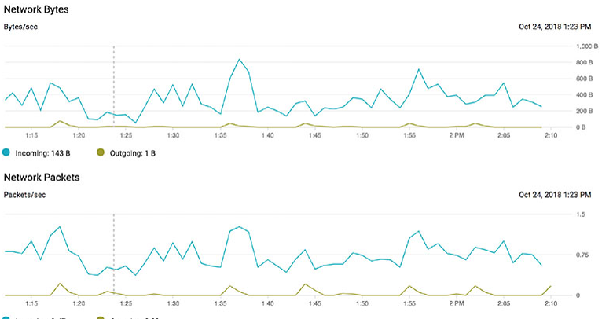

# Chapter 5. Compute Engine 가상머신을 사용한 Computing

**이 챕터는 구글 Associate Cloud Engineer 인증 시험 과목 중, 아래 내용을 다룬다.**
* 1.3 CLI, 특히 Cloud SDK 설치와 설정 (ex. 기본 프로젝트 세팅)
* 2.2 compute 리소스 계획 및 설정, 다음 고려 사항을 포함
  * 주어진 워크로드를 위해 적절한 compute를 선택 (ex. Compute Engine, Kubernetes Engene, App Engine)
  * 적절하게 Preemptible VM과 커스텀 머신 유형을 사용하는 것

이 챕터에서는, GCP의 GUI인 구글 클라우드 콘솔에 대해서 배울 것이다. 구글 클라우드 SDK를 설치하는 방법과, VM 인스턴스를 생성하여 사용하는 방법, 구글 클라우드 SDK를 로컬에 설치하는 것을 대신하여 Cloud Shell을 사용하는 방법

## 콘솔로 VM을 생성하고 설정하기

Compute Engine에서 VM을 생성해보자. 이 것을 하기 위해 3가지 옵션이 있다: 구글 클라우드 콘솔, 구글 클라우드 SDK, 구글 클라우드 Shell. 콘솔에서 시작해보자.

구글 클라우드 콘솔은 구글 클라우드에서 리소스를 생성하고, 설정하고, 관리하기 위한 web 기반의 GUI이다. 이 챕터에서, VM을 생성하는데 사용할 것이다.

콘솔을 열기 위해서는 브라우저에서 [https://console.cloud.google.com](https://console.cloud.google.com)에 접속하고 로그인한다. 그림 5.1은 콘솔의 메인 페이지의 예를 보여준다.


**그림 5.1** 구글 클라우드 콘솔의 메인 시작 페이지

페이지 왼쪽 위에서, 기존 프로젝트를 보여주는 Select A Project 옵션을 클릭한다. 그림 5.2와 같은 화면에서 새로운 프로젝트를 생성할 수 있다.


**그림 5.2** VM을 생성할 때 작업할 프로젝트르 선택하는 프로젝트 화면. 또한 새로운 프로젝트를 생성할 수 있다.

기존 프로젝트를 선택하거나 새로운 프로젝트를 생성한 후에, 메인 콘솔 화면으로 돌아온다. 첫번째로 해야할 작업은 billing account을 생성한다. 이미 account가 있으면 생성하지 않아도 된다. 그림 5.3은 billing account를 생성하기 위한 메인 화면의 메시지와 버튼을 보여준다.


**그림 5.3** billing account가 프로젝트에 없을 때, VM을 생성할 때 billing account를 생성하는 옵션이 있다.

Enable Billine을 클릭하고 이름, 주소, 카드정보와 같은 billing 정보를 입력한다. billing이 적용되면, 메인 화면으로 돌아온다. (그림 5.4)


**그림 5.4** VM을 생성하기 위한 첫 화면

VM 설정을 가져오기 위해 화면에서 Create 버튼을 클릭한다.(그림 5.5)


**그림 5.5** Compute Engine에서 VM을 생성하기 위한 메인 설정 화면의 한 부분

### 메인 VM 설정 정보

콘솔 내에서, 생성하고 있는 VM의 설정에 대해서 아래에 있는 필요한 모든 정보를 지정할 수 있다.
* VM 이름
* VM이 실행할 Region, Zone
* Machine Type, VM의 CPU 수와 메모리 양을 결정한다.
* Boot disk, VM이 실행할 OS를 포함한다.

VM의 이름을 선택할 수 있다. 이 것은 주로 사용자가 사용한다. 구글 클라우드는 VM을 관리하는데 내부적오로 다른 ID를 사용한다.

Region을 지정해야 한다. Region은 주요 지리적 영역들이다. 그림 5.6은 region의 일부분을 보여준다.


**그림 5.6** Compute Engine 서비스를 제공하는 region의 일부 리스트

region을 선택한 후, zone을 선택할 수 있다. zone은 region 내에 있는 시설 처럼 데이터 센터라는 것을 기억해야 한다. 그림 5.7은 us-east-1 region에서 이용할 수 있는 zone의 예를 보여준다.


**그림 5.7** us-east-1 region 내의 zone 리스트

region과 zone을 지정한 후, 구글 클라우드는 zone에서 이용할 수 있는 VM을 결정한다. 모든 zone이 동일하게 이용할 수는 없다. 그림 5.8은 us-east1-b zone에서 시용할 수 있는 machine type의 예를 보여준다.


**그림 5.8** us-east1-b zone에서 이용할 수 있는 machine type 리스트

부트 디스트 옵션은 기본 설정이 나열된다. Change 버튼을 클릭하면 부트 디스트 옵션을 가져온다. (그림 5.9)


**그림 5.9** VM의 부트 디스크 설정을 위한 화면

여기에서 원하는 OS를 선택할 수 있다. 또한, 기본적인 영구 디스트나 SSD 영구 디스크 중에서 부트 디스크 타입을 선택할 수 있다. 디스크의 크기를 지정할 수 있다.

아래는 부트 디스크의 ID와 API 접근 영역이다. 여기에서 VM을 위한 service account을 지정하고, API 접근의 범위를 설정할 수 있다. 이 VM에서 실행되는 프로세스가 일부 API만 사용하도록 하려면, VM의 특정 API로의 접근을 제한하는 옵션을 사용할 수 있다.


**그림 5.10** ID, API 접근, 방화벽 설정

다음 영역은 VM에 HTTP나 HTTPS 트래픽의 접근을 원하는 경우 선택할 수 있다.

### 추가 설정 정보

추가 설정 정보를 하려면 Managemeng, Security, Disks, Networking, Sole Tenancy를 클릭한다.

#### Management Tab

페이지의 Management 탭(그림 5.11)은 VM을 설명할 수 있는 영역을 제공한다. 또한 Key-value 쌍의 label을 생성할 수 있다. 원하는 label을 지정할 수 있다. Label과 설명은 VM을 관리하고 VM을 사용하는 방법을 이해하는데 종종 사용된다. Label은 서버의 수가 늘어날 때 특히 중요하다. 모든 VM에 설명과 label을 포함하는 것은 좋다.


**그림 5.11** VM 생성 페이지의 Management 탭 중 첫번째 부분

인스턴스를 삭제하기 전에 추가 확인을 강제로 적용하려면, deletion protection 옵션을 선택할 수 있다. 누군가가 인스턴스를 삭제하려고 하면, 삭제되지 않을 것이다.

인스턴스가 기동될 때 실행하는 startup 스크립트를 지정할 수 있다. script text box에 startup 스크립트의 내용을 복사한다. 예를 들어, text box에 직접 bash나 python 스크립트를 입력할 수 있다.

Meatdata 섹션은 인스턴스와 연관된 key-value을 지정할 수 있다. 이 value는 metadata 서버에 저장되며,Compute Engine API를 사용하여 쿼리할 수 있다. Metadata tag는 기동이나 중지에서 실행할 공통 스크립트를 갖고 있지만, metadata의 값에 따라서 다른 스크립트 동작을 원하는 경우 특히 유용하다.

Availability Policy는 3가지 파라미터를 설정한다.
* Preemptibility, 설정하면, 구글이 30초간 통지하고 서버를 중지할 수 있다. 그 대신, preemptible 서버의 비용은 nonpreemptible 서버보다 훨씬 적다.
* Automatic restart, 서버가 하드위어 장애, 유지보수, 비사용자가 제어하는 이슈로 인해 중지해야 하는지 여부
* host maintenance, 유지보수 이벤트가 발생할 때, 가상서버를 다른 물리서버로 이동시켜야 하는 지 여부


**그림 5.12** VM 생성 페이지 Management 탭의 두 번째 부분

Security 섹션에서는 Shielded VM과 Secure Shell(SSH) Key를 사용할 지 지정할 수 있다.

Shielded VM은 실행하도록 선택할 수 있는 추가 보안 메커니즘을 갖도록 구성한다. 다음을 포함한다.
* Secure Boot, 오직 인증된 OS 소프트웨어만 VM에서 실행한다. 소프트웨어의 디지털 서명을 확인하여 진행한다. 서명 확인이 실패하면 부트 프로세스틑 멈춘다.
* Virtual Trusted Platform Module(vTPM), trusted platform module(TPM)의 가상화되 버전이다. TPM은 key와 인증처럼 보안 리소스를 보호하도록 설계된 특별한 컴퓨터 칩이다.
* Integrity Monitoring, 잘 알려진 부트 측정 기준을 사용하여 최근 부트 측정을 비교한다. 확인이 실패하면, 측정 기준과 현재 측정간 차이점을 보여준다.


**그림 5.13** 추가적인 security 제어는 VM에 배치할 수 있다.

GCP는 프로젝트전체 SSH key 개념을 지원하며, 사용자에게 프로젝트 전체에서 VM에 접근하는 데 사용한다. 프로젝트 전체 SSH key를 사용하고, 모든 프로젝트 사용자가 이 장치에 접근하지 못하게 하려면, VM에서 이러한 동작을 막을 수 있다.

다음 advanced 탭은 Boot Disk 탭이다. 여기에서 인스턴스가 삭제될 때, 부트 디스크를 삭제할지 지정할 수 있다. 또한, 부트 디스크를 위한 암호화 키를 어떻게 관리하고 싶은지 선택할 수 있다. 기본으로, 구글은 이 키를 관리한다.

Boot Disk 설정 탭 내에서, 새로운 디스크를 추가하거나 기존 디스크를 추가하는 옵션이 있다. 그림 5.14는 새로운 디스크를 추가하기 위한 탭을 보여준다.


**그림 5.14** Boot Disk 고급 설정

기존 디스크를 추가할 때, 그림 5.15처럼 페이지가 나타난다. 디스크 선택지는 선택할 수 있는 기존 디스크의 리스트이다. 디스크를 read-only나 read/write로 설정할 수 있다. 또한 인스턴스가 삭제될 때 디스크를 삭제할지 여부를 선택할 수 있다. read-only 모드의 기존 디스크를 사용하는 것은 VM의 다수 인스턴스간 참조 데이터를 복제하는 좋은 방법이다.


**그림 5.15** VM에 기존 디스크를 추가하기 위한 화면

또한, 5.16에서 보여지는 화면을 사용하여 새로운 디스크를 추가할 수 있따. 새로운 디스크를 추가할 때, 아래 정보를 제공해야 한다.
* 디스크의 이름
* Disk type, 기본이나 SSD Persistent Disk
* Source image, 빈 디스크가 아니라면,
* 인스턴스가 삭제될 때 디스클 삭제할지에 대한 여부
* 기가바이트 급 사이즈
* 어떻게 암호화 키가 관리될 지


**그림 5.16** VM에 새로운 디스크를 추가하기위한 화면

Networking 탭에서 VM의 IP주소를 포함한 네트워크 인터페이스 정보를 볼 수 있다. 다수의 네트워크를 갖고 있다면, 다른 네트워크에 다른 네트워크 인터페이스를 추가할 수 있는 옵션이 있다. 듀얼 네트워크 인터페이스의 이러한 사용은 네트워크 간 일부 트래픽을 제어하는 일부 유형의 프록시나 서버를 동작하는 경우 유용하다. 이 외에, 화면에서 네트워크 태그를 추가할 수 있다. (그림 5.17)


**그림 5.17** VM의 네트쿼으 설정 화면

VM이 오직 다른 VM과 함께 서버에서 실행되어야 한다면, sole tenancy(전용 테넌시)를 지정할 수 있다. Sole Tenancy 탭은 서버에서 sole tenancy에 관한 label을 지정할 수 있다. (그림 5.18)


**그림 5.18** Sole Tenancy 설정 화면

## Cloud SDK로 VM 생성과 설정

VM을 생성하고 설정하는 두번째 방법은 CLI를 제공하는 구글 Cloud SDK이다. Cloud SDK를 사용하기 위해, 첫번째로 로컬 디바이스에 설치해야 한다.

### Cloud SDK 설치

구글 클라우드 리소스와 상호작용하기 위한 3가지 옵션이 있다.
* CLI
* RESTful 인터페이스
* CLoud Shell

로컬 시스템에서 첫번째, 두번째 옵션 중 하나를 사용하기 전에 갖고 있는 장치에 CLoud SDK를 설치해야 한다. Cloud Console은 [https://connsole.cloud.google.com](https://console.cloud.google.com)를 통해 접근할 수 있는 GUI이다.

Cloud SDK는 Linux, Windows, Mac 컴퓨터에 설치될 수 있다.

#### Linux에 Cloud SDK 설치

리눅스에서 사용한다면, OS 패키지 매니저를 사용하여 Cloud SDK를 설치할 수 있따. Ubuntu와 다른 Debian 분류는 설치 패키지인 `apt-get`을 사용한다. Red-Hat Exterprise, CentOS, 다른 리눅스 계열은 `yum`을 사용한다. `apt-get`를 사용하는 명령어는 [https://cloud.google.com/sdk/docs/quickstart-debian-ubuntu](https://cloud.google.com/sdk/docs/quickstart-debian-ubuntu)에서 확인할 수 있다. Red Hat Enterprise나 CentOS를 설치하는 명령어는 [https://cloud.google .com/sdk/docs/quickstart-redhat-centos.Installing](https://cloud.google.com/sdk/docs/quickstart-redhat-centos.Installing)에서 확인할 수 있다.

### Mac OS에서 Cloud SDK

Mac에서 설치하기 위한 명령어와 Cloud SDK를 위한 설치 파일은 [https://cloud.google.com/sdk/docs/quickstart-macos](https://cloud.google.com/sdk/docs/quickstart-macos)에서 이용할 수 있다. 첫 번쨰 단계는 Python 2.7이 설치되어있어야 한다. Cloud SDK의 두 버전이 있다. 32bit MacOS, 64bit MacOS.

### Windows에 Cloud SDK 설치

Windows 플랫폼에서 Cloud SDK를 설치하기 위해 적절한 설치파일을 다운로드 해야한다. [https://cloud.google.com/sdk/docs/quickstart-windows](https://cloud.google.com/sdk/docs/quickstart-windows)에서 확인할 수 있다.

### Cloud SDK에서 VM 생성

CLI로 VM을 생성하기 위해 `gcloud` 명령어를 사용한다. 아래 내용을 포함한 많은 클라우드 관리 업무에서 이 명령어를 사용한다.
* Compute Engine
* Cloud SQL 인스턴스
* Kubernetes Engine
* Cloud Dataproc
* Cloud DNS
* Cloud Deployment

`gcloud`명령어는 Compute Engine 명령어를 위한 compute 그룹과 같이 그룹의 계층으로 구성된다. 이후 챕터에서 다른 그룹에 대해서 논의할 것이고, 여기서는 Compute Engine에 초점은 둔다.

전형적인 `gcloud` 명령어는 아래 보여지는 것처럼 그룹으로 시작한다.

```bash
gcloud compute
```

하위그룹은 실행할 compute 리소스의 유형을 가리키기 위해 Compute Engeine 명령어에서 사용된다. 인스턴스를 생성하기 위해 아래 명령어를 사용한다.

```bash
gcloud compute instance
```

그리고 인스턴스를 생성다여 다음 동작을 수행한다.

```bash
gcloud compute instances create ace-instance-1, ace-instance-2
```

zone과 같은 추가 파라미터를 지정하지 않았다면, 구글 클라우드는 디폴트 프로젝트의 정보를 사용한다. 아래 `gcloud` 명령어를 사용하여 프로젝트 정보를 확인할 수 있다.

```bash
gcloud compute project-infe describe
```

us-central1-a zone에서 VM을 생성하기 위해 zone 파라미터를 추가한다.

```bash
gcloud compute instances create ace-instance-1 ace-instance-2 --zone us-central1-a
```

아래 명령어를 사용하여 생성한 VM의 리스트를 확인할 수 있다.

```bash
gcloud compute instances list
```

다음은 인스턴스를 생성하는 명령에서 공통적으로 사용되는 파라미터이다.
* `--boot-disk-size`는 새로운 디스크를 위한 부트 디스크릐 크기이다. 디스크 사이즈는 10GB에서 2TB 사이일 수 있다.
* `--boot-disk-type`은 디스크 타입이다. VM이 생성된 zone에서 이용할 수 있는 디스크 타입 리스트는  `gcloud compute disk-types list`를 사용한다.
* `--labels`는 KEY=VALUE 포맷의 key-value 쌍의 리스트이다.
* `--machine-type`은 사용하는 머신 타입이다. 지정하지 않는다면 n1-standard-1을 사용한다. 사용 중인 zone에서 이용할 수 있는 머신 타입 리스트를 확인하기 위해 `gcloud compute machine-type list`를 사용한다.
* `--preemptible`, 포함된다면, VM은 preemptible로 지정된다.

추가적인 파라미터를 위해 [https://cloud.google.com/sdk/gcloud/reference/compute/instances/create](https://cloud.google.com/sdk/gcloud/reference/compute/instances/create)에서 `gcloud compute instance create` 문서를 확인한다.

8 CPUs와 30GB의 메모리를 갖는 기본 VM을 생성하기 위해 머신 타입으로 n1-standard-8을 지정할 수 있다.

```bash
gcloud compute instances create ace-instance-n1s8 --machine-type=n1-standard-8
```

이 인스턴스가 preemptible이 되려면, preemptible 파라미터를 추가한다.

```bash
gcloud compute instances create --machine-type=n1-standard-8 --preemptibl ace-instance-1
```

### Cloud Shell에서 VM 생성

로컬 `gcloud` 명령어를 실행하는 것을 대체하는 것은 클라우드 인스턴스에서 실행하는 것이다. Cloud Shell은 이 기능을 제공한다. Cloud Shell을 사용하기 위해 그림 5.19에서 보여지는 것처럼 클라우드 콘솔 브라우저의 오른쪽 위에있는 shell 아이콘을 클릭하여 시작한다.


**그림 5.19** Cloud Shell은 클라우드 콘솔을 통해 실행된다.

Cloud Shell은 그림 5.20처럼 리눅스 CLI를 제공하고, Cloud SDK는 이미 설치되어있다. Cloud SDK가 설치된 로컬 디바이스에서 입력되는 모든 `gcloud` 명령어는 Cloud Shell에서 사용될 수 있다.


**그림 5.20** Cloud Shell은 브라우저에서 CLI 화면을 실행한다.

## 기본 VM 관리

VM이 실해 중일 때, 콘솔을 사용하거나 `gcloud` 명령어를 사용해서 기본적인 관리 작업을 수행할 수 있다.

### 인스턴스를 기동하고 중기하기

콘솔에서 Compute Engine을 선택한다음 왼쪽 패널에서 VM Instance를 선택하여 인스턴스의 리스트를 확인한다. 작업할 VM을 선택한 다음 오른쪽 3개의 점으로 된 아이콘을 클릭해서 명령어 옵션 리스트를 선택할 수 있다. (그림 5.21)


**그림 5.21** VM의 기본적인 동작은 콘솔의 팝업 메뉴를 사용하여 수행될 수 있다.

중지된 인스턴스에서 나타나는 `start` 명령어를 사용하여 중지된 인스턴스를 기동할 수 있다.

또한, 아래 `gcloud` 명령어를 이용하여 인스턴스를 중지할 수 있다. `INSTANCE-NAME`은 인스턴스의 이름이다.

```bash
gcloud compute instances stop INSTANCE-NAME
```

### VM에 네트워크 접근

클라우드 엔지니어로서, 일부 관리 업수를 수행하기 위해 VM에 접속할 필요가 있다. 가장 공통적인 방법은 리눅스 서버에서 접속할 때 SSH나 Windows 서버에서 접속할 때 Remote Desktop Protocol(RDP)이다.

그림 5.22는 콘솔에서 SSH를 사용하기위한 옵션이다. 옵션 리스트는 관련된 VM의 SSH 버튼을 클릭할 떄 나타난다.


**그림 5.22** 콘솔에서 SSH session을 시작하여 리눅스 서버에 접속할 수 있다.

Open In Browser Window 옵션을 선택하는 것은 새로운 브라우저를 열고, 서버에서 CLI에 접근하기 위한 터미널을 표시한다.


**그림 5.23** 터미널은 Cloud Shell을 사용할 때 새로운 브라우에서 열린다.

### VM 모니터링

VM이 실행되는 동안 VM 인스턴스 상세페이지의 모니터링 페이지에서 CPU, 디스트, 네트워크로드를 모니터링할 수 있다.

콘솔에서 모니터링 정보에 접근하기 위해 모니터링 하려는 VM의 이름을 클릭하고 VM 인스턴스 페이지에서 VM 인스턴스를 선택한다. 이는 VM의 상테 페이지를 보여준다. 페이지 위쪽에 있는 Monitoring 옵션을 선택하여 모니터링 상세정보를 확인한다.

그림 5.24, 5.25, 5.26dms CPU, 네트워크, 디스크에 대한 정보를 보여준다.


**그림 5.24** VM인스턴스 상세 페이지의 모니터링 탭은 CPU 이용을 보여준다.



**그림 5.25** VM 인스턴스 상세 페이지의 모니터링 탭은 네트워크 이용에 대해 보여준다.


**그림 5.26** 디스크 이용량은 VM 인스턴스 상세 페이지의 모니터링 탭에 포함되어있다.

### VM 비용

VM의 기본적인 관리 중 일부는 실행중인 인스턴스의 비용을 추적하는 것이다. 자동적으로 비용을 추적하고 싶다면, 클라우드 플랫폼 billing을 적용하고, Billing Export를 설정할 수 있다. 이 것은 VM의 사용량과 비용에 대해 데일리로 알려준다.

아래는 VM 비용에 대해서 기억해야할 가장 중요한 요소이다.
* VM은 1초단위로 계산된다.
* 비용은 머신 타입을 기반으로 한다. 많은 CPU와 메모리를 사용하면 더 많은 비용이 발생한다.
* 구글은 지속적인 사용에 대한 할인을 제공한다.
* VM은 최소 1분 단위로 청구된다.
* Preemptible VM은 VM의 비용을 80%까지 절약할 수 있따.

## VM 기획, 배포, 관리를 위한 가이드라인

VM 작업을 간소화하는 데 도움이 되는 다음 지침을 고려해야한다. 이 가이드라인은 적은 수의 VM에서 작업할 때 적용된다. 이후 챕터에서 유사하게 설정된 VM 셋인 클러스터와 인스턴스 그룹에 작업하기 위한 추가 가이드라인을 제공할 것이다.
* 최대 용량 같이 요구사항을 충족하는 적은 수의 CPU와 적은 양의 메모리를 갖는 머신 타입을 선택해야 한다. 이 것은 VM의 비용을 최소화한다.
* VM의 특별한 관리를 위해서 콘솔을 사용해야 한다. 반복될 수 있는 작업을 위해 `gcloud`명령어 스크립트를 사용한다.
* 소프트웨어 업데이트와 기동될 때 수행해야하는 여러 작업을 수행하는 시작 스크립트를 사용해야 한다.
* 머신 이미지에 많은 수정이 있다면, 모든 새로운 인스턴스에서 동일한 수정사항을 실행하는 것 보다 시스템 이미지를 저장하고, 새 인스턴스와 함께 사용하는 것을 고려해야 한다.
* 예상치 못한 장에가 발생해도 된찮다면, 비용을 줄여주는 Preemptible VM을 사용해야 한다.
* SSH나 RDP를 사용하여 VM에 접근해서 OS레벨의 작업을 수행해야 한다.
* VM레벨 작업을 수행하기 위해서 Cloud Console, Cloud Shell, Cloud SDK를 사용한다.

## Summary

구글 클라우드 콘솔은 GCP 리소스를 관리하기 위한 웹 기반의 GUI이다. Cloud SDK는 엔지니어가 로컬 디바이스의 CLI로 클라우드 리소스를 관리할 수 있는 CLI 패키지이다. Cloud Shell은 웹 기반의 VM 터미널 인터페이스 이다. Cloud SDK는 Cloud Shell에 설치되어있다.

VM을 생성할 때, VM의 이름, VM이 실행될 Region과 Zone, CPU의 수와 메모리 양을 지정하는 machine type, OS를 포함하는 부트 디스크를 포함하는 다양한 파라미터를 지정해야 한다.

`gcloud`는 Cloud SDK에서 계층 명령 구조에서 최상위 명령어이다.

VM을 관리할 때 공통된 작업은 VM 터미널에 접근하는 SSH를 사용하여 인스턴스를 기동하고 중지하고, 모니터링하고, VM의 비용을 추적하는 것이다.

## 시험 필수 요소

**VM 생성, 기동, 중지를 위해 Cloud Console과 Cloud SDK를 사용하는 방법을 이해한다.** VM을 생성할 때 제공해야하는 파라미너는 이름, 머신 타입, region, zone, 부트디스크를 포함해야 한다. 프로젝트에서 VM을 생성해야 하는 필요를 이해한다.

**Cloud Console과 `gcloud` 명령어를 사용하여 Preemptible VM을 설정하는 방법을 알아야 한다.** Preemptible VM을 사용할 때와 사용하지 않을 때를 알아야 한다. Preemptible VM을 사용할 떄 비용은 사용하지 않을 때의 비용보다 80%까지 절약된다는 것을 알아야 한다.

**Shelded VM과 고급 부트 디스크 설정과 같은 advanced option의 목적을 알아야 한다.** advanced option은 추가적인 보안을 제공한다는 것을 알아야 한다. 제공되는 보호기능의 종류를 이해해야 한다.

**VM 리스트를 확인하고, 기동하고, 중지하는 `gcloud` compute 인스턴스 명령어를 사용하는 방법을 알아야 한다.** `gcloud` 명령어의 구조를 알아야 한다. `gcloud` 명령어는 `gcloud`로 시작하고, 그 뒤에 `compute` 같은 서비스가 있고, 그 뒤에 `instances` 같은 리소스 타입이 있고, 그 뒤에 `create`, `list`, `describe` 같은 명령어나 동사가 있다.

**VM을 모니터링하는 방법을 이해한다.** console의 VM 인스턴스 페이지에서 CPU 사용, 네트워크 모니터링, 디스크 모니터링을 확인한다는 것을 알아야 한다. `gcloud` 명령어로 인스턴스 listing과 describing의 차이점을 알아야 한다.

**VM의 비용을 결정하는 요소를 알아야 한다.** 구글은 최소 1분씩 초단위 비용을 청구한다는 것을 알아야 한다. 머신타입의 비용은 지역마다 다를 수 있다는 것을 이해해야 한다. 비용은 CPU수와 메모리를 기반으로 한다는 것을 알아야 한다.

[맨 위로](#chapter-5-compute-engine-%ea%b0%80%ec%83%81%eb%a8%b8%ec%8b%a0%ec%9d%84-%ec%82%ac%ec%9a%a9%ed%95%9c-computing)