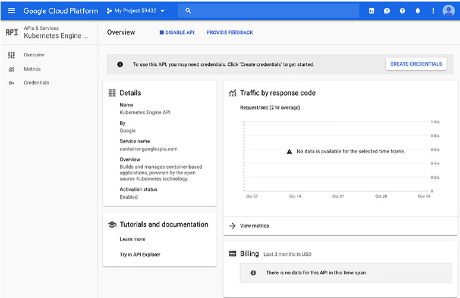

# Chapter 7 Computing with Kubernetes

**이 챕터는 구글 Associate Cloud Engineer 인증 시험 과목 중, 아래 내용을 다룬다.**
* 3.2 Kubernetes Engine 리소스 배포 및 구현

이 챕터는 구글에 의해서 생성되고 오픈소스화된 컨테이너 오케스트레이션 시스템인 Kubernetes를 소개한다. Kubernetes 아키텍처와 클러스터 내 노드 전반적으로 워크로드를 관리하는 방법을 배울 것이다. 또한, Cloud Console, Cloud Shell, Cloud SDK로 Kubernetes 리소스를 관리하는 방법을 배울 것이다. 이 챕터는 또한 어플리케이션 pods(Kubernetes 구조)를 배포하고, Kubernetes 리소스를 모니터링하고, 로깅하는 방법을 다룬다.

## Kubernetes Engine 소개

Kubernetes Engine은 GCP에서 관리하는 Kubernetes 서비스이다. 이 서비스로 GCP 사용자는 Kubernetes 플랫폼을 관리할 필요 없이 자체 Kubernetes 클러스터를 생성하고 유지보수할 수 있다.

Kubernetes는 VM의 클러스터에서 컨테이너를 실행한다. Kubernetes는 컨테이너를 실행할 곳을 결정하고, 컨테이너의 상태를 모니터링하고, VM의 완전한 lifecycle을 관리한다. 이 업무의 집합은 *container orchestration*이라고 알려졌다.

Kubernetes 클러스터는 챕터 6에서 논의된 인스턴스 그룹과 유사하다. 둘 다 그룹으로서 관리될 수 있는 VM의 집합이다. 그러나, 인스턴스 그룹은 더 많이 제한된다. 일반적으로 모든 VM은 인스턴스 그룹에서 같은 이미지를 실행한다. Kubernetes는 그렇지 않다. 또한, 인스턴스 그룹은 컨테이너의 배포를 지원하는 메커니즘이 없다. 컨테이너는 게스트 OS를 복지하지 않고도 VM처럼 어플리케이션이나 워크로드를 분산하고 확장할 수 있는 높은 이식성과 가벼운 수단을 제공한다. 컨테이너는 아주 빠르게(보통 몇 초) 기동 및 중지될 수 있고, 아주 적은 리소스를 사용한다. 컨테이너는 어플리케이션과 워크로드를 위한 배의 컨테이너와 유사하다고 생각할 수 있다. 재구성할 필요 없이 배, 기차, 트럭에서 운반될 수 있는 컨테이너처럼, 어플리케이션 컨테이너는 재구성할 필요없이 개발 노트북에서 검증 및 운영 서버로 이동될 수 있다. 이는 수동적으로 완료해야 한다. 인스턴스 그룹은 일부 모니터링을 갖고 실패한 인스턴스를 재시작할 수 있지만, Kubernetes는 유지보수와 관련하여 더 많은 융통성를 갖는다.

몇몇 오브적트와 컨트롤러의 집합으로 구성되는 Kubernetes 아키텍처를 살펴보자.

명심해야 한다. Kubernetes Engine 를 사용할 때, Kubernetes 플랫폼의 컨테이너에서 실행되는 Kubernetes와 어플리케이션과 워크로드를 관리할 것이다.

### Kubernetes 클러스터 아키텍쳐

Kubernetes 클러스터는 클러스터 마스터와 클러스터의 워커인 하나 이상의 노드로 구성된다. 클러스터 마스터는 클러스터를 제어하고, 고가용성과 장애대응을 위한 replicated와 분산될 수 있다.

클러스터 마스터는 Kubernetes API, Controllers, Schedulers와 같이 Kubernetes에서 제공되는 서비스를 관리한다. 클러스터와의 모든 상호작용은 Kubernetes API를 사용하여 마스터를 통해 동작된다. 클러스터 마스터는 노드에서 동작을 수행하는 명령어를 실행한다. 또한 사용자는 `kubectl`명령어를 사용하여 클러스터와 상호작용할 수 있다.

노드는 클러스터에서 실행하는 워크로드를 실행한다. 노드는 어플리케이션을 실행하도록 설정된 컨테이너를 실행하는 VM이다. 노드는 클러스터 마스터에 의해 주로 제어되지만, 일부 명령어는 수동적으로 실행될 수 있다. 노드는 `kubelet`이라고 불리는 에이전트를 실행한다. 이는 클러스터 마스터와 통신하는 서비스이다. 

클러스터를 생성할 때, 머신 타입을 지정할 수 있다. 기본 값은 1개의 vCPU와 3.75GB의 메모리를 갖는 n1-standard-1이다. 이 VM들은 컨테이너를 실행하는데 최적화된 특별한 OS를 실행한다. 메모리와 CPU의 일부는 Kubernetes를 위해 선점된다. 그래서 노드에서 실행하는 어플리케이션이 이용할 수 없다.

Kubernetes는 처리를 워크로드로 구성합니다. Kubernetes가 워크로드를 처리하는 방법의 핵심 기능을 구성하는 몇 가지 구성 Objects가 있다.

### Kubernetes Objects

워크로드는 Kubernetes 클러스터에서 노드 전반적으로 분산된다. 어떻게 작업이 분산되는지 이해하기 위해, 몇 가지 기본 개념을 이해하는게 중요하다.
* Pods
* Services
* Volumes
* Namespaces

이러한 각 object은 워크로드의 논리적인 구성에 기여한다.

#### Pods

Pods는 클러스터에서 실행 중인 프로세스의 단일 인스턴스이다. Pods는 최소 하나의 컨테이너를 포함한다. 보통 단일 컨테이너를 실행하지만, 다수의 컨테이너를 실행할 수 있다. 다수의 컨테이너는 2개 이상의 컨테이너가 리소스를 반드시 공유해야할 때 사용된다. Pods는 컨테이너 전반적으로 네트워크와 스토리지를 공유한다. 각 Pod는 유니크한 IP 주소와 port의 집합을 얻는다. 컨테이너는 port에 연결한다. pod 내에 다수의 컨테이너는 다른 포트에 연결하고, 서로 localhost로 통신할 수 있다. 이 구조는 클러스터내의  하나의 어플리케이션 인스턴스를 pod로서 실행하는 데 지원하도록 설계되었다. pod는 컨테이너가 마치 독립된 VM에서 실행중인 것처럼, 공용 스토리지, 하나의 IP주소, 포트 집합을 공유하는 것처럼 작동할 수 있다. 이렇게 하면, 구성을 변경하지 않고도 동일한 어플리케이션의 여러 인스턴스나 다른 어플리케이션의 다른 인스턴스를 동일한 노드나 다른 노드에 배포할 수 있다.

Pods는 관리 목적으로 다수의 컨테이너를 하나의 엔티티로 취급한다.

Pods는 일반적으로 그룹으로 생성된다. Replicas는 Pods의 복사본이고, 유닛으로 관리되는 Pods의 그룹을 구성한다. 뿐만 아니라 Pods는 오토 스케일링을 지원한다. Pods는 임시로 간주된다. 즉, Pods는 종료될 것으로 간주된다. Pod가 unhealthy 상태(예를 들어, waiting 모드에서 멈추거나 반복적으로 충돌되는 경우)이면, 종료된다. 확장과 상태 모니터링을 관리하는 메커니즘은 *controller*로 알려져있다.

pods는 Compute Engine 관리형 인스턴스 그룹과 유사하다. 핵심 차이점으로 pods는 컨테이너에서 어플리케이션을 실행하기 위한 것이고, 클러스터에서 다양한 노드에 위치될 수 있다. 반면에 관리형 인스턴스 그룹은 각 노드에 동일한 어플리케이션 코드를 실행한다. 또한, Cloud Console에서 명령을 실행하거나 커맨드라인을 통해서 스스로 인스턴스 그룹을 관리한다. Pods는 보통 controller에 의해서 관리된다.

#### Sevices

Pods가 임시적이고, controller에 의해서 종료될 수 있기 때문에, pods에 의존하는 다른 서비스는 특정 pods에 밀접하게 결합되지 않아야 한다. 예를 들어, pods가 유니크한 IP 주소를 갖더라도, 어플리케이션은 해당 IP 주소에 의존하지 않아야 한다. 해당 IP 주소를 갖는 pod가 종료되고 다른 pods가 생성되면, 다른 IP 주소를 갖을 수도 있다. IP 주소는 다른 컨테이너를 실행하는 다른 pod에 재지정될지도 모른다.

Kubernetes는 pods에서 실행 중인 어플리케이션과 이를 호출하는 다른 어플리케이션 사이의 간접적인 수준을 제공한다. 이를 *service*라고 부른다. Kubernetes에서 service는 API 엔드포인트에 안정적인 IP 주소를 제공하여 어플리케이션이 특정 어플리케이션을 실행하는 pods를 찾을 수 있도록 하는 객체이다. Services는 pods가 변경될 때 업데이트 된다. 그래서 어플리케이션을 실행하는 최신 pods의 리스트를 유지한다.

#### ReplicaSet

ReplicaSet은 동일한 수의 pods가 실행 중이라는 것을 보장하는 deployment에 의해서 사용되는 controller이다. 예를 들어, pod가 unhealthy 상태라고 결정되면, controller는 pod를 종료할 것이다. ReplicaSet은 어플리케이션나 워크로드를 위해 충분한 pods가 실행 중이지 않은 것을 감지하고, 다른 pods를 생성할 것이다. 또한 ReplicaSet은 pods를 업데이트하고 삭제하는데 사용된다.

#### Deployment

Kubernetes에서 또 다른 중요한 개념은 deployment이다. Deployments는 동일한 pods의 세트이다. 세트의 멤버는 일부 pods가 종료되고 다른 pods가 실행되면 변경될 수 있지만, 모두 동일한 어플리케이션을 실행하고 있다. pods는 동일한 pod 템플릿을 사용하여 생성되기 때문에, 모두 동일한 어플리케이션을 실행한다. 

pod 템플릿은 pod를 실행하는 방법에 대한 정의이다. pod를 정의하는 방법의 설명은 *pod specification*이라고 부른다. Kubernetes는 템플릿에서 정의된 상태로 pod를 유지하기위해 이 정의를 사용한다. 즉, 이 명세서는 deployment에 포함되어야하는 pods의 최소 수가 있고, 그 수에 미치지 못하면, ReplicaSet을 호출하여 추가적인 pods가 Deployment에 추가될 것이다.

#### StatefulSet

Deployments는 stateless 어플리케이션에 적합하다. stateless 어플리케이션은 상태를 추적할 필요가 없는 어플리케이션이다. 예를 들어, 입력 값으로 계산하는 API를 호출하는 어플리케이션은 이전 호출이나 계산을 추적할 필요가 없다. 해당 API를 호출하는 어플리케이션은 호출할 때마다 다른 pod에 도달할지도 모른다. 그러나, 단일 세션 동안 단일 pod가 클라이언트의 모든 호출에 응답하도록하는 것이 유리한 경우가 있다. 

StatefulSets는 deployment와 같지만, pod에 유니크한 ID를 지정한다. 이를 통해 Kubernetes는 어떤 클라이언드가 어떤 pod를 사용하는지 추적하고 함께 유지할 수 있다. StatefulSets는 어플리케이션이 유니크한 네트워크 ID나 안정적인 persistenct 스토리지가 필요할 때 사용된다.

#### Job

Job은 워크로드에 대한 추상화이다. Job은 pods를 생성하고, 어플리케이션이 워크로드를 완료할때까지 pods를 실행한다. Job 명세서는 설정파일에 지정되고, 사용할 컨테이너에 대한 명세서와 실행할 명령어를 포함한다.

Kubernetes가 어떻게 구성되고, 워크로드를 어떻게 실행하는지 다뤘다. 앞으로 Kubernetes Engine을 사용하여 Kubernets 클러스터를 배포하는 방법을 다룰 것이다.

## Kubernetes 클러스터 배포

Kubernetes 클러스터는 Cloud Shell이나 Cloud Shell이나 Cloud SDK가 설치된 로컬 환경에서 커맨드 라인을 사용하여 배포될 수 있다.

### Cloud Console을 사용하여 Kubernetes 클러스터 배포

Kubernetes Engine을 사용하기 위해, Kubernetes Engine API를 활성화해야 한다. API를 활성화하면, Cloud Console에서 Kubernetes Engine 페이지를 이동할 수 있다. 그림 7.1은 Overview 페이지의 예를 보여준다.

**그림 7.1** Cloud Console의 Kubernets Engine 섹션의 Overview 페이지

