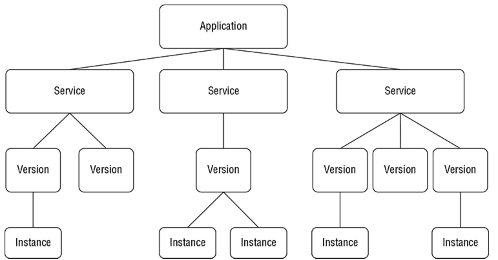
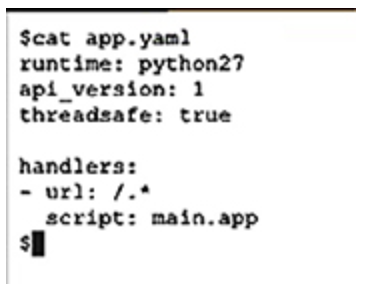
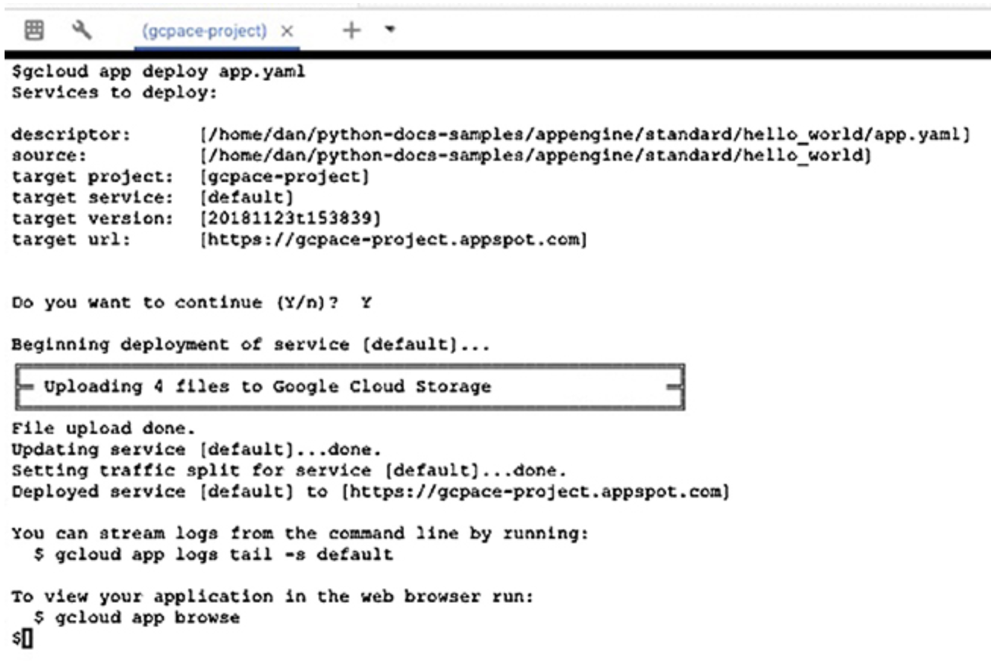
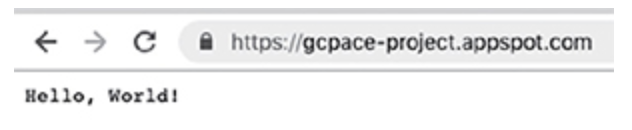
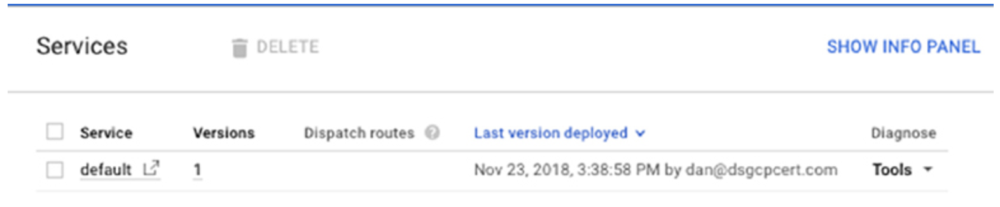
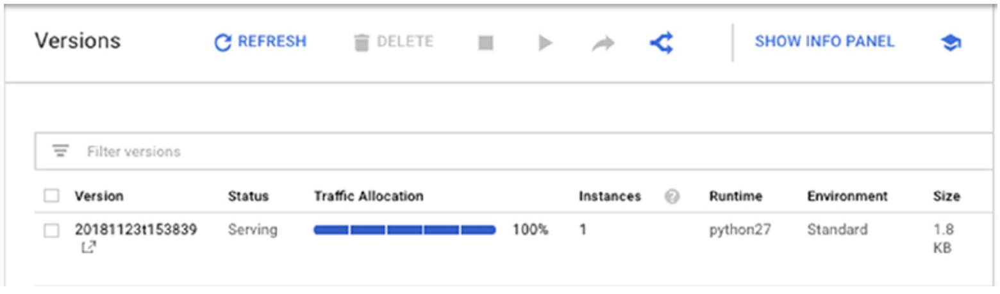
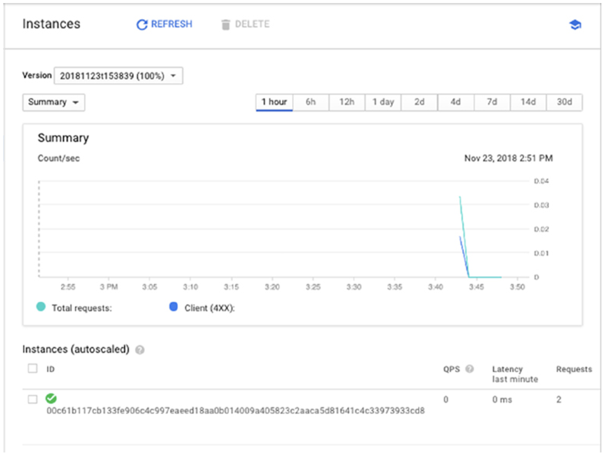
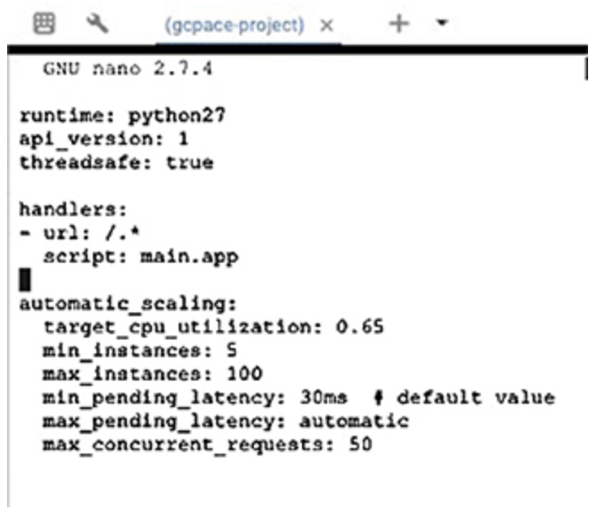
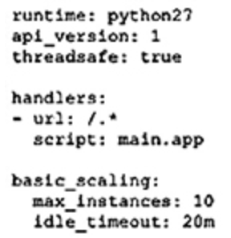
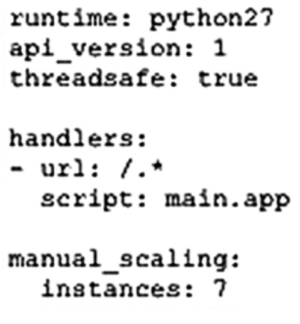

# Chapter 9 Computing with App Engine

**이 챕터는 구글 Associate Cloud Engineer 인증 시험 과목 중, 아래 내용을 다룬다.**
* 3.3 App Engine과 Cloud Functions 리소스 배포하고 구현

이 챕터는 App Engine Standard 어플리케이션을 배포하는 방법을 설명한다. App Engine 어플리케이션의 구조를 확인 하는 것으로 시작하고, 어플리케이션 설정을 지정하는 방법에 대해서 설명한다. 그 다음, 스케일링과 트래픽 분산을 통해서 App Engine 어플리케이션을 튜닝에 관심을 기울일 것이다. 또한, App Engine 어플리케이션 버전에 대해서도 논의한다.

구글 App Engine은 근본적으로 언어에 특화된 환경에서 어플리케이션을 실행하도록 설계되었다. App Engine이 소개된 이후, 구글은 App Engine Flexible을 소개했다. 이는 컨테이너에 커스텀 런타임을 배포하는데 사용될 수 있다. 이 챕터는 App Engine Standard로 알려진 근본적인 App Engine 환경에 어플리케이션을 배포하는 방법을 설명한다.

## App Engine 컴포넌트

App Engine Standard 어플리케이션은 4가지 컴포넌트로 구성된다.
* Application
* Service
* Version
* Instance

App Engine 어플리케이션은 project에서 생성되는 고수준의 리소스이다. 즉, 각 프로젝트는 하나의 App Engine 어플리케이션을 갖을 수 있다. App Engine과 연관된 모든 리소스는 어플리케이션이 생성될 때 지정되는 region에서 생성된다.

어플리케이션은 최소 하나의 service를 갖는다. 이는 App Engine 환경에서 실행되는 코드이다. 어플리케이션 코드의 다양한 버전이 존재할 수 있기 때문에, App Engine은 어플리케이션의 버전관리를 지원한다. service는 다양한 버전을 갖을 수 있고, 새로운 기능, 버그 수정, 이전 버전에 상대적인 변화를 통합하는 새로운 버전은 일반적으로 약간 다르다. 버전이 실행될 때, 어플리케이션의 인스턴스를 생성한다.

Service는 전형적으로 *microservices*로 알려진 다수의 서비스로 구성된 복합한 어플리케이션으로 하나의 기능을 수행하도록 구성된다. 하나의 microservice는 데이터 접근을 위한 API 요청을 처리한다. 반면에, 또 다른 microservice는 비용 청구를 목적으로 인증과 3번째 레코드 데이터를 수행한다.



**그림 9.1** App Engine 어플리케이션의 컴포넌트 계층

Service는 소스 코드와 설정 파일에 의해서 정의된다. 파일의 조합은 어플리케이션의 버전을 구성한다. 소스코드나 설정 파일이 약간 변경되었다면, 또다른 버전을 생성한다. 이 방법으로 한 번에 어플리케이션의 다양한 버전이 유지될 수 있다. 모든 사용자에게 변경을 배포하기 전에 적은 수의 사용자에게 새로운 기능을 테스트하는데 특히 유용하다. 버그나 다른 문제가 해당 버전에서 발생한다면, 이전 버전으로 쉽게 롤백할 수 있다. 다양한 버전을 유지하는 다른 장점은 트래픽을 이관하고 분리할 수 있다. 이후 챕터에서 더 자세한 정보를 설명할 것이다.

## App Engine 어플리케이션 배포

구글 Associate Cloud Engineer 인증 시험은 어플리케이션을 작성하는 엔지니어를 요구하지 않는다. 하지만, 어플리케이션을 배포하는 방법을 알아야 한다. 이 섹션에서는 구글에서 Hello World 예시를 다운로드하고, 배포할 샘플 어플리케이션으로 사용한다. 어플리케이션은 Python으로 작성 되어서 App Engine에서 Python 런타임을 사용할 것이다.

### Cloud Shell과 SDK를 사용하여 어플리케이션 배포

처음, Cloud Shell을 사용하여 터미널에서 작업할 것이다. Cloud Console에서 Cloud Shell 아이콘을 클릭하여 시작한다. `gcloud`가 App Engine과 작동하도록 구성되어있는지 확인한다.

```bash
gcloud components install app-engine-python
```

이 것은 필요한 App Engine Python 라이브러리를 설치하거나 업데이트할 것이다. 라이브러리가 최신이면, 상태를 알리는 메시지를 수진할 것이다.

Cloud Shell을 열 면, `python-docs-samples` 이름의 디렉토리를 갖을 수 있다. 이 디렉토리는 이 챕터에서 사용할 Hello World 어플리케이션을 포함한 예제 어플리케이션을 포함한다. 디렉토리가 보이지 않는다면, 아래를 참고하여 구글에서 Hello World 어플리케이션을 다운로드 할 수 있다.

```bash
git clone [https://github.com/GoogleCloudPlatform/python-docs-samples](https://github.com/GoogleCloudPlatform/python-docs-samples)
```

다음, 워킹디렉토리를 Hello World 어플리케이션 디렉토리로 변경한다.

```bash
cd python-docs-samples/appengine/standard/hello_world
```

디렉토리의 파일을 조회하면 3개의 파일이 확인될 것이다.
* app.yaml
* main.py
* main_test.py

여기에서는 주로 `app.yaml` 파일을 다룬다. 아래 명령을 사용하여 파일의 컨텐츠를 조회한다.

```bash
cat app.yaml
```

그림 9.2에서 보여지는 것 처럼 설정의 상세정보를 보여준다.



**그림 9.2** Python 어플리케이션을 위한 `app.yaml`파일의 컨텐츠

어플리케이션 설정 파일은 사용할 Python의 버전, 배포할 API 버전, `true`로 설정된 Python 파라미터인 `threadsafe`를 지정한다. 마지막 3 라인은 실행할 스크립트를 지정한다. 여기서는 `main.py`를 지정했다.

어플리케이션을 배포하기 위해, 다음 명령을 사용할 수 있다.

```bash
gcloud app deploy app.yaml
```

그러나, `app.yaml`은 기본 값이다. 그래서 파일 이륾을 사용하는 경우, `deploy` 명령에서 `app.yaml`을 지정할 필요가 없다.

이 명령은 `app.yaml` 파일이 있는 디렉토리에서 반드시 실행되어야 한다. `gcloud app deploy` 명령은 몇 가지 optional 파라미터를 갖는다.
* `--version`, 커스텀 버전 ID를 지정
* `--project`, 어플리케이션에서 사용할 projectID를 지정
* `--no-promote`, 트래픽 라우팅없이 어플리케이션을 배포

`gcloud app deploy` 명령을 실행하면, 그림 9.3같은 output을 확인할 수 있다.



**그림 9.3** `gcloud app deploy` 명령의 output

브라우저에서 https://gcpace-project.appspot.com과 같이 프로젝트 URL을 입력하면 HelloWorld 프로그램의 output을 확인할수 있다. 프로젝트 URL은 project name 위에 .appspot.com이 붙는다. 예를 들어, 그림 9.8는 output을 보여준다.



**그림 9.4** App Engine Standard에서 실행할 때, Hello World 어플리케이션의 output

**Notice**

> `appspot.com` URL을 사용하지 않으면 커스텀 도메인을 지정할 수 있다. App Engine Settings 페이지에서 Add New Custom domain 기능으로부터 실행할 수 있다.

App Engine 콘솔에서 왼쪽 패널 메뉴에서 Services를 선택하면 service의 리스트를 확인할 수 있다. (그림 9.5)



**그림 9.5** App Engine 콘솔에서의 service 리스트

그림 9.6.은 버전의 리스트를 보여준다. 왼쪽 패널 메뉴에서 Versions을 선택하여 확인할 수 있다.



**그림 9.6** App Engine 콘솔에서의 버전 리스트

그림 9.7은 인스턴스 성능의 상세정보를 보여준다. 왼쪽 패널 메뉴에서 Instances를 선택하여 상세정보를 확인할 수 있다. 이 정보는 어플리케이션의 부하를 이해하는데 유용하다.



**그림 9.7** App Engine 콘솔에서 인슽턴스 성능 상세 정보

`gcloud app versions stop` 명령을 사용하여 버전 서비스를 중지할 수 있고, 중지할 버전의 리스트를 추가로 입력할 수 있다. 예를 들어, v1과 v2 버전의 서비스를 중지하기 위해서 다음과 같이 사용하면 된다.

```bash
gcloud app versions stop v1 v2
```

App Engine 콘솔에서 Settings의 Disable App 버튼을 클릭하여 전체 어플리케이션을 비활성화 할 수 있다.

## App Engine 어플리케이션 확장

인스턴스는 App Engine 서버에서 어플리케이션을 실행하기 위해 생성된다. App Engine은 부하를 기반으로 필요한 만큼 인스턴스를 자동적으로 추가하거나 삭제한다. 부하 기반으로 인스턴스가 확장되었을 때, *dynamic* 인스턴스라고 부른다. dynamic 인스턴스는 수요가 낮을 때, 중지하여 비용을 최저고하하는데 도움을 준다.

또는, 이동하지 않거나 항상 실행하도록 인스턴스를 설정할 수 있다. 이들은 성능을 최적화해서 인스턴스가 시작되는 동안 사용자가 기다리는 시간이 적다.

설정은 인스턴스가 resident인지 dynamic인지 결정한다. 오토스케일링이나 기본 스케일링을 설정한 경우, 인스턴스는 dynamic이 될 것이다. manual scaling으로 설정하면, 인스턴스는 resident가 될 것이다.

오토 스케일링을 지정한 경우, `app.yaml`에 `automatic_scaling`을 포함하여 추가하고, 그 뒤에 설정 옵션의 key-value 쌍을 추가한다.
* target_cpu_utilization
* target_throughput_utilization
* max_concurrent_requests
* max_instances
* min_instances
* max_pending_latency
* min_pending_latency

**Target CPU Utilization** 추가 인스턴스가 시작되기 전에 발생하는 최대 CPU 사용량을 지정

**Target Throughput Utilization** 추가 인스턴스가 시작되기 전에 동시 요청의 최대 수를 지정한다. 이 것은 0.5에서 0.95 사이로 수를 지정한다.

**Maximum Concurrent Request** 새로운 인스턴스를 시작하기 전에 인스턴스가 수용할 수 있는 최대 동시 요청을 지정한다. 기본 값은 10이고, max는 80이다.

**Maximum and Minimum Instances** 어플리케이션을 실행할 수 있는 인스턴스 수의 범위를 가리킨다.

**Maximum and Minimum Latency** 요청이 queue에서 처리되기 기다리는 최대, 최소 시간을 가리킨다.



**그림 9.8** 오토스케일링 파라미터를 갖는 Hello World 앱의 `app.yaml` 예시

또한 오토 스케일링을 활성화하여 기본적인 스케일링을 사용할 수 있다. 오직 basic scaling의 파라미터는 `idle_timeout`과 `max_instances`이다.

그림 9.9는 최대 10개의 인스턴스와 20분의 `idle_timeout` basic scaling이 설정된 Hello World 앱의 `app.yaml`의 예시를 보여준다.



**그림 9.9** basic scaling을 사용한 `app.yaml`의 예시

scaling을 제어해야하기 때문에 manual scaling 사용을 선호한다면, `manual_scaling` 파라미너와 실행할 인스턴스의 수를 지정한다. 그림 9.10 예시에서는 Hello World 앱이 7개 인스턴스를 실행하도록 설정되었다.



**그림 9.10** manual scaling을 사용한 `app.yaml` 예시

**실 사용 사례: Microservices vs Monolithic 어플리케이션**

> 확장이 가능한 어플리케이션은 종종 microservices의 집합으로 작성된다. 항상 그런 것은 아니다. 과거에는 많은 어플리케이션이 monolithic이거나 하나의 컴파일된 프로그램이나 스크립트에서 모든 기능이 포함되도록 설계되었다. 이 것은 단순하고 어플리케이션을 관리하기 쉬운 방법으로 들릴수도 있지만, 해결하는 것 보다 더 많은 문제가 발생한다.
> * 어플리케이션의 일부가 변경되면 전체 어플리케이션을 재배포 해야한다. microservice를 배포하는 것보다 더 오래 걸린다. 개발자는 배포하기 전에 변경사항을 묶는다.
> * 묶은 파일에 버그가 있는 경우, monolithic 어플리케이션이 롤백 될 때 모든 기능이 롤백 된다.
> * 개발자의 팀이 하나의 파일이나 적은 수의 소스코드 파일로 작업을 하면 동등하게 변경하기 어렵다.

Microservice는 개발자가 다른 어플리케이션에 영향 없이 서비스를 변경하고 배포할 수 있는 단일 기능 어플리케이션으로 어플리케이션 코드를 분리한다. Git 같은 소스코드 관리 도구는 개발자가 소스코드 파일을 동시에 변경하는 큰 시스템의 컴포넌트에 기여하는 것을 쉽게 한다. 이 단일 기능 코드와 다른 코드와 쉬운 통합은 더 빈번한 업데이트와 모든 사용자에게 배포하기 전에 새로운 버전을 테스트하는 기능을 촉진한다.

### App Engine 버전간 트래픽 분산

하나 이상의 어플리케이션 버전이 동작 중인 경우, 버전간 트래픽을 분산할 수 있다. App Engine은 트래픽을 분산하는 3가지 방법을 제공한다: IP 주소 기반, HTTP 쿠키 기반, 랜섬 선택 기반. IP 주소 분산은 고정성을 제공해서 최소 IP 주소가 변경되지 않는 한 클라이언트는 항상 동일한 분할로 라우팅된다. HTTP 쿠키는 사용자를 버전에 지정하려고할 때 유용하다. 랜덤 선택은 워크로드를 고르게 분산하려고할 때 유용하다.

IP 주소 분할을 사용하면, App Engine은 hash를 생성한다. 즉, 각 버전의 IP 주소를 사용하여 0에서 999사이의 입력 문자열을 기반으로 생성된 숫자이다. 사무실에서 앱 작업을 시작한 다음 카페로 네트워크를 옮기는 경우와 같이 IP 주소가 변경되는 경우 문제가 발생할 수 있다. 상태 정보는 버전에 유지되는 경우, IP주소가 변경된 후에는 사용하지 못할 수도 있다.

트래픽을 분산하는 데 좋은 방법은 쿠키이다. 쿠키를 사용하면, GOOGAPPUID라는 이름의 쿠키 HTTP request 헤더에 0에서 999사이의 hash 값이 포함된다. 쿠키 분산으로, 사용자의 IP가 변경되어도 앱의 동일한 버전으로 접근할 수 있다. GOOGAPPUID 쿠키가 없으면, 트래픽은 랜덤하게 라우팅된다.

트래픽을 분산하는 명령은 `gcloud app services set-traffic` 이다. 다음은 예시이다.

```bash
gcloud app services set-traffic serv1 --splits v1=.4,v2=.6
```

위 예시는 serv1 이름의 서비스에 버전 1에는 40%, 버전 2에는 60% 트래픽이 분산될 것이다. 지정된 서비스 이름이 없다면 모든 서비스가 분할 된다.

`gcloud app services set-traffic` 명령은 다음 파라미터를 갖는다.
* `--migrate`는 App Engine이 이전 버전에서 신규 버전으로 트래픽을 이관해야한다는 것을 가리킨다.
* `--split-by`은 IP나 쿠키 중 하나를 사영하여 트래픽을 분산하는 방법을 지정한다. 가능한 값은 `ip`, `cookie`, `random`이다.

또한 콘솔에서 트래픽을 이관할 수 있다. Version 페이지에서 Migrate 명령을 선택한다.

## Summary

App Engine Standard는 언어에 특화된 환경에서 어플리케이션을 실행하기 위한 서버리스 플랫폼이다. 클라우드 엔지니어로서, App Engine 어플리케이션을 배포하고 확장하는 방법을 알아야 한다. App Engine 어플리케이션은 services, version, instances로 구성된다. 동시에 실행하는 다양한 버전을 갖을 수 있다. 버전 간 트래픽을 분산할 수 있고, 자동적으로 새로운 버전으로 모든 트래픽을 이관할 수 있다. App Engine 어플리케이션은 `app.yaml` 설정 파일을 통해 설정된다. 언어 환경, 확장 파라미터, deployment를 커스터마이즈하는 다른 파라미터를 지정할 수 있다.

## 시험 요소

**App Engine 어플리케이션의 구조를 안다.** services, versions, instances로 구정된다. Services는 하나의 기능을 제공한다. Version은 App Engine 환경에서 실행하는 코드의 다른 버전이다. Instances는 services를 실행하는 관리형 인스턴스이다.

**App Engine 앱을 배포하는 방법을 안다.** `app.yaml` 파일을 사용하여 App Engine 환경 설정을 포함한다. project는 한번에 하나의 App Engine만 갖을 수 있다. `gcloud app deploy` 명령을 사용하는 방법을 알아야 한다.

**App Engine 콘솔에서 어플리케이션의 상태를 확인하는 방법을 안다.** Services, Versions, Instances의 리스트를 확인하는 것을 포함한다.

**Scaling 옵션의 차이점을 이해한다.** Scaling 옵션은 autoscaling, basic scaling, manual scaling이 있다. 오직 autoscaling과 basic scaling은 dynamic 인스턴스 이다. manual scaling은 resident 인스턴스를 생성한다. Autoscaling은 basic scaling보다 더 많은 설정 옵션을 허용한다.

**트랙픽을 분산하는 방법을 안다.** `gcloud app services set-traffic` 명령ㅇ르 사용하면 트래픽을 분산할 수 있다. `--splits` 파라미터는 각 버전에 라우팅하는 트래픽의 퍼센트를 지정한다.

**신규 버전으로 트래픽을 이관하는 방법을 이해한다.** App Engine 콘솔의 Versions 페이지나 `gcloud app services set-traffic`명령의 `--migrate` 파라미터를 사용하여 이관할 수 있다.

[맨 위로](#chapter-9-computing-with-app-engine)