# Official Google Cloud Certified Associate Cloud Engineer Study Guide

# Contents
[TOC]

---

# 소개
구글 클라우드 플랫폼(GCP)는 구글에서 제공하는 동일한 소프트웨어, 하드웨어, 네트워킹 인프라를 사용자에게 제공하는 퍼블릭 클라우드다. 사업, 기업, 개인은 몇 분안에 서버를 설치하고, 페타바이트의 데이터를 저장하고, GCP에 글로벌 가상 클라우드를 구현할 수 있다. GCP에는 쉽게 사용할 수 있는 콘솔, CLI 툴, 클라우드에서 리소스를 관리하기 위한 API를 포함하고 있다. 사용자는 가상머신(VM), 디스크와 같은 일반적인 리소스를 사용하거나 IoT를 위한 서비스, 머신러닝, 미디어, 다른 특정 도메인에 특화된 서비스를 선택할 수 있다.

GCP에서 어플리케이션과 서비스를 배포하고 관리하는 것은 구글이 사용자 계정을 구성하고, identities와 접근 제어를 관리하는 방법에 명확한 이해가 필요하다. 또한 다양한 서비스의 장단점을 이해해야 한다. Associate Cloud Engineer 인증은 구글 클라우드에서 인프라, 서비스, 네트워크를 배포하고 운영하는 데에 필요한 지식과 스킬을 증명한다.

이 스터디 가이드는 Google Cloud에서 동작하는 리소스들의 필요를 충족시키기위한 GCP를 자세하게 이해하는데 도움이 되도록 설계되었다. 물론 이 책은 Associate Cloud Engineer 인증 시험을 통과하는데 도움을 주지만, 벼락치기를 위한 가이드는 아니다. 당신은 시험에 통과하기 위해 필요한 것보다 더 많이 배울 것이다. 서비스 선택, 사용자 관리, 배포, 모니터링, 클라우드 기반 솔루션에서 사업 요구사항 매핑과 같이 클라우드 엔지니어가 직면하는 이슈를 해결하는 방법을 배울 것이다.

이 책의 각 챕터는 하나의 주제를 다루고, 인증 시험을 통과하기위해 알아야하는 핵심 정보를 설명하는 "Exam Essentials" 섹션을 포함한다. 그리고 복습을 도와주고, 각 챕터의 이해력을 강화하기위한 연습을 포함한다. 시험에서 볼 수도 있는 질문의 유형 감각을 얻기 위한 샘플 문제는 각 챕터의 마지막에 포함되어있다. 이 책은 또한 쉽게 이해할 수 있도록 만든 카드(flashcard)와 가이드를 통해 배우는 모든 토픽에 대한 연습 문제를 포함하고 있다.

[맨 위로](#Contents) 

## 이 책에서 다루는 것

이 책은 GCP의 제품과 서비스를 설명한다. G Suite 관리자 주제는 포함하지 않는다.

**Chapter 1 : 구글 클라우드 플랫폼 Overview**
이 챕터에서는 compute, storage, 머신러닝 상품과 같은 networking 서비스를 포함하여 GCP에서 제공하는 서비스들의 유형을 확인한다. 이 챕터에서는 또한 클라우드 컴퓨팅과 데이터 센터 혹은 on-premise 컴퓨팅의 핵심 차이에 대해 설명한다.

**Chapter 2 : 구글 클라우드 컴퓨팅 서비스** 이 챕터에서는 computing, storage, networking과 같은 인프라스트럭쳐 서비스에 대한 기초를 제공한다. ID 관리와 관련 서비스의 컨셉도 소개한다. 또한 DevOps 주제와 어플리케이션과 리소스를 배포하고 모니터링하기 위한 도구들을 소개한다.GCP는 머신러닝과 자연어 처리 서비스와 같은 특화 서비스의 리스트를 포함한다. 이 챕터에서는 특화 서비스들을 간단하게 다룬다. 이 챕터는 regions과 zones을 살펴보면서 구글 클라우드의 조직 구조를 소개한다. 이 챕터에는 패키지된 어플리케이션을 배포하기 위한 클라우드 런쳐의 논의 내용이 포함되어있다.

**Chapter 3 : 프로젝트, 서비스계정, 빌링** GCP와 작업하기 시작할 때 해야할 일 중에 하나는 계정을 세팅하는 것이다. 이 챕터에서, 조직, 폴더, 프로젝트에서 계정별 리소스를 구성하는 방법에 대해 배울 것이다. 이 구조를 생성하고 수정하는 방법을 배울 것이다. 특정 프로젝트를 위한 API 활성화 뿐만 아니라 특정 프로젝트의 접근 제어와 사용자 ID를 관리하는 방법에 대해 배울 것이다. 이 챕터는 빌링 계정을 생성하고 프로젝트에 연결하는 방법에 대해 설명한다. 또한 예산을 생성하고, 비용환리를 도와주기위한 빌링 알림을 정의하는 방법에 대해 배울 것이다. 마지막으로 이 챕터는 GCP의 모니터링 시스템중 하나로 사용되는 Stackdriver 계정을 생성하는 방법에 대해 설명한다.

**Chapter 4 : 구글 클라우드 컴퓨팅 소개** 이 챕터에서는 GCP에서 어플리케이션과 서비스가 동작하기 위해 이용할 수 있는 다양한 옵션들을 확인할 것이다. 옵션들은 리눅스나 윈도우OS에서 동작하는 VM을 제공하는 Compute Engine을 포함한다. App Engine은 개발자들이 스스로 VM을 관리해야하는 걱정없이 그들의 어플리케이션을 실행할 수 있는 Platform as a service(PaaS) 옵션이다. 다수의 어플리케이션과 서비스를 실행할 것이라면, VM을 대체할 수 있는 가벼운 컨테이너를 원할지도 모른다. 이 챕터에서는 컨테이너와 이를 관리하는 Kubernetes Engine에 대해서 배울 것이다. 또한 Cloud Storage에서 로그되는 이미지의 처리 동작과 같이 이벤트 중심의 짧은 실행 작업을 위한 Cloud Functions를 소개한다. 또한 모바일 어플리케이션의 백엔드 인프라를 제공하는 데 적합한 서비스인 Firebase에 대해서 배울 것이다.

**Chapter 5 : Compute Engine 가상 머신의 Computing** 이 챕터에서는 CPU, 메모리, 저장소 옵션, OS 이미지를 선택하는 것을 포함한 VM 설정 방법에 대해 배울 것이다. VM을 동작하기 위한 GCP 콘솔과 Cloud Shell을 사용하는 방법을 배울 것이다. 게다가 VM을 기동하거나 정지할 때 사용할 CLI와 SDK를 설치하는 방법을 확인할 것이다. 이 챕터는 또한 VM으로 네트워크 접속을 허용하는 방법에 대해 설명한다.

**Chapter 6 : 가상머신 관리** 이전 챕터에서 VM을 생성하는 방법을 배웠고, 이 챕터에서는 VM 단위와 그룹별로 관리하는 방법을 배울 것이다. GCP 콘솔을 사용하여 VM 하나의 인스턴으를 관리하는 것으로 시작할 것이다. 그리고 Cloud Shell과 CLI를 사용하여 같은 동작을 수행할 것이다. 다음으로, 하나의 단위로 관리할 수 있는 VM 집합을 생성하도록 허용한 인스턴스 그룹에 대해서 배울 것이다. 인스턴스 그룹 섹션에서 관리된/관리되지 않은 인스턴스 그룹의 차이를 배울것이다. 또한 구글에 의해서 정지될 수도 있는 저비용의 VM인 Preemptible instances를 배울 것이다. preemptible 인스턴스의 비용 절충에 대해서 배울 것이다. 마지막으로, 이 챕터는 VM 관리를 위한 가이드라인으로 마무리된다.

**Chapter 7 : Kubernetes 컴퓨팅** 이 챕터는 구글에서 관리하는 Kubernetes service인 Kubernetes Engine을 소개한다. Kubernetes는 구글에 의해서 생성되고, 오픈소스로 릴리즈된 컨테이너 오케스트레이션 플랫폼이다. 이 챕터에서는 컨테이너, 컨테이너 오케스트레이션, Kubernetes 아키텍처의 기초에 대해서 배울 것이다. Pods, Services, Volumes, Namespace와 같은 Kubernetes 오브젝트 뿐만 아니라, ReplicaSets, deployments, jobs과 같은 Kubernetes 컨트롤러의 소개를 포함한다.
다음으로, 이 챕터는 GCP 콘솔, Cloud Shell, SDK를 사용하여 Kubernetes 클러스터를 배포하는 것을 배운다. 또한 존재하는 Docker 이미지 다운로드, Dokcer 이미지 빌드, pod 생성과 같이 Pods를 배포하는 방법과 Kubernetes 클러스터에 어플리케이션을 배포하는 것에 대해 학습한다. 서버의 클러스터를 확인하는 방법에 대해 알 필요가 있다. 이 챕터에서는 구글의 어플리케이션, 서비스, 컨테이너, 인프라 모니터링 서비스인 스택드라이버를 이용하여 모니터링과 로깅을 세팅하는 방법에 대한 설명을 제공한다.

**Chapter 8 Kubernetes 클러스터 관리** 이 챕터에서는 클러스터의 상태 확인, 이미지 저장소의 컨텐츠 확인, 저장소에 저장된 이미지의 세부정보 확인, node/pod/service의 추가/수정/삭제에 대한 Kubernetes 클러스터 관리의 기초에 대해서 배울 것이다. VM 관리 챕터처럼 이 챕터에서는 3가지 관리도구(GCP 콘솔, Cloud Shell, SDK)를 이용하여 관리 동작을 수행하는 방법을 배울 것이다. 이 챕터는 Kubernetes 클러스터 관리를 위한 좋은 예시와 가이드라인에 대한 논의로 마무리한다.

**Chapter 9 App Engine 컴퓨팅** 구글 App Engine은 구글의 PaaS 서비스다. 어플리케이션, 서비스, 버전, 인스턴스와 같은 App Engine 컴포넌트에 대해 배울 것이다. 이 챕터는 또한 설정 파일을 정의하고, 어플리케이션의 dependencies를 지정하는 방법을 다룬다. 이 챕터에서는 GCP 콘솔, Cloud Shell, and SDK를 사용하여 App Engine 리소스를 확인하는 방법을 배울 것이다. 또한 분산 매개변수로 트래픽을 조정하여 워크로드를 분산하는 방법을 설명한다. 또한 App Engine의 오토 스케일링에 대해서 배울 것이다.

**Chapter 10 Cloud Functions 컴퓨팅** Cloud Functions은 이벤트 기반을 위한 서버리스 연산이다. 이 챕터에서는 Cloud Functions를 사용하여 이벤트를 수신하고, 서비스를 실행하고, 결과를 리턴하는 것을 소개한다. 다음으로 3rd party API 통합, 이벤트 기반 처리와 같은 Cloud Functions의 사용 사례를 확인할 것이다. publications, subscription 기반의 처리를 위한 구글의 Pub/Sub 서비스와 Pub/Sub과 함께 Cloud Functions을 사용하는 방법에 대해 배울 것이다. Cloud Function은 Cloud Storage에서 이벤트를 응답하는데 잘 맞는다. 이 챕터에서는 Cloud Storage 이벤트와 이 이벤트를 수신하고 응답하기 위한 Cloud Functions의 사용 방법에 대해 설명한다. Cloud functions 실행의 상세 로그와 모니터링을 위한 Stackdriver 사용 방법을 배울 것이다. 마지막으로 이 챕터는 Cloud Functions 사용과 관리를 위한 가이드라인으로 마무리한다.

**Chapter 11 클라우드에서 storage 계획** GCP의 다양한 컴퓨팅 옵션에 대해서 설명했고, 이제는 Storage로 변경할 때이다. 이 챕터는 접속, 지속 시간, 데이터 모델과 같은 storage 시스템의 특정을 설명한다. 이 챕터에서는 캐쉬, persistent storage, archival storage의 차이에 대해 배울 것이다. regional과 multi regional persistent storage와 nearline vs coldline archival storage를 사용하는 것의 비용 절감 효과에 대해서 배울 것이다. 이 챕터에는 blob storage를 위한 Cloud Storage, 관계형 저장소 옵션인 Cloud SQL과 Spanner, NoSQL 저장소를 위한 Datastore, Bigtable, BigQuery 옵션에 해당하는 다양한 GCP 저장소 옵션에 대한 상세정보를 포함한다. 이 챕터는 지속성, 이용가능성, 트랜잭션 지원, 비용, 지연, 다른 read/write 패턴을 위한 지원의 요구사항을 기반에 기반한 데이터 저장소를 선택하는 자세한 가이드라인을 포함한다.

**Chapter 12 : 구글 클라우드 플랫폼에 저장소 배포** 이 챕터에서는 GCP의 스토리지 시스템의 각각에서 데이터베이스를 생성하고, 데이터를 추가하고, 레코드를 나열하고, 데이터를 삭제하는 방법을 배울 것이다. 이 챕터는 MySQL과 PostgreSQL을 제공하는 관리형 데이터베이스 서비스인 Cloud SQL을 소개하는 것으로 시작한다. Cloud Datastore, BigQuery, Bigtable, Spanner에 데이터베이스를 생성하는 방법을 배울 것이다. 다음으로, 메시지 큐에 데이터를 저장할 수 있는 Cloud Pub/Sub을 배우고, 큰 데이터 셋을 처리하기 위한 Hadoop, Spark 클러스터 서비스과 같은 Cloud Dataproc에 대해 논한다. 다음 섹션에서는 오브젝트를 위한 Cloud Storage에 대해 배울 것이다. 이 챕터는 특정 요구사항 집합을 위한 데이터 저장소를 선택하는 방법에 대한 가이드로 마무리한다.

**Chapter 13 : 스토리지에서 데이터 불러오기** GCP에서 데이터를 얻는 방법은 다양하다. 이 챕터는 Cloud SQL, Cloud Storage, Datastore, BigQuery, BigTable, Dataproc에서 데이터를 로드하기 위해 CLI SDK를 사용하는 방법에 대해 설명한다. 또한 같은 서비스에 대해 벌크로 데이터를 적재하거나 추출하는 것을 설명한다. 다음으로, Cloud Storage로부터 데이터를 옮기고, Cloud Pub/Sub으로 데이터를 스트리밍하는 2가지 공통 데이터 로딩 패턴에 대해 배울 것이다.

**Chapter 14 : 클라우드 네트워킹: Virtual Private Clouds와 Virtual Private Networks** 이 챕터에서는 아래 내용같은 기본 네트워킹 컨셉의 소개와 함께 네트워킹을 배울 것이다.
* IP 주소
* CIDR blocks
* Network와 subnetworks
* Virtual Private Clouds (VPCs)
* Routing과 rules
* Virtual Private Network (VPNs)
* Cloud DNS
* Cloud routers
* Cloud interconnect
* External peering
네트워킹 컨셉의 핵심이 소개된 후에, VPC를 생성하는 방법에 대해 배울 것이다. 특히, VPC 정의, 방화벽 정책 지정, VPN 생성, 로드 밸런서 동작이 포함될 것이다. 로드밸런서의 다른 유형과 이를 사용하는 시기에 대해서 배울 것이다.

**Chapter 15 : 클라우드 네트워킹 : DNS, 로드 밸런싱, IP할당** 이 챕터에서는 서브넷 정의, VPN 서브넷 추가, CIDR 블럭 관리, IP 주소 확보와 같은 공통 네트워크 관리 업무에 대해서 배울 것이다. Cloud 콘솔, Cloud Shell, Cloud SDK를 사용하여 각 업무를 수행하는 방법에 대해 배울 것이다.

**Chapter 16 : Cloud Launcher와 배포 매니저로 어플리케이션 배포** 구글 클라우드 런처는 미리 설정된 stacks과 서비스의 마켓플레이스다. 이 챕터에서는 Cloud Launcher를 소개하고, 몇몇 어플리케이션과 현재 이용가능한 서비스를 설명한다. Cloud Launcher을 통해서 탐색하고, 어플리케이션을 배포하고, 어플리케이션을 중지하는 방법을 배울 것이다. 또한 이 챕터에서는 어플리케이션의 배포를 자동화하는 Deployment Manager 템플릿, GCP 리소스 할당을 위한 템플릿, 자동적으로 어플리케이션 설정하는 것을 논의한다.

**Chapter 17 : 접근과 보안 설정** 이 챕터에서는 ID 관리를 소개한다. 특히, ID, roles, 권한 할당과 제거를 배울 것이다. 또한 이 챕터에서는 서비스 계정을 소개하고, 계정을 생성하고, 계정에 VM을 할당하고, 프로젝트를 동작하는 방법을 소개한다. 그리고 프로젝트와 서비스를 위한 감시 로그를 확인하는 바업을 배울 것이다. 이 챕터는 접근 제어 보안 설정을 위한 가이드라인으로 마무리한다.

**Chapter 18 : 모니터링, 로딩, 비용 예측** 마지막 챕터에서는 Stackdriver 알림, 로그, 분산 추적, 어플리케이션 디버깅을 논한다. GCP 서비스에 해당하는 것들은 더 효과적이고, 기능적이고, 신뢰적인 서비스로 설계되었다. 이 챕터는 GCP에서 리소스의 비용을 예측하기위해 도움이 되는 비용 계산의 리뷰로 마무리한다.

[맨 위로](#Contents) 

## 시험 과목

Associate Cloud Engineer 인증은 GCP에 기업 어플리케이션과 인프라를 생성하고, 배포하고, 관리하는 사람을 위해 설계되었다. Associate Cloud Engineer는 Cloud Console, Cloud Shell, Cloud SDK와 동작하기 적합하다. 또한 GCP의 한 부분으로 제공되는 제품과 적합한 사용사례를 이해한다.
이 시험은 아래 내용에 대해서 당신의 지식을 테스트한다.
* 하나이상의 GCP 서비스를 사용하여 클라우드 솔루션을 기획하는 것
* 조직을 위한 클라우드 환경을 생성하는 것
* 어플리케이션과 인프라를 배포하는 것
* 클라우드 솔루션의 이용가능성을 보증하기위해 모니터링과 로깅을 사용하는 것
* ID 관리, 접근 제어, 다른 보안 감지를 세팅하는 것

### 과목 map

아래는 [https://cloud.google.com/certification/guides/cloud-engineer](https://cloud.google.com/certification/guides/cloud-engineer) 에서 구글이 정의한 과목이 명시한다.

**Section 1 : 클라우드 솔루션 환경 세팅**

**1.1 클라우드 프로젝트와 계정 세팅**
* 프로젝트 생성
* 프로젝트 내에서 사전 정의된 IAM(Identity and Access Management)룰을 사용자에게 할당하는 것
* G suite ID에 유저를 연결하는 것
* 프로젝트 내에서 API를 활성화하는 것
* 하나 이상의 Stackdriver 계정을 프로비저닝 하는 것
  
**1.2 과금 설정 관리**
* 하나이상의 과금 계정을 생성하는 것
* 빌링 계정을 프로젝트에 연결하는 것
* 과금 예산과 알림을 설정하는 것
* 일/월 단위 비용을 측청하기위한 과금 내보내기 설정하는 것
  
**1.3 command-line interface(CLI), 특히 Cloud SDK를 설치하고 설정**

**Section 2 : 클라우드 솔루션을 기획하고 설정**

**2.1 비용 계산기를 사용하여 GCP 제품 사용을 기획하고 측정하는 것**

**2.2 컴퓨트 자원을 기획하고 설정하는 것**
* 주어진 워크로드를 위해 적합한 compute를 선택하는 것(ex. Compute Engine, Kubernetes Engine, App Engine)
* 미리 선점된 VM과 커스텀 머신을 사용하는 것
  
**2.3 데이터 스토리지 옵션을 기획하고 설정**
* 제품 선택(ex. Cloud SQL, BigQuery, Cloud Spanner, Cloud Bigtable)
* 스토리지 옵션 선택(ex. Reginal, Multiregional, Nearline, Coldline)
  
**2.4 네트워크 리소스를 기획하고 설정**
* 로드밸런싱 옵션을 구별하는 것
* 이용가능성을 위해 네트워크에서 리소스 위치를 지정하는 것
* Cloud DNS 설정하는 것

**Section 3 : 클라우스 솔루션을 배포하고 구현**

**3.1 Compute Engine 리소스를 배포하고 구현하는 것**
* Cloud Console과 Cloud SDK(gcloud)를 사용하여 compute instance를 실행하는 것(ex. assign disk, availability policy, SSH keys)
* 인스턴스 템플릿을 사용하여 오토스케일 관리 인스턴스 그룹을 생성하는 것
* 인스턴스를 위한 커스텀 SSH 키를 생성하고 업로드하는 것
* Stackdriver 모니터링과 로깅을 위한 VM을 설정하는 것
* compute 할당량 평가와 증설 요청
* 모니터링과 로깅을 위한 Stackdriver 에이전트를 설치하는 것

**3.2 Kubernetes Engine 리소스를 배포하고 구현**
* Kubernetes Enging 클러스터 배포하기
* pod를 사용하여 Kubernetes Engine에 container 어플리케이션을 배포하는 것
* Kubernetes Engine 어플리케이션 모니터링과 로깅 설정하는 것
  
**3.3 App Engine과 Cloud Functions 리소스를 배포하고 구현**
* App Engine에 어플리케이션 배포하는 것(ex. scaling configuration, versions, traffic splitting)
* Google Cloud 이벤트를 받는 Cloud Functions 배포하는 것(ex. Cloud Pub/Sub 이벤트, Cloud Storage object 변경 알림 이벤트)
  
**3.4 데이터 솔루션을 배포하고 구현**
* 데이터 시스템 제품 초기화(ex. Cloud SQL, Cloud Datastore, BigQuery, Cloud Spanner, Cloud Pub/Sub, Cloud Bigtable, Cloud Dataproc, Cloud Storage)
* 데이터 로딩(ex. command-line upload, API transfer, import/export, Cloud Storage에서 데이터 로드, Cloud Pub/Sub에서 데이터 스트리밍)
  
**3.5 네트워킹 리소스를 배포하고 구현**
* 서브넷과 함께 VPC 생성(ex. custom-mode VPC, shared VPC)
* 커스텀 네트워크 설정과 함께 Compute Engine 인스턴스 실행(ex. internal-only IP address, Google private access, static external, private IP address, network tags)
* VPC를 위한 ingress, egress 방화벽 정책 생성(ex. IP subnet, tags, service accounts)
* Cloud VPN을 사용하여 Google VPC와 외부 네트워크간 VPN 생성
* 어플리케이션으로 들어오는 네트워크 트래픽을 분산하기위한 로드밸런서 생성(ex. global HTTP(S) load balancer, global SSL proxy load balancer, global TCP proxy load balancer, regional network load balancer, regional internal load balancer)
  
**3.6 Cloud Launcher를 사용하여 솔루션 배포**
* Cloud Launcher 카탈로그를 탐색하고 솔루션 정보를 확인
* Cloud Launcher 마켓플레이스 솔루션 배포
  
**3.7 Deployment Manager를 사용하여 어플리케이션 배포**
* 어플리케이션의 배포를 자동화하는 Deployment Manager 템플릿 배포
* GCP 리소스를 할당하고 어플리케이션을 자동적으로 설정하는 Deployment Manager 템플릿 배포

**Section 4 : 클라우드 솔루션의 성동적인 운영 보증**

**4.1 Compute Engine 리소스 관리**
* 싱글 VM 인스턴스 관리(ex. start, stop, edit configuration, or delete an instance)
* 인스턴스 SSH/RDP
* 새로운 인스턴스에 GPU 추가, CUDA 라이브러리 설치
* 현재 동작하고있는 VM 인벤토리 조회(instance IDs, 상세정보)
* 스냅샷 작업(ex. VM의 스냅샷 생성, 조회, 삭제)
* 이미지 작업(ex. VM 이미지 생성, 조회, 삭제)
* 인스턴스 그룹 작업(ex. 오토스케일링 파라미터 세팅, 인스턴스 템플릿 할당, 인스턴스 템플릿 생성, 인스턴스 그룹 제거)
* 관리 인터페이스 작업(ex. Cloud Console, Cloud Shell, Cloud SDK)
  
**4.2 Kubernetes Engine 리소스 관리**
* 현재 동작하고 있는 클러스터 인벤토리 조회(nodes, pods, services)
* 컨테이너 이미지 저장소 탐색, 컨테이너 이미지 상세정보 조회
* nodes 작업(ex. 추가, 수정, 제거)
* pods 작업(ex. 추가, 수정, 제거)
* services 작업(ex. 추가, 수정, 제거)
* 관리 인터페이스 작업(ex. Cloud Console, Cloud Shell, Cloud SDK)

**4.3 App Engine 리소스 관리**
* 어플리케이션 트래픽 분산 파라미터 조정
* 오토스케일하는 인스턴스를 위한 파라미터 세팅
* 관리 인터페이스 작업(ex. Cloud Cosole, Cloud Shell, Cloud SDK)

**4.4 데이터 솔루션 관리**
* 데이터 인스턴스로부터 데이터를 조회하기위한 쿼리 실행(ex. Cloud SQL, BigQuery, Cloud Spanner, Cloud Bigtable, Cloud Dataproc)
* BigQuery 쿼리의 비용 측정
* 데이터 인스턴스 백업 및 원복(ex. Cloud SQL, Cloud Datastore, Cloud Dataproc)
* Cloud Dataproc이나 BigQuery에서 작업 상태 확인
* Cloud Storage 버킷간 오브젝트 이동
* 스토리지 클래스간 Cloud Storage 버킷 변환
* Cloud Storage 버킷을 위한 오브젝트 lifecyle 관리 정책 세팅
* 관리 인터페이스 작업(ex. Cloud Console, Cloud Shell, Cloud SDK)

**4.5 네트워킹 리소스 관리**
* 존재하는 VPC에 서브넷 추가
* 많은 IP 주소를 갖기 위한 CIDR 단위 서브넷 확장
* 정적 외부/내부 IP주소 확보
* 관리 인터페이스 작업(ex. Cloud Console, Cloud Shel, Cloud SDK)

**4.6 모니터링과 로깅**
* 리소스 메트릭스 기반의 Stackdriver 알림 생성
* Stackdriver 커스텀 메트릭스 생성
* 외부 시스템으로 로그를 내보내기위한 로그 싱크 설정(ex. on-premise 혹은 BigQuery)
* Stackdriver에서 로그 조회, 필터
* Stackdriver에서 특정 로그 메시지 상세정보 조회
* 어플리케이션 이슈를 연구하기위한 클라우드 진단 사용(ex. Cloud Trace 데이터 조회, 시간별 어플리케이션 포인트를 조회하기 위한 Cloud Debug 사용)
* GCP 상태 조회
* 관리 인터페이스 작업(ex. Cloud Console, Cloud Shell, Cloud SDK)

**Section 5: 접근 및 보안 설정**

**5.1 Identity와 접근 관리**
* 계정 IAM 할당 조회
* 계정이나 Google 그룹에 IAM 정책 할당
* 커스텀 IAM 정책 정의

**5.2 service account 관리**
* 한정된 범위로 서비스 계정 관리
* VM 인스턴스에 서비스 계정 할당
* 다른 프로젝트에서 서비스 계정 접근 권한 부여

**5.3 프로젝트와 관리 서비스를 위한 감시로그 조회**
**클라우드 컴퓨팅 컴포넌트**
* Compute 리소스
* 스토리지
* 네트워킹
* 특별한 서비스

**Cloud Computing과 Data Center Computing의 차이**
* 리소스 소유 대신 임대
* 사용량에 따라 비용 지불
* 탄력적인 리소스 할당
* 특별한 서비스

# Chapter 1 구글 클라우드 플랫폼 Overview

**이 챕터는 Google Associate Cloud Engineer 인증 시험에서 아래 과목을 다룬다.**

*1.0 클라우드 솔루션 환경 세팅*

구글클라우드 플랫폼(GCP)은 구글이 소유하고 있는 제품에서 사용되는 기술의 일부를 제공하는 퍼블릭 클라우드 서비스이다. 이 챕터에서는 GCP의 가장 중요한 컴포넌트에 대해 설명하고, 온프레미스 데이터센터 기반의 컴퓨팅과 어떻게 다른지 논한다.

## 클라우드 서비스의 유형

구글, 아마존, 마이크로소프트와 같은 퍼블릭 클라우드 제공업체는 비즈니스 서비스와 어플리케이션의 넓은 범위에서 실행되는 컴퓨팅, 스토리지, 네트워킹, 다른 인프라스트럭쳐를 배포하기위한 서비스를 제공한다. 몇몇 클라우드 사용자는 클라우드에서 시작하는 신생 업체이다. 그들은 보유하고있는 하드웨어와 소프트웨어가 없다. 다른 클라우드 고객은 다수의 데이터센터를 보유하고있는 기업이고, 그들의 데이터 센터를 보완하기위해 퍼블릭 클라우드를 사용한다. 이 다른 종류의 사용자는 다른 요구사항을 갖고 있다.

클라우드에서 시작하는 업체는 보유하고 있는 인프라에 대한 고려없이 그들의 어플리케이션와 구조적 니즈에 가장 알맞는 서비스를 선택할 수 있다. 예를 들면, 스타트업은 모든 인증과 권한 부여 니즈를 위한 GCP의 IAM(Identity and Access Management) 서비스를 사용할 수 있다. ID 관리를 위한 마이크로소프트 Active Directory 솔루션에 이미 투자한 업체는 클라우드의 ID 관리 시스템과 단독으로 작업하는 대신 클라우드 시스템을 활용할 수도 있다. 이것은 두 시스템을 통합하고 동기화를 유기하기위한 추가적인 작업으로 이끌 수 있다.

인프라를 보유하고 있는 기업들을 위해 고려해야하는 다른 영역은 온프레미스 리소스와 퍼블릭 클라우드 리소스간 보연 네트워크를 구축과 유지하는 것이다. 온프레미스 시스템과 퍼블릭 클라우드간에 높은 볼륨의 네트워크 트래픽이 있다면, 기업에서는 데이터센터와 퍼블릭 클라우드 제공업체의 시설간 전용 네트워크를 투자할 필요가 있다. 트래픽의 양이 시설들 간 전용 연결 비용에 비해 충분하지 않다면, 업체는 공인 인터넷 위에서 동작하는 virtual private network를 사용할 수 있다. 이것은 클라우드만 사용하는 업체에게는 할 필요가 없는 추가적인 네트워크 설계와 관리가 필요하다.

퍼블릭 클라우드 제공 업체는 4가지 넓은 카테고리의 서비스를 제공한다.
* 컴퓨트 리소스
* 스토리지
* 네트워킹
* 머신러닝 서비스와 같은 특별한 서비스들

클라우드 고객들은 전형적으로 위 카테고리중 하나 이상의 서비스를 사용한다.

### Compute Resources

컴퓨팅 리소스는 퍼블릭 클라우드에서 다양한 형태로 존재한다.

#### 가상머신

가상머신은 컴퓨팅 리소스의 기본적인 단위이고 클라우드를 경험하는데 가장 좋은 시작 포인트이다. 클라우드 제공업체에 계정을 생성하고 빌링 정보를 제공한 후에, VM을 생성하는 포털이나 커맨드라인 도구를 사용할 수 있다. 구글 클라우드 플랫폼은 다양한 수의 vCPU와 다양한 메모리가 미리 지정된 다양한 VM을 제공한다. 그리고 미리 지정된 VM이 필요하지 않는다면 커스텀으로 설정해서 생성할 수 있다.

VM을 생성하면, 로그인하여서 원하는대로 관리할 수 있다. VM에 완전한 접근권한을 갖고 있어서 파일 시스템을 설정하고, 스토리지를 설정하고, OS를 설치하고, 추가적인 패키지를 설치할 수 있다. VM에서 무엇을 실행할 지, 누구를 접속하게 할 지, 언제 VM을 종료할 것인지 결정할 수 있다. 본인이 관리하는 VM은 관리자 권한을 갖는 서버를 본인의 사무일에 둔 것과 같다. 

물론 다른 운영체제와 어플리케이션을 실행하는 다수의 VM을 생성할 수 있다. 또한 GCP는 하나의 접근 포인트를 백엔드로 분산하는 로드밸런서와 같은 서비스를 제공한다. 이것은 특히 당신의 어플리케이션을 위해 HA(high availability)가 필요할 때 유용하다. 클러스터에서 VM 중 하나에 에러가 발생하면, 워크로드는 클러스터의 다른 VM으로 분산될 수 있다. 오토스케일러는 워크로드를 기반으로 클러스터의 VM을 추가하거나 제거할 수 있다. 이것을 오토 스케일링이라고 한다. 이것은 필요보다 많은 VM이 동작하지 않기 위해 비용을 제어하고, 워크로드가 증가할 때 충분한 컴퓨팅 용량을 사용할 수 있도록 도와준다.

#### 관리형 Kubernetes 클러스터

구글 클라우드 플랫폼은 서버의 클러스터를 생성하고 관리하는데 필요한 모든 도구를 제공한다. 많은 클라우드 사용자는 그들의 어플리케이션에 초점을 두고있고, 서버가 기동하고 동작하는 클러스터를 유지하는데 필요한 작업을 하지 않는다. 이 사용자들에게 관리형 클러스터는 좋은 옵션이다.

관리형 클러스터는 컨테이너를 활용한다. 컨테이너는 같은 서버에서 하나의 컨테이너에서 동작하는 프로세스가 다른 컨테이너에서 동작하는 프로세스로부터 독립되는 가벼운 VM과 같다. 관리형 클러스터에서 실행하기 원하는 서버의 수와 여기서 동작해야하는 컨테이너를 지정할 수 있다. 또한, 동작하는 컨테이너의 수에 최적화된 오토스케일링 파라미터를 지정할 수 있다.

관리형 클러스터에서 컨테이너의 상테를 모니터링한다. 컨테이너가 에러로 인해 종료되면 클러스터 관리 소프트웨어는 이를 감지하고 다른 컨테이너를 실행한다.

컨테이너는 당신의 환경에서 다수의 마이크로 서비스가 요구되는 어플리케이션을 실행할 때 좋은 옵션이다. 서비스는 컨테이너를 통해 배포되고, 클러스터 관리 서비스는 모니터링, 네트워킹, 몇몇 보안 관리 업무를 다룬다. 

#### 서버리스 컴퓨팅

VM과 관리형 Kubernetes 클러스터는 모두 컴퓨팅 리소스를 설정하고 관리하기 위한 노력이 필요하다. 서버리스 컴퓨팅은 개발자와 어플리케이션 관리자에게 VM이나 Kubernetes 클러스터를 세팅할 필요없이 컴퓨팅 환경에서 그들의 코드를 동작하는 것을 허용한다는 접근이다. 

구글 클라우드 플랫폼에선 2가지 서버리스 컴퓨팅 옵션이 있다. App Engine과 Cloud Functions. App Engine은 웹사이트 백엔드, POS 시스템, 고객 비즈니스 어플리케이션과 같이 장시간동안 실행되는 어플리케이션과 컨테이너를 위해 사용된다. Cloud Functions은 파일 업로딩이나 메시지 큐에 미시지가 추가되는 것과 같은 이벤트를 응답하기위한 코드를 실행하는 플랫폼이다. 이 서버리스 옵션은 함수로 짜여진 짧은 프로세스를 실행하거나 VM, 클러스터, App Engine에서 장시간 실행되는 어플리케이션을 호출하여 이벤트를 응답해야 할 때 잘 동작한다.

### 스토리지

퍼블릭 클라우드는 넓은 범위의 어플리케이션 요구사항에 유용한 몇몇 유형의 스토리지 서비스를 제공한다.
* Object storage
* File storage
* Block storage
* Caches

클라우드 서비스의 기업 고객은 이런 서비스들의 조합을 자주 사용할 것이다.

#### Object Storage

오브젝트 스토리지는 오브젝트나 블롭(blobs) 단위의 스토리지 사용을 관리하는 시스템이다. 보통 오브젝트는 파일이지만, 기존 파일 시스템에서 저장되지 않는다. 오브젝트는 버킷에 그룹화된다. 각 오브젝트는 개별로 주소가 지정될 수 있고, 보통 URL로 지정된다.

오브젝트 스토리지는 서버의 디스크나 SSD 사이즈에 의해 제한되지 않는다. 오브젝트는 디스크의 사용 용량에 대한 걱정없이 업로드할 수 있다. 가용성과 내구성을 향상시키기 위해서 다수의 오브젝트 복사본이 저장된다. 몇몇 케이스에서 오브젝트의 복사본은 가용성을 보장하기 위해서 다른 regions에 저장될 수도 있다.

오브젝트 스토리지의 다른 장점은 서버리스다. 스토리지를 위해서 VM이 필요하지 않다. Cloud Storage라고 불리는 GCP의 오브젝트 스토리지는 GCP에서 동작하는 서버뿐만 아니라 인터넷에 접속한 다른 디바이스에서 접근할 수 있다.

접근 제어는 오브젝트 단위로 적용할 수 있다. Cloud storae 사용자에게 오브젝트에 접근하고 업데이트할 수 있도록 허용한다.

#### File Storage

파일 스토리지는 파일을 위한 계층구조의 스토리지 시스템이다. 파일 시스템 스토리지는 네트워크 공유 파일 시스템을 제공한다. GCP는 Cloud Filestore라고 불리는 네트워크파일시스템(NFS)기반의 파일 스토리지 서비스를 갖고있다. 

파일 스토리지는 파일 엑세스 같은 OS가 필요한 어플리케이션에 적합하다. 파일 스토리지 시스템은 파일 시스템을 특정 VM에서 분리한다. 파일시스템, 디렉토리, 파일은 해당 파일에 접근할 수 있는 VM이나 어플리케이션과 독립적으로 존재한다.

#### Block Storage

블록 스토리지는 *block* 이라고 불리는 고정된 크기의 데이터 구조를 사용하여 데이터를 구성한다. 블록 스토리지는 일반적으로 VM에 연결된 임시 및 영구 디스크에 사용된다. 블록 스토리시 시스템을 사용하면, 블록 스토리지 위에 파일시스템을 설치하거나 블록에 직접 접근하는 어플리케이션을 실행할 수 있다. 

리눅스 파일 시스템에서는 4KB가 일반적인 블록 사이즈이다. 관계형 데이터베이스는 종종 직접 블록을 쓰지만, 8KB 이상의 큰 사이즈를 종종 사용한다. 

블록 스토리지는 GCP에서 VM에 연결된 디스크에서 이용할 수 있다. 블록 스토리지는 임시적이거나 영구적일 수 있다. 영구 디스크(persistent disk)는 가상 서버에서 연결이 끊어지거나 서버가 죽어도 저장된 데이터를 유지한다. 임시 디스크(Ephemeral disk)는 VM이 동작하는 동안 데이터를 저장한다. 임시 디스크는 OS파일과 다른 파일들, VM이 멈추면 삭제되는 데이터를 저장한다. 영구 디스크는 VM과 독립적인 블록 스토리지 장치에 저장하기를 원할 때 사용된다. 이러한 디스크는 VM 라이프사이클과 독립적으로 사용히고, OS 및 파일시스템 레벨의 빠르게 접근하기를 원하는 데이터를 가질 때 좋은 옵션이다.

오브젝트 스토리지는 VM 라이프사이틀과 독립적으로 데이터를 저장하지만, OS나 파일시스템 접근를 지원하지 않는다.(오브젝트에 접근하는 HTTP와 같은 하이레벨 프로토콜을 사용해야한다.) 오브젝트 스토리지의 데이터를 조회하는 것은 블록 스토리지의 데이터를 조회하는것보다 오래걸린다. 어플리케이션의 필요에따라 오브젝트 스토리지와 블록 스토리지의 결합이 필요할 수 있다. 오브젝트 스토리지는 필요할 때 영구 디스크에 복사된 대용량의 데이터를 저장할 수 있다. 이 결합은 필요할 때 OS와 파일시스템 접근과 함께 대용량 스토리지의 이점을 제공한다.

#### Caches

캐쉬는 데이터를 빠르게 접근하는 인메모리 데이터 저장소이다. 데이터를 조회하는 데 걸리는 시간은 *latency*라고 부른다. 인메모리 저장소의 latency는 1 밀리초 미만으로 설계되었다. 비교를 위해서 아래 latency 참고:
* 기본 메모리 참조를 만드느데 100나노초 혹은 0.1마이크로초
* SSD의 4KB 임의 데이터를 읽는 것은 150 마이크로초
* 메모리의 1MB 데이터를 순차적으로 읽는 것은 250 마이크로초
* SSD의 1MB 데이터를 순차적으로 읽는 것은 1,000 마이크로초 혹은 1 밀리초
* 디스크의 1MB 데이터를 순차적으로 읽는 것은 20,000 마이크로초 혹은 20 밀리초

단위 변환을 위한 참조:
* 1,000 나노초 = 1 마이크로초
* 1,000 마이크로초 = 1 밀리초
* 1,000 밀리초 = 1 초

유용한 데이터 타이밍은 Jonas Boner의 "Latency Numbers Every Programmer Should Know"에서 확인할 수 있다. [https://gist.github.com/jboner/2841832](https://gist.github.com/jboner/2841832)

1MB 데이터를 읽는 예로 보자. 인메미로 캐쉬에 저장된 데이터를 갖고있다면, 이 데이터를 조회하는데 250 마이크로초 혹은 0.25 밀리초가 걸린다. 같은 데이터가 SSD에 저장되면, 조회하는데 시간이 1밀리초로 4배가 걸린다. 같은 데이터가 하드디스크에 저장되면, 20 밀리초가 예측되고 이는 인메모리 캐쉬보다 80배이다.

캐쉬는 어플리케이션에서 최소한의 지연으로 데이터를 읽을 필요가 있을 때 꽤 유용하다. 물론, 빠른 조회 시간을 누가 안 좋아하나? 왜 항상 데이터를 캐쉬에 저장하지 않을까? 3가지 이유가 있다.
* 메모리는 SSD나 HDD 스토리지보다 비싸다. 대부분의 경우 SSD 또는 HDD의 영구 블록 스토리지만큼 인메모리 스토리지를 보유하는 것은 실용적이지 않다.
* 캐쉬는 휘발성이다. 전원이 끊어지거나 OS가 재부팅될 때 캐쉬에 저장된 데이터를 잃는다. 빠른 접근을 위해서 캐쉬에 데이터를 저장할 수 있지만, 데이터를 유지하는 유일한 저장소로 사용되어서는 안 된다. "진정한 시스템" 혹은 항상 최신, 가장 정확한 버전의 데이터를 저장한 데이터 저장소를 유지하기 위해서는 어떠한 형태의 영구 디스크를 사용해야 한다.
* 캐쉬는 실제 시스템과 동기화되지 않을 수 있다. 실제 시스템에 업로드 되었지만, 새로운 데이터가 캐쉬에 쓰여지지 않는 경우가 생길 수 있다. 이 현상이 발생했을 때, 캐쉬에 의존하는 어플리케이션에서는 캐쉬에 있는 데이터가 적절하지 않다는 사실을 감지하는 것은 어려울 수 있다. 캐쉬를 사용하기로 결정을 했다면 캐쉬와 실제 시스템간 지속성을 위한 요구사항을 충족하는 캐쉬 업데이트 전략을 설계해야 한다. 이 것은 Phil Karlton의 잘 알려진 명언인 "There are only two hard thins in computer science: cache invalidation and naming thins." ([https://martinfowler.com/bliki/TwoHardThings.html](https://martinfowler.com/bliki/TwoHardThings.html))처럼 어려운 설계 문제이다.

> **실제 시나리오**  
> 데이터베이스 쿼리 응답시간 개선하기
>> 사용자는 빠르게 응답하는 웹 어플리케이션을 기대합니다. 페이지가 로드하는데 2~3초이상 소요된다면, UX는 고통일 수 있다. 고객 ID에 계정 정보를 찾는 것과 같이 데이터베이스 쿼리의 결과를 사용하는 페이지의 컨텐츠를 생성하는 데 일반적이다. 데이터베이스를 쿼리할 때, 데이터베이스 엔진은 보통 디스크에서 데이터를 찾을 것이다. 많은 유저가 데이베이스로 쿼리를 할수록 많은 쿼리가 발생한다. 데이터베이스는 응답이 필요하지만, 다른 쿼리로 인해 바쁘기 때문에 처리하지 못하는 쿼리에 대한 큐를 갖고 있다. 이 것은 웹 어플리케이션이 쿼리의 결과가 리턴되기를 기다려야하기 때문에, 응답 시간이 지연되는 원인일 수 있다.
>> 
>> 지연시간을 줄기는 한 가지 방법은 데이터를 읽는데 필요한 시간을 줄이는 것이다. 몇몇 경우에서, 하드디스크를 더 빠른 SSD로 대체하는 것이 도움이 된다. 그러나 쿼리의 양이 SSD에서도 큐에서 오래 걸린다면, 캐쉬를 사용하는 것이 또 다른 옵션이다.
>> 
>> 쿼리 결과를 가져올 때, 캐쉬에 저장된다. 정보가 필요할 때, 데이터베이스 대진 캐쉬에서 가져온다. 이 것은 데이터를 디스크보다 빠르게 메모리에서 가져오기 때문에 시간을 줄일 수 있다. 또한 데이터베이스 쿼리의 양을 줄이므로 캐쉬에서 데이터를 조회할 수 없는 쿼리는 처리되기 전에 쿼리 큐에서 오래 기다릴 필요가 없다.

### 네트워킹

클라우드에서 동작할 때, 클라우드 리소스와 온프레미스 시스템간 네트워킹을 작업할 필요가 있을 것이다.

클라우드 환경에서 동작하는 다수의 VM을 갖고 있을 때, 몇몇 포인트의 IP 주소를 관리할 필요가 있을 것이다. 사용자 환경에서 각 네트워크 접근 장치나 서비스는 IP주소가 필요할 것이다. 사실, GCP 내 장치는 내부와 외부 주소를 갖을 수 있다. 내부 주소는 오직 GCP 내부 네트워크에서 서비스를 접속할 수 있다. GCP 내부 네트워크는 Virtual Private Cloud(VPC)로 정의된다. 외부 주소는 인터넷을 통해서 접속할 수 있다.

외부 IP 주소는 정적 주소나 임시 주소가 될 수 있다. 정적 주소는 장시간동안 장치에 할당된다. 임시 외부 IP주소는 VM에 붙여지고, VM이 멈췄을 때 개방된다. 

IP주소를 지정하는것 외에도, VPC의 서브네트워크와 VM들로 접근을 제어하는 방화벽 정책을 정의할 필요가 있을 것이다. 예를 들어, 오직 어플리케이션 서버만 데이터베이스롤 쿼리할 수 있도록 접근을 제한하려는 데이터베이스 서버가 있을 수 있다. 방화벽 정책은 어플리케이션의 IP주소나 어플리케이션 클러스터의 앞에 있는 로드밸런서로의 인바운드와 아웃바운드 트랙픽을 제한하도록 설정할 수 있다. 

온프레미스 데이터 센터와 VPM 간에 데이터와 네트워크 접근을 공유할 필요가 있을 수 있다. 별개의 네트워크를 연결하기 위한 일반적인 용어인 *peering*의 여러 유형중 하나를 사용하여 수행할 수 있다.

### 특별한 서비스

대부분의 퍼블릭 클라우드 제공업체는 어플리케이션의 블록이나 데이터를 처리하기 위한 절차의 한 부분에서 사용될 수 있는 특별한 서비스를 제공한다.

특별한 서비스의 공통적인 특성은 아래와 같다.
* 서버리스이다.; 서버나 클러스터를 구성할 필요가 없다.
* 텍스트를 번역하거나 이미지를 분석하는 특정 함수를 제공한다.
* 서비스의 기능을 접근하는 API(Application Programming Interface)를 제공한다.
* 다른 클라우드 서비스와 마찬가지로 서비스에서 사용하는 만큼 비용이 청구된다.

GCP의 특별한 서비스 중 일부는 아래와 같다.
* 머신러닝 서비스, AutoML
* 텍스트를 분석하기위한 서비스인 Cloud Natural Language
* 이미지 분석을 위한 Cloud Vision
* 시간 단위 데이터에 대한 상관관계를 계산하는 서비스인 Cloud Interface API

특별한 서비스는 고급 컴퓨팅 기능을 캡슐화하여 자연언어 처리와 머신러닝과 같은 도메인을 전문가가 아닌 개발자가 접근할 수 있도록 한다. GCP에 더 많은 특별한 서비스가 추가될 것으로 예상된다.

### 클라우드 컴퓨팅 vs 데이터센터 컴퓨팅

클라우드에서 동작하는 VM이 데이터센터에서 동작하는 VM과 차이가 없어보여도, 클라우드에서 운영하는 IT환경과 온프레미스나 데이터센터간에 상당한 차이가 있다.

#### 리소스 소유 대신 대여

기업의 데이터 센터는 서버, 디스크, 네트워크 장치로 가득차있다. 이 장치는 회사에 소유되거나 장기간동안 임대되고, 이 모델은 장치를 구매하거나 장기간 임대하기 위해서 상당한 양의 돈을 회사에서 소비한다. 이 방법은 기업에서 장기간 필요한 서버와 다른 장치의 양을 정확하게 예측하고, 지속적으로 활용할 수 있을 때 적합하다.

이 모델은 기업이 평균 워크로드보다 상당히 높은 용량을 계획해야할 때 제대로 동작하지 않는다. 예를 들어, 유통업체가 20개 서버의 클러스터가 필요한 평균 로드를 받고 있지만, 연휴기간동은 워크로드는 80개의 서버가 필요한 포인트까지 증가한다. 회사는 80개의 서버를 구매하고, 60개의 서버를 1년의 대부분을 Idle 상태로 두어 최대 용량을 수용할 수 있는 자원으로 확보한다. 그 대신에 더 적은 서버를 구매하거나 임대할 수 있고, 컴퓨트 리소스가 수요를 견딜 수 없을 때 일어나는 기업의 손실을 발생한다. 둘 다 매력적인 옵션을 아니다.

퍼블릭 클라우드는 컴퓨트 용량의 단기간 대여의 대안을 제공한다. 예를 들어, 유통업체가 피크 기간동안 온프레미스 서버 이외에도 클라우드에서 VM을 동작했다. 이 것은 유통업체는 필요하지 않을 때 비용 지불을 하지 않고, 필요할 때 서버에 접근할 수 있따.

클라우드에서 동작 중인 서버의 단위 비용은 데이터 센터에서 동작 중인 동등한 서버보다 높을 수도 있다. 하지만, 온 프레미스의 전체 비용과 클라우드에서 단기간 서버의 조합은 최대 용량을 위한 구매나 임대하는 것과 리소스를 유휴상태로 유지하는 비용보다 상당히 적을 수 있다.

#### 종량제 모델

클라우드 컴퓨팅의 단기간 임대 모델와 관련있는 것은 종량제 모델이다. 클라우드에서 가상 서버를 동작할 때, 전형적으로 10분과 같이 최소 기간동안과 이 후에 사용된 시간만큼 비용을 지불할 것이다. 분당 단위 비용은 서버의 특성에 따라 다르다. 많은 CPU와 메모리를 갖는 서버는 적은 CPU와 메모리를 갖는 서버보다 많은 비용이 발생한다.

클라우드 엔지니어는 클라우드 제공업체의 비용 모델을 이해하는 것이 중요하다. 사용내역에 대해서 모니터링하지 않는다면 서버와 스토리지에 대해 많은 비용청구서를 받기 쉽다. 사실, 몇몇 클라우드 사용자들은 클라우드에서 동작하는 어플리케이션이 온프레미스에서 동작하는 것보다 더 비쌀수 있다는 것을 알고 있다.

#### 탄력적인 리소스 할당

온프레미스와 퍼블릭 클라우드 컴퓨팅 간 또 다른 차별화 키는 짧은 알림으로 컴퓨트와 스토리지 자원을 추가하고 제거할 수 있는 능력이다. 클라우드에서 몇분만에 20개의 서버를 동작할 수 있다. 온프레미스 데이터센터에서는 몇 일이 걸리거나 추가적인 하드웨어를 할당받는다면 몇주가 걸릴 수 있다. 

클라우드 제공업체는 광범위한 컴퓨트, 스토리지, 네트워크 리소스를 갖는 데이터센터를 설계한다. 제공업체는 고객들에게 효과적인 리소스 효과적으로 임대하여 투자를 최적화한다. 고객 사용 패턴에 대한 충분한 데이터로 고객의 요구를 충족시키기 필요한 용량을 예측할 수 있다. 제공업체는 많은 고객을 가지고 있기 때문에, 한 고객의 수요 변화는 리소스의 전체적인 사용에 거의 영향을 미치지 않는다.

광범위한 리소스와 고객간에 따르게 리소스를 이동시키는 능력을 통해 퍼블릭 클라우드 제공업체는 작은 데이터센터에서 할 수 있는 것보다 더 효과적으로 탄력적인 리소스 할당을 제공할 수 있다.

#### 특별한 서비스

특별한 서비스는 널리 알려지지 않았다. 많은 개발자들은 UI를 개발하거나 데이터베이스를 쿼라히는 방법에 대해 이해하지만, 자연어 처리나 머신러닝의 상세 정보를 이해하는 사람은 거의 없다. 큰 기업은 데이터 사이언스와 머신 비전과 같은 영역에서 전문가들이 사내에서 개발할 수 있는 제정적인 자원을 가질 수도 있지만, 대부분의 다른 기업은 아니다.

특별한 서비스를 제공함으로써, 클라우드 제공업체는 더 많은 개발자들에게 고급 기능을 제공하고 있다. 많은 양의 하드웨어에 투자하는것 처럼 퍼블릭 클라우드 업체는 특별한 서비스에 투자하고, 많은 고객들에 의해서 사용되기 때문에 수익을 벌고, 비용을 회복할 수 있다.

## 시험 필수요소

**클라우드 컴퓨팅 리소스를 제공하는 다양한 방법을 이해한다.** 컴퓨팅 리소스는 개별적인 VM이나 VM 클러스터로 할당될 수 있다. 또한 Kubernetes 클러스터를 관리하는 운영적인 일부 오버헤드를 완화하는 관리형 Kubernetes 클러스터(GKE)를 사용할 수 있다. 서버리스 컴퓨팅 옵션은 사용자의 서버관리 부담을 줄여준다. 그 대신 개발자들은 클라우드 제공업체에 의해서 관리되는 컨테이너 환경이나 짧은 실행 코드를 위해 설계된 컴퓨트 플랫폼에서 그들의 코드를 실행한다. 개발자들과 DevOps 전문가들은 그들이 소요한 서버와 클러스터를 관리할 때 리소스에 대해 가장 많이 제어한다. 관리형 서비스와 서버리스 옵션은 컴퓨팅 환경에 대한 제어가 필요하지 않고, 컴퓨트 리소스를 관리하지않고 많은 가치를 얻을 때 좋은 선택이다.

**클라우드 스토리지의 다양한 형태와 사용 시기를 이해한다.** 스토리지의 4가지 분류가 있다: 오브젝트, 파일, 블록, 인메모리 캐쉬. 오브젝트 스토리지는 이미지나 데이터 셋과 같은 오브젝트 저장에 높은 신뢰성과 내구성을 위해 설계되었다. 오브젝트 스토리지는 스토리지 시스템 기반의 파일시스템보다 기능적으로 더 제한된다. 스토리지 기반의 파일 시스템은 파일을 위한 계층구조의 디렉토리 스토리지를 제공하고, 공통적인 OS와 파일 시스템 기능을 지원한다. 파일시스템 서비스는 많은 서버에 의해서 접근될 수 있는 네트워크 접근이 가능한 파일시스템을 제공한다. 블록 스토리지는 디스크에 데이터를 저장하기위해 사용된다. 파일시스템과 데이터베이스는 블록 스토리지 시스템을 사용한다. 블록 스토리지는 SSD와 HDD와 같은 영구 스토리지 장치와 사용된다. 캐쉬는 데이터 조회의 지연을 최소화하기 위해 사용되는 인메모리 데이터 저장소이다. 이는 영구 스토리지를 제공하지 않고, "진실의 시스템"으로 간주되어서는 안 된다.

**온프레미스나 클라우드에서 동작하는 IT환경 간 차이점을 이해한다.** 클라우드에서 동작하는 IT 환경은 단기간 리소스 대여, 종량제 모델, 탄력적인 리소스 할당, 특별한 서비스 사용 능력을 포함한 몇몇 장점을 갖고있다. 미들웨어 서버의 분당 비용과 같은 클라우드 리소스의 단위 비용은 온프레미스보다 클라우드가 더 높을 수도 있다. 클라우드와 온프레미스 리소스간 워크로드의 가장 효과적인 분산에 대해서 결정하기 위해 클라우드 제공업체의 비용 모델을 이해하는 것이 중요하다.

# Chapter 2 구글 클라우드 컴퓨팅 서비스

**이 챕터는 Google Associate Cloud Engineer 인증 시험에서 아래 과목을 다룬다.**

*2.2 주어진 워크로드를 위해 적절한 컴퓨트 옵션 선택을 포함하여 컴퓨트 리소스를 기획하고 설정하는 것*
*3.4 제품을 사용한 데이터 시스템을 초기화을 포함하여 데이터 솔루션을 배포하고 구현하는 것*

GPC는 다양한 컴퓨팅, 스토리지, 네트워킹 요구사항을 충족하는 거의 40개 이상의 서비스를 제공한다. 이 챕터에서는 가장 중요한 GCP 서비스의 overview를 제공하고, 이 서비스들의 중요한 사용 사례를 설명한다.

## GCP의 컴퓨팅 컴포넌트

GCP는 클라우드 컴퓨팅 고객의 광범위한 필요를 충적하기 위해 설게된 컴퓨트, 스토리지, 네트워킹 서비스를 포함한 클라우드 컴퓨팅 서비스이다. 작은 기업은 VM과 스토리지 서비스에 매력을 느낄 수 있다. 큰 기업과 다른 사이즈의 기업은 VM 클러스터의 높은 확장성, 다양한 관계형과 NoSQL 데이터베이스, 특별한 네트워킹 서비스, 고급 AI와 머신러닝 능력에 많은 흥미를 느낄수도 있다.

이 챕터는 GCP의 많은 서비스에 대한 overview를 제공한다. GCP에서 이용가능한 서비스의 범위는 계속 증가한다. 이 것을 읽는 시점에도 구글은 추가적인 서비스를 제공할지도 모른다. 서비스의 대부분은 몇 가지 핵심 분류로 그룹화될 수 있다.
* 컴퓨팅 리소스
* 스토리지 리소스
* 데이터베이스
* 네트워킹 서비스
* ID관리와 보안
* 개발 도구
* 관리 도구
* 특별 서비스

Associate Cloud Enginner 인증은 각 카테고리에 있는 서비스를 사용하는 방법과 각 카테고리의 다양한 서비스의 장단점에 익숙해야한다.

### 컴퓨팅 리소스

퍼블릭 클라우드 서비스는 넓은 컴퓨팅 서비스 옵션을 제공한다. 스펙트럼의 한쪽 끝에서, 고객들은 그들 스스로 VM을 생성하고 관리할 수 있다. 이 모델은 클라우드 사용자에게 모든 컴퓨팅 서비스의 가장 훌륭한 제어를 제공한다. 사용자들은 실행할 운영체제, 설치할 패키지, 백업할 시기, 다른 유지보수 작업을 수행을 선택할 수 있다. 이 컴퓨팅 서비스의 유형은 전형적으로 Infrastructure as a service(IaaS)로 언급된다.

다른 모델은 서버, 네트워크, 스토리지 시스템을 관리할 필요없이 어플리케이션을 실행할 런타임 환경을 제공하는 Platform as a service(PaaS)로 불린다. 

GCP의 IaaS 컴퓨팅 제품은 Compute Engine이라고 불리고, PaaS는 App Engine, CloudFunctions을 제공한다. 이외에도, 구글은 클러스터에서 컨테이너를 관리하기위한 서비스인 Kubernetes Engine을 제공한다. 이 서비스 유형은 VM의 개별 셋을 관리하는 것에 대체적으로 급격하게 유명해지고 있다.

#### Compute Engine

Compute Engine은 사용자가 VM을 생성하고, VM에 영구 스토리지를 추가하고, Cloud Storage와 같은 GCP의 다른 서비스를 사용할 수 있는 서비스이다.

VM은 물리적인 서버의 추상화이다. 이는 기본적으로 물리적인 서버를 모방하고, 개인 책상이나 데이터센터의 서버에서 좋아하는 운영체제를 실행하면 찾을 수 있었던 CPU, 메모리, 스토리지, 다른 서비스를 제공한다. VM들은 *하이퍼바이저*라고 불리는 로우레벨의 서비스에서 동작한다. GCP는 KVM 하이퍼바이스의 보안 강화 버전을 사용한다. KVM은 Kernel Virtual Machine을 의미하고 x86 하드웨어 위에서 동작하는 리눅스 시스템의 가상화를 제공한다.

하이퍼바이저는 리눅스나 윈도우 서버같은 운영체제 위에서 동작한다. 하이퍼바이저는 다른 *게스트 운영체제*라고 불리는 다양한 운영체제를 실행하는 동시에 각 운영체제의 활동을 다른 게스트 운영체제로부터 독립시킬 수 있다. 실행 중인 게스트 운영체제의 각 인스턴스는 VM 인스턴스이다. 그림 2.1은 물리적인 서버에서 실행하는 VM 인스턴스의 눈리적인 구성를 보여준다.

FIGURE 2.1 하이퍼바이저 내에서 동작하는 VM 인스턴스

VM은 미리 정의된 여러 가지 사이즈가 있지만, 커스텀 구성으로 생성할 수 있다. 인스턴스를 생성할 때, 아래와 같은 여러 가지 파라미터를 지정할 수 있다. 
* 운영체제
* 영구 스토리지의 사이즈
* 머신러닝과 같이 계산 집중적인 동작을 위한 GPU 추가
* 선점형 VM 생성

마지막 옵션인 "선점형 VM 생성하기"는 일반적인 VM보다 80퍼센트 정도 적게 비용이 발생할 수도 있지만, VM이 구글에 의해서 언제든지 종료될 수 있다. 선점형 VM이 최소 24시간동안 실행될 경우 종종 종료된다.

챕터 4는 Compute Engine VM을 관리하는 상세 정보에 대해서 설명할 것이다. Compute Engine을 탐색하기 위해서는 구글 Cloud Console에 로그인하고, 왼쪽 메인 메뉴에서 Compute Engine을 선택한다.

#### Kubernetes Engine

Kubernetes Engine은 사용자가 서버의 클러스터에서 컨테이너화된 어플리케이션을 쉽게 실행할 수 있도록 설계되었다. 컨테이너는 컴퓨팅 프로세스와 리소스를 독립시키기 위해서 사용되기 때문에 VM과 자주 비교된다. 컨테이너는 컴퓨팅 프로세스를 독립시키기 위해서 VM보다 다른 방식을 사용한다.

언급되었던것 처럼, VM은 물리서버 위에 게스트 OS에서 동작한다. 물리적인 서버는 하이퍼바이저와 함께 운영체제도 실행한다. 컴퓨팅 리소스를 독립시키기위한 또다른 방식은 프로세스와 리소스를 독립시키는 호스트 운영체제의 기능을 사용하는 것이다. 이 방식은 하이퍼바이저가 필요하지 않으므로 호스트 운영체제는 독립 상태를 유지한다. 컨테이너 매니저 위에서 실행하는 추가 혹은 게스트 OS가 없다. 그 대신, 컨테이너는호스트 운영체제 기능을 사용하는 동시에 운영체제와 컨테이너 매니저는 동작 중인 컨테이너간 독립을 보장한다. 그림 2.2는 컨테이너의 논리적인 구조를 보여준다.

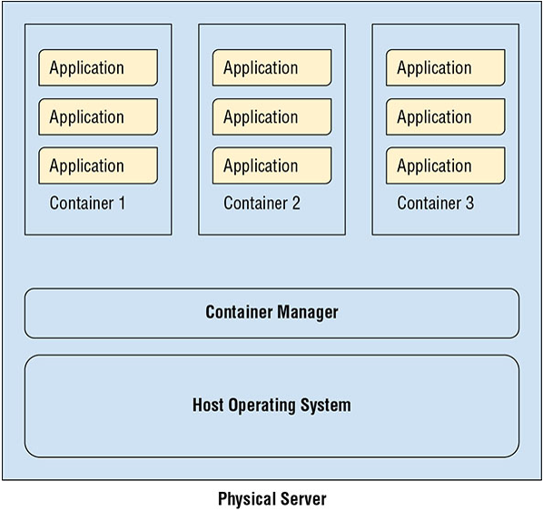

FIGURE 2.2 물리 서버에서 동작하는 컨테이너

Kubernetes Engine은 사용자가 서비스를 실행할 수 있는 컴퓨트, 스토리지, 메모리 리소스를 설명할 수 있는 GCP 제품이다. Kubernetes Engine은 기본적인 리소스를 할당한다. 커맨드라인이나 GUI를 사용하면 Kubernetes 클러스터의 리소스를 추가하고 제거하기 쉽다.

게다가, Kubernetes는 클러스터에 있는 서버의 상태를 모니터링하고, 서버의 에러와 같은 문제를 자동적으로 해결한다. Kubernetes Engine은 또한 어플리케이션의 부하가 증가하면, Kubernetes Engine은 추가적인 리소스를 할당하기 위해서 오토스케일링을 지원한다.

챕터 7은 Kubernetes Engine을 기획하고 관리하기위한 상세정보에 대해 설명할 것이다. Kubernetes Engine을 탐색하기 위해서 구글 Cloud Console에 로그인하고, 왼쪽 메뉴에서 Kubernetes Engine을 선택한다.

#### App Engine

App Engine은 GCP의 컴퓨트 PaaS 상품이다. App Engine을 사용하는 개발자와 어플리케이션 관리자는 VM 구성이나 Kubernetes 클러스터 설정에 대해 관여할 필요가 없다. 그 대신, 개발자는 Java, Go, Python, Node.JS와 같은 언어로 어플리케이션을 만들고, 서버리스 어플리케이션 환경에 코드를 배포한다.

App Engine은 기본적인 컴퓨팅과 네트워크 인프라를 관리한다. VM이나 어플리케이션을 보호하는 강화된 네트워크를 설정할 필요가 없다. App Engine은 웹과 모바일 백엔드 어플리케이션에 적절하다. 

App Engine은 2가지 유형으로 이용할 수 있다: standard and flexible

standard 환경에서는 특정 언어별 샌드박스에서 어플리케이션을 실행하므로, 어플리케이션은 기본적인 서버의 운영체제뿐만 아니라 서버에서 동작하는 다른 어플리케이션으로부터 분리된다. standard 환경은 지왼되는 언어 중 하나로 만들어진 어플리케이션에 적합하고, 어플리케이션 코드와 함께 설치되어야하는 소프트웨어와 운영체제 패키지가 필요하지 않다. 

flexible 환경에서는 App Engine 환경에서 Docker 컨테이너를 실행한다. flexible 환경은 어플리케이션 코드를 갖고 있지만, 라이브러리나 다른 써드파티 소프트웨어가 필요한 경우 잘 동작한다. 이름에서 알수 있듯이, flexible 환경은 백그라운드 프로세스에서 작업하고 로컬 디스트에 작성하는 기능을 포함한 많은 옵션을 제공한다.

챕터 9는 App Engine 사용과 관리를 위한 상세정보를 소개할 것이다. App Engine을 탐색하기 위해서 구글 Cloud Console에서 왼쪽 메뉴 중, App Engine을 선택한다.

#### Cloud Functions

구글 Cloud Functions는 이벤트 중심 프로세싱에 적합한 가벼운 컴퓨팅 옵션이다. Cloud Functions은 Cloud Storage에 파일이 업로드되거나 메시지 큐에 메시지가 쓰여진것 처럼 이벤트를 응답하는 코드를 실행한다. Cloud Functions 환경에서 실행되는 코드는 짧게 동작해야하고, 이 컴퓨팅 서비스는 오래 동작하는 코드를 실행하도록 설계되지 않았다. 오래 동작하는 어플리케이션이나 업무를 지원해야할 필요가 있다면, Compute Engine, Kubernetes Engine, App Engine을 고려해야한다.

Cloud Functions은 써드파티 API나 자연어 번역 서비스같은 다른 GCP 서비스와 같은 다른 서비스를 호출하는데 자주 사용된다. 

App Engine처럼, Cloud Functions은 서버리스 제품이다. 사용자는 오직 코드를 제공해야한다; VM을 설정하거나 컨테이너를 생성할 필요가 없다. Cloud Functions은 부하 증가에따라서 자동적으로 확장한다.

4가지 주요 컴퓨팅 제품에 추가적으로 GCP는 스토리지 리소스를 제공한다.

챕터 10은 Cloud Functions 사용과 관리의 상세정보를 설명한다. Cloud Functions을 탐색하기위해서 구글 Cloud Console에 로그인하고 왼쪽 메뉴에서 Cloud Functions을 선택한다.

## GCP의 스토리지 컴포넌트

클라우드에서 동작하는 어플리케이션과 서비스는 저장소에 대한 넓은 범위의 요구사항을 충족해야한다.

### 스토리지 리소스

때때로 어플리케이션은 적당한 양의 데이터를 빠르게 읽고 쓰는게 필요하다. 경우에 따라 비즈니스 어플리케이션은 페타바이트의 저장소에 접근할 필요가 있을지도 모른다. 하지만 문서를 조회하는데 몇 분, 심지어 몇 시간까지 허용할 수 있다. GCP는 오브젝트와 파일을 저장하기위한 스토리지 리소스를 갖고 있다.

#### Cloud Storage

Cloud Storage는 GCP의 오브젝트 스토리지 시스템이다. 오브젝트는 파일이나 바이너리 오브젝트의 어떠한 유형일 수 있다. 오브젝트는 파일 시스템에서 디렉토리와 유사한 버킷에 구성된다. Cloud Storage가 파일 시스템이 아니라는 것을 기억해야한다. 분산된 스토리지 시스템으로터 파일이나 오브젝트를 수신하고, 저장하고, 조회하는 서비스이다. Cloud Storage는 영구 디스크가 추가되는 방식처럼 VM의 일부가 아니다. Cloud Storage는 VM(이나 다른 네트워크 장치)과 영구 디스크에 있는 완전한 파일 시스템에서 접근할 수 있다.

각 저장된 오브젝트는 URL에 의해서 유니크한 주소를 갖고 있다. 예를 들어, *ace-certification-exam-prep* 이름의 버킷에 저장된 이 챕터의 .pdf 버전인 chapter1.pdf는 아래와 같은 주소로 지정될 수 있다.
**https://storage.cloud.google.com/ace-certification-exam-prep/chapter1.pdf**

GCP 사용자와 다른 사람들은 버킷에 있는 오브젝트를 읽고 쓰는 권한을 얻을 수 있다. 종종, 어플리케이션은 버킷을 읽고 쓸 수 있는 권한을 IAM 정책을 통해서 얻게될 것이다.

Cloud Storage는 단일 데이터를 다루는 오브젝트를 저장하는데 유용하다. 예를 들어, 이미지는 오브젝트 스트리지를 위해 좋은 후보이다. 이미지는 일반적으로 갑작스럽게 읽고 쓰여진다. 이미지의 일부분만 조회할 필요는 거이 없다. 일반적으로, 갑작스럽게 오브젝트를 쓰거나 조회하고, 언제든지 동작되거나 동작되지 않을 수 있는 서버와 독립적으로 저장해야 한다면, Cloud Storage는 좋은 옵션이다.

Cloud Storage에는 다양한 등급이 있다. Reginal Storage는 하나의 구글 클라우드 *region*에 오브젝트의 사본을 저장한다. region은 여러 *zone*이나 배포 영역을 가질 수 있는 분명한 지리적 영역이다. zone은 단일 장애 도메인으로 간주된다. 즉, 어플리케이션의 모든 인스턴스가 하나의 zone에서 동작하고 장애가 발생한다면, 어플리케이션의 모든 인스턴스에 접근하지 못할 것이다. Regional Storage는 같은 region에서 동작하고, Cloud Storage에 있는 오브젝트로 접근하는데 지연시간이 낮아야 하는 어플리케이션을 위해서 적합하다.

Cloud Storage는 여러 region 지원과 같이 몇몇 유용한 고급기능을 갖고 있다. 이 기능은 여러 GCP region에 오브젝트의 복사본을 저장하는 것을 제공한다. 이는 높은 유용성, 지속성, 낮은 지연시간을 위해서 중요하다.

**실제 시나리오**
> us-east1 지역에 정전이 발생하고, 오브젝트가 해당 지역에만 저장되어 있다면, 정전동안 이 오브젝트에 접근할 수 없다. 그러나, 멀티리전 스토리지를 사용할 수 있다면 us-east1에 저장된 오브젝트는 us-west1과 같은 다른 리전에 저장되어있을 것이다.

높은 유용성, 지속성 이외에도 Multiregion storage는 사용자나 어플리케이션이 여러 지역에 걸쳐서 분산되어있을 때 데이터에 더 빠르게 접근할 수 있다. 

때때로 데이터는 드물게 접근하지만, 장기간동안 유지될 필요가 있다. 이런 경우에, nearling storage는 regional이나 multiregional storage보다 비용이 적고, 빈번하지 않은 접근에 최적화되어있기 때문에 좋은 옵션이다.

cold storage는 높은 지속성과 빈번하지않은 접근을 위해 설계된 저비용 저장소이다. 이 스토리지 등급은 1년에 한번도 접근을 하지 않는 데이터를 위해 적합하다.

Cloud Storage의 유용한 기능은 사전에 정의한 정책을 기반으로 자동적으로 오브젝트를 관리할 수 있는 lifecycle 관리 정책 기능이다. 예를 들어, 버킷에서 60일이 지난 모든 오브젝트를 nearline storage로 이동하거나 coldline storage 버킷에서 5년 이상된 오브젝트를 삭제하는 정책을 정의할 수 있다.

#### 영구 디스크(Persistent Disk)

영구 디스크는 Compute Engine이나 Kubernetes Engine에  추가되는 스토리지 서비스이다. 영구 디스크는 SSD와 HDD위에 블록 스토리지를 제공한다. SSD는 영구 디스크 성능이 중요한 저지연의 어플리케이션을 위해 종종 사용된다. SSD는 HDD보다 비싸다. 그래서 많은 양의 영구 디스크가 필요하지만, 더 긴 읽고 쓰기 시간을 허용할 수 있는 어플리케이션은 HDD를 사용하여 스토리지 요구사항을 충족시킬 수 있다.

GCP에서 영구 디스크의 장점은 성능 저하 없이 다양한 클라이언트가 디스크를 읽을 수 있다는 점이다. 여러 인스턴스가 단일 데이터의 사본을 읽을 수 있다. 디스크는 VM을 재기동할 필요 없이 사용하는 동안 필요에 따라서 사이즈를 조정할 수 있다.

영구 디스크는 SSD나 HDD를 사용하여 64TB까지 사이즈가 증가될 수 있다.

#### Cloud Storae for Firebase

모바일 앱 개발자는 Firebase용 Cloud Storage가 클라우드 오브젝트 스토리지의 최고의 조합이고, 좋지 않은 네크워크 연결상태의 모바일 디바이스로부터 업로드와 다운로드를 지원하는 기능이라고 생각할 수 있다.

Firebase API를 위한 Cloud Storage는 안전한 전송뿐만 아니라 잠재적으로 문제가 있을 수 있는 네트워크 품질을 다루는 recovery 메커니즘을 제공하도록 설계되었다. 사진이나 음악과 같은 파일이 Cloud Storage에 업로드 되면, Cloud Storage Cli와 SDK를 통해서 파일에 접근할 수 있다.

#### Cloud Filestore

때때로 개발자들은 네트워크 연결 스토리지에 저장된 파일시스템에 접근할 필요가 있다. 이러한 사용 사례로, Cloud Filestore 서비스는 Compute Engine와 Kubernetes Engine과 함께 사용할 수 있는 공유 파일시스템을 제공한다. 

Filestore는 높은 수의 초당 I/O 동작(IOPS)뿐만 아니라 다양한 스토리지 용량을 제공할 수 있다. 파일 시스템 관리자는 지정된 IOPS와 용량 요구사항에 충족하도록 Cloud Filestore를 설정할 수 있다.

Filestore는 네트워크 파일 시스템(NFS)프로토콜로 구현되어서 시스템 관리자는 가상 서버에 공유 파일 시스템을 쉽게 마운트할 수 있다.

스토리지 시스템은 파일같은 큰 덩어리의 물체를 저장하는데 사용된다. 데이터가 작은 구조이고, 리턴하는 데이터의 서브셋을 설명하는 쿼리를 사용하여 조회될 때, 데이터베이스 관리 시스템으로 가장 좋다.

챕터 11에는 스토리지 서비스 기획을 위한 상세정보와 가이드를 설명한다. 스토리지 옵션을 탐색하기 위해서 구글 클라우드 Console에 로그인하고 왼쪽 메뉴에서 Storage나 Filestore를 선택한다.

### 데이터베이스

GCP는 몇 개의 데이터베이스 옵션을 제공한다. 몇개는 관계형 데이터베이스이고, 몇개는 NoSQL 데이터베이스이다. 몇 개는 서버리스이고, 몇 개는 서버의 클러스터를 관리해야 한다. 몇 개는 최소한의 트랜잭션을 위한 지원을 제공하고, 몇 개는 일관성과 트랜잭션 요구사항이 덜 중요한 어플리케이션에 적합하다. GCP 사용자는 서비스를 선택하기 전에 어플리케이션의 요구사항에 대해서 이해해야한다. 이는 어플리케이션 스택에서 핵심 스토리지 서비스를 제공하는 데이터베이스를 선택할 때 특히 중요하다.

#### Cloud SQL

Cloud SQL은 사용자가 데이터베이스 백업이나 데이터베이스 소프트웨어 패치와 같은 데이터베이스 관리 업무를 시도해야하는 필요 없이 VM에 MySQL이나 PostgreSQL 데이터베이스를 설치하는 GCP의 관계형 데이터베이스 서비스이다. Cloud SQL은 다음과 같은 구성으로 제공된다.
* 1세대 MySQL 데이터베이스는 MySQL 5.5 혹은 5.6을 사용하고, 16GB RAM과 500GB 스토리지까지 사용할 수 있다.
* 2세대 MySQL 데이터베이스는 MySQL 5.6 혹은 5.7을 사용하고, 416GB RAM과 함께 10TB 스토리지까지 사용할 수 있따. 2세대 MySQL 데이터베이스는 필요에따라 스토리지를 자동적으로 추가도록 설정할 수 있다.
* PostgreSQL 9.6은 2세대 플랫폼 의에서 동작하고, 64CPUs/416RAM/10TB스토리지까지 설정할 수 있다. Cloud SQL의 PostgreSQL은 PostGIS, 분석을 위한 cubes, 단일 PostgreSQL 값에서 key-value 쌍을 저장하기 위한 hstore 같은 확장프로그램을 지원한다.

이 데이터베이스 서비스는 복제(replication) 관리를 포함하고, 가용성이 높은 데이터베이스를 위해 자동 failover를 제공한다.

관계형 데이터베이스는 비교적 일관된 데이터 구조의 요구사항을 같은 어플리케이션에 적합하다. 예를 들어, 은행 데이터베이스는 계좌번호, 고객 이름, 주소 등을 추적한다. 사실상 데이터베이스에서 모든 레코드는 같은 정보가 필요하기 때문에, 이 어플리케이션을 관계형 데이터베이스가 가장 적합하다.

#### Cloud Bigtable

Cloud Bietable은 십 억개의 행과 천개의 열까지 관리할 수 있는 페타바이트급의 어플리케이션을 위해 설계되었다. *wide-column data model*로 알려진 NoSQL 모델 기반이고, 관계형 데이터베이스를 지원하는 Cloud SQL와는 다르다. Bigtable은 저지연의 읽고쓰는 동작이 필요한 어플리케이션에 적합하다. 초당 백만개의 동작을 지원하도록 설계되었다.

Bigtable은 Cloud Storage, Cloud Pub/Sub, Cloud Dataflow, Cloud Dataproc과 같이 다른 구글 클라우드 서비스과 통합된다. 하둡 빅데이터에서 데이터 접근을 위한 API인 Hbase API를 지원한다. Bigtable은 또한 데이터 처리, 그래프 분석, 시계열 분석을 위한 오픈소스 도구와 통합된다. 

#### Cloud Spanner 

Cloud Spanner는 NoSQL 데이터베이스처럼 수평적인 확장 기능과 함께 높은 일관성과 트랙잭션과 같은 관계형 데이터베이스의 핵심 장점을 조합한 구글의 글로벌 분산 관계형 데이터베이스이다. Spanner는 99.999퍼센트의 SLA를 갖춘 고가용성 데이터베이스로, 확장가능하고, 고가용성의 관계형 데이터베이스를 요구하는 기업 어플리케이션을 위해 적합한 옵션이다.

Cloud Spanner는 또한 ID 기반의 접근 제어와 함께 유휴 암호화와 전송 중 암호화를 통혜 엔터프라이즈급 보안을 갖는다.

Cloud Spanner는 ANSI 2011 표준 SQL을 지원한다.

#### Cloud Datestore

Cloud Datsstore는 NoSQL 문서 데이터베이스이다. 이러한 종류의 데이터베이스는 문서 컨셉이나 key-value 쌍의 collection을 기본구성블록으로 사용한다. 문서는 유연한 스키마를 허용한다. 예를 들어, 책에 대한 문서는 저자, 제목, 출판일을 나열한 key-value 쌍을 갖을 수 있다. 몇몇 책은 회사 웹사이트와 다른 언어로 번역에 대한 정보를 갖을 수도 있다. 포함될수도 있는 키의 집합은 문서 데이터베이스에서 사용하기 전에 정의할 필요가 없다. 이 것은 어플리케이션이 설계 당시에 알려지지 않은 속성들을 수용하는데 유용하다.

Cloud Datastore는 Compute Engine, Kubernetes Engine, App Engine에서 동작하는 어플리케이션에서 사용될 수 있는 REST API를 통해 접근된다. 이 데이터베이스는 로드에 따라서 자동적으로 확장될 것이다. 또한, 성능을 유지하는 필요한 데이터를 *shard*나 파티션화 할 것이다. Cloud Datastore는 관리형 서비스이기 때문에, 복제(replication), 백업, 다른 데이터베이스 관리 업무를 받는다.

NoSQL 데이터베이스일지라도 Cloud Datastore는 트랜잭션, 인젝트, SQL같은 쿼리를 지원한다.

Cloud Datastore는 고가용성과 구조화 데이터를 요구하는 어플리케이션에 적합하고, 데이터를 읽을 때 항상 높은 일관성을 필요로하지 않는다. 제품 카탈로그, 유저 프로필, 사용자 사용 이력은 Cloud Datastore를 사용하는 어플리케이션의 예시이다.

#### Cloud Memorystore

Cloud Memorystore는 인메모리 캐시 서비스이다. GCP에서 제공되는 다른 데이터베이스들은 큰 용량의 데이터를 저장하고, 복잡한 쿼리를 지원하도록 설계되었지만, Cloud Memorystore는 메모리에서 자주 사용되는 데이터를 캐시하기위한 Redis 서비스이다. 캐시는 어플리케이션에서 데이터를 읽는데 필요한 시간을 줄이는데 사용한다. Cloud Memorystore는 밀리초 미만의 데이터 접근을 제공하도록 설계되었다.

관리형 서비스로서, Cloud Memorystore는 사용자가 캐시의 사이즈를 지정할 수 있도록 하고, 관리 업무를 구글에 맡길 수 있다. GCP는 고가용성, 패치, 자동 failover를 보장한다.

#### Cloud Filestore

Cloud Filestore는 확장성이 뛰어난 웹과 모바일 어플리케이션을 위한 백엔드로 설계된 또 다른 GCP의 관리형 NoSQL 데이터베이스 서비스이다. Cloud Filestore의 차별화 기능은 오프라인 지원, 동기화, 모바일, IoT 디바이스를 통한 데이터를 관리하기 위한 기능, 백엔드 데이터 저장소를 제공하는 클라이언트 라이브러리이다.

Cloud Firebase는 Datastore 모드가 포함되어있어 Datastore로 작성된 어플리케이션도 Cloud Firebase와 함께 동작할 수 있다. Native 모드로 동작할 때, Cloud Firestore는 실시간 데이터 동기화와 오프라인 지원을 제공한다.

챕터 12는 다양한 유형의 데이터베이스를 생성하는 방법뿐만 아니라 데이터를 로드하고, 삭제하고 쿼리하는 방법의 상세 정보에 대해 자세하게 다룬다. 각 데이터베이스들은 구글 클라우드 console의 메인 메뉴에서 접속할 수 있다. 거기에서 각각의 작동방식을 탐색하고 차이를 확인할 수 있다.

## GCP의 네트워킹 컴포넌트

이 섹션에서는 주요한 네트워킹 컴포넌트를 확인할 것이다. 네트워킹을 세팅하고 관리하는 상세 정보들은 챕터 14, 15에서 설명된다.

### 네트워킹 서비스

GCP는 사용자가 구글의 글로벌 네트워크 인프라 내의 가상 네트워크를 설정하고, 온프레미스 데이터센터와 구글의 네트워크를 연결하고, 컨텐츠 전달을 최적화하고, 네트워크 보안 서비스를 사용하여 클라우드 리소스를 보호하는 것이 가능하도록 설계된 몇 가지의 네트워킹 서비스를 제공한다.

#### Virtual Private Cloud(VPC)

기업이 자체 데이터 센터를 운영할 때, 물리적으로 데이터 센터의 위치한 것과 네트워크에 연결된 것을 제어한다. 이 인프라는 다른 데이터센터에서 동작하고있는 다른 조직과 물리적으로 독립된다. 이 조직이 퍼블릭 클라우드로 이동할 때, 퍼블릭 클라우드의 다른 고객과 인프라를 공유한다. 다양한 기업이 같은 클라우드 인프라를 사용할지라도, 각 기업은 VPC를 생성하여 클라우드 리소스를 논리적으로 독립할 수 있다.

GPC의 차별화 기능으로 VPC는 공인 인터넷에 의존하지않고 전세계로 확장할 수 있다. VPC에서 어떠한 서버로의 트래픽은 구글읠 글로벌 네트워크를 통해 해당 네트워크의 다른 지점으로 안전하게 라우팅될 수 있다.구글 네트워크 구조의 또 다른 장점은 자신의 백엔드 서버가 백엔드 서버를 위한 공인 IP 주소를 생성하지 않고, 머신러닝이나 IoT 서비스같은 구글 서비스에 접근할 수 있다는 것이다.

구글 클라우드의 VPC들은 Internet Protocal Security(IPSec)을 사용하여 온프레미스 가상 사설 네트워크에 연결될 수 있다.

VPC가 글로번일지라도, 기업을 조직 내에서 다른 부서나 그룹을 관리하도록 프로젝트와 과금 계정을 분리하여 사용할 수 있다. 방화벽도 VPC의 리소스로 접근하는데 엄격하게 사용될 수 있다.

#### 클라우드 로드밸런싱

구글은 클라우드 인프라를 전반에서 워크로드를 분산하는 글로벌 로드밸런싱을 제공한다. 단일 멀티캐스트 IP주소를 사용하여 Cloud Load Balancing은 리전 내 및 여러 리전간 워크로드를 분산하고, 장애가 발생하거나 성등이 저하된 서버에 적응하고, 워크로드의 변화를 수용하는 컴퓨트 리소스를 자동으로 확장할 수 있다. Cloud Load Balancing은 또한 내부 로드 밸런싱을 지원한다. 그래서 로드밸런싱의 장점을 얻기 위해서 IP주소가 인터넷에 노출될 필요가 없다.

Cloud Load Balancing은 HTTP, HTTPS, TCP/SSL, UDP 트래픽을 로드밸런스할 수 있는 소프트웨어 서비스이다.

#### Cloud Armor

인터넷에 노출된 서비스는 Distributed Denial-of-Service(DDoS) 공격의 타켓이 될 수 이따. Cloud Armor는 글로벌 HTTP(s) 로드밸런싱 서비스를 기반한 구글 네트워크 보안 서비스이다. Cloud Armor는 다음 기능을 포함한다.
* IP 주소 기반으로 접근을 허용하거나 제한하는 기능
* 사이트간 스크립팅 공격에 대응하기 위한 미리 정의된 규칙
* SQL injection 공격을 대응하기 위한 기능
* L3와 L7의 규칙을 정의하는 기능
* 인입되는 트래픽의 지리적 위치를 기반으로 접근을 허용하고 제한

#### Cloud CDN

Content Delevery Network(CDNs)로, 어느 곳에 있는 사용자는 다양한 리전에 분산된 시스템으로부터 컨텐츠를 요청할 수 있다. CDNs는 전 세계의 엔드포인트 세트에 컨텐츠를 캐시하여 이러한 요청에 대한 저지연으로 응답을 가능하게 한다. 현재 구글은 글로벌 리소스로 관리되는 90개 이상의 CDN 엔드포인트를 갖고 있다. 그래서 지역별로 구성을 유지할 필요가 없다.

CDNs는 많은 양의 정적 컨텐츠워 글로벌 고객의 분야를 위해서 특히 중요하다. 예를 들어, 뉴스 분야는 세계에서 어느 지점으로부터 오는 요청에 대해 빠른 응답을 보증하는 Cloud CDN 서비스를 사용할 수 있다.

#### Cloud Interconnect

Cloud Interconnect는 기존 네트워크를 구글 네트워크에 연결하기 위한 GCP 서비스 집합이다. Cloud Interconnect는 interconnects와 peering, 2가지 유형의 연결을 제공한다.

네트워크에 직접 접근하는 Interconnect는 VPC에 있는 디바이스에 연결기위해 Private Internet 표준(RFC1918)의 주소 할당을 사용한다. 직접적인 네트워크 연결은 온프레미스나 데이터센터와 북미, 남미, 유럽, 아시아, 호주에 위치한 구글의 시설 중 하나와 연결을 유지한다. 그 대신, 한 조직이 구글 시설과 직접적인 interconnect를 할 수 없다면, Partner Interconnect를 사용할 수 있다. 이 서비스는 업체의 데이터 센터와 구글 시설간 연결을 제공하는 써드파티 네트워크 제공업체에 의존한다.

직접적이거나 peer interconnect의 대역폭을 필요하지 않는 조직을 위해서 구글은 공인 인터넷을 사용하여 데이터센터와 구글 시설간 트래픽을 전송할 수 있는 VPN 서비스를 제공한다.

#### Cloud DNS

Cloud DNS는 GCP에서 제공되는 도메인 이름 서비스이다. Cloud DNS는 74.120.28.18과 같은 IP 주소를 example.com과 같은 도메인 이름으로 매핑하기 위한 고가용성, 저지연 서비스이다.

Cloud DNS는 자동적으로 확장되도록 설계되어서 사용자는 기본적인 인프라의 확장에 대한 걱정 없이 수 천, 수 만개의 주소를 보유할 수 있다. Cloud DNS는 또한 VM의 커스텀 이름을 생성할 수 있는 private zone을 제공한다.

### Identity Management

GCP의 Cloud Identity and Access Maangement(IAM) 서비스는 사용자가 클라우드 리소스에 세부적인 접근 제어를 정의할 수 있다. IAM은 사용자(users), 역할(roles), 관리자 권한(privileges)의 개념을 사용한다.

ID는 서비스의 사용자에 대한 추상화이다. ID가 로그인이나 다른 메커니즘을 통해 인증된 후에, 인증된 사용자는 리소스에 접근하고, ID에 부여된 권한을 기반으로 동작을 수행할 수 있다. 예를 들어, 사용자는 Cloud Storage에 버킷을 생성하거나 Compute Engine에 동작하고있는 VM을 삭제하는 권한을 갖을 수 있다.

사용자는 종종 유사한 권한(Permission)의 집합을 필요로 한다. VM을 생성하는 능력을 갖는 누군가는 VM을 수정하거나 삭제할 수 있기를 원할 것이다. 관련된 권한 그룹은 역할로 묶을 수 이따. 역할(roles)은 ID에 할당된 권한의 집합이다.

구글 Associate Cloud Engineer 인증에서 ID, 역할, 사용 권한, 조직과 프로젝트를 전반적으로 관리하는 방법에 대해서 친숙해져야 한다.

구글 클라우드 Console에서 IAM과 어드민 메뉴 아래에 identity management tools를 확인할 수 있다. 챕터 17은 ID, 역할에 대한 상세정보와 이런 관리를 위한 좋은 사례를 제공한다.

### Development Tools

GCP는 인프라에 대한 쉬운 접근과 데이터 관리 서비스뿐만 아니라 이를 지원하는 도구때문에 개발자와 소프트웨어 엔지니어에게 좋은 선택이다. 

Cloud SDK는 VM, 디스크 스토리지, 네트워크 방화벽, GCP에 배포될지도 모르는 다른 가상화 리소스를 포함하여 GCP 리소스를 관리하기 위한 커맨드라인 인터페이스이다. Cli 이외에도 Cloud SDK는 JAVA, Python, Node.JS, Ruby, GO, .NET, PHP를 위한 클라이언트 라이브러리를 갖는다.

GCP는 또한 Container Registry, Cloud Build, Cloud Source Repositories로 컨테이너화 어플리케이션 배포를 지원한다.

구글은 유명한 개발도구로 작업하기 쉽게 플러그인을 개발했다. 
* IntelliJ를 위한 Cloud Tool
* PowerShell을 위한 Cloud Tool
* Visual Studio를 위한 Cloud Tool
* Eclipse를 위한 Cloud Tool
* App Engine Gradle 플러그인
* App Engine Maven 플러그인

물론, GCP는 어플리케이션이 개발에서 상용으로 배포되고, 배포된 후에 어플리케이션을 모니터링하고 유지하는데 도움을 주는 추가적인 관리 도구를 제공한다.

## GCP의 추가적인 컴포넌트

관리 도구는 어플리케이션의 신뢰성, 가용성, 확장성을 보장하기위한 책임을 갖는 DevOps 전문가를 위해 설계되었다.

### 관리 도구

관리 도구 카테고리에서 가장 중요한 도구의 몇 가지이다.

**Stackdriver**는 어플리케이션과 인프라로부터 메트릭스, 로그, 이벤트 데이터를 수집하고, 데이터를 통합해서 DevOps 엔지니어가 모니터링하고, 평가하고, 운영적인 문제를 진단할 수 있는 서비스이다.

**Monitoring**은 GCP와 AWS 리소스, Nginx, Cassandra, Elasticsearch과 같이 유명한 오픈소스 시스템을 포함한 어플리케이션 계측으로부터 성능 데이터를 수집하여 Stackdriver의 기능을 확장한다.

**Logging**은 사용자가 GCP와 AWS 로그의 로그 데이터를 저장하고, 분석하고, 알람을 받을 수 있는 서비스이다.

**Error Reporting**은 중앙 집중식 인터페이스에 표시하기위한 어플리케이션 충돌 정보를 집계한다.

**Trace**는 어플리케이션에 지연 데이터를 캡처하여 성능 문제 지역을 식별하는데 도움을 주는 분산 추적 서비스이다.

**Debugger**는 개발자가 실행 중인 코드, 명령어 입력의 상태를 점검하고, 콜 스택 변수를 확인할 수 있다.

**Profiler**은 어플리케이션의 호출 계층의 전반적인 CPU와 메모리 활용 정보를 수집하는데 사용된다. Profiler는 어플리케이션 성능에 미치는 영향을 최소화하는 통계적인 샘플링을 사용한다.

관리 도구의 조합은 운영 시스템의 효과적인 모니터링과 분석하여 상용에서 동작하는 어플리케이션에 대한 인사이트를 제공한다.

### 특별한 서비스

IaaS와 Paas 제공 이외에도, GCP는 APIs, 데이터 분석, 머신러닝을 위한 특별한 서비스를 갖고있다.

#### Apigee API 플랫폼

Apigee API 플랫폼은 본인의 어플리케이션에 접근하는 API를 GCP 사용자들에게 제공하기위한 관리 서비스이다. Apigee 플랫폼은 개발자가 API를 배포하고, 모니터링하고, 보안하는 것을 허용한다. 또한 Open API Specification 기반으로 API 프록시를 생성한다.

API의 로드를 예측하기 어렵고, 때때로 사용량이 급증할 수 있다. 그 시간에 Apigee API 플랫폼은 사용자가 정의할 수 있는 정책을 기반으로 라우팅과 비율 제한을 제공한다.

API는 OAuth 2.0이나 SAML을 사용하여 인증될 수 있다. 데이터는 Apigee API 플랫폼에서 전송 중과 전송 중이지 않을 때 모두 암호화된다.

#### 데이터 분석

GCP는 배치와 스트리밍 모드의 빅데이터를 분석하기 위해 설계된 다양한 서비스를 갖고 있다. 서비스들에서 가장 중요한 도구들 중 몇가지는 아래와 같다.
* BigQuery, 데이터 웨어하우스를 위한 페타바이트 급 데이터베이스 분석 서비스
* Cloud Dataflow, 배치와 스트림 처리 파이프라인을 정의하기 위한 프레임워크
* Cloud Dataproc, 관리형 Hadoop과 Spark 서비스
* Cloud Dataprep, 분석가가 분석을 위한 데이터를 탐색하고 준비할 수 있는 서비스

종종, 데이터분석과 데이터 웨어하우스 프로젝트는 이런한 서비스를 함께 사용한다.

#### AI와 머신러닝

구글은 AI와 머신러닝의 리더이다. 그래서 GCP가 AI 서비스를 포함하는게 놀랍지 않다. 이 영역에 포함된 특별한 서비스는 아래와 같다.
* Cloud AutoML, 머신 러닝 경험 없는 개발자가 머신 러닝 모델을 개발할 수 있는 도구
* Cloud Machine Learning Engine, 확장 가능한 머신러닝 시스템을 상용에 구축하고 배포하기위한 플랫폼
* Cloud Natural Language Processing, 사람의 언어를 분석하고, 텍스트로부터 정보를 추출하기 위한 도구
* Cloud Vision, 메타데이터, 텍스트를 추출, 컨텐츠를 필터링을 사용하여 이미지에 표시하기 위한 이미지 분석 플랫폼

## 시험 필수 요소

**Compute Engine, Kubernetes Engine, App Engine, Cloud Functions간 차이를 이해한다.** Compute Engine은 구글의 VM 서비스이다. 사용자는 CPU, 메모리, 영구 디스크, 운영체제를 선택할 수 있다. 더 나아가 계산집중 동작을 위한 GPU를 추가하는 VM을  커스텀 할 수 있다. VM은 개별적이거나 비슷한 서버의 그룹으로 관리된다.

Kubernetes Engine은 가상서버와 컨테이너에서 동작하는 어플리케이션의 그룹을 관리한다. 컨테이너는 VM보다 가볍다. Kubernetes는 클러스터에 걸친 컨테이너를 분산하고, 클러스터의 상태를 모니터링하고, 설정에 의해서 확장하기 때문에 *orchestration service*라고 불린다.

App Engine은 구글의 PaaS이다. 개발자는 표준 환경을 사용할 때 언어별 샌드박스나 유영한 환경을 사용할 때 컨테이너에서 코드를 실행할 수 있다. App Engine은 서버리스 서비스이다. 그래서 사용자는 VM을 설정하거나 서버를 관리할 필요가 없다.

Cloud Functions는 파일 업로드나 메시지 큐에 메시지를 전송하는 것과 같은 이벤트를 수신하는 짧은 동작의 코드를 실행하도록 설계된 서버리스 서비스이다. Functions는 Node.js나 Python으로 작성될 수 있다.

**서버리스의 의미가 무엇인지 이해한다.** 서버리스는 설정, 모니터링, 서비스를 기반으로하는 컴퓨팅 리소스를 유지할 필요가 없는 서비스이다. 서버가 포함되지 않는다는 것을 의미하는 것은 아니다. 항상 어플리케이션, 함수, 다른 소프트웨어가 동작하는 물리적인 서버는 존재한다. 서버리스는 오직 기본적인 리소스를 관리할 필요가 없다는 것이다.

**오브젝트와 파일 스토리지의 차이를 이해한다.**오브젝트 저장소는 파일 기반의 리소스를 저장하고 접근하는데 사용된다. 이러한 오브젝트는 URL같은 유니크한 ID에 의해서 참조된다. 오브작트 저장소는 플록이나 파일시스템 서비스를 제공하지 않는다. 그래서 데이터베이스 스토리지를 위해 적합하지 않다. Cloud Storage는 GPC의 오브젝트 스토리지 서비스이다.

파일 스토리지는 파일에 블록기반 접근을 지원한다. 파일은 디렉토리와 서브디렉토리로 구성된다. 구글의 Filestore는 NFS 기반이다.

**다양한 종류의 데이터베이스를 알아야 한다.** 데이터베이스는 넓게 관계형과 NoSQL 데이터베이스로 나뉜다.

관계형 데이터베이스는 트랜잭션, 강한 일관성, SQL 쿼리를 지원한다. 관계형 데이터베이스는 전통적으로 수평적인 확장이 어렵다. Cloud Spanner는 이전에 NoSQL 데이터베이스에서만 찾을 수 있었던 확장성과 함께 관계형 데이터베이스의 장점을 제공하는 글로벌 관계형 데이터베이스이다.

NoSQL 데이터베이스는 수평적인 확장을 할 수 있게 설계되었다. 강한 일관성과 표준 SQL 지원과 같은 다른 기능은 확장성과 저지연 쿼리 응답을 달성하기위해 희생된다. NoSQL 데이터베이스는 Cloud Memorystore처럼 key-value 저장소, Cloud Datastore처럼 문서형 데이터베이스, Cloud Bigtable같은 넓은 열의 데이터베이스가 될 수 있다.

**Virtual Privete Cloud(VPC)를 이해한다.** VPC는 퍼블릭 클라우드 내에서 조직의 클라우드 리소스의 논리적인 독립이다. GCP에서 VPC는 글로벌이다. 단일 zone이나 region에 제한되지 않는다. GCP 서비스간 모든 트래픽은 공인 인터넷에서 트랙픽을 전송할 필요 없이 구글 네트워크에서 전송될 수 있다.

**로드밸런싱을 이해한다.** 로드밸런싱은 서버의 그룹 전반적인 워크로드를 분산하는 프로세스이다. 로드 밸런서는 네트워크 단이나 어플리케이션 단에서 워크로드를 라우트할 수 있다. GCP 로드밸런서는 글로벌하게 워크로드를 분산할 수 있다.

**개발자와 관리 도구를 이해한다.** 개발자 도구는 소프트웨어의 버전 컨트롤을 사용하는 것, 어플리케이션과 서비스를 실행하는 컨테이너를 빌드하는 것, Kubernetes Engine과 같은 오케스트레이션 시스템과 다른 개발자가 이용할 수 있는 컨테이너를 만드는 것을 포함한 소프트웨어 엔지니어링에서 공통적인 워크플로우를 지원한다. 

Stackdriver, 모니터링, 로깅와 같은 관리도구는 어플리케이션이 이용가능하고, 예상대로 동작하는 것을 보장하기 위한 책임을 갖는 개발자와 운영자에게 시스템 관리 정보를 제공하도록 설계되었다.

**GCP에서 제공되는 특별한 서비스의 종류를 알아야 한다. GCP는 데이터분석, AI, 머신러닝을 위한 특별한 서비스의 리스트가 증가하고 있다.**

**온프레미스와 퍼블링 클라우드 컴퓨팅간 주요 차이점을 알아야한다.** 온프레미스 컴퓨팅은 자체 사용을 위해 업체나 조직에 의해서 관리되는 인프라에서 발생하는 관련 서비스, 컴퓨팅, 스토리지, 네트워킹이다. 하드웨어는 업체 건물이나 써드파티의 공동 시설 내에 위치할 수도 있다. 공동 시설은 전력, 냉각시스템, 물리적인 보안을 제공하지만, 공동 시설 사용자는 모든 세팅과 인프라의 관리를 위한 책임을 져야한다.

퍼블릭 클라우드 컴퓨팅은 구글, AWS, 마이크로소프트와 같은 클라우드 제공업체에 의해서 제공되는 인프라와 서비스를 사용한다. 클라우드 제공업체는 모든 하드웨어와 시설을 관리한다. 사용자에 의해서 설정되고 유지되는 VM같은 서비스와 사용자가 어플리케이션 개발에 초점을 두고 이용할 수 있는 서버리스 제품을 제공하며, 클라우드 제공 업체는 기본적인 컴퓨트 인프라를 유지보수에 더 많은 책임을 진다.

# Chapter 3 프로젝트, 서비스 계정, 과금

**이 챕터는 구글 Associate Cloud Engineer 인증 시험 과목 중, 아래 내용을 다룬다.**
* 1.1 클라우드 프로젝트와 계정 세팅
* 1.2 과금 설정 관리

컴퓨팅, 스토리지, 네트워킹 서비스를 탐구하기 전에, 우리는 어떻게 GCP가 리소스를 구성하고, 과금 시스템과 리소스의 사용을 연결하는지 논의할 필요가 있다. 이 챕터는 조직(organizations), 폴더(folders), 프로젝트(projects)으로 구성된 GCP의 구조적인 계층을 소개한다. 또한 사용자 대신 기능을 수행할 수 있도록 컴퓨팅 리소스에 역할을 할당하는 방법인 서비스 계정(service account)에 대해서 논의한다. 마지막으로, 이 챕터는 간단하게 과금을 논의한다.

## GCP의 프로젝트와 계정 구성 방법

GCP를 사용할 때, 가상머신이나 클러스터를 설치하고, 스토리지 오브젝트에 버킷을 생성할 수도 있고, App Engine과 Cloud Functions과 같은 서버리스 컴퓨팅 서비스를 사용할수도 있다. 사용하는 리소스의 리소트는 빠르게 증가할 수 있다. 또한 워크로드에 응답하는 서비스의 오토스케일링에 따라 동적이고, 예측이 불가능한 방법으로 변화할 수 있다.

당신의 부서에서 단일 어플리케이션이나 일부 서비스를 실행한다면, 사용 중인 리소스의 리스트를 확인하기 위해 모든 리소스를 추적해야 할지도 모른다. GCP의 범위가 넓어짐에 따라, 아마도 여러 개의 부서를 갖게 될 것이고, 각각의 부서는 다른 권한을 필요로하는 자체 관리자들을 갖게 될 것이다. GCP는 리소스를 그룹화하고, 단일 유닛으로 관리하는 방법을 제공한다. 이 것은 *resource hierarchy*라고 부른다. 리소스 계층에서 리소스에 대한 접근은 사용자가 정의할 수 있는 정책의 집합으로 제어된다.

### GCP 리소스 계층(resource hierarchy)

GCP 리소스를 관리하기위한 중요한 추상화는 리소스 계층이다. 이는 3가지 레벨로 구성된다.
* 조직(Organization)
* 폴더(Folder)
* 프로젝트(Project)

3가지 컴포넌트가 서로 어떤 연관이 있는지 설명해보자.

#### 조직(Organization)

조직은 리소스 계층의 루트이고, 전형적으로 회사나 조직과 일치한다. G-suite 도메인과 Cloud Identity 계정은 GCP 조직에 매핑한다. G Suite는 Gmail, Docs, Drive, Calendar, 다른 서비스를 포함하여 구글의 업무 상샌성 세트이다. 회사에서 G suite를 사용한다면, GCP 계층에 조직을 생성할 수 있다. 회사에서 G Suite를 사용하지 않는다면 Cloud Identity를 사용할 수 있다. 구글은 Identity as a Service(IDaaS)를 제공한다.(그럼 3.1)

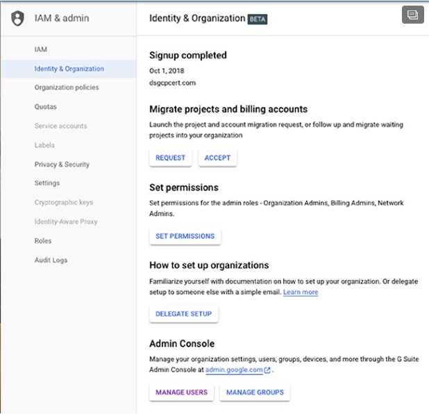

**그림 3.1** Cloud Identity 계정을 생성하고, Identity & Organization 형식으로 G-Suite 사용자를 관리할 수 있다.

단일 Cloud identity는 최대 하나의 조직에 결부된다. Cloud identity는 최고 관리자가 있으며, 이러한 최고 관리자는 조직을 관리하는 사용자에게 조직 관리자 IAM 역할을 부여한다. 이외에도 GCP는 도메인의 모든 사용자에게 프로젝트 생성자와 과금 계정 생성자 IAM 역할을 자동적으로 부여한다. 이 것은 모든 사용자가 프로젝트를 생성하고, 리소스 사용의 비용을 위해 과금을 가능하게한다.

조직 관리자 IAM 역할을 갖는 사용자는 아래의 책임을 진다.
* 리소스 계층의 구조를 정의
* 리소스 계정위에 IAM 정책을 정의
* 다른 사용자의 다른 관리 권한을 위임

G Suite 조직/Cloud Identity 계정의 멤버가 과금 계정이나 프로젝트를 생성할 떄, GCP는 자동적으로 조직 리소스를 생성할 것이다. 모든 프로젝트와 과금 계정은 조직 리소스의 자식이 될 것이다. 이 외에도, 조직이 생성될 때, 이 조직의 모든 사용자는 프로젝트 생성자와 과금 계정 생성자 역할을 부여받는다. 그 시점부터 G Suite 사용자는 GCP 리소스에 접근할 수 있다.

#### 폴더(Folder)

폴더는 다층적인 조직 계층의 빌딩 블록이다. 조직은 폴더를 포함한다. 폴더는 다른 폴더나 프로젝트를 포함할 수 있다. 단일 폴더는 폴더와 프로젝트 모두 포함할 수도 있다. (그림 3.2) 폴더 구성은 보통 포함된 프로젝트의 리소스에서 제공되는 서비스의 종류와 폴더와 프로젝트를 관리하는 정책을 중심으로 구축된다.

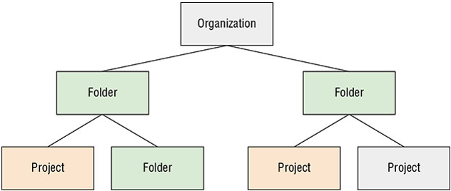

**그림 3.2** 일반적인 조직 폴더 프로젝트

리소스 계층의 예시를 살펴보자. 조직은 4개의 부서를 갖고 있다: 회계, 마케팅, 소프트웨어 개발, 법무. 회계 부서는 받아야할 계정과 지불해야할 계정 리소스를 분리해서 가져야한다. 그래서 관리자는 회계 폴더 내에 2개의 폴더를 생성했다: Account Receivable, Accounts Payable. 소프트웨어 개발은 개발, 검증, 대기, 상용을 포함한 다양한 환경을 사용한다. 각 환경의 접근은 그 환경에 지정된 정책에 의해서 제어된다. 그래서 소유하고 있는 폴더 내에 각 환경을 구성했다. 마케팅과 법무는 부서의 멤버들 간에 그들의 모든 리소스를 공유한다. 그래서 단일 폴더는 두 부서에 모두 충분하다. 그림 3.3은 이 조직을 위한 조직 계층을 보여준다.

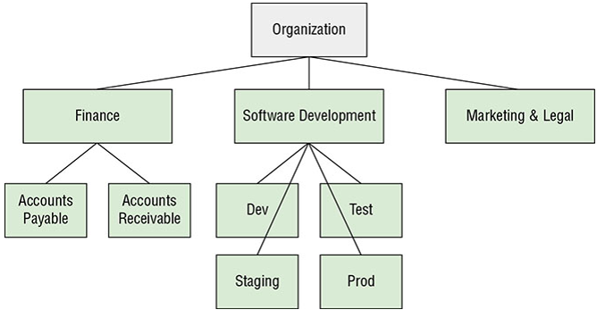

**그림 3.3** 조직 폴더 프로젝트의 예시

이제 조직을 정의하고, 부서와 일치하는 폴더를 설정했으며, 다양한 리소스 그룹에 액세스하는 방법을 설정할 것이고, 프로젝트를 생성할 수 있다.

#### 프로젝트(Project)

프로젝트는 어떤 면에서 계층의 가장 중요한 부분이다. 리소스 생성, GCP 서비스 사용, 권한 관리, 과금 옵션 관리는 프로젝트에 있다.

프로젝트에서 작업하는 첫 번째 단계는 프로젝트를 생성하는 것이다. *resourcemanager .projects. create* IAM 권한을 갖는 사용자는 누구나 프로젝트를 생성할 수 있다. 기본적으로 조직이 생성될 때, 도메인의 모든 사용자는 이 권한을 부여받는다.

조직은 생성할 수 있는 프로젝트의 할당량을 가질 것이다. 구글은 일반적인 사용량, 고객의 사용 이력, 기타 요인에 기반하여 프로젝트의 할당량을 결정한다. 프로젝트의 제한에 도달하여 다른 프로젝트를 시도한다면, 할당량 증가를 요청하라는 메시지를 받을 것이다. 추가적으로 필요한 프로젝트의 수와 그 프로젝트가 무엇에 사용될 것인지에 대한 정보를 제공해야 한다.

리소스 계층을 생성한 후에, 리소스를 제어하는 정책을 정의할 수 있다.

### Organization Policies

GCP는 Organization Policy Service를 제공한다. 이 서비스는 조직의 리소스에 대한 접근을 제어한다. Organization Policy Service는 IAM 서비스를 보완한다. IAM은 사용자나 역할들이 클라우드에서 지정된 동작을 수행할 수 있도록 사용 권한을 할당할 수 있다. Organization Policy Service는 리소스를 사용할 수 있는 방법에 대한 제한을 지정할 수 있다. 차이점을 생각하는 한 가지 방법으로 IAM은 누가 할 수 있는지를 지정하고, Organization Policy Service는 무엇을 할 수 있는지를 지정한다.

orginization policies는 리소스의 제약이라는 관점에서 정의된다.

#### 리소스 제약(Constraints)

Constraints는 서비스의 제한이다. GCP는 List constraint과 Boolean constraint을 갖는다.

List constraint는 리소스에 허용되거나 허용되지 않는 값의 리스트이다. list constraint의 몇 가지 유형은 아래와 같다.
* 특정 값의 모음을 허용
* 특정 값의 모음을 거부
* 한 값과 그 값의 모든 child 값을 거부
* 허용된 모든 값을 허용
* 모든 값을 거부

Boolean constraint는 true와 false를 평가하고, constraint가 적용될지 아닐지를 결정한다. 예를 들어, VM에 시리얼 포트로 접근하는 것을 거부하고 싶다면, *constraints/compute.disableSerialPortAccess*를 TRUE로 설정할 수 있다.

#### Policy Evaluation

Organizations는 클라우드에서 데이터와 리소스를 보호하기 위한 고정적인 정책을 갖을 수 있다. 예를 들어, organization에서 누가 service API를 사용하도록 설정하거나 service account를 생성하는지를 지시하는 규칙이 있을 수 있다. 정보보호 부서는 모든 VM이 시리얼 포트 접근을 사용하지않도록 설정할수도 있다. 각각의 VM에 대한 제어를 구현할 수 있지만, 효과적이지 않고, 실수하기 쉽다. 더 좋은 방법은 무엇을 할 수 있는지에 대한 제약을 정책으로 정의하고, 그 정책을 리소스 계층에서 object에 연결하는 것이다.

예를 들어, 정보보호 부서가 모든 VM에 시리얼포트 접근을 거부하기를 원하기 때문에, 시리얼 포트 접근을 제약하는 정책을 지정한 다음, 이 정책을 organization에 연결한다. organization 아래에 있는 모든 folder와 project는 해당 정책을 상속받을 것이다. 정책은 상속되고, 계층의 하위 object에 의해서 사용되지 않거나 재정의될 수 없기 때문에, 모든 조직 리소스에 정책을 적용하는 효과적인 방법이다.

정책들은 IAM & admin 형식에 있는 Organization Policies를 통해 관리된다. 그림3.4는 정책 모음의 예를 보여준다.

다양한 정책은 folder나 project에 유효할 수 있다. 예를 들어, organization은 시리얼 포트 접근에 대한 정책을 갖고 있고, project를 포함하는 folder는 누가 service account를 생성할 수 있는지 제한하는 정핵을 갖고 있다면, project는 두 가지 정책을 상속받을 것이고, project에서 리소스로 할 수 있는 일을 제약할 것이다.

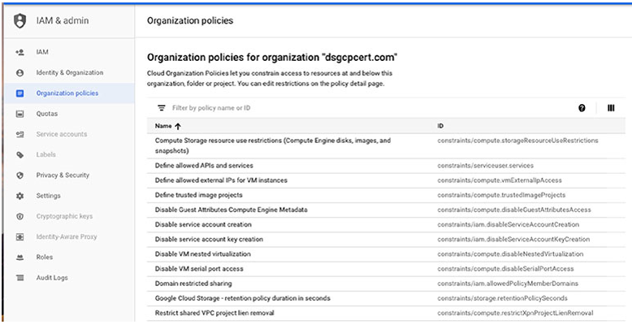

**그림 3.4** Organizational policies는 IAM & admin console에서 관리된다.

### Project 관리

새로운 클라우드 계획을 시작할 때 수행할 첫 번째 업무 중 하나는 프로젝트를 세팅하는 것이다. 이 것은 구글 클라우드 Console에서 할 수 있다. GCP에 계정을 생성했다면 가정하면, [https://console.cloud.google.com](https://console.cloud.google.com)에서 Google Cloud Console을 찾고, 로그인한다. 그림 3.5와 같은 홈페이지가 보일 것이다.

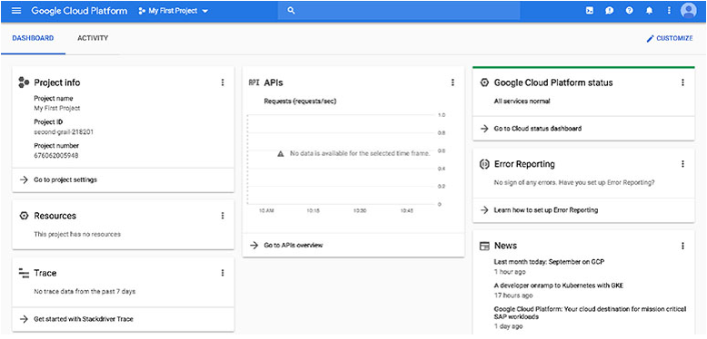

**그림 3.5** console 홈페이지

왼쪽 위에 메뉴에서 IAM & admin을 선택하고, Manage Resoucce를 선택한다.(그림 3.6, 3.7)

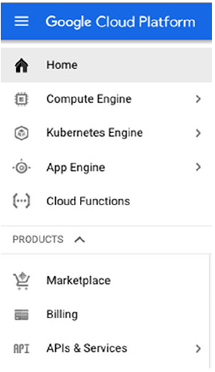

**그림 3.6** 네비게이션 메뉴

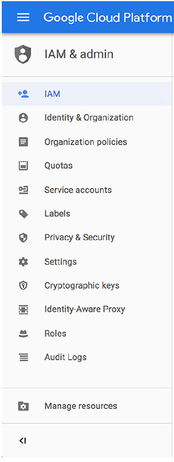

**그림 3.7** Manage Resource 선택

페이지에서 Create Project를 선택하여 Create Project 화면이 표시된다. 프로젝트의 이름을 입력하고, 화면에서 organization을 선택할 수 있다.(그림 3.8, 3.9)

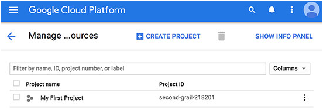

**그림 3.8** Creat Project 클릭

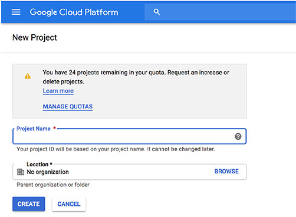

**그림 3.9** Create Project 화면

프로젝트를 생성할 때, 프로젝트의 남은 할당량은 표시된다. 추가적인 프로젝트가 필요하면 할당량 증가를 요청하는 Manage Quotas 링크를 클릭한다.

## Roles과 Identities

리소스 관리 이외에도, 클라우드 엔지니어로서 리소스에 대한 접근을 관리해야 할 것이다. 이 것은 role과 identities의 사용으로 가능하다.

### GCP에서 Roles

*role*은 사용 권한의 집합이다. Roles는 사용자에게 역할을 바인딩하여 사용자에게 부여된다. identities에 대해서 이야기하면, GCP에서 사용자나 서비스 계정을 나타내는데 사용하는 기록을 의미한다. 예를 들어, 앨리스 클라우드에서 어플리케이션을 개발하는 소프트웨어 엔지니어니고, alice@example.com과 같은 이름의 identity를 갖고 있다. Roles은 앨리스가 GCP에서 리소스를 생성, 수정, 삭제, 사용할 수 있게 GCP 내에서 alice@example.com에 할당된다.

GCP에서 role의 3가지 유형이다.
* Primitive roles
* Predefined roles
* Custom roles

Primitive roles는 Owner, Editor, Viewer를 포함한다. 이는 대부분의 리소스에 적용될 수 있는 기본적인 권한이다. 가능하면 predefined roles 대신에 primitive roles를 사용하는게 좋은 예시이다. Primitive roles는 사용자에 의해서 항상 필요하지 않을 수 있는 넓은 범위의 사용 권한을 부여한다. predefined roles를 사용하면, 사용자에게 기능을 수행하는데 필요한 사용 권한을 부여할 수 있다. 필요한 권한만 할당하고, 더 이상 할당하지 않는 관행을 *principle of least privilege(최소 권한 원칙)*이라고 알려져 있다. 이 것은 정보 보호에서 기본적인 예시 중 하나이다.

Predefined roles는 GCP 리소스에 세밀한 접근을 제공하고, GCP 제품에 한정된다. (그림 3.10) 예를 들어, App Engine roles는 아래 내용을 포함한다.
* *appengine.appAdmin*, 모든 어플리케이션 세팅의 읽고, 쓰고, 수정하는 기능을 identity에 부여한다.
* *appengine.ServiceAdmin*, 어플리케이션 세팅에 대한 read-only 접근 권한과 모듈 수준과 버전 수준 세팅에 대한 쓰기 수준의 접근 권한을 부여
* *appengine.appView*, 어플리케이션에 대한 read-only 접근 권한을 부여

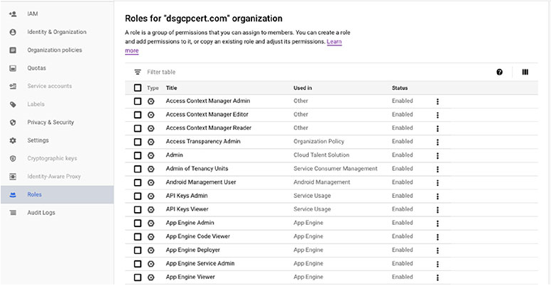

**그림 3.10** GCP roles의 샘플 리스트

Custom roles은 클라우드 관리자가 자신의 role을 생성하고 관리할 수 있다. Custom roles는 IAM에 정의된 사용권한을 사용하여 구성된다. custom role에서 대부분의 사용권한을 사용할 수 있지만, *iam.ServiceAccounts.getAccessToken*과 같은 일부는 custom roles에서 이용할 수 없다.

IAM 콘솔에서 그림 3.11과 같이 사용권한 인터페이스를 표시할 프로젝트를 선택할 수 있다.

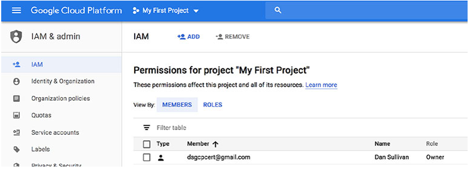

**그림 3.11** IAM Permissions

여기에서 Add 옵션을 선택하면 username과 role를 입력하는 화면이 표시된다.

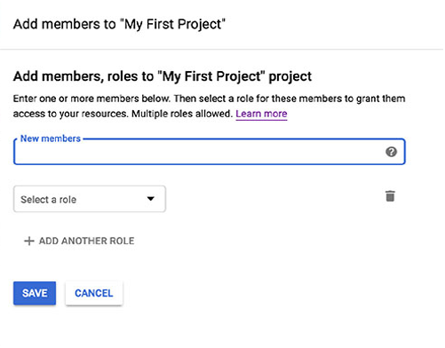

**그림 3.12** 사용자 추가

## Service Account

identities는 보통 사용자 개별적으로 할당된다. 때때로 어플케이션이나 VM이 사용자를 대신하여 수행하거나 사용자에게 권한이 없는 동작을 수행하는 것은 도움이 된다.

예를 들어, 데이터베이스 접근이 필요한 어플리케이션을 갖을 수도 있지만, 어플리케이션의 사용자가 직접 데이터베이스를 접근하는 것을 원하지 않는다. 그 대신에, 데이터베이스에 대한 모든 사용자의 요청은 어플리케이션을 통해야 한다. service account는 데이터베이스에 접근하도록 생성될 수 있다. 그 service account는 어플리케이션에 할당될 수 있어서 어플리케이션은 사용자에게 데이터베이스 접근 권한을 부여하지 않아도 사용자를 대신하여 쿼리를 실행할 수 있다.

Service account는 때로는 리소스로 다루고, 때로는 identities로 취급한다는 점에서 다소 특이하다. service account에 role을 지정할 때, identity로 취급한다. 사용자에게 service account에 대한 접근 권한을 줄 때, 리소스로 취급한다.

service account에는 사용자가 관리하는 servic account와 구글이 관리하는 service account가 있다. 사용자는 프로젝트당 service account를 100개까지 생성할 수 있다. Compute Engine API를 이용하는 프로젝트를 생헝할 때, Compute Engine service account는 자동적으로 생성된다. 유사하게, 프로젝트에 App Engine 어플리케이션이 있다면, GCP는 자동적으로 App Engine service account를 생성할 것이다. Compute Engine과 App Engine service account는 모두 생성된 프로젝트에서 editor role을 부여받는다. 또한 프로젝트에 custom service account를 생성할 수 있다.

구글은 관리하는 service account를 생성할 수 있다. 이 account는 다양한 GCP 서비스와 사용된다.

Service account는 프로젝트 수준에서 account 그룹이나 service account 개별적인 수준으로 관리될 수 있다. 예를 들어, 특정 프로젝트 사용자에게 *iam.serviceAccountUser*를 부여한다면, 사용자는 프로젝트의 모든 service account를 관리할 수 있다. 특정 service account만 관리하도록 사용자를 제한하기를 선호한다면, 특정 service account에 *iam.serviceAccountUser* 권한을 부여할 수 있다.

service account는 리소스가 생성될 때 자동적으로 생성된다. 예를 들어, service account는 VM이 생성될 때 VM에 생성될 것이다. 어플리케이션 중 하나에 service account를 생성하고 싶은 상황이 있을지도 모른다. 이 경우에는 IAM & admin 콘솔에서 Service Account를 선택한다. 그림 3.13에서 보여지는 것처럼 위쪽에 Create Service Account를 클릭한다.

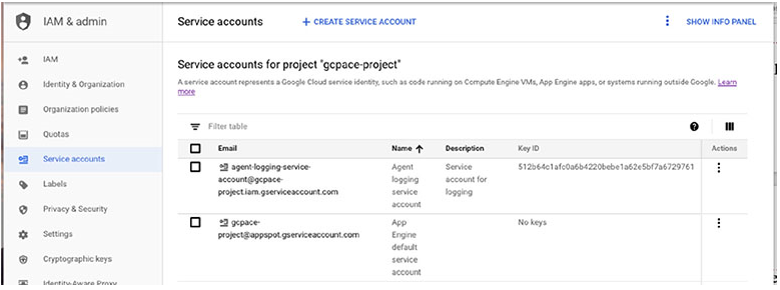

**그림 3.13** IAM & admin 콘솔에서 Service account 리스트

service account를 생성하는 데 필요한 정보를 입력하는 양식을 가져온다.

## Billing(과금)

VM, object storage, 특별한 서비스와 같은 리소스를 사용하는 것은 일반적으로 비용이 발생한다. GCP Billing API는 리소스 사용에 대해 어떻게 비용을 지불하는지 관리하는 방봅을 제공한다.

### Billing Accounts

Billing account는 리소스 사용에 대한 비용을 지불하는 방법에 대한 정보를 저장한다. billing account는 하나 이상의 프로젝트와 연관된다. 모든 프로젝트는 무료 서비스만 사용하지 않는다면 billing account를 반드시 가져야 한다.

Billing account는 리소스 계층과 비슷한 구조를 갖는다. 작은 기업에서 작업하는 경우, 단일 billing account만 갖을 수도 있다. 이 경우에는 모든 리소스 비용이 하나의 account로 과금된다. 이 챕터 초반에 있었던 회계, 마케팅, 법무, 소프트웨어 개발 부서 예시와 비슷한 회사인 경우, 다양한 billing account를 갖기를 원할 수도 있다. 각 부서별로 하나의 billing account를 갖지만, 그럴 필요는 없을 것이다. 회계, 마케팅, 법무 모두 회사의 예산에서 동일한 부분으로부터 클라우드 서비스에 대한 비용을 지불한다면, 하나의 billing account를 갖을 수 있다. 소프트웨어 개발 서비스가 회사 예산의 다른 부분으로부터 비용이 지불된다면, 다른 billing account를 사용할 수 있다.

구글 클라우드 콘솔의 메인에서 기존의 billing account를 나열한 Billing console을 찾을 수 있다. (그림 3.14)

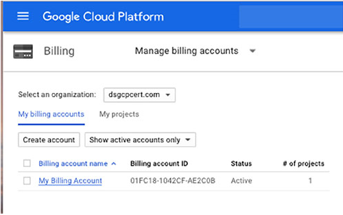

**그림 3.14** 기존 billing account를 나열하는 Billing 메인 형식

여기에서 그림 3.15에서 보여지는 것처럼 새로운 billing account를 생성할 수 있다.

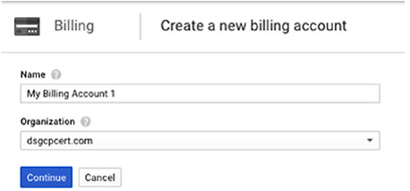

**그림 3.15** 새로운 billing account를 생성하는 양식

Billing overview 페이지에서 billing account와 연결된 프로젝트를 확인하고 수정할 수 있다.

billing account에는 2가지 유형이 있다: self-serve와 invoiced. Self-serve account는 신용카드나 은행 계좌로부터 직접 인출하여 지불한다. 비용은 자동적으로 부과된다. 다른 유형은 invoiced billing account로 사용자에게 영수증이나 인보이스를 전송한다. account의 유형은 기업이나 다른 대형 고객에 의해 공통적으로 사용된다.

몇몇 roles는 billing과 연관된다. 시험을 위해서 아래 내용을 아는 것은 중요하다.
* Billing Account Creator, 새로운 self-service billing account를 생성할 수 있다.
* Billing Account Administrator, billing account를 관리하지만, 생성할 순 없다.
* Billing Account User, 사용자가 프로젝트를 billing account에 연결할 수 있다.
* Billing Account Viewer, 사용자가 billing account 비용과 트랜잭션을 확인할 수 있다.

Billing Account Creator를 담당하는 사용자는 거의 없고, 이 사람은 조직에서 재무 역할을 담당할 가능성이 높다. 클라우드 어드민은 account를 관리하는 Billing Account Administrator를 맡을 수도 있다. 프로젝트를 생성할 수 있는 모든 사용자는 Billing Account User를 맡는다. 그래서 새로운 프로젝트는 관련된 billing account와 연결될 수 있다. Billing Account Viewer는 billing account 정보를 읽어야 하지만, 변경할 수 없는 감사 담당자 같은 일부 사람들에게 유용하다.

### Billing Budget and Alerts

GCP Billing 서비스는 예산을 정의하고 과금 알림을 설정하는 옵션을 포함한다. 콘솔의 메인 메뉴에서 Billing을 선택하고, Budget & alerts를 선택해서 예산 양식을 확인할 수 있다. (그림 3.16)

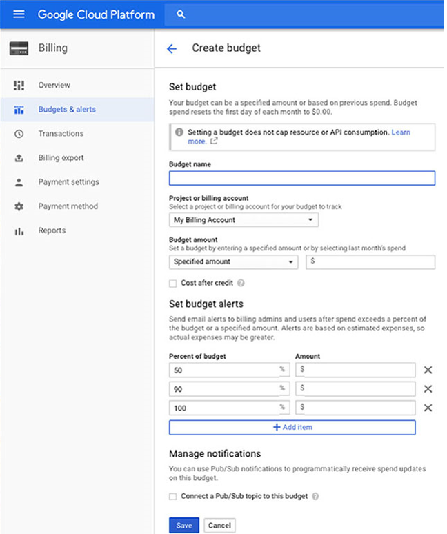

**그림 3.16** 예산 양식은 특정한 달에 예산의 일정 퍼센트를 지불한 경우 공지가 보내질 수 있다.

예산 양식에서 예산의 이름과 모니터링하는 billing account를 지정할 수 있다. 예산은 프로젝트가 아닌 billing account와 연관된다는 점을 기억해야 한다. 하나 이상의 프로젝트는 billing account와 연결될 수 있다. 그래서 지정한 예산과 알림은 billing account와 연결된 모든 프로젝트에서 쓰여질 것으로 예측되는 금액을 기준으로 해야한다.

특정 금액을 지정하거나 이전 달에 쓰여진 예산 금액으로 지정할 수 있다.

예산에서 3가지 퍼센트를 설정할 수 있다. 기본적으로 3개의 퍼센트로 50%, 90%, 100%를 설정한다. 이는 상황에 잘 맞게 퍼센트를 변경할 수 있다. 3가지 이상 알림을 받고 싶다면, Set Budget Alerts 영역에서 추가적인 알림 임계값을 추가하는 Add Item을 클릭한다.

예산의 설정한 퍼센트가 쓰여졌을 때, billing 관리자와 사용자는 이메일로 알림을 받을 것이다. 프로그램방식으로 알림을 받고 싶다면, Manage Notification 영역에서 체크박스를 선택하면 Pub/Sub 토픽이 전송된다.

### Exporting Billing Data

추후 분석이나 근거를 위해서 과금 데이터를 추출할 수 있다. 과금 데이터는 BigQuery 데이터베이스나 Cloud Storage 파일로 추출될 수 있다. 

BigQuery로 과금 데이터를 추출하기 위해, 콘솔에서 Billing 영역을 찾고, 해당 메뉴에서 Billing export를 선택한다. 나타나는 화면의 형식에서 추출하기 원하는 billing account를 선택하고, BigQuery Export나 File Export 중에서 하나를 선택한다. (그림 3.17)

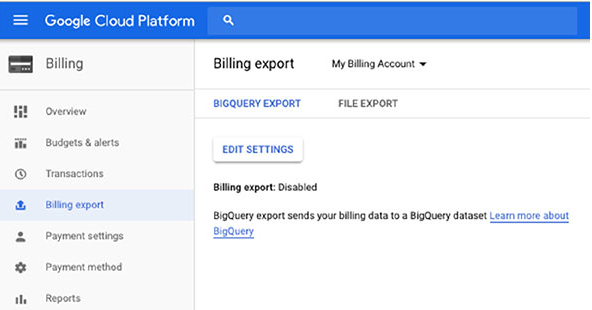

**그림 3.17** Billing 추출 양식

BigQuery에서 Edit Setting을 선택한다. 포함하길 원하는 프로젝트를 선택한다. 데이터를 저장하기 위해서 BigQuery 데이터 셋을 생성할 필요가 있다. Go To BigQuery를 클릭해서 BigQuery 양식을 연다. 추출된 데이터를 저장하는데 사용되는 Billing export 데이터 셋을 생성한다. (그림 3.18) BigQuery를 사용한 추가 정보는 챕터 12에서 확인한다.

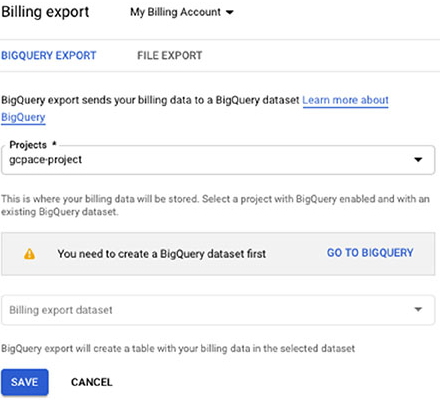

**그림 3.18** BigQuery로 추출

그 대신, Cloud Storage에 저장되는 파일로 billing 데이터를 추출할 수 있다. Billing Export 양식에서 그림 3.29에서 보이는 것처럼 File Export 탭을 선택한다.

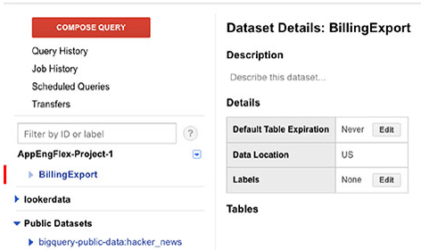

**그림 3.19** 파일로 billing 데이터 추출

파일로 추출할 때, 버킨이름과 리포트의 prefix를 지정할 필요가 있다. CSV나 JSON 파일 포맷 중 하나를 선택하는 옵션이 있따. 가능한 파일 포맷 옵션에 대해서 궁금할 수 있지만, 2가지 옵션을 기억해라.

## Enaling API

GCP는 프로그램방식으로 접근이 가능한 서비스인 API를 사용한다. 예를 들어, VM이나 Cloud Storage 버킷을생성하는 양식을 사용할 때, 뒤에서 VM이나 버킷을 생성하는 API함수가 실행된다. 모든 GCP 서비스는 관련된 API를 갖고 있다. 그러나, 대부분 프로젝트에서 디폴트로 사용하지 않는다.

API 서비스를 사용하기 위해서 콘솔의 메인 메뉴에서 APIs & Services를 선택한다. 그림 3.20에서 보이는 것 처럼 대쉬보드를 볼 수 있다.

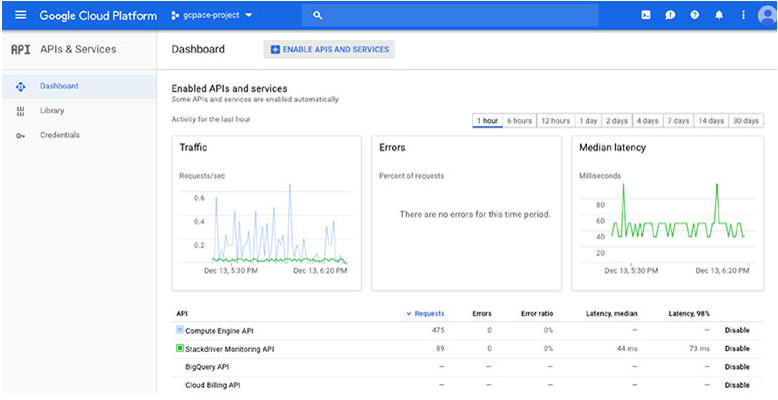

**그림 3.20** API 서비스 대쉬보드의 예

Enable API and Service 링크를 클릭하면, 그림 3.21처럼 사용할 수 있는 서비스의 리스트를 확인할 수 있다.

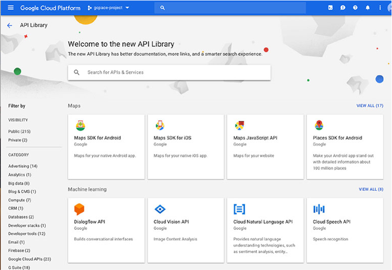

**그림 3.21** API를 사용할 수 있는 서비스

이 양식은 필요하다고 생각하는 API를 사용하는 편리한 방법이다. 사용할 수 없는 API가 요구되는 동작을 시도 한다면, API를 사용할 지 여부를 결정하는 메시지가 표시될 수 있다.

또한, 그림 3.20에서 API의 목록과 상태를 기억해라. 사용가능한 API는 Disable 옵션을 갖고 있고, disable the API를 틀릭할 수 있다. 리스트에서 API의 이름을 클릭하여 API 사용에 대한 상세 정보를 확인할 수 있다. (그림 3.22)

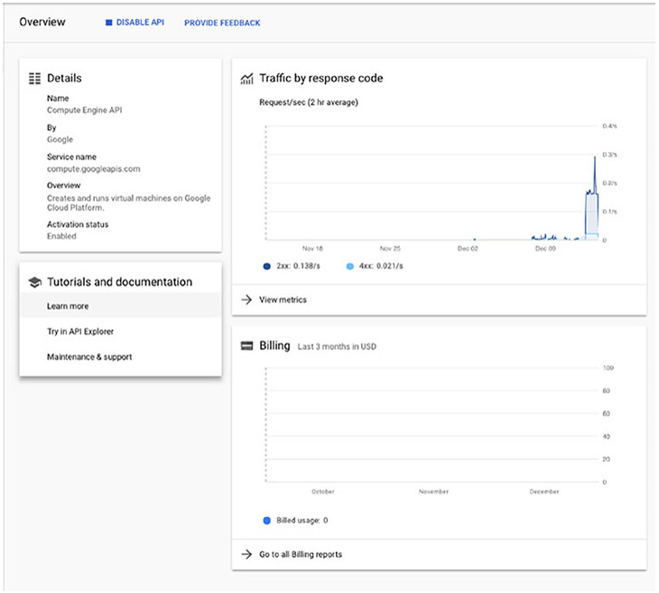

**그림 3.22** API 사용에 대한 상세 정보

## Provisionning Stackdriver Workspace

oraganization과 project를 설정할 때, identities 생성, roles 지정, billing account 설정과 같이 이 챕터에서 나열한 업무를 하는데 시간을 쓸 것이다. 해야 할 다른 것은 Stackdriver Workspaces를 생성하는 것이다. (이전에는 이 것을 Stackdriver account로 불렀다. 그래서 때때로 이 용어를 볼 수도 있다.)

Stackdriver는 어플리케이션과 리소스의 모니터링, 로깅, 추적, 디버깅을 위한 서비스 셋이다. (그림 3.23)Stackdriver에 저장되는 모니터링과 로깅 데이터를 저장하기 위해서 workspace를 생성해야 한다. 콘솔 메인 메뉴에서 Stackdriver를 선택하여 진행할 수 있다.

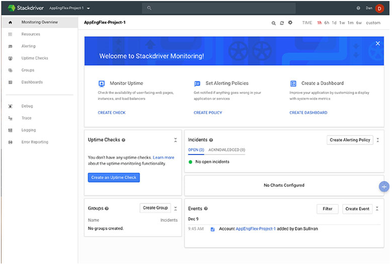

**그림 3.23** Stackdriver 대쉬보드

대쉬보드 위쪽에는 연재 프로젝트의 이름이 보여진다. 관리자 옵션 리스트를 확인하기 위해 프로젝트 이름 옆에 화살표를 클릭한다. (그림 3.24)

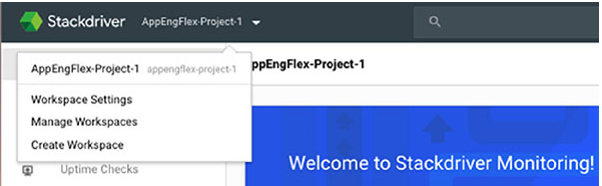

**그림 3.24** Stackdriver workspace 관리를 위한 관리 기능

Create Workspace를 클릭하면, 그림 3.25와 같은 양식이 나타난다. GCP 프로젝트 상자를 클릭한 다음 Create Workspace를 클릭할 때 나타나는 리스트로부터 프로젝트를 선택한다. workspace를 생성되고, 프로젝트와 연결된다. 프로젝트의 모니터링, 로깅, 다른 Stackdriver 서비스를 바로 사용할 수 있다.

챕터 18에서 Stackdriver에 대한 더 자세한 정보를 확인할 수 있다.

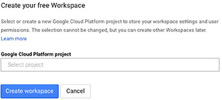

**그림 3.25** Create Workspace 

# 시험 필수 요소

**GCP 리소스 계층을 이해한다.** 모든 리소스는 리소스 계층 내에 구성된다. 하나의 organization과 다양한 folder와 project를 사용하여 리소스 계층을 정의할 수 있다. Folder는 부서를 그룹화하는데 유용하고, 다른 그룹은 그들의 프로젝트를 분리하여 관리한다. Project는 VM과 Cloud storage 버킷과 같은 리소스를 포함한다. Project는 무료 서비스보다 많이 사용하려면 관련된 billing account가 반드시 있어야 한다.

**organization 정책을 이해한다.** Organization 정책은 리소스 계층에서 리소스를 제한한다. 정책에는 리소스로 할 수 있거나 할 수 없는 것을 정의하는 규칙인 제약조건(constraint)을 포함한다. 예를 들어, 제약조건은 프로젝트에서 모든 VM에 시리얼 포트로 접근을 막는다고 설정할 수 있다. 또한, 정책 평가 과정과 상속된 정책을 재정의하는 방법을 이해한다.

**Service account와 사용하는 방법을 이해한다.** Service Account는 특정 사용자와 관련되지 않지만 VM같은 리소스와 할당할 수 있는 ID이다. service account가 할당된 리소스는 service account가 수행 권한을 갖는 동작을 수행할 수 있다. Service account와 생성하는 방법을 이해한다.

**GCP Billing을 이해한다.** GCP Billing은 무료 서비스를 넘어서 서비스와 리소스를 사용할 수 있어야 한다. Billing은 프로젝트에 신용카드나 인보이스 같은 과금 방법으로 연결된다. 프로젝트에서 리소스와 관련된 모든 비용은 프로젝트의 billing account로 청구된다. Billing account는 하나 이상의 프로젝트와 연결될 수 있다. Billing API를 통해서 billing을 관리한다.

**API를 사용하는 방법과 Stackdriver Workspace를 생성하는 방법을 안다.** 편리한 양식을 사용하면 필요한 API를 사용할 수 있다. 또한 API의 목록과 상태를 확인할 수 있다. Stackdriver는 어플리케이션과 리소스 모니터링, 로깅, 추적, 디버깅을 위한 서비스 셋이다. Stackdriver에 모니터링과 로그 데이터를 저장하기 위해 workspace를 생성해야 한다.

# Chapter 4 Google Cloud의 Computing 소개

**이 챕터는 구글 Associate Cloud Engineer 인증 시험 과목 중, 아래 내용을 다룬다.**
* 2.2 compute 리소스 계획과 설정
  
이 챕터에서는 GCP에서 사용할 수 있는 각 compute 옵션과 사용시기에 대해 배울 것이다. 또한 전반적인 컴퓨팅 비용을 줄이도록 도와주는 preemptible 가상머신에 대해서 논의할 것이다.

## Compute Engine

Compute Engine은 GCP에서 동작하는 VM을 제공하는 서비스이다. 일반적으로 동작 중인 VM을 *인스턴스*라고 언급한다. Compute Engineㅇ르 사용할 때, 하나 이상의 인스턴스를 생성하고 관리한다.

### 가상 머신 이미지

인스턴스는 OS, 라이브러리, 다른 코드를 포함한 이미지를 실행한다. 구글에 의해서 제공되는 퍼블릭 이미지를 실행하도록 선택할 수 있다. (그림 4.1) 리눅스와 윈도우 이미지 모두 사용할 수 있다. 구글에서 제공되는 이미지 이외에도, 오플소스 프로젝트나 3rd 파티 벤더에서 제공하는 다른 퍼블릭 이미지도 존재한다.

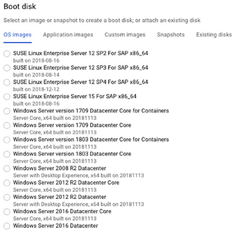

**그림 4.1** Compute Engine에서 사용할 수 있는 OS 이미지 일부분

퍼블릭 이미지는 CentOS, Container Optimized OS from Google, Debian, Red Hat Enterprise Linux, SUSE Enterprise Linux Server, Ubuntu, Windows Server와 같은 넓은 범위의 OS를 포함한다.

필요로하는 퍼블릭 이미지가 없다면, boot disk로부터 커스텀 이미지를 생성하거나 다른 이미지로 시작할 수 있다. 콘솔에서 VM을 생성하기 위해 Compute Engine을 찾은 다음 VM Instance를 찾는다. 그림 4.2와 비슷한 화면을 볼 수 있다.

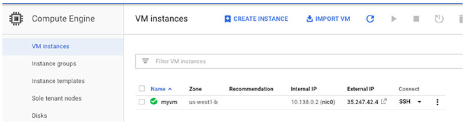

**그림 4.2** Compute Engine에서 VM 생성

위 화면에서, VM을 생성하는 Create Instance를 클릭한다. 필요한 것과 가까운 이미지를 선택하고, VM을 생성한다. 그 다음 라이브러리나 다른 소프트웨어 패키지를 설치하는 것과 같이 이미지에 필요한 변경 사항을 수행한다. VM이 생성되고, 변경사항이 적용되었다면, Google Cloud Console의 Compute Engine 메뉴에서 Snapshot을 선택한다. (그림 4.3)

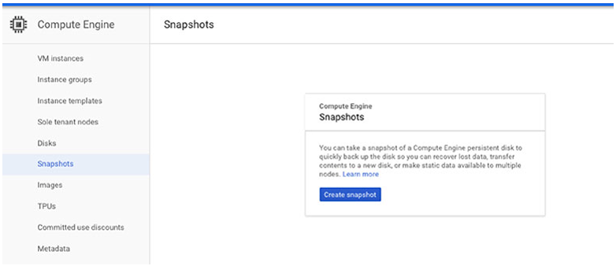

**그림 4.3** snapshot 생성하기의 첫 번째 단계

Create Snapshot를 클릭한다. 보이는 양식에서 스냅샷의 이름, 설명, 그리고 가장 중요하게 스냅샷을 위한 원본인 디스크를 지정할 수 있다. 그림 4.4에서, *myvm*이라고 되어있는 VM의 boot disk가 선택되었다. 옵션을 선택한 후에, 스냅샷을 저장하는 Create 버튼을 클릭한다. 이 이미지는 다른 VM의 이미지로 사용될 수 있다.

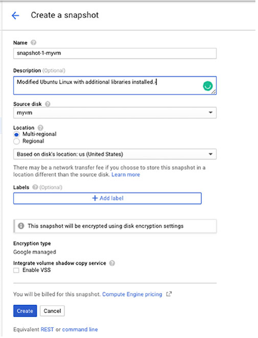

**그림 4.4** Compute Engine에서 스냅샷 생성하기

커스텀 이미지는 실행하는 VM의 각 인스턴스에 OS를 설정하고, 추가 소프트웨어를 설치해야하는 경우에 특히 유용하다. 각 인스턴스에 소프트웨어를 여러번 설정하고, 설치하는 것 대신에, 한번만 설정하고 설치한 다음 인스턴스의 boot disk에서 있는 커스텀 이미지로 생성할 수 있다. 다른 인스턴스를 기동할 때 커스텀 이미지를 지정하여서 추가적인 단계 없이 설정과 소프트웨어를 사용할 수 있을 것이다.

로컬 환경이나 데이터 센터에서 커스텀 이미지를 갖는 경우가 있을 수 있다. 구글에서 제공하는 가상 디스크 import 도구를 사용하여 이미지를 불러올 수 있다. 이 도구는 *gcloud* 커맨드라인 도구 중 하나이고, 다음 챕터에서 더 자세한 정보를 설명한다.

커스텀 이미지는 GCP와 반드시 호환되어야 한다. 작성 시, Compute Engine에서 실행되는 커스텀 이미지를 빌드하기 위해 다음과 같은 기본 운영체제를 사용할 수 있다.

* Linux OS
  * CentOS 6
  * CentOS 7
  * Debian 8
  * Debian 9
  * Red Hat Enterprise Linux 6
  * Red Hat Enterprise Linux 7
  * Ubuntu 14.04 LTS
  * Ubuntu 15.04 LTS
* Windows OS
  * Windows Server 2008 R2
  * Windows Server 2012 R2
  * Windows Server 2012 R2 Core
  * Windows Server 2016
  * Windows Server 2016 Core

### 프로젝트에 포함된 가상머신

인스턴스를 생성할 때, 인스턴스를 포함하는 프로젝트를 지정한다. 기억하겠지만, 프로젝트는 GCP 리소스 계층의 일부이다. 프로젝트는 계정에서 가장 하위 계층이다. 프로젝트는 공통 정책으로 관련 리소스를 관리할 수 있다. 

Google Cloud Console을 열 때, 그림 4.5에서 보여지는 것처럼 맨 위에 프로젝트 이름이나 Select a Project 문구중 하나가 표시될 것이다.

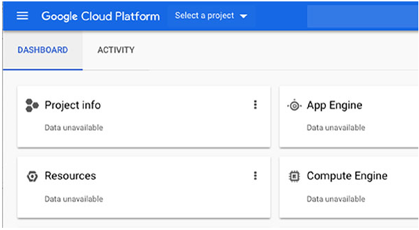

**그림 4.5** 현재 프로젝트 이름이나 선택 옵션 중 하나가 Google Cloud Console에서 보여진다.

Select a Project를 선택할 때, 그림 4.6처럼 양식이 나타난다. 거기에서 VM을 포함하여 리소스를 저장할 프로젝트를 선택할 수 있다.

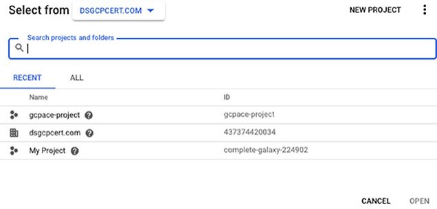

**그림 4.6** 계정의 기존 프로젝트 중에서 프로젝트를 선택

### Zone 및 Region에서 가상머신 실행

프로젝트를 갖는 것 이외에도, VM 인스턴스틑 할당된 zone을 갖는다. Zone은 리소스 같은 데이터 센터이지만, 하나 이상의 밀접하게 연결된 데이터센터로 구성될 수 있다. Zone은 region 내에 위치한다. *region*은 asia-east1, europe-west2, us-east4와 같이 지리적 위치이다. region 내 zone은 저지연, 높은 대역폭의 네트워크 연결로 구성된다.

VM을 생성할 때 region과 zone을 지정한다. 그림 4.7에서 볼 수 있는 것처럼, Create VM 양식은 region과 zone을 선택할 수 있는 drop-down 리스트 양식을 포함한다.

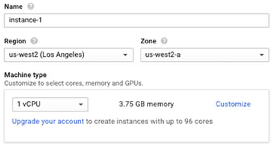

**그림 4.7** Create VM 양식에서 region과 zone 선택하기

VM이 실행되는 장소를 선택할 때 고려할 몇 가지 요소는 아래와 같다.
* 비용, region 간 다를 수 있다.
* Data Locality regulation(데이터 지역적 규제), EU시민에 대한 데이터는 EU에 있어야 한다.
* High availability, 다양한 인스턴스가 실행 중이라면, 다른 zone과 가능하면 다른 region에 실행되길 원할 수도 있다. zone이나 regions중 하나에 접근할 수 없게 되면, 다른 zone과 region에 있는 인스턴스는 서비스를 제공할 수 있다.
* Latency, 전 세계의 다른 영역에서 사용자를 갖는 경우 중요하다. 인스턴스와 데이터가 지리적으로 어플리케이션 사용자와 가깝게 유지되는 것은 latency를 줄이는데 도움을 줄 수 있다.
* Need for specific hardware platform, region마다 다를 수 있다. 예를 들어, europe-west1에 쓸 당시에는 Intel Xeon E5와 Sandy Bridge 플랫폼으로 알려졌지만, Europe-west2는 그렇지 않다.

### 사용자들은 VM을 생성하는 권한이 필요

프로젝트에서 Compute Engine 리소스를 생성하기 위해서 사용자는 프로젝트나 특정 리소스의 팀 멤버여야 하고, 특정 업무를 수행하는 적절한 권한을 가져야 한다. 사용자는 아래와 같이 프로젝트와 연관될 수 있다.
* Individual User
* A Google group
* A G Suite domain
* A service account

사용자나 사용자 그룹이 프로젝트에 추가되면, 사용자나 사용자 그룹에 role를 부여하여 사용 권한을 할당할 수 있다. 이 프로세스는 챕터 17에 자세하게 설명한다. Predefined role은 사용자가 일련의 업무를 수행하는데 필요한 권한을 그룹화하기 때문에 특히 유용하다. 아래는 predefined role의 예시이다.

**Compute Engine Admin** Compute Engine 인스턴스 전체를 제어하는 역할을 갖는 사용자

**Compute Engine Network Admin** 대부분의 네트워킹 리소스를 생성, 수정, 삭제하고, 방화벽 규칙과 SSL 인증으로 read-only 접근을 제공하는 역할을 갖는 사용자. 이 role은 인스턴으를 생성하거나 대체하는 권한을 사용자에게 부여하지 않는다.

**Compute Engine Security Admin** SSL 인증과 방화벽 규칙을 생성, 수정, 삭제할 수 있는 역할을 갖는 사용자

**Compute Engine Viewer** Compute Engine 리소스를 확인할 수 있지만, 리소스의 데이터를 읽을 수 없는 역할의 사용자

권한이 프로젝트 단위로 사용자에게 부여될 때, 이 사용 권한은 프로젝트 내의 모든 리소스에 적용된다. 예를 들어, 사용자가 프로젝트 레벨에서 Compute Engine Admin role을 부여 받았다면, 프로젝트에서 모든 Compute Engine 인스턴스들을 관리할 수 있다. 그림 4.8은 사용자와 role의 리스트를 보여주는 예시이다.

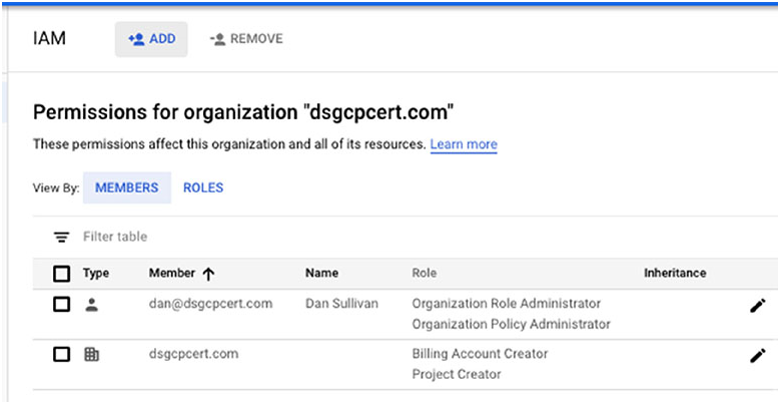

**그림 4.8** 사용자와 role 리스트의 예시

사용 권한을 부여하는 대체 방법은 리소스에 직접적으로 IAM 정책을 추가한느 것이다. 이 방법에서, 권한은 프로젝트 내의 모든 리소스 대신에 특정 리소스에 맞출 수 있다. 예를 들어, 사용자 Alice는 하나의 인스턴스에 Compute Engine Admin role을 갖고, Bob은 다른 인스턴스에 같은 role을 지정할 수 있다. Alice와 Bob은 각자의 VM 인스턴스를 관리할 수 있지만, 다른 인스턴스를 관리할 수 없다.

### Preemptible VM

고가용성이 필요한 워크로드가 있는 경우 고려해야한다. Preemptible VM은 금융 모델링, 렌더링, 빅데이터, CI, 웹 크롤링을 수행하는 어플리케이션과 같은 워크로드 유형에 적합하게 짧게 기동되는 컴퓨트 인스턴스이다. 이런 VM은 일반적인 compute 인스턴스와 동일한 설정으로 제공하고, 24시간까지 유지된다. 어플리케이션이 장애 예방 기능(fault-tolerant)가 있고, 가능한 인스턴스 중단(경고 30초)을 견딜 수 있다면, Peemptible VM 인스턴스를 사용하는 것은 Google Compute Engine 비용을 크게 줄일 수 있다.

몇몇 빅데이터 분석 작업은 Hadoop과 Spark같은 소프트웨어를 실행하는 서버의 클러스터에서 동작한다. 플랫폼은 실패를 회복할 수 이쎅 설계되었다. 노드가 작업 중간에 중단되면, 플랫폼은 실패를 감지하고, 서버의 다른 노드로 워크로드를 이동시킨다. 신뢰있는 VM과 Preemptible VM의 조합으로 제대로 서비스를 제공하는 분석 작업이 있을 수 있다. 신뢰할 수 있는 VM의 몇 퍼센트는 제한 시간 내의 처리된 작업을 얻을 수 있지만, 적은 비용(Preemptible VM)을 추가하면, 더 빠르고 적은 비용으로 작업을 끝낼 수 있다.

#### Preemptible VM의 제한

Preemptible VM을 사용하는 곳을 결정할 때, GCP의 기존 VM 인스턴스와 비교하여 제한사항과 차이점에 유의해야 한다. Preemptible VM은 아래와 같은 특성이 있다.
* 언제든지 종료될 수 있다. 시작한지 10분 이내레 종료된다면, 비용이 발생하지 않는다.
* 24시간 내에 종료된다.
* 항상 이용하지 못할 수 있다. 이용 가능한지는 zone와 region에 따라 다르다.
* 일반적인 VM에 이관할 수 없다.
* 자동적으로 재시작하도록 설정할 수 없다.
* Service Level Agreement(SLA)를 보장하지 않는다.

### 커스텀 머신 유형

Compute Engine은 기본 유형, high-memory machine, high-CPU machines, shared core type, memory-optimized machines으로 그룹화된 25가지 이상의 predefined 머신 유형을 갖고 있다. 이러한 predefined 머신 유형은 가상 CPU(vCPUs)의 수와 메모리의 양이 다르다. 아래는 예시이다.
* n1-standard-1은 1개의 vCPU와 3.75GB의 메모리
* n1-standard-32는 32개의 vCPU와 120GB의 메모리
* n1-highmem-32는 32개의 vCPU와 208GB의 메모리
* n1-highcpu-32는 32개의 vCPU와 28.8GB의 메모리

VM의 predefined 옵션은 많은 예시의 요구를 충족하지만, 미리 정의되지 않은 설정에서 더 비용 효과적이고 더 빠르게 워크로드가 실행되는 경우가 있을 수 있다. 이 경우 커스텀 머신 유형을 사용할 수 있다.

커스텀 이미지를 생성하기 위해 콘솔에서 Create VM 옵션을 선택한다. Machine Type 영역에서 Customize 링크를 클릭한다. 그림 4.9처럼 Machine Type 영역에 확장된다. 거기에서 원하는 CPU의 수와 메모리의 양을 슬라이더로 증가시키거나 감소시킬 수 있다.

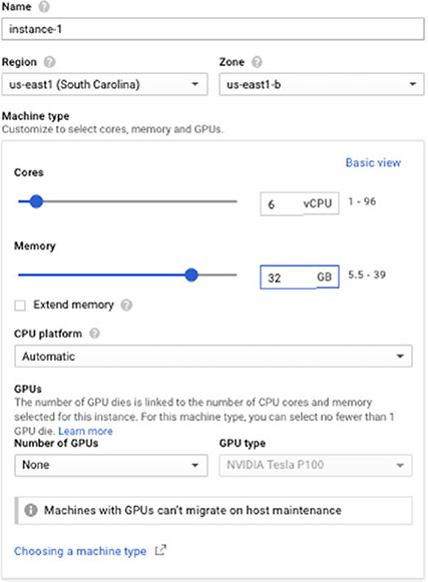

**그림 4.9** CPU 수와 메모리 양을 조정하여 VM을 커스터마이징

커스텀 머신 유형은 1에서 64사이의 vCPU와 vCPU당 6.5GB 메모리까지 가질 수 있다. 커스텀 설정의 가격은 할당된 vCPU 수와 메모리를 기반으로 한다.

### Compute Engine 가상 머신의 사용 사례

Compute Engine은 VM 인스턴스 위에서 최대의 제어가 필요할 때 좋은 옵션이다. Compute Engine으로 할 수 있는 것은 아래와 같다.
* 인스턴스에서 실행할 특정 이미지를 선택
* 소프트웨어 패키지나 커스텀 라이브러리를 설치
* 인스턴스에 대한 사용 권한을 가진 사용자가가 세부적으로 제어
* 인스턴스를 위해 SSL 인증과 방화벽 정책에서 제어

GCP의 다른 computing 서비스와 상대적으로, 구글 Compute Engine은 최소한의 관리만 제공한다. 구글은 공인 이미지와 VM 설정 세트를 제공한다. 하지만, 관리자로서 사용할 이미지, CPU 수, 할당할 메모리 양, 영구 저장소 설정 방법, 네트워크 설정 방법에 대해서 선택해야 한다.

일반적으로, GCP에서 리소스에 대한 더 많은 제어할 수록, 리소스를 구성하고 관리해야하는 책임이 더 커진다.

## App Engine

[맨 위로](#Contents) 