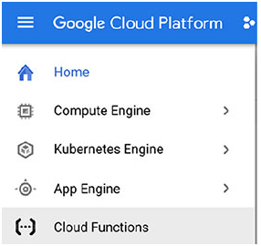
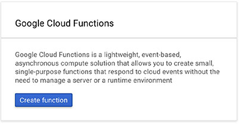
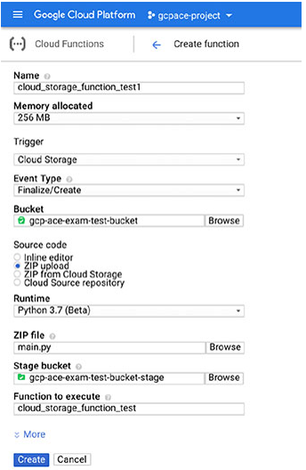
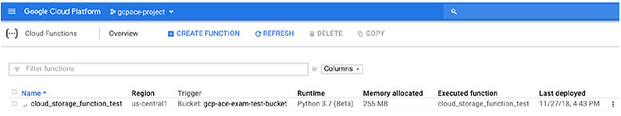
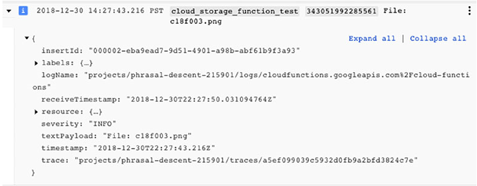
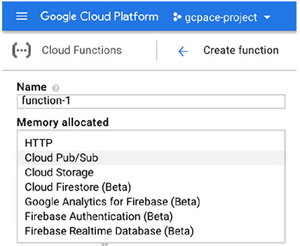

# Chapter 10 Computing with Cloud funcstions

**이 챕터는 구글 Associate Cloud Engineer 인증 시험 과목 중, 아래 내용을 다룬다.**
* 3.3 App Engine과 Cloud Functions 리소스를 배포하고 구현

이 챕터에서는 Cloud Functions의 목적과 functions을 구현하고 배포하는 방법을 설명한다. Python으로 작성된 기능의 예를 사용할 것이다. Python이 친숙하지 않다면, 따라하자 읺는 것이 좋다. Python 기능의 중요한 상세 정보가 설명될 것이다. Cloud Functions을 생성하고 관리기 위해 Cloud Console과 `gcloud` 명령을 사용하는 방법을 배울 것이다.

**Notice**

> 이 챕터는 오직 Cloud Functions만 다룬다. App Engine은 챕터 9에서 다룬다.

## Cloud Functions 소개

Cloud Functions은 GCP에서 제공하는 서버리스 compute 서비스이다. Cloud Functions은 서버리스라는 점에서 App Engine고 유사하다. 그러나, 주요 차이점은 App Engine은 하나의 어플리케이션으로 구성된 다수의 서비스를 지원한다. 반면에 Cloud Functions은 다른 서비스와 독립적으로 관리되고 운영하는 개별적인 서비스를 지원한다. 

App Engine은 하나의 서비스에서 실행하는 프론트엔드, 하나 이상의 다른 서비스에서 실행되는 API 집합 웹 어플리케이션, 또 다른 서비스에서 실행되는 비즈니스 로직이 있는 웹 어플리케이션에 적합한 서버리스 옵션이다. 서비스는 어플리케이션을 함께 구성하므로, 하나의 관리 유닛으로 취급하는 것이 좋다.

모든 컴퓨팅 요구사항은 다수의 서비스가 필요하지 않다. 예를 들어, 어느 부서는 데이터베이스에서 매일 데이터를 추출하여 업로드한 다음, 기업의 데이터 웨어하우스에 로드할 수 있다. 데이터 추출 파일이 Cloud Storage에서 로드된다면, 파일이 올바른 포맷이고, 다른 비즈니스 규칙을 충족하는지 검증하는 것과 같은 전처리를 수행하는 기능을 사용할 수 있다. 확인을 통과하면, GCP의 메시징 서비스인 Pub/Sub 토픽으로 메시지가 작성되고, 데이터 웨어하우스 로드 처리에서 읽는다. Cloud Functions은 개발자가 추출, 변환, 로드 프로세스에서 초기 데이터 품질 검사를 분리할 수 있다.

Cloud Functions에는 제한이 있다. 기본적으로 타임아웃을 9분까지 설정할 수 있지만, 기능은 1분 후에 타임아웃 된다.

### Event, Trigger, and Functions

Cloud Functions에서 더 나가기 전에 알아야할 용어가 있다.
* Events
* Triggers
* Functions

*Events*는 Cloud Storage에 파일이 업로드 되거나 메시지가 Pub/Sub 메시지 큐에 작성되는 것 같이 구글 클라우드에서 일어나는 특정 동작이다. 각 이벤트와 관련된 다양한 종류의 동작이 있다. 현재, GCP는 5가지 카테고리의 이벤트를 지원한다.
* Cloud Storage
* Cloud Pub/Sub
* HTTP
* Firebase
* Stackdriver Logging

Cloud Storage에서 이벤트는 파일 업로드, 삭제, 아카이빙을 포함한다. Cloud Pub/Sub은 메시지 publish의 이벤트이다. 이벤트의 HTTP 타입은 개발자가 POST, GET, PUT, DELETE, OPTIONS을 사용하여 HTTP request로 function을 호출할 수 있다. Firebase 이벤트는 데이터베이스 트리거, remote configuration 트리거, 인증 트리거와 같은 Firebase 데이터베이스에 수행되는 작업이다. 로그 항목을 Pub/Sub 토픽으로 전달하고, 응답을 트리거하여 Stackdriver Logging의 변화를 응답하는 기능을 설정할 수 있다.

발생할 수 있는 Cloud Functions의 이벤트에 대해 트리거를 정의할 수 있다. *trigger*는 이벤트에 응답하는 방법이다.

트리거는 function과 관련이 있다. functions은 이벤트에 대한 데이터를 argument로 전달된다. function은 이벤트에 응답하여 실행된다.

### Runtime 환경

Functions는 자체 환경에서 실행한다. function가 호출될 때마다 다른 모든 호출로부터 분리된 인스턴스에서 실행된다. 오직 Cloud Functions을 사용하여 functions의 호출 간 정보를 공유하는 방법은 없다. 글로벌 카운트를 유지하는 것 같이 데이터를 업데이트를 동일하게 해야하거나 처리된 지난 이벤트의 이름같이 function의 상태에 대한 정보를 유지해야 하면, cloud Datastore나 Cloud Storage의 파일같은 데이터베이스를 사용해야 한다.

구글은 현재 3가지 런타임 환경을 지원한다.
* Python 3
* Node.js 6
* Node.js 8

function 예시를 살펴보자. Cloud Storage에 특정 버킷에 파일 업로드에 대한 정보를 기록하고자 한다. 이벤트에 대한 정보를 수신한 다음 로그 파일로 데이터의 설명을 전송하는 print 명령을 실행하는 Python 함수를 작성할 수 있다. 다음은 Python 코드이다.

```python
def cloud_storage_function_test(event_data, event_context):
    print('Event ID: {}'.format(event_context.event_id))
    print('Event type: {}'.format(event_context.event_type))
    print('File: {}'.format(event_data['name']))
```

첫 번째 라인은 `cloud_storage_function_test` 함수를 생성한다. 이 함수는 `event_data`, `event_context`의 두 가지 매개변수를 받는다. 이벤트의 object와 이벤트 자체에 대한 정보를 갖는 Python 데이터 구조이다. 다음 3개의 라인은 `event_id`, `event_type`, 파일 이름의 값을 출력한다. 이 코드는 대화식이 아닌 functions으로 실행되기 때문에, print의 output은 함수의 로그 파일로 이동할 것이다.

Python 함수는 `main.py` 파일로 저장되어야 한다.

**실 사용 사례: 검색가능한 문서 만들기**

> 비즈니스 간 소송은 대량의 문서 검토가 포함된다. MS Word 문서나 PDF 파일같이 전자 문서는 손쉽에 검색이 가능한 포맷이다. 다른 것은 종이 문서를 스캔한 이미지가 될 수 있다. 이 경우에, 파일은 Optical Character Recognition(OCR) 프로그램을 사용하여 전처리할 필요가 있다. <br>
> Functions은 OCR 처리를 자동화하는데 사용될 수 있다. 파일이 업로드 되면, Cloud Storage는 파일을 트리거하고 함수를 호출한다. 함수는 파일이 겁색이 가능한 포맷인지, OCR 프로그램에 의해 전처리가 필요한지 결정한다. 파일이 OCR 처리가 필요하다면 함수는 Pub/Sub 토픽에 파일의 위치를 작성한다. <br>
> 두번째 함수는 새로운 메시지 이벤트가 묶여있다. 파일 위치가 메시지에 쓰여지면, 팜수는 문서를 스캔하는 OCR 프로그램을 호출하고 파일의 검색가능한 버전을 생성한다. 검색이 가능한 버전은 Cloud Storage 버킷에 쓰여지고 다른 검색이 가능한 파일과 함께 검색 도구에 의해 색인을 생성할 수 있다.

## Cloud Storage에서 이벤츠를 수신하는 CLoud Functions

Cloud Storage는 GCP의 object 스토리지이다. 이 서비스는 *buckets*이라는 컨테이너에 파일을 저장할 수 있다. 챕터 11에서 Cloud Storage에 대한 더 자세한 정보를 다룬다. 하지만, 이 챕터에서는 Cloud Storage가 버팃을 사용하여 파이릉 저장한다는 것을 이해하면 된다. 파일이 생성되고, 삭제되고, 저장되거나 내용이 변경되면, 이벤트를 함수를 호출한다. Cloud Console과 Cloud SDK와 Cloud SDK에 `gcloud` 명령을 사용하여 Cloud Storage Events를 위한 함수를 배포하는 예를 살펴보자

### Cloud Console을 사용하여 Cloud Storage Event를 위한 Cloud Functions 배포

Cloud Console을 사용하여 함수를 생성하기 위해, 콘솔의 메뉴에서 Cloud Functions 옵션을 선택한다. (그림 10.1)



**그림 10.1** Cloud Functions 콘솔

Cloud Console 콘솔에서, 활성화되어있지 않는다면, Cloud Functions API를 활성화하는 입력화면이 보일 것이다. Cloud Functions API가 활성화 된 후에, 신규 함수를 생성할 수 있다. (그림 10.2)



**그림 10.2** Cloud 콘솔에서 새로운 함수를 생성하는 프롬프트

콘솔에서 새로운 함수를 생성할 때, 그림 10.3와 같이 양식이 나타난다. 그림 10.3에서 채워야하는 옵션은 아래와 같다.
* Function name
* Memory allocated for the function
* Trigger
* Event type
* Source of the function code
* Runtime
* Source code
* Python, Go or Node.js function to execute



**그림 10.3** 콘솔에서 함수 생성

다음 예시에서, 함소 코드를 포함한 파일을 업로드한다. 파일의 내용은 다음과 같다.

```python
def cloud_storage_function_test(event_data, event_context):
    print('Event ID: {}'.format(event_context.event_id))
    print('Event type: {}'.format(event_context.event_type))
    print('File: {}'.format(event_data['name']))
```

함수 이름은 GCP가 이 함수을 참조하기 위해서 사용하는 이름이다. 할당된 메모리는 함수를 사용할 수 있는 메모리의 양이다. 메모리 옵션은 128MB에서 2GB 범위이다. Trriger는 HTTP, Cloud Pub/Sub, Cloud Storage와 같이 정의된 트리거 중 하나이다. 업로드, Cloud Storage나 Cloud Source Repository에서 가져오기, 에디터에서 코드 입력하기를 포함하여 소스코드를 찾을 위치를 지정하는 옵션이 있다. Runtime은 코드를 실행하는데 사용할 런타임을 가리킨다. 에디터는 함수 코드를 입력할 수 있는 장소이다. 마지막으로, function to execute는 이벤트가 발생할 때 실행해야할 코드에서 함수의 이름이다.

함수가 생성된 후에, 그림 10.4와 같이 Cloud Functions 콘솔에서 함수의 리스트를 확인할 수 있다.



**그림 10.4** 콘솔에서 함수의 리스트

함수의 리스트 위에 delete function 옵션이 있다는 것을 기억해야 한다.

### gcloud 명령을 사용하여 Cloud Storage 이벤트를 위한 Cloud Function 배포

Cloud Functions를 위한 `gcloud` 명령을 사용하는 첫번째 단계는 최신 버전의 명령을 설치하는 것이다. 다음과 같이 기본 `gcloud` 명령을 업데이트할 수 있다.

```bash
gcloud components update
```

Python 명령은 작성 당시 베타버전이므로 다음과 같이 설치될 수 있다.

```bash
gcloud components install beta
```

`gcp-ace-exam-test-bucket`이라는 Cloud Storage 버킷이 생성되었다고 가정하자. `gcloud functions deploy` 명령을 사용하여 함수를 배포할 수 있다. 이 명령은 매개변수로 함수의 이름을 받는다. 전달해야할 3가지 파라미터가 있다.
* runtime
* trigger-resource
* trigger-event

`runtime`은 Python 3.7, Node.js 6, Node.js 8을 사용할 지 가리킨다. `trigger-resource`는 트리거와 관련된 버킷의 이름을 가리킨다. `trigger-event`는 함수 실행을 트리거하는 이벤트의 종류이다. 가능한 옵션은 다음과 같다.
* google.storage.object.finalize
* google.storage.object.delete
* google.storage.object.archive
* google.storage.object.metadataUpdate

`finalize`는 파일이 완전히 업로드되었을 때를 설명하는데 사용되는 용어이다.

`gcp-ace-exam-test-bucket` 버킷에 새로운 파일이 업로드 될때마다 `cloud_storage_function_test`를 실행하고자 한다. 다음 명령을 실행해야 한다.

```bash
gcloud functions deploy cloud_storage_function_test --runtime python37 --trigger-resource gcp-ace-exam-test-bucket --trigger-event google.storage.object.finalize
```

버킷에 파일이 업로드될 때, 함수가 실행되고, 그림 10.5에서 보여지는것과 유사한 로그 메시지가 생성된다.



**그림 10.5** `cloud_storage_function_test`함수에 의해서 생성된느 로그 메시지의 예

함수가 완료되고 삭제하고자 할 때, `gcloud functions delete` 명령을 사용할 수 있다.

```bash
gcloud functions delete cloud_storage_function_tset
```

## Pub/Sub으로부터 이벤트를 수신하는 Cloud Functions

함수는 메시지가 Pub/Sub 토픽으로 쓰여지는 각 시간에 실행될 수 있다. Cloud Pub/Sub 이벤트에 의해서 동작되는 함수를 배포하기 위해 Cloud Console이나 `gcloud` 명령을 사용할 수 있다.

### Cloud Console을 사용하여 Cloud Pub/Sub 이벤트를 위한 Cloud Function 배포

이전 Cloud Storage 예시에서 사용된 것과 유사한 함수를 사용한다고 가정하자. 지금은 `pub_sub_function_test` 함수를 호출할 것이다.

Cloud Console에서 함수를 생성하기 위해, 콘솔의 메뉴에서 Cloud Functions 옵션을 선택한다. Cloud Function 콘솔에서 Cloud Function API가 활성화되어있지 않다면 활성화하라는 프롬프트를 받을 수 있다. Cloud Function API가 활성화 된 후, 새로운 함수를 생성하는 옵션을 갖을 것이다. 함수를 생성할 때, cloud function name, memory allocated, event type, source code를 포함한 몇 가지 파라미터를 지정해야 한다. 아래는 `pub_sub_function_test`의 소스코드이다.

```python
def pub_sub_function_test(event_data, event_context):
    import base64
    print('Event ID: {}'.format(event_context.event_id))
    print('Event type: {}'.format(event_context.event_type))
    if 'name' in event_data:
        name = base64.b64decode(event_data['name']).decode('utf-8')
        print('Message name: {}'.format(event_data['name']))
```

이 함수는 메시지와 관련된 이벤트 ID와 이벤트 타입을 출력한다. `event_data`가 `name`의 키를 갖는 Key-value 쌍이라면, 함수는 메시지에서 이름을 출력할 것이다. 이 함수는 base64를 import하고, `base64.b64decode` 함수를 사용한다. 이 것은 Pub/Sub의 메시지는 텍스트 데이터가 예상되는 곳에 바이너리 데이터를 허용하도록 인코딩되어있기 때문이고, `base64.b64decode` 함수는 인코딩된 데이터를 UTF-8로 변환하는데 사용된다.

이 코드는 2가지 예외사항을 갖는 이전 Cloud Storage 예시와 동일한 방법으로 배포된다. Cloud Storage 트리거를 선택하는 것 대신에, 그림 10.6에서 보여지는 것처럼 트리거의 리스트에서 Cloud Pub/Sub을 선택한다. 또한, Cloud Pub/Sub 트리거를 지정한 후, Cloud Pub/Sub 토픽의 이름을 지정한다. 토픽이 존재하지 않으면 생성될 것이다.



**그림 10.6** 클라우드 콘솔의 옵션에서 트리거를 선택

### gcloud 명령을 사용하여 Cloud Pub/Sub 이벤트를 위한 Cloud Function 배포

Cloud Storage를 위한 함수와 마찬가지로, Cloud Functions을 배포한다면, 최신 `gcloud` 명령을 사용하는게 적합하다.

```bash
gcloud compunents update
```

Python을 사용하는 경우, beta `gcloud` 명령으로 설치한다.

```bash
gcloud compunents install beta
```

함수를 배포하기 위해 `gcloud functions deploy` 명령을 사용한다. Cloud Pub/Sub 함수를 배포할 때, 함수를 트리거할 메시지를 포함하는 토픽의 이름을 지정한다. Cloud Storage를 위해 배포하는 것 처럼 사용하고자 하는 runtime 환경을 지정해야 한다.

```bash
gcloud functions deploy pub_sub_function_test --runtime python37 --trigger-topic gcp-ace-exam-test-topic
```

`gcloud functions delete` 명령을 사용하여 함수를 삭제할 수 있다.

```bash
gcloud functions delete pub_sub_function_test
```

## Summary

이 챕터에서, Cloud Functions을 작업했고, 함수를 구현하고 배포하는 방법을 확인했다. Python으로 작성된 함수의 예시를 사용했지만, Node.js로 함수를 작성할 수 있다. 함수는 구글 Cloud Console이나 커맨드 라인 중 하나를 사용하여 생성될 수 있다. Cloud Functions을 사용하기 위해서, events, triggers, functions간 관계를 이해하는 것이 중요하다. Events는 클라우드에서 일어나는 동작이다. 서비스마다 다른 유형의 events가 있다. Triggers는 event가 발생했을 때 함수 실행을 가리키는 방법이다. Functions는 trigger가 정의된 event가 발생햇을 때 실행되는 코드를 참고한다.

## 시험 요소

**events, triggers, functions간 관계를 알아야 한다.** Event는 Cloud Storage에 파일이 업로드되거나 메시지가 Cloud Pub/Sub 토픽으로 작성되었을 때와 같이 발생하는 동작이다. Trigger는 event가 발생했을 때 이루어져야하는 동작의 선언이다. Functions는 event가 발생했을 때, 무슨 동작을 할 지 정의하는 trigger와 연관된다.

**Cloud Functions vs App Engine 어플리케이션을 사용하는 시기를 알아야 한다.** Cloud Functions은 클라우드의 이벤트에 응답하는 단일 목적의 함수를 지원하는 서비스이다. App Engine은 서버리스 컴퓨팅 옵션이지만, 사용자가 직접 상호작용하는 다양한 기능의 어플리케이션을 배포하는데 사용된다.

**Cloud Functions에서 지원되는 런타임을 알아야 한다.** Cloud Functions은 Node.js 6, Node.js 8, Python 3를 지원한다.

**Cloud Storage 이벤트에서 Cloud Functions을 정의하기 위한 파라미터를 알아야 한다.** Cloud Storage를 위한 파라미터는 다음을 포함한다.
* Cloud Function name
* Memory allocated for the function
* Trigger
* Event type
* Source of the function code
* Runtime
* Source code
* Name of the Python or Node.js function to execute

**Cloud Pub/Sub 이벤트에서 Cloud Functions을 정의하기 위한 파라미터를 알아야 한다.** Pub/Sub을 위한 파라미터는 다음과 같다.
* Cloud function name
* Memory allocated for the function
* Trigger
* Topic
* Source of the function code
* Runtime
* Source code
* Name of the Python or Node.js function to execute

**Cloud Functions 작업을 위한 `gcloud` 명령을 알아야 한다.** 
* `gcloud functions deploy`
* `gcloud functions delete`

[맨 위로](#chapter-10-computing-with-cloud-funcstions)