# Chapter 11 클라우드에서 Storage 기획

**이 챕터는 구글 Associate Cloud Engineer 인증 시험 과목 중, 아래 내용을 다룬다.**
* 2.3 데이터 스토리지 옵션 기획 및 설정

클라우드 엔지니어로서, GCP에서 제공되는 다양한 스토리지 옵션을 이해해야 한다. "쿼리를 위한 SQL에 접근하는 것 vs 데이터베이스에 페타바이트 급의 데이터 스트리밍을 저장하고 쿼리하는 기능"과 같이 상대적인 절충안을 알면서 주어진 케이스를 위한 적당한 옵션을 선택해야 한다.

이 책에서 대부분 다른 챕터와 다르게, 이 챕터는 GCP에서 특정 업무를 수행하는 것보다 스토리지 개념에 더 초점을 맞춘다. 여기 자료는 최고의 스토리지 솔루션을 선택하는 것에 대한 질문에 답변하는데 도움을 줄 것이다. 챕터 12는 데이터 솔루션을 배포하고 구현하는데 상세한 정보를 제공할 것이다.

스토리지 옵션 중 선택을 위해서, 스토리지 솔루션이 어떻게 다른지 이해해야 도움이 된다.
* Time to access data
* Data model
* Other features, such as consistency, availability, and support for transactions

이 챕터는 다양한 유형의 요구사항을 위해 스토리지 옵션을 선택하기 위한 가이드라인을 포함한다.

## 스토리지 시스템의 유형

스토리지 솔루션을 선택할 때 주요 고민은 데이터에 접근해야하는 시간이다. 극단적으로 CPU 칩의 L1 캐시에 있는 데이터는 0.5 나노초(ns)에 접근할 수 있다. 반대로 일부 서비스는 데이터 파일을 가져오는데 몇 시간이 요구될 수 있다. 대부분 스토리지 요구사항은 이러한 극단 사이에 있다.

**나노초, 밀리초, 마이크로초**
> 일부 스토리시 시스템은 전자 현미경에서 일어날 것 처럼 우리롸 친숙하지 않은 속도로 동작한다. 1초는 메모리나 디스크의 데이터에 접근하는데 걸리는 시간보다 극단적으로 길다. 3가지 측정 단위로 접근 시간이나 "latency"를 측정한다.
> * 나노 초(㎱), 10^-9초
> * 마이크로 초(㎲), 10^-6초
> * 밀리 초(㎳), 10^-3초 
>
> 10^-3은 과학적 표기법이고 0.001초를 의미한다. 유사하게, 10^-6은 0.000001과 같다. 10^-9는 0.000000001 초와 같다.
>
> 또 다른 고민은 Persistence이다. 특정 시스템에 저장된 데이터의 내구성은 어드정도인가? 캐시는 데이터에 접근하기 위한 가장 적은 지연시간을 제공하지만, 휘발성 데이터 유형은 오직 메모리에 전원이 공급될때만 존재한다. 서버가 중지되면 데이터는 사라진다. 디스크 드라이브는 내구성 등급이 더 높지만, 실패할 수 있다. 중복성이 도움이 된다. 데이터의 복사본을 만들고, 다른 rack, 다른 zone, 다른 region에 다른 서버에 저장함으로써, 하드웨어 장애로 인해 데이터 손실 위험을 줄인다.

GCP는 몇 가지 스토리지 서비스가 있다.
* 캐싱을 위한 관리형 Redis 캐시 서비스
* VM 사용을 위한 Persistenct disk storage
* 리소스 전반적으로 파일에 공유된 접근을 위한 Object storage
* 장기간, 비주기적 접근 요구사항을 위한 Archival stoarge

### Cache

캐시는 어플리케이션이 데이터에 수 밀리초 접근을 제공하도록 설계된 인메모리 데이터 저장소이다. 다른 스토리지 시스템보다 주요 장점은 저지연이다. 캐시는 이용할 수 있는 데이터의 양이 제한된다. 그리고 캐시를 호스팅한 머신이 중지되면 캐시의 컨텐츠는 삭제된다. 이 것은 상당한 제한조건이다. 하지만 일부 경우에, 데이터 접근 속도의 장점이 단점을 능가한다.

#### MemoryStore

GCP는 관리형 Redis 서비스인 Memorystore를 제공한다. Redis는 오픈소스 캐시로 넓게 사용된다. Memorystore는 Redis와 프로토콜 호환이 되기 때문에, Redis 작업을 위해 작성된 툴과 어플리케이션은 MemoryStore와 사용할 수 있다.

캐시는 데이터를 조회할 때 지연시간이 길면 안 되는 어플리케이션과 주로 사용된다. 예를 들어, 하드디스크 드라이브로부터 읽어야하는 어플리케이션은 인메모리에서 데이터를 읽는 경우보다 80배 더 오래 기다려야한다. 어플리케이션 개발자는 데이터베이스에서 조회된 다음 데이터가 필요할 때 디스크 대신 캐시에서 조회되는 데이터를 저장하는데 캐시를 사용할 수 있다.

MemoryStore를 사용할 때, Redis를 실행할 인스턴스를 생성한다. 인스턴스는 1GB에서 300GB 메모리로 구성된다. 또한 high availability(HA)를 구성할 수 있다. 이 경우 MemoryStore가 failover replicas를 생성한다.

#### Configuring MemoryStore

Memorystore 캐시는 Compute Engine, App Engine, Kubernetes Engine에서 실행하는 어플리케이션과 사용될 수 있다. 그림 11.1은 Memorystore를 구성하는데 사용되는 파라미터를 보여준다. 메인 콘솔 메뉴에서 Memorystore를 선택한 다음 Redis instance 생성 옵션을 선택하여 아래 양식을 확인할 수 있다.

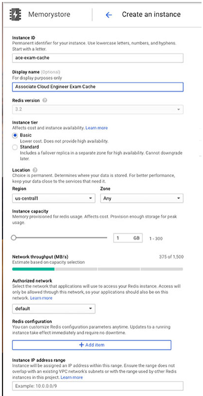

**그림 11.1** Memorystore 캐시를 위한 설정 파라미터

Memorystore에서 Redis 캐시를 설정하기 위해, instance ID, display name, Redis Version을 지정해야 한다. 현재 Redis 3.2만 지원된다. Standard instance tier를 선택하여 high availability를 위해 다른 zone에 replica를 갖도록 선택할 수 있다. Basic instance tier는 replica를 포함하지 않지만 비용이 적다.

캐시 전용 메모리 양에 따라서 region과 zone을 지정해야 한다. 캐시는 1GB에서 300GB의 사이즈가 될 수 있따. Redis 인스턴스는 다른 네트워크를 지정하지 않으면 기본 네트워크에서 접근할 수 있다.(GCP의 더 많은 네트워크 정보를 위해 챕터 14, 15를 참고). Memorystore를 위한 고급 옵션은 labels을 지정하고 IP 주소가 지정될 IP 범위를 정의할 수 있다.

### Persistent Storage

GCP에서 persistent disks는 내구성있는 block storage를 제공한다. Persistent disk는 GCE와 GKE의 VM에 연결될 수 있다. persistent disk가 block storage 디바이스이기 때문에, 이 디바이스에 파일 시스템을 생성할 수 있다. Persistent disk는 VM을 호스팅한 물리 서버에 직접 연결되지 않지만, 네트워크로 접근할 수 있다. VM은 SSD에 로컬로 연결될 수 있지만, 이 장치의 데이터는 VM이 종료되었을 때 잃는다. persistent disk의 데이터는 VM이 중지된 후에도 계속 존재한다. persistent disk는 VM과 독립적으로 존재한다. 로컬로 연결된 SSD는 그렇지 않다.

#### Persistent disk의 기능

persistent disk는 SSD와 HDD 설정을 사용할 수 있다. SSD는 높은 대역폭이 중요할 때 사용된다. SSD는 랜덤 액세스와 순차적 액세스 패턴을 위한 일관된 성능을 제공한다. HDD는 지연시간이 더 길지만 비용은 적다. 그래서 HDD는 대량의 데이터를 저장하고 어플리케이션 상호작용보다 데이터 지연시간이 덜 민감한 배치를 수행할 때 좋은 옵션이다. HDD를 지원하는 persistent disk는 기가바이트 0.75 IOPS(초당 입출력 동작, 기가바이스당 1.5 wirte IOPS를 수행할 수 있다. 반면에, 네트워크로 연결된 SSD는 기가바이트당 30 read and write IOPS를 수행할 수 있다. 로컬로 연결된 SSD는 기가바이트당 266에서 453의 read IOPS와 기가바이트당 186에서 240의 write IOPS를 달성할 수 있다.

Persistent disk는 multireader 스토리지를 지원하여 다양한 VM에 마운트될 수 있다. 디스크의 스냅샷은 몇 분만에 생성될 수 있다. 그래서 디스크 데이터의 추가 복사본은 다른 VM에서 사용하기 위해 분배될 수 있다. 스냅샷으로 생성된 디스크가 하나의 VM에 마운트되면, read, write 동작을 모두 지원할 수 있다.

Persistent disk의 사이즈는 VM에 마운트되는 동안 증가될 수 있다. 디스크 사이즈를 재조정하려면, 파일시스템이 접근할 수 있는 추가공간을 만들기 위해 OS 명령을 수행해야할지도 모른다. SSD와 HDD는 모두 64TB까지 가능하다.

Persistent disk는 디스크의 데이터가 자동적으로 암호화된다.

스토리지 옵션을 기획할 때, 디스크가 zonal인지 regional인지 고려해야한다. zonal 디스크는 하나의 존에 다양한 물리 드라이버 전체적으로 데이터를 저장한다. zone이 이용할 수 없게 되면, 디스크에 접근할 수 없다. 그 대안으로, regional persistent disk를 사용할 수 있고, region 내에 2개 존에 걸쳐서 데이터 블록을 복사하지만 zonal 스토리지보다 더 비싸다.

#### Persistent disk 설정

콘솔에서 Compute Engine을 열고 Disk를 선택해서 persistent disk를 생성, 설정할 수 있다. Disk 페이지에서 Create Disk를 클릭하면 그림 11.2와 같은 양식이 나타난다.

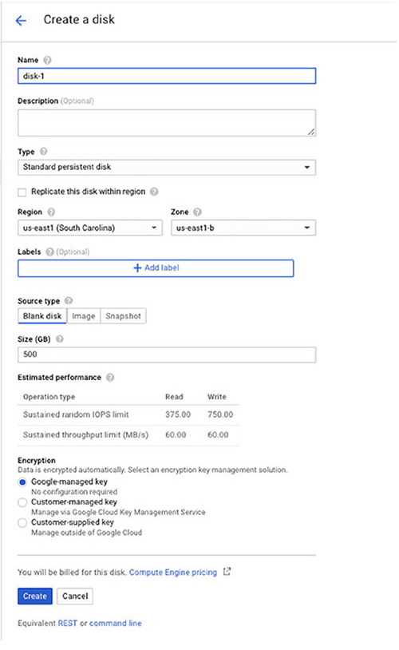

**그림 11.2** persistent disk 생성 양식

디스크의 이름을 제공해야 하지만, description은 옵션이다. 디스크에는 2가지 유형이 있다: standard, SSD persistent disk. high availibility를 위해 region 내에 replica를 생성될 수 있다. region과 zone을 지정해야 한다. Label은 옵션이지만, 각 디스크의 목적을 추적하는데 도움을 주기 위해 추천한다.

Persistent disk는 공백이나 이미지나 스냅샷으로 생성될 수 있다. persistent boot disk를 생성하려면 이미지 옵션을 사용한다. 다른 디스크에 replica를 생성하려면 스냅샷을 사용한다.

데이터를 GCP에 저장할 때, 기본적으로 암호화된다. 디스크를 생성할 때, GCP에서 암호화 키를 관리하도록 선택할 수 있고, 이런 경우 추가 설정이 필요하지 않다. GCP의 Cloud Key Management Service를 사용하여 스스로 키를 관리할수 있고, GCP의 키 repository에 키를 저장할 수 있다. 이를 위해 customer-managed Key 옵션을 선택한다. Cloud Key Management Service에 생성될 키의 이름을 지정해야 한다. 또 다른 키 관리 시스템을 사용하여 키를 생성하고 관리하는 경우, customer-supplied Key를 선택한다. customer-supplied key 옵션을 선택한 경우 양식에서 키를 입력해야 한다.

### Object Storage

캐시는 수 밀리초의 latency로 접근할 수 있는 상대적으로 적은 양의 데이터를 저장하는데 사용된다. Persistent 스토리지 디바이스는 하나의 디스크에 64TB까지 저장할 수 있고, read/write 동작을 위한 100 IOPS까지 제공한다. exabyte 급 대량의 데이터를 저장해야 하고, 넓게 공유해야할 때, object 스토리지는 좋은 옵션이다. GCP의 objet 스토리지는 Cloud Storage 이다. 

#### Cloud Storage의 기능

Cloud Storage는 object 스토리지 시스템이다. 시스템에 저장되는 파일은 최소 단위로 취급된다. 즉, 파일의 한 섹션만 읽는 것같이 파일의 부분만 조작할 수 없다. object를 생성하거나 삭제하는 동작을 수행할 수 있지만 Cloud Storage는 파일의 하위 구성요소를 조작하는 기능을 제공하지 않느다. 예를 들어 파일의 한 색션을 덮어쓰는 Cloud Storage 명령은 없다. 또한, Cloud Storage는 동시성과 잠금을 지원하지 않는다. 다수의 클라이언트가 파일을 작성하면, 파일에 작성된 마지막 데이터가 저장되고 유지된다.

Cloud Storage는 일관된 데이터 구조에 대한 요구없이 대량의 데이터를 저장하기 위해 적합하다. 버킷에 다양한 유형의 데이터를 저장할 수 있다. 버킷은 Cloud Storage의 논리적 구성 단위이다. 버킷은 프로젝트 내의 리소스이다. 버킷은 글로벌 namespace를 공유한다는 것을 기억해야 한다. 그래서 각 버킷의 이름은 globally 유니크해야 한다. "mytestbucket"으로 버킷 이름을 할 수 없을 경우 놀라지 않아도 된다. 특히, 버킷 및 object 이름 지정 규칙을 따르지 않는 경우, 유니크한 파일 이름을 찾는 것은 어렵지 않다.

object storage는 파일 시스템을 제공하는 않는 것을 기억해야 한다. 버킷은 객체를 그룹으로 구성하는 데 도움을 주는 점에서 디렉토리와 유사하다. 하지만, 버킷은 하위 디렉토리같은 기능을 지원하는 디렉토리가 아니다. 구글은 Cloud Storage Fuse라는 오픈소스 프로젝트를 지원한다. 이는 리눅스와 MacOS에서 파일 시스템으로 버킷을 마운트하는 방법을 제공한다. Cloud Storage Fuse를 사용하면, 파일 시스템 명령을 사용하여 버킷에 파일을 다운로드하고 업로드할 수 있다. 하지만, 완전한 파일시스템 기능을 제공하지 않는다. Cloud Storage Fuse는 Cloud Storage와 동일한 제한조건을 갖는다. Cloud Storage Fuse의 목적은 리눅스나 Mac 파일시스템에서 작업할 때, 버킷에 내부, 외부에 데이터를 편하게 이동하게 만들어주는 것이다.

Cloud Storage는 object storage의 4가지 등급을 제공한다: multi-regional, regional, nearline, coldline.

#### Multiregional과 Regional 스토리지

버킷을 생성할 때, 버킷을 생성할 지역을 지정한다. 버킷과 버킷의 컨텐츠는 이 지역에 저장된다. regional 버킷이라고 알려진 single region이나 multiregional 버킷이라고 알려진 multiple regions에 데이터를 저장할 수 있다. Multiregional 버킷은 99.95%의 SLA(서비스 수준 계약)로 월 평균 99.99% 이상의 가용성을 제공한다. 데이터는 다수의 region에 복사된다. Regional 버킷은 월 평균 99.99%의 가용성과 99.9%의 SLA를 갖는다. Regional 버킷은 zone에 걸쳐서 중복된다. 

Multiregional 버킷은 컨텐츠에 접근 가능한 시간을 보장하기 위해 컨텐츠를 다수의 region에 저장되어야할 때 사용된다. 또한, zone 수준의 장애 시, 중복성을 제공한다. 그러나, 이 장점은 비용이 더 높다. 글을 작성하는 시점에, multiregional 스토리지는 미국에서 $0.26/GB/month가 발생한다. 반면에, regional 스토리지는 $0.20/GB/month가 발생한다. (Associate Cloud Enginner 시험에서 특정 비용에 대해서 물어보지 않을 것이다. 하지만 요구사항에 충족하는 저비용 솔류션을 식별하기 위해서 상대적인 비용을 알아야 한다.)

regional과 multiregional 스토리지는 자주 사용되는 데이터를 위해 사용된다. 한달에 한 번 이상 사용자가 파일을 자주 다운로드하고 접근하는 어플리케이션이라면, regional이나 multiregional을 선택하는게 가장 비용에 효과적이다. 사용자의 위치를 기반으로 regional과 multiregional을 선택한다. 사용자가 글로벌로 분산되고 동기화된 데이터에 접근해야한다면, multiregional은 더 나은 성능과 가용성을 제공한다.

데이터를 적극적으로 사용하지 않으면 어떻게 될까? 예를 들어, 규정에 따라서 7년동안 저장해야할 파일이 있지만, 접근이 예상되지 않는 경우, 보관 스토리지를 원할 수 있다. 유사하게, 장애 복구에만 필요한 파일을 저장하는 경우, 연간 1회 미만으로 자주 접근하지 않도록 설계된 스토리지 클래스를 원할 수 있다. 이러한 종류의 사례를 위해서 구글은 nearline과 clodline 스토리지 등급을 설계했다.

**Notice**

> 용어에 대한 참고사항: 구글은 때때로 georedundant라는 용어를 사용한다. Georedundant 데이터는 최소 100마일 이상 떨어진 2개 이상의 위치에 저장된다. 데이터가 multiregional인 경우, georedundant 이다.

#### Nearline and Coldline 스토리지

자주 접근하지 않는 데이터를 위해, nearline과 coldline 스토리지 클래스는 좋은 옵션이다. Nearline 스토리지는 한달에 한번 미만으로 파일 접근이 예상되는 경우를 위해 설계되었다. Coldline 스토리지는 1년에 한번이나 그보다 더 적게 접근이 예상되는 파일을 위해 설게되고, 가격이 책정되었다.

Nearline 스토리지는 multiregional 위치에서 월평균 99.95% 가용성을 제공하고, regional 위치에서 99.9%의 가용성을 제공한다. nearline을 위한 SLA는 multiregional 위치에서 99.9%이고, regional 위치에서 99.0%이다. 낮은 SLA는 $0.10/GB/month으로 비용이 크게 절감된다. 비용을 절약하기 위해 regional과 multiregional을 nearline으로 이동하기 전에, 구글은 nearline과 coldline 스토리지에 데이터 조회 요금을 추가해야 한다. nearline 스토리지의 조회 비용은 $0.01/GB이다. 또한, nearline 스토리지를 위해 최소 30일의 저장 기간이 있다.

Coldline 스토리지는 multiregional 위치에서 월 평균 99.95% 가용성과 regional 위치에서 99.9% 가용성을 갖는다. SLA는 multiregional 위치에서 99.9%이고 regional 위치에는 99.0%이다. Coldline은 $0.07/GB/month로 기가바이트당 가장 적은 비용이다. 기억해야할 것으로, 이 것은 오직 스토리지 비용이다. nearline 스토리지처럼, coldline 스토리지도 액세스 비용이 부과된다. 구글은 coldline 스토리지를 1년에 한 번 미만으로 접근한다고 예상하고, 최소 90일 이상 스토리지를 보유한다. coldline 스토리지의 조회 비용은 $0.05/GB이다.

현재 비용보다 상대적인 비용 관계를 이해하는 것이 더 중요하다. 비용을 변할 수 있다. 하지만 다른 등급의 스토리지과 상대적으로 각 등급의 비용은 동일하게 유지될 가능성이 높다. 다양한 스토리지 유형을 위한 기능, 비용, 사례의 요익은 표 11.1을 확인하면 된다.

**그림 11.1** 스토리지 서비스 - 기능 요약

| :: | Regional | Multiregional | Nearline | Coldline |
|---|---|---|---|---|
| Features | 다수의 zone에 복사된 Object Storage | 다수의 region에 복사된 Object Storage | 한 달에 한번미만 접근하는 Object Storage | 1년에 한 번 미만 접근하는 Object Storage |
| Storage 비용 | $0.20/GB/month | $0.26/GB/month | $0.10/GB/month | $0.07/GB/month |
| 액세스 비용 | | | $0.01/GB | $0.05/GB |
| 사용 사례 | 어플리케이션간 공유되는 Object Storage | 공유된 Object를 글로벌 액세스 | 데이터 레이크, 백업의 오래된 데이터 | 문서 보유, 규정 준수 |

### Versioning과 Object Lifecycle 관리

Cloud Storage에서 버킷은 Object가 변경될 때 object의 버전을 유지하는데 설정될 수 있다. 버전 관리가 버킷에 활성화되었을 때, object의 복사본은 object가 덮어쓰여지거나 삭제될 때마다 보관된다. object의 최신 버전은 live 버전으로 알려졌다. 버전관리는 object의 변경 이력을 유지해야 하거나 object를 실수로 삭제되는 위험을 완화할 때 유용하다.

또한 Cloud Storage는 자동적으로 object의 스토리지 등급을 변경하거나 특정 기간 뒤에 object를 삭제하는 lifecycle 관리 정책을 제공한다. 때때로 configuration이라고 불리는 lifecycle 정책은 규칙의 집합이다. 규칙은 condition과 action을 포함한다. condition이 true면, action은 실행된다. Lifecycle 관리 정책은 버킷에 적용되고, 버킷의 모든 object에 영향을 미친다.

Conditions는 종종 연대(age)를 기반으로 한다. object가 특정 age에 도달하면, 삭제되거나 더 적은 비용의 스토리지 등급으로 이동될 수 있다. age 이외에도, condiftion은 버전의 수, 버전이 live인지 아닌지, object가 특정 날짜 이전에 생성됐는지, object가 특정 스토리지 등급에 있는지를 확인할 수 있다. 

object를 삭제하거나 object의 스토리지 등급을 변경할 수 있다. 버전이 있는 object과 없는 object 모두 삭제될 수 있다. 파일의 live 버전이 삭제되면, 실제로 삭제되지 않고 object가 보관된다. object의 보관된 버전이 삭제되면, object는 영구적으로 삭제된다.

또한, lifecycle 관리를 사용하여 object의 스토리지 등급을 변경할 수 있다. 할당할 수 있는 등급에는 제한조건이 있다. Multiregional과 regional 스토리지 object는 nearline이나 coldline으로 변경될 수 있다. Nearline은 오직 coldline으로만 변경될 수 있다.

#### Cloud Storage 설정

콘솔을 사용하여 Cloud Storage의 버킷을 생성할 수 있다. 메인 메뉴에서 Storage를 열고, Create Bucket을 선택한다. 그림 11.3과 유사한 양식이 표시될 것이다.

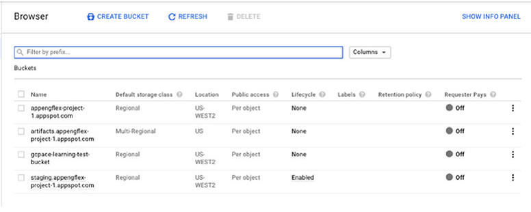

**그림 11.3** 콘솔에서 스토리지 버킷 생성하는 양식. 고급 옵션이 표시된다.

버킷을 생성할 때, 버킷 이름, 스토리지 등급을 포함한 몇몇 기본 정보를 제공해야 한다. 선택적으로 label 추가와 암호화를 위한 Google-managed keys나 customer-managed keys 중 하나를 선택할 수 있다. 파일 변경하거나 특정 시간 전에 파일을 삭제하는 것을 막는 정책을 설정할 수 있다.

버킷이 생성되면 lifecycle 정책을 정의한다. 콘솔에서 Storage 메뉴로부터 Browse 옵션을 선택하면 그림 11.4 같은 화면이 표시된다.

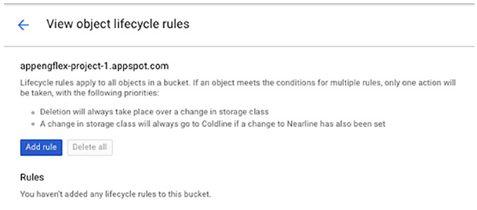

**그림 11.4** 버킷의 리스트는 lifecycle 정책을 정의하거나 수정하는 링크를 포함한다.

lifecycle 열은 lifecycle 설정이 활성화됐는지 가리킨다. lifecycle을 생성하거나 수정할 버킷을 선택하고 Lifecycle 열에서 None이나 Enabled를 클릭한다. 그림 11.5와 같은 양식이 표시된다.

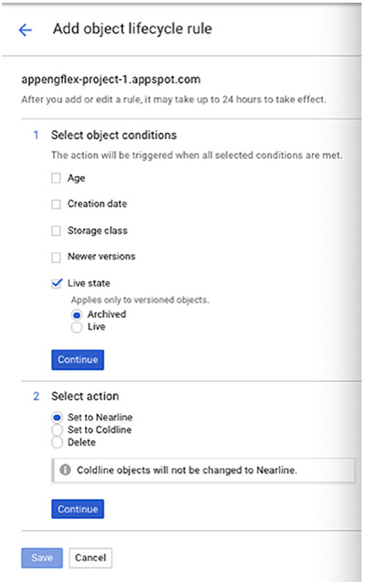

**그림 11.5** lifecycle 정책을 생성할 때, 규칙을 정의하는 Add Rule option을 클릭한다.

규칙을 추가할 때, object condition과 action을 지정해야 한다. Condition 옵션은 Age, Creation Data, Storage Class, Newer Versions, Live State가 있다. Live State는 object에 버전을 적용하고, live 또는 archived 버전의 object에 적용되는 condition을 설정할 수 있다. action은 nearline이나 coldline중 하나에 스토리지 등급으로 설정할 수 있다.

정책의 예시를 살펴보자. 콘솔에서 Cloud Storage의 Browser 섹션에서 버킷의 리스트와 현재 lifecycle 정책을 확인할 수 있다.

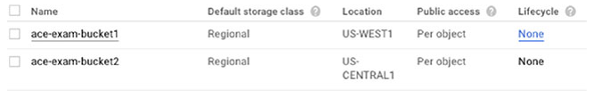

**그림 11.6** Cloud Storage Browser에서 버킷의 리스트

버킷의 정책 상태를 클릭하면 lifecycle 규칙을 생성할 수 있다.

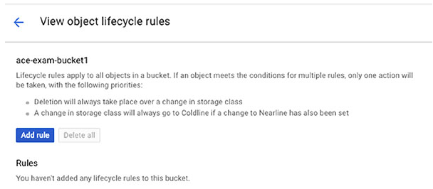

**그림 11.7** 버킷에 lifecycle 정책을 추가하는 양식

Add Object Lifecycle Rule 양식은 그림 11.8처럼 표시된다. 이 양식에서, AGe, Storage Class와 같은 object condition을 지정할 수 있고, Set To Nearline과 같은 action을 지정할 수 있다.

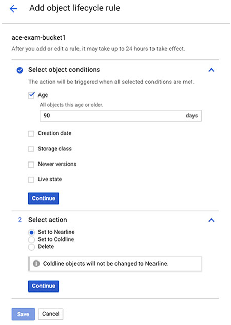

**그림 11.8** 버킷에 object lifecycle 규칙을 추가

### Storage 솔루션을 기획할 때 Storage Type

storage 솔루션을 기획할 때, 고려할 요소는 데이터에 접근하는데 요구되는 시간이다.

Memorystore같은 캐시는 가장 빠른 접근 시간을 제공하지만, 사용할 수 있는 메모리 양이 제한된다. 캐시는 휘발성이다. 서버가 중지되면, 캐시의 컨텐츠는 손실된다. 캐시의 컨텐츠가 마지막으로 저장된 특정 시점으로 복구될 수 있도록 정기적으로 캐시의 내용을 persistent 스토리지에 저장해야 한다.

Persistent 스토리지는 VM에 연결된 디스크같이 block 스토리지 디바이스로 사용된다. GCP는 SSD와 HDD 드라이브를 제공한다. SSD는 더 빠른 성능을 제공하지만, 비싸다. HDD는 파일 시스템에 저장되어야하는 대량의 데이터를 저장할 때 사용되지만, 데이터의 사용자는 가장 빠른 접근이 필요하지 않다.

Object storage는 장기간동안 대량의 데이터를 저장하는데 사용된다. Cloud Storage는 regional과 multiregional 스토리지 등급이 있고, lifecycle 관리와 버전관리를 지원한다.

기본적인 스토리지 시스템을 선택하는 것 이외에도, 데이터가 어떻게 저장되고 접근되는지 고려해야 한다. 이를 위해서 사용가능한 데이터 모델과 이를 사용하는 시기에 대해서 이해해야 한다.

## 스토리지 데이터 모델

GCP에서 사용할 수 있는 데이터 모델에는 3가지 카테고리가 있다: object, relational, NoSQL. 게다가, 4번째 카테로리로 Cloud Firestore와 Firebase처럼 모바일에 최적화된 제품을 다루지만, 이러한 데이터 저장소는 NoSQL 모델을 사용한다. 모바일을 지원하는 기능은 설명을 보증하는데 충분히 중요하다.

### Object: Cloud Storage

object storage 데이터 모델은 최소 단위의 object로 파일을 취급한다. 데이터의 블록을 읽거나 object의 일부분을 덮어쓰는데 object storage 명령을 사용할 수 없다. object를 업데이트해야 한다면, object를 서버에 복사하고, 변경을 적용하고, object storage 시스템에 업데이트된 버전을 다시 복사해야 한다.

Object storage는 대용량 데이터를 저장해야 하고, object가 object 저장소에 있을 때 object 내의 데이터에 세분화된 접근이 필요하지 않을 때 사용된다. 이 데이터 모델은 저장되어야하지만, 더이상 적극적으로 분석되지 않는 데이터를 보관하고 머신러닝 학습 데이터, 오래된 IoT 데이터레 적합하다.

### Relational: Cloud SQL, Cloud Spanner, BigQuery

Relational 데이터베이스는 수 십년동안 기업을 위한 주요 데이터 저장소이다. Relational 데이터베이스는 빈번한 쿼리와 데이터 업데이트를 지원한다. 사용자에게 데이터의 일관된 조회가 중요할 때 사용된다. 예를 들어, 두 명의 사용자가 동시에 relational 테이블에서 데이터를 읽는 경우, 같은 데이터를 확인할 것이다. 이는 몇몇 NoSQL과 같이 데이터의 replicas간 불일치가 있을 수 있는 데이터베이스의 경우 항상 그런 것은 아니다.

Cloud SQL과 Cloud Spanner와 같은 Relational 데이터베이스는 데이터베이스 트랜잭션을 지원한다. 트랜잭션은 전체적으로 성공이나 실패를 보장하는 일련의 작업이다. 일부 작업은 실행되고 다른 작업은 실행되지 않을 가능성이 있다. 예를 들어, 사용자가 제품을 구매할 때, 사용할 수 있는 제품 수는 인벤토리 테이블에서 감소된다. 그리고 레코드는 사용자가 구매한 제품 테이블에 추가된다. 트랜잭션의 경우, 데이터베이스가 인벤토리를 업데이트한 후, customer-purchased prodects 테이블에 업데이트하기 전에 실패한 경우, 데이터베이스는 데이터베이스를 재시작할 때 부분적으로 실행된 트랜잭션을 롤백할 것이다.

Cloud SQL과 Cloud Spanner는 데이터가 구조화되고, 관계형 데이터베이스로 모델링 되었을 때 사용된다. Cloud SQL은 MySQL과 PostgreSQL 데이터베이스를 제공하는 관리형 데이터베이스 서비스이다. 즉, Cloud SQL은 클러스터에 추가적인 서버를 추가하는 수평적 확장이 필요하징 않을 때, 데이터베이스를 사용한다. 즉, Cloud SQL 데이터베이스는 실행 중인 서버에 더 많은 메모리와 CPU를 갖도록 수직적으로 확장된다. Cloud Spanner는 극단적으로 대규모의 관계형 데이터를 갖거나 모든 서버에 일관성과 무결성을 보장하도록 글로벌로 분리해야하는 데이터를 갖을 때 사용된다. 

큰 기업은 글로벌 공급망과 금융 서비스 어플리케이션 같은 어플리케이션을 위해 Cloud Spanner를 종종 사용한다. 반면, Cloud SQL은 웹 어플리케이션, business intelligence, e-커머스 어플리케이션을 위해 종종 사용된다.

BigQuery는 데이터 웨어하우스와 분석 어플리케이션을 위해 설계된 서비스이다. BigQuery는 페타바이트급 데이터를 저장하도록 설계되었다. BigQuery는 대량의 행과 열 데이터로 작업하고, e-커머스나 웹 어플리케이션에 상호작용을 지원하는 트랜잭션 지향 어플리케이션에 적합하지 않다.

#### Cloud SQL 설정

콘솔 메인 메뉴에서 Cloud SQL을 열고 Create Instance를 선택해 Cloud SQL 인스턴스를 생성할 수 있다. 그림 11.9처럼 MySQL이나 PostgreSQL 인스턴스 중 하나를 선택할 수 있다.

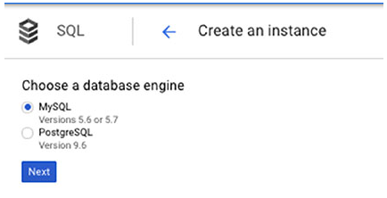

**그림 11.9** Cloud SQL은 MySQL과 PostgreSQL 인스턴스를 제공한다.

PostgreSQL을 선택하면 설정 양식이 표시된다. MySQL을 선택하면 MySQL 인스턴스의 First Generation이나 Second Generation 중 하나를 선택해야 한다. (그림 11.10) MySQL의 오래된 버전을 사용해야하지 않는다면, Second Generation 인스턴스가 추천된다. MySQL 2nd generation은 더 좋은 용량과 선택적으로 high availability 설정, MySQL 5.7 지원, 많은 경우 더 낮은 비용을 제공한다.

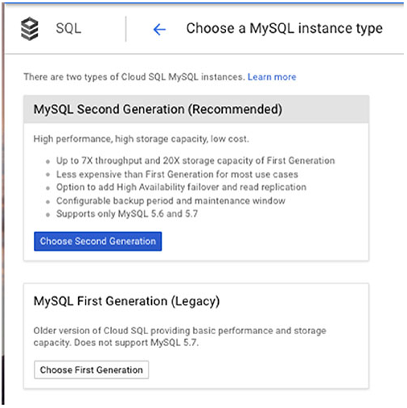

**그림 11.10** MySQL 인스턴스는 1st와 2nd generation을 사용할 수 있다.

MySQL 인스턴스를 설정하기 위해, 이름, root 패스워드, region, zone을 지정해야 한다. 설정 옵션이 다음을 포함한다.
* MySQL 버전
* Connectivity, 공인이나 사설 IP 주소를 사용할지 지정할 수 있다.
* Machine Type, 기본 값은 1 vCPU, 3.75GB 메모리를 갖는 db-n1-standard-1이다.
* Automatic backups
* Failover replicas
* Database flags. MySQL을 지정하고, read-only flag와 쿼리 캐시 사이즈를 설정하는 기능을 포함한다.
* Setting a maintenance time window
* Labels

그림 11.11은 MySQL 2nd generation을 위한 설정 양식을 보여주고, 그림 11.12는 PostgreSQL 설정 양식을 보여준다.

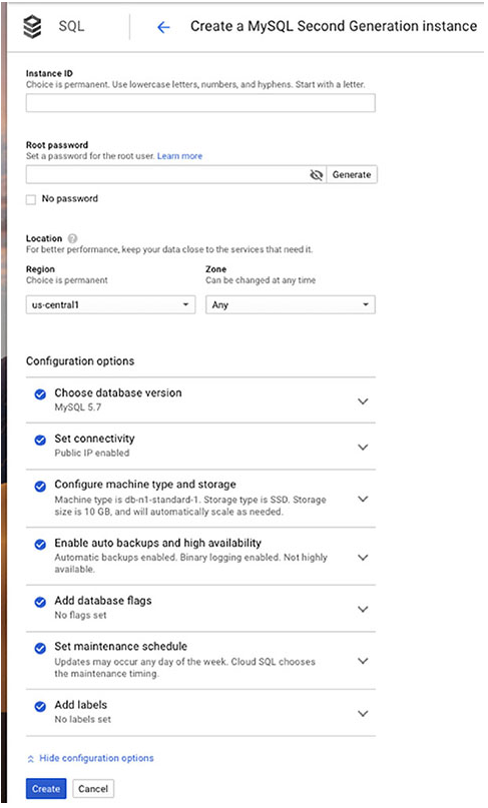

**그림 11.11** MySQL 2nd generation 인스턴스를 위한 설정 양식

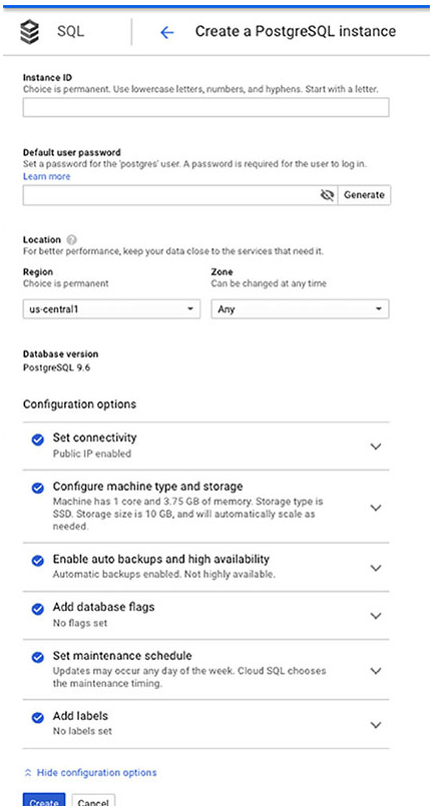

**그림 11.12** PostgreSQL 인스턴스를 위한 설정 양식

#### Cloud Spanner 설정

트랜잭션을 지원하는 글로벌, 일관된 데이터베이스를 생성해야 한다면, Cloud Spanner를 고려해야 한다. Spanner의 고급 특성을 고려할 때, Spanner의 설정은 놀랍게도 간단하다. 콘솔에서 Cloud Spanner를 열고 Create Instance를 선택하면 그림 11.13같은 양식이 표시된다.

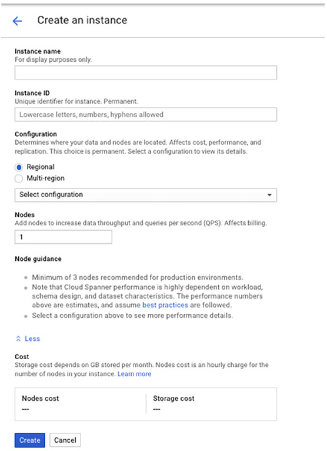

**그림 11.13** Cloud Console에서의 Cloud Spanner 설정 양식

인스턴스 이름, ID, 노드의 수를 제공해야 한다.

또한, 노드와 데이터가 위치할 장소를 결정할 regional이나 multiregional 설정 중 하나를 선택해야 한다. 이것은 비용과 replication 스토리지 위치를 결정한다. regional을 선택하면 us-west1, asis-east1, europe-north1과 같이 사용할 수 있는 region의 리스트 중에서 선택한다.

Cloud Spanner는 Cloud SQL이나 다른 데이터베이스 옵션보다 상당히 많이 비싸다는 것을 알아야 한다. us-central1에 위치한 단일 regional 노드는 시간당 $0.90이다. 반면에, nam3(북미)에 있는 단일 multiregional node는 시간당 $3이다. nam-eur-asia1(북미, 유렵, 아시아)의 단일 multiregional 노드는 시간당 $9이다.

#### BigQuery 설정

BigQuery는 스토리지와 쿼리, 통계, 머신러닝 분석 툴을 제공하는 관리형 분석 서비스이다. BigQuery는 인스턴스를 설정할 필요가 없다. 대신, 콘솔 메뉴에서 BigQuery를 열면 그림 11.14와 같은 양식을 확인할 수 있다.

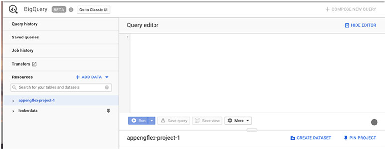

**그림 11.14** 데이터를 생성하고 쿼리하기 위한 BigQuery 사용자 인터페이스

BigQuery를 사용하기 위한 첫번째 업무는 데이터를 보유할 데이터 셋을 생성하는 것이다. Create Dataset을 클릭하면 그림 11.15처럼 양식을 확인할 수 있다.

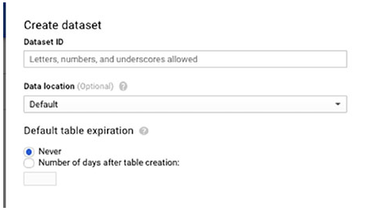

**그림 11.15** BigQuery에서 dataset을 생성하는 양식

data set을 생성할 때, 이름을 지정해야 하고, 저장할 region을 선택해야 한다. 모든 regions이 BigQuery를 지원하지 않는다. 현재 US, Europe, Asia 전체적으로 9개의 지역에서 선택해야 한다.

챕터 12에서는 BigQuery와 GCP 데이터베이스에서 데이터를 가져오고 쿼리하는 방법을 논의한다.

### NoSQL: Datastore, Cloud Firestore, Bigtable

NoSQL 데이터베이스는 관계형 모델을 사용하지 않고, 고정된 구조나 스키마를 요구하지 않는다. 데이터베이스 스키마는 어떤 종류의 속성이 저장될 수 있는지 정의한다. 고정된 스키마가 요구되지 않으면, 개발자는 다양한 레코드에 다양한 속성을 저장할 수 있다. GCP는 3가지 NoSQL 옵션을 갖고 있다.
* Cloud Datastore
* Cloud Firestore
* Cloud Bigtable

#### Datastore 기능

Datastore는 문서 데이터베이스이다. 스프레드시트나 텍스트 파일같음 문서를 저장하는데 사용된다는 의미는 아니다. 하지만, 데이터베이스의 데이터는 document라고 불리는 구조로 구성된다. Documents는 key-value 쌍의 집합으로 만들어진다. 아래는 간단한 예시이다.

~~~json
{
    book : "ACE Exam Guide",
    Chapter: 11,
    length: 20,
    topic: "storage"
}
~~~

이 예시는 이 책에서 챕터의 특성을 설명한다. 이 예시에서는 4개의 key 또는 properties가 있다: book, chapter, length, storage. 이 key-value 쌍의 집합은 Datastore에서 엔티티라고 부른다. 엔티티는 공통적인 properties를 갖지만, Datastore는 schemaless 데이터베이스여서 모든 엔티티가 동일한 properties를 요구하지 않는다. 다음은 예시이다.

~~~json
{
    book: "ACE Exam Guide",
    Chapter: 11,
    topic: "computing",
    number_of_figures: 8
}
~~~

Datastore는 관리형 데이터베이스이다. 그래서 서비스의 사용자는 서버를 관리하거나 데이터베이스 소프트웨어를 설치할 필요가 없다. Datastore는 자동적으로 데이터를 파티셔닝하고, 수요에 따라서 스케일을 업하거나 다운한다.

Datastore는 비분석적, 비관계형 스토리지 요구를 위해 사용된다. 다양한 특정이나 properties를 갖는 많은 제품 유형을 갖는 제품 카탈로그에 좋은 옵션이다. 또한, 어플리케이션에 연관된 사용자 프로필을 저장하는데 좋은 선택이다.

Datastore는 트랜잭션과 쿼리 성능을 증진시키는 인덱스를 지원하는 것 같이 관계형 데이터베이스와 공통적으로 몇몇 기능을 갖고 있다. 주요 차이점은 Datastore는 고정된 스키마나 구조를 요구하지 않고, 테이블 조인이나 sum과 count같은 computing aggregates같은 관계형 동작을 지원하지 않는다.

#### Datastore 설정

BigQuery처럼 Datastore는 노드 설정을 지정하지 않는 관리형 데이터베이스 서비스이다. 대신, 콘솔에서 데이터베이스에 엔티티를 추가할 수 있다. 그림 11.16은 Cloud Console에서 Datastore를 열었을 때 나타나는 초기 야식을 보여준다.

**그림 11.16** 데이터를 생성하고 쿼리할 수 있는 Datastore의 사용자 인터페이스

Create Entity를 선택하면 양식이 표시되고 document 데이터 구조의 데이터를 추가할 수 있다.

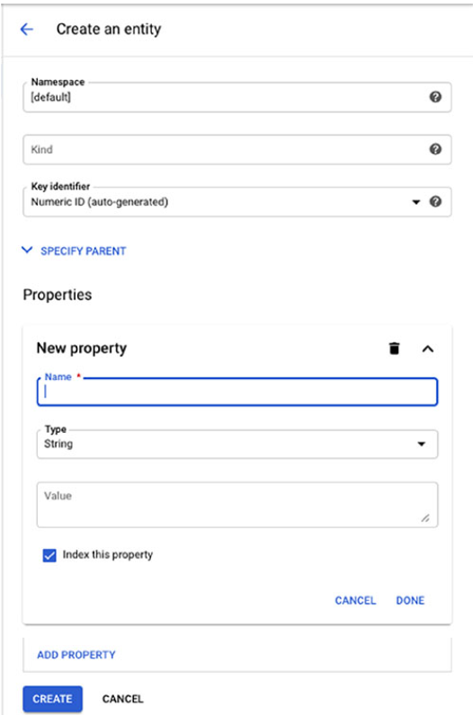

**그림 11.17** Datastore에 엔티티 추가

엔티티를 추가할 때, 관계형 데이터베이스에서 스키마 그룹 테이블같이 엔티티를 그룹화하는 방법인 namespace를 지정한다. 관계형 데이터베이스에서 테이블과 유사항 kind를 지정해야 한다. 각 인스턴스는 자동으로 생성된 숫자 key나 custom-defined key가 될 수 있는 Key가 필요하다.

다음, names, types, values를 갖는 하나 이상의 properties를 추가한다. Types은 strine, data 및 time, Boolean, array같은 다른 구조화 타입을 포함한다.

Datastore에서 데이터를 가져오고 쿼리하는 추가 상세 정보는 챕터 12에 있다.

#### Cloud Firestore 기능

Cloud Firestore는 document 데이터 모델을 사용하는 관리형 NoSQL 데이터베이스이다. Datastore와 유사하다. 실제로, Datastore 데이터베이스는 최신 Cloud Firestore 스토리지 시스템을 사용할 수 있다. Cloud Firestore의 한 가지 장점은 모바일 앱처럼 분리된 어플리케이션 간 데이터를 저장하고, 동기화하고, 쿼리하기 위해 설계되었다. 앱은 데이터가 백엔드에서 변경되었을 때 실시간에 가깝게 자동으로 업데이트될 수 있다. Cloud Firestore는 트랜잭션을 지원하고 multiregional replication을 제공한다.

#### Cloud Firestore 설정

Cloud Firestore는 인스턴스를 설정할 필요가 없는 관리형 데이터베이스 서비스이다. 그러나 데이터 스토리지 시스템을 선택해야 한다. 옵션은 Datastore를 사용하는 것, Datastore 모드로 Firestore를 사용하는 것(Datastore 스토리지 시스템을 사용한다.), 또는 native 모드에서 Firestore를 사용하는 것을 포함한다. 신규 Firestore 사용자는 native 모드의 Firestore를 사용해야 한다. (그림 11.18)

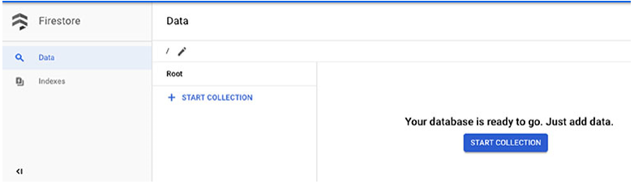

**그림 11.18** Firestore는 Datastore의 백엔드 스토리지 시스템이나 신규 native 모드 스토리지 시스템을 사용하도록 설정할 수 있다.

스토리지 시스템을 선택한 후, 데이터베이스의 위치를 선택할 수 있다. (그림 11.19)

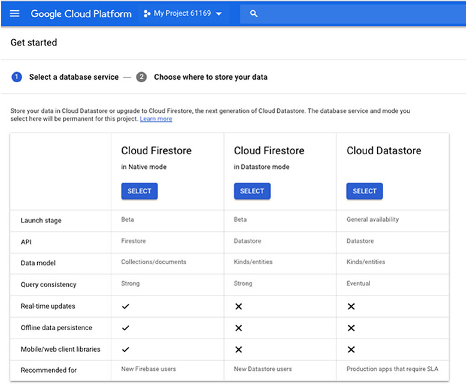

**그림 11.19** Firestore 데이터베이스의 위치를 선택

Firestore는 거의 몇분이 안돼서 데이터베이스를 생성한다. 데이터베이스가 ready 상태일 때, 그림 11.20같은 화면을 확인할 수 있다.

챕터 12에서는 Firestore에서 데이터를 가져오고 쿼리하는 것을 살펴볼 것이다.

#### Bigtable 설정

Bigtable은 또다른 NoSQL 데이터베이스이지만 Datastore와 다르다. Bigtable은 wide-column 데이터베이스이고, document 데이터베이스가 아니다. 이름에서 알 수 있듯이, Wide-column 데이터베이스는 대량의 컬럼을 갖을 수 있는 테이블을 저장한다. 모든 행이 모든 열을 사용해야 하는 것은 아니어서 Datastore와 같은 방식으로 데이터를 구성하는 고정된 스키마가 필요하지 않다.

Bigtable은 페타바이트급의 데이터베이스로 설계되었다. IoT 데이터를 저장하는 것과 같이 운영 데이터베이스와 데이터 사이언스 어플리케이션같은 분석 프로세싱은 Bigtable을 효과적으로 사용할 수 있다. 데이터베이스는 일관성, 밀리초 이하의 latency를 제공하도록 설계되었다. Bigtable은 클러스터에서 실행되고, 수평적으로 확장된다.

Bigtable은 데이터 양이 많고, 데이터 수집 속도가 빠른 어플리케이션을 위해 설계되었다. 시간 단위, IoT, 금융 어플리케이션은 이 카테고리 안에 있다.

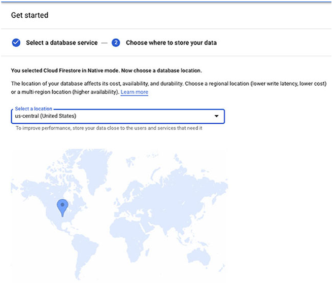

**그림 11.20** Firestore 데이터베이스가 사용되기 위한 ready 상태

#### Bigtable 설정

Cloud Console에서, Bigtable을 열고, Create Instance를 클릭한다. 그림 11.21과 같은 양식을 확인할 수 있다.

이 양식에서 인스턴스 이름과 ID를 제공해야 한다. 다음으로, 운영이나 개발 모드 중에서 선택해야 한다. 운영 클러스터는 최소 3개의 노드를 갖고, high availability를 제공한다. 개발 모드는 replication이나 high availability 없이 저비용 인스턴스를 사용한다. 또한 데이터베이스에 사용되는 persistent disk를 위해 SSD나 HDD 중 하나를 선택해야 한다.

Bigtable은 다수의 클러스터를 지원한다. 각 클러스터를 위해 클러스터 ID, region과 zone 위치, 클러스터의 노드 수를 지정해야 한다. 클러스터는 가용성 향상을 위해서 복사될 수 있다.

챕터 12에서는 Bigtable에서 데이터를 가져오고 쿼리하는 방법을 설명한다.

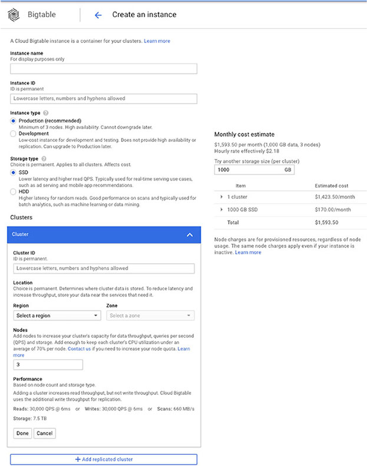

**그림 11.21** Bigtable을 위한 설정 양식

**실 사용 사례**  
**Multiple 데이터베이스의 필요**

> 헬스케어 조직과 의료시설은 환자, 치료법, 결과에 대한 넓은 범위의 데이터를 저장하고 관리한다. 환자의 의료 기록은 이름, 주소, 나이 등과 같이 개인정보를 보함한다. 또한 의료 기록은 건강상태, 치료뿐만 아니라 처방약 및 절차와 같은 진단에 대한 상세한 정보를 저장한다. 이러한 종류의 데이터는 구조화되어있다. 트랜잭션 지원과 강한 일관성이 요구된다. Cloud SQL 처럼, 관계형 데이터베이스는 이러한 종류의 어플리케이션에 좋은 솔루션이다.  
> transactional, relational 데이터베이스에 저장된 의료 데이터는 치료와 회복의 패턴을 분석하기 위해 가치가 있다. 예를 들어, 데이터 사이언티스트는 병원에 재입원에 관련된 패턴을 식별하는 데 의료 데이터를 사용한다. 그러나, transactional relational 데이터베이스는 분석을 위해 적합하지 않다. 더 좋은 옵션은 BigQuery를 사용하는 것과 데이터를 쉽게 분석할 수 있는 방식으로 데이터가 구성된 데이터 웨어하우스를 구축하는 것이다. 트랜잭션 시스템에서 데이터는 Bigtable 데이터 셋에 추출, 변환, 로드된다.

## 스토리지 솔루션 선택: 고려해야할 가이드 라인

GCP는 다양한 스토리지 솔루션을 제공한다. 클라우드 엔지니어로서, 넓은 범위의 어플리케이션을 위해 스토리지 솔루션을 기획하고 구현해야 한다. 다양한 스토리지 솔루션은 다양한 케이스에 적합하고, 많은 기업 어플리케이션에서 전체 어플리케이션의 요구사항을 지원하는 둘 이상의 스토리지 제품이 필요하다는 것을 알게될 것이다. 다음은 스토리지 솔루션을 선택할 때 유의해야할 몇가지 요소이다.

**Read and Write 패턴** 회계와 유통 어플리케이션같은 몇몇 어플리케이션은 데이터를 빈번하게 읽고 쓴다. 또한 어플리케이션에 자주 업데이트한다. 데이터가 구조화되어있다면 Cloud SQL같은 스토리지 솔루션이 가장 적합하다. 그러나 관계형 read/write 동작을 지원하는 글로벌 데이터베이스가 필요하다면, Cloud Spanner가 더 좋은 선택이다. 지속적으로 높은 속도와 대량의 데이터를 쓴다면, Bigtable을 고려해라. 파일을 쓰고 파일의 전체를 다운로드 한다면 Cloud Storage가 좋은 옵션이다. 

**Consistency(일관성)** 일관성은 데이터베이스에서 데이터를 읽는 사용자가 요청을 응답하는 클러스터의 서버와 상관없이 같은 데이터를 얻는 것을 보장한다. 항상 최신 데이터를 읽는 강한 일관성이 필요하다면, Cloud SQL과 Cloud Spanner가 좋은 옵션이다. Datastore는 강한 일관성을 설정할 수 있지만, IO동작이 일관성 설정이 낮게 사용되는 경우보다 더 오래 걸린다. Datastore는 데이터가 구조화되어있지 않는 경우 좋은 옵션이다. 그렇지 않으면, 관계형 데이터베이스 중 하나를 고려해야 한다. NoSQL 데이터베이스는 일부 replicas가 짧은 시간동안 동기화되지 않을 수도 있는 최소한의 일관성을 제공한다. 이 기간동안 오래된 데이터를 읽을 수 있다. 어플리케이션이 이런 경우에도 괜찮다면, 덜 엄격한 일관성 요구사항이 더 빠른 read/write 동작을 가져올 수 있다.

**트랜잭션 지원** 어플리케이션에서 최소단위의 트랜잭션을 수행해야 한다면, 트랜잭션을 지원하는 데이터베이스를 사용해야 한다. 어플리케이션에서 지원하는 트랜잭션을 구현할수도 있다. 하지만, 코드는 개발과 유지보수하기 어렵다. 관계형 데이터베이스, Cloud SQL, Cloud Spanner, Datastore는 트랜잭션 지원을 제공한다.

**비용** 특정 스토리지 시스템을 사용하는 것의 비용은 저장된 데이터의 양, 조회하거나 스캔하는 데이터의 양, 스토리지 시스템의 단위단 요금에 따라 다르다. VM을 프로비저닝하는 스토리지 서비스를 사용한다면, VM 프로비저닝 비용도 고려해야 한다.

**Latency(지연시간)** Latency는 데이터베이스에 데이터 row를 읽는 요청같은 동작의 시작부터 완료되기 까지의 시간이다. Bigtable은 밀리초 미만의 동작을 일관되게 제공한다. Spanner는 Letency가 더 길수 있지만, 글로벌로 일관되고 확장 가능한 데이터베이스가 제공된다.

일번작으로, 데이터 저장소를 선택하는 것은 절충안을 만드는 것이다. 이상적으로, 저비용, 글로벌 확장, 저지연, 강한 일관성 데이터베이스를 갖을 수 있다. 하지만 이상적이지 않다. 위의 특성 중 하나를 포기해야 한다.

다음 챕터에서는, 여기서 설명한 스토리지 솔루션의 사용 방법을 데이터 로드와 쿼리 중점으로 배울 것이다. 

## Summary

클라우드 스토리지를 기획할 때, 스토리지 시스템의 유형과 데이터 모델의 유형을 고려해야 한다. 스토리지 시스템은 하드웨어와 데이터를 저장하기 위해 사용되는 기본적인 조직 구조를 제공한다. 데이터 모델은 어떻게 데이터가 데이터베이스에 저장되고 쿼리되는지 결정하는 논리적 구조로 데이터를 구성한다. 

GCP에서 사용할 수 있는 주요 스토리지 시스템은 관리형 캐시 서비스인 Memorystore, Compute Engine과 Kubernetes Engine의 VM에 네트워크로 접근이 가능한 디스크인 persistent disk가 있다. Cloud Storage는 GCP의 Object 스토리지 시스템이다.

주요 데이터 모델은 object, relational, NoSQL이다. GCP에서 NoSQL 데이터베이스는 document와 wide-column 데이터베이스로 더 세분화된다. Cloud Storage는 object 데이터모델을 사용한다. Cloud SQL과 Cloud Spanner는 트랜잭션 처리 어플리케이션을 위한 관계형 데이터베이스를 사용한다. BigQuery는 데이터 웨어하우스와 분석 어플리케이션을 위한 relational 모델을 사용한다. Datastore와 Firestore는 document 데이터베이스이다. Bigtable은 wide-column 테이블이다.

데이터 스토리지 시스템을 선택할 때, read/write 패턴, 일관성 요구사항, 트랜잭션 지원, 비용, latency를 고려해야 한다.

## 시험 요소

**캐시, persistent 디스크, objeect 스토리지를 포함한 주요 스토리지 시스템 유형을 알아야 한다.** 캐시는 디스크의 데이터베이스로부터 읽는 필요를 줄여 어플리케이션의 성능을 향상시키는데 사용된다. 캐시는 사용할 수 있는 메모리의 양이 제한된다. Persistent disk는 VM에 연결되는 네트워크 디바이스이다. Persistent disk는 read-only 모드로 다수의 VM에 연결될 수 있다. Object 스토리지는 공유된 접근과 장기간 스토리지에 파일을 저장하는데 사용된다.

**주요 데이터 모델을 알아야한다.** 관계형 데이터베이스는 트랜잭션 지원과 강한 일관성을 요구하는 트랜잭션 프로세싱 시스템에 사용된다. Cloud SQL과 Cloud Spanner는 트랜잭션 프로세싱 시스템에 사용되는 관계형 데이터베이스이다. BigQuery는 관계형 모델을 사용하지만 데이터 웨어하우스와 분석을 위해 설계되었다. object 모델은 파일 시스템 모델의 대안이다. 파일로 저장되는 Object는 최소 단위로 취급된다. NoSQL 데이터 모델은 document 데이터 모델과 wide-column 모델을 포함한다. Datastore와 Firestore는 document 모델 데이터베이스이다. Bigtable은 wide-column 데이터베이스이다.

**Cloud Storage의 4가지 스토리지 클래스를 알아야 한다** Regional, multiregional, nearline, coldline은 4가지 스토리지 클래스이다. Multiregional 클래스는 regions에 걸쳐서 데이터를 복제한다. regional 스토리지는 zone에 걸쳐서 데이터를 복제한다. Nearline은 한 달에 한 번 미만으로 빈번하지 않은 접근을 위해 설계되었다. Coldline 스토리지는 일 년에 한 번 미만으로 접근되는 파일을 보관하는 스토리지를 위해 설계되었다. nearline과 coldline 스토리지는 모두 데이터 크기에 따른 비용 이외에 검색 요금이 발생한다.

**클라우드 어플리케이션이 데이터 저장소 중 하나 이상을 필요할 수도 있다는 것을 알아야 한다.** 예를 들어, 어플리케이션이 Cloud SQL의 데이터를 쿼리할 때, 데이터 파일의 장기간 저장을 위한 object 스토리지, latency를 줄이기 위해 캐시와 데이터 웨어하우스와 분석을 위해 BigQuery를 필요로 할 수 있다.

**Cloud Storage 버킷에 lifecycle 설정을 적용할 수 있다는 것을 알아야 한다.** Lifecycle은 파일을 삭제하고 스토리지 클래스를 변경하는데 사용된다. Regional과 Multiregional 클래스는 nearline이나 coldline으로 변경될 수 있다. Nearline 스토리지는 coldline으로 변경될 수 있다. Regional 클래스 스토리지는 Multiregional 로 변경될 수 없고, Multiregional은 regional로 변경될 수 없다.

**요구사항의 가장 좋은 옵션을 결정하는데 도움을 주는 데이터 저장소의 특성을 알아야 한다.** read/write 패턴, 일관성, 트랜잭션 지원, 비용, latency가 요소이다.

[맨 위로](#chapter-11-%ed%81%b4%eb%9d%bc%ec%9a%b0%eb%93%9c%ec%97%90%ec%84%9c-storage-%ea%b8%b0%ed%9a%8d)