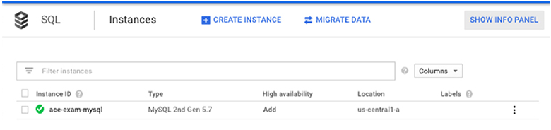
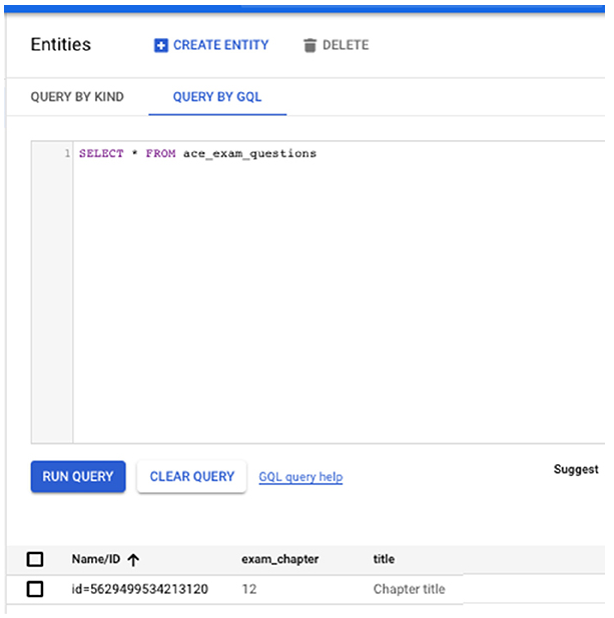
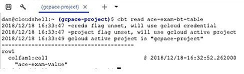

# Chapter 12 GCP에서 스토리지 배포

**이 챕터는 구글 Associate Cloud Engineer 인증 시험 과목 중, 아래 내용을 다룬다.**
* 3.4 데이터 솔루션 배포 및 구현
* 4.4 데이터 솔루션 관리

이 챕터에서는 Cloud SQL, Cloud Datastore, BigQuery, Bigtable, Cloud Spanner, Cloud Pub/Sub, Cloud Dataproc, Cloud Storage를 포함하여 GCP 제품 중, 데이터 스토리지 시스템을 생성하는 방법을 논한다. 데이터베이스, 버킷, 다른 기본 데이터 구조를 생성하는 방법뿐만 아니라 데이터 백업과 job의 상태 체크와 같은 핵심 관리 업무를 수행하는 방법에 대해서 배울 것이다.

## Cloud SQL 배포 및 관리

Cloud SQL은 관리형 relational 데이터베이스 서비스이다. 이 섹션에서는 아래 내용의 수행하는 방법을 배울 것이다.
* 데이터베이스 인스턴스 생성
* 인스턴스 연결
* 데이터베이스 생성
* 데이터베이스에서 데이터 로드
* 데이터베이스 쿼리
* 데이터베이스 백업

이 섹션에서는 MySQL 인스턴스를 사용할 것이지만, PostgreSQL도 절차가 유사하다.

### MySQL 인스턴스 생성 및 연결

챕터 11에서 MySQL 인스턴스를 생성하고 설정하는 방법을 설명했지만, 여기서 다시 확인한다.

콘솔에서 SQL을 열고, Create Instance를 클릭하다. MySQL을 선택하고 Second Generation Instance 타입을 선택한다. 그림 12.1과 같은 양식을 확인할 수 있다.


**그림 12.1** MySQL 인스턴스 생성

몇 분 후, 인스턴스가 생성된다. MySQL 인스턴스 리스트는 그림 12.2와 유사하다.



**그림 12.2** MySQL 인스턴스 리스트

데이터베이스가 생성된 후, Cloud Shell을 시작하고 `gcloud sql connect` 명령을 사용하여 연겷할 수 있다. 이 명령은 연결할 인스턴스 이름과 선택적으로 username과 패스워드를 사용한다. 커맨드라인에서 패스워드를 지정하지 않는 것이 좋은 방법이다. 그 대신에, 입력하라는 메시지가 표시되고, 입력할 때는 화면에 표시되지 않는다. IP주소 허용에 대한 메시지를 확인할 수도 있다; 이는 보안 조치이며, Cloud Shell에서 인스턴스에 연결할 수 이따.

`ace-exam-mysql`을 인스턴스에 연결하기 위해, 아래 명령을 사용한다.

~~~bash
gcloud sql connect ace-exam-mysql -user=root
~~~

MySQL 인스턴스에 대한 커맨드라인 프롬프트가 열린다. (그림 12.3)


**그림 12.3** `gcloud sql connect`를 사용하여 연결한 후에 MySQL 작업을 위한 커맨드라인 프롬프트

### 데이터베이스 생성, 데이터 로딩 및 쿼리

MySQL 커맨드라인 환경에서, `gcloud` 명령이 아닌 MySQL 명령을 사용한다. MySQL은 standard SQL을 사용한다. 그래서 데이터베이스를 생성하는 명령은 `CREATE DATABASE`이다. `USE`명령을 사용하여 작업할 데이터베이스를 선택한다. (단일 인스턴에스 많이 있을 수 있다.) 예를 들어, 데이터베이스를 생성하고, 작업할 기본 데이터베이스를 설정하기 위해 다음을 사용한다.

~~~sql
CREATE DATABASE ace_exam_book;
USE ace_exam_book
~~~

`CREATE TABLE`을 사용하여 테이블을 생성할 수 있다. 데이터는 `INSERT` 명령을 사용하여 삽입된다. 예를 들어, 다음 명령은 `books`이라는 테이블을 생성하고 2개의 row를 삽입한다.

~~~sql
CREATE TABLE books (title VARCHAR(255), num_chapters INT, entity_id INT NOT NULL \AUTO_INCREMENT, PRIMARY KEY (entity_id));
INSERT INTO books (title, num_chapters) VALUES ('ACE Exam Study Guide', 18);
INSERT INTO books (title, num_chapters) VALUES ('Architecture Exam Study Guide', 18);
~~~

테이블에 쿼리하기 위해, `SELECT` 명령을 사용한다.

~~~sql
SELECT * from books;
~~~

이는 테이블의 모든 row를 조회한다. (그림 12.4)


**그림 12.4** MySQL의 테이블 컨텐츠 조회

### Cloud SQL에서 MySQL 백업

Cloud SQL은 on-demand와 automatic backups 모두 적용할 수 있다.

on-demand 백업을 생성하기 위해 콘솔의 Instances 페이지에서 인스턴스의 이름을 클릭한다. 그림 12.5처럼 Instance Details 페이지가 표시된다.


**그림 12.5** MySQL Instance Detail 페이지

Backups 탭을 클릭하면 Create Backup 옵션이 표시된다. (그림 12.6)


**그림 12.6** Create Backup을 클릭하는데 사용되는 양식

Create Backup을 클릭하면 그림 12.7과 같은 양식이 열린다.


**그림 12.7** 백업에 설명을 지정하고 생성한다.

선택적으로 description을 채우고, Create를 클릭한다. 백업이 완료되면, 그림 12.8처럼 백업 리스트가 표시된다.


**그림 12.8** 인스턴스를 위해 사용할 수 있는 백업 리스트

또한 `gcloud sql backups` 명령을 사용하여 백업을 생성할 수 있다.

~~~bash
gcloud sql backups create --async --instance [INSTANCE_NAME]
~~~

여기에서 *[INSTANCE_NAME]*은 ace-exam-mysql같은 이름이고 --async 파라미터는 optional이다.

`ace-exam-mysql` 인스턴스를 위한 on-demand 백업을 생성하기 위해서 다음 명령을 사용한다.

~~~bash
gcloud sql backups create --async --instance ace-exam-mysql
~~~

또한 Cloud SQL이 자동적으로 백업을 생성하도록 할 수도 있다.

콘솔에서, Cloud SQL Instance 페이지를 열고 인스턴스의 이름을 클릭한 다음, Edit Instance를 클릭한다. Enabled Auto Backups 섹션을 열고, 백업을 생성시기에 대한 정보를 채운다. (그림 12.9) 자동 백업이 발생하는 시간 범위를 지정해야 한다. 또한, 특정 시점 복구와 같은 고급 기능에 필요한 바이너리 로깅을 활성화할 수 있다. 

커맨드라인에서 자동 백업을 활성화하기 위해, `gcloud` 명령을 사용한다.

~~~bash
gcloud sql instances patch [INSTANCE_NAME] -backup-start-time [HH:MM]
~~~

이 예시 인스턴스에서, 1:00am에 자동 백업을 실행할 수 있다.

```bash
gcloud sql instance patch ace-exam-mysql -backup-start-time 01:00
```


**그림 12.8** Cloud Console에서 자동 백업 활성화

## Datastore 배포 및 관리

챕터 11은 Datastore document 데이터베이스를 초기화하는 방법을 설명했다. 이제 엔티티를 생성하고 document 데이터베이스에 properties를 추가하는 방법을 확인할 것이다. 또한 백업과 복구 동작을 확인할 것이다.

### Datastore 데이터베이스에 데이터 추가

콘솔의 Datastore 섹션에서 Entities 옵션을 사용하여 Datastore 데이터베이스에 데이터를 추가한다. Entities 데이터 구조는 관계형 데이터베이스의 스키마와 유사하다.

Create Entity를 클릭하고, 나타나는 양식을 채워서 엔티티를 생성한다. 관계형 데이터베이스에서 테이블과 유사한 Kind와 Properties를 채워야 한다. (그림 12.10)


**그림 12.10** Datastore 엔티티에 데이터 추가

엔티티를 생성한 후, SQL과 유사한 쿼리인 GQL을 사용하여 document 데이터베이스에 쿼리할 수 있다. 그림 12.11은 `SELECT` 명령을 사용한 예시 쿼리를 보여준다.



**그림 12.11** SQL과 유사한 쿼리인 GQL을 사용하여 데이터 저장소에 쿼리

### Datastore 백업

Datastore 데이터베이스를 백업하기 위해, 백업 파일을 저장하는 Cloud Storage 버킷을 생성해야 하고, 백업을 수행하는 사용자에게 적절한 권한을 부여해야 한다.

`gsutil` 명령을 사용하여 백업을 위한 버킷을 생성할 수 있다.

```bash
gsutil mb gs://[BUCKET_NAME]/
```

여기서, [BUCKET_NAME]은 `ace_exam_backups`과 같은 이름이다. 예시에서는 `ace_exam_backups`을 사용하고, 다음을 사용하여 버킷을 생성한다.

```bash
gsutil mb gs://ace_exam_backups/
```

백업을 생성한 사용자는 `datastore.databases.export` 권한이 필요하다. 데이터가 인입되는 경우, `datastore.databases.import`가 필요하다. Cloud Datastore Import Export Admin role은 두 권한을 갖는다; 사용자에게 roles을 지정하는 상세 정보는 챕터 17을 확인한다.

Cloud Datastore Import Export Admin role을 갖는 사용자는 다음 명령을 사용하여 백업을 만든다.

```bash
gcloud -namespaces='[NAMESPACE]' gs://[BUCKET_NAME]
```

이 예시에서 백업을 생성하는 명령은 다음과 같다.

```bash
gcloud datastore export -namespaces='(default)' gs://ace-exam-backups
```

백업 파일을 추가하기 위해, `gcloud datastore import` 명령을 사용한다.

```bash
gcloud datastore import gs://[BUCKET]/[PATH]/[FILE].overall_export_metadata
```

이 예시에서는 아래와 같이 사용할 수 있다.

```bash
gcloud datastore import gs://ace_exam_backups/[FILE].overall_export_metadata
```

여기에서, [FILE]은 추출 프로세스에 의해서 지정된 파일이름이다.

## BigQuery 배포 및 관리

BigQuery는 fully 관리형 데이터베이스 서비스이다. 그래서 구글은 백업을 관리하고 다른 기본적인 관리 업무를 수행한다. 클라우드 엔지니어로서, BigQuery로 작업할 때, 몇 가지 관리 업무가 남아있다. 이 업무중 2가지는 쿼리의 비용 측정과 job의 상태를 확인하는 것이다.

### BigQuery에서 쿼리의 비용 측정

콘솔의 메인 메뉴에서 BigQuery를 선택하면 BigQuery 쿼리 인터페이스가 표시된다. (그림 12.12)


**그림 12.12** BigQuery 사용자 인터페이스. 이 것은 신규 인터베이스의 베타 버전이다. 이전 버전은 다르게 보인다.

이 양식에서 `use_1910_2013` 테이블에서 이름과 성에 대해 쿼리하는 것 같이 Query Editor에서 쿼리를 입력할 수 있다. (그림 12.13)


**그림 12.13** 예상 데이터 양이 스캔된 예시 쿼리

오른쪽 아래에, BigQuerysms 얼마나 많은 데이터가 스캔될지 측정 값을 제공한다. 또한, 커맨드 라인에서 `bq` 명령에 `--dry-run` 옵션을 함께 사용하여 이 측정을 얻을 수 있다.

```bash
bq --location=[LOCATION] query --use_legacy_sql=false --dry-run [SQL_QUERY]
```

여기에서 *[LOCATION]*은 쿼리할 데이터 셋이 생성된 위치이고, *[SQL_QUERY]*는 측정할 SQL 쿼리이다.

이 수치를 Pricing Calculator를 사용하여 비용을 추정할 수 있다. Pricing Calculator는 [https://cloud.google.com/products/calculator](https://cloud.google.com/products/calculator)에서 사용할 수 있다. BigQuery를 선택한 후, On-Demand 탭을 열고, 쿼리할 테이블의 이름을 입력하고, 스토리지 양을 0으로 설정한 다음 Queries Pricing 섹션의 Queries 라인에 쿼리의 사이즈를 입력한다. BigQuery 콘솔에서 표시된 것과 동일한 크기 단위를 사용해야 한다. 예시에서, 측정 단위는 메가바이트이다. Add To Estimate를 클릭하면 Pricing Calculator에 비용이 표시될 것이다.(그림 12.14)

### BigQuery의 Jobs 확인

BugQuery에서 Jobs은 데이터 로드, 추출, 복사, 쿼리에 사용되는 프로세스이다. Jobs은 이러한 동작을 시작할 때 자동적으로 생성된다.

Jobs의 상태를 확인하기 위해 BigQuery 콘솔을 열고, 왼쪽 메뉴에서 Job History를 클릭한다. jobs의 리스트와 상태가 표시될 것이다. 그림 12.15에서, 리스트의 상위 job은 green bar이다. 이는 성공적으로완료된 job을 가리킨다. 이것은 job 항목의 확장된 보기의 예시이다. 아래에 실패된 job의 한줄 요약이 있다. 실패는 job 설명 옆에 빨간 아이콘으로 표시된다.


**그림 12.14** Pricing Calculator를 사용하여 쿼리의 비용을 추정한다.


**그림 12.15** BigQuery에서 job 상태 리스트

`bq show` 명령을 사용하여 BigQuery job의 상태를 확인할 수 있다. 예를 들어, 그림 12.15처럼 성공적으로 추출 job의 결과를 확인하기 위해서 아래 명령을 사용할 수 있다.

```bash
bq --location=US show -j gcpace-project:US.bquijob_119adae7_167c373d5c3
```

## Cloud Spanner 배포 및 관리

이제, 글로벌 관계형 데이터베이스인 Cloud Spanner를 살펴본다. 이 섹션에서는 데이터베이스를 생성하고, 스키마를 정의하고, 일부 데이터를 삽입한 다음 데이터를 쿼리할 것이다.

처음, Cloud Spanner 인스턴스를 생성할 것이다. 콘솔에서 Cloud Spanner를 열고, Create Instance를 선택한다. 그림 12.16과 같은 양식이 표시된다.


**그림 12.16** Cloud Spanner 인스턴스 생성

다음, 인스턴스에서 데이터베이스를 생성해야 한다. Instance Detail 페이지의 위에 Create Database를 선택한다. (그림 12.17)


**그림 12.17** Cloud Spanner 인스턴스 내에 데이터베이스 생성

데이터베이스를 생성할 때, 테이블의 구조를 정의하는 SQL Data Definition Language(DDL)을 사용해야 한다. SQL DDL은 테이블, 인덱스, 다른 데이터 구조를 생성하기 위한 SQL 명령의 집합이다.(테이블 12.1) 그림 12.18의 예시에서는 Cloud Spanner Quickstart에서 구글에 의해 제공되는 Singer 테이블 정의를 사용한다. ([https://cloud.google.com/spanner/docs/quickstart-console](https://cloud.google.com/spanner/docs/quickstart-console))

**테이블 12.1** SQL 데이터 정의 명령

| Command | Description|
|---|---|
| `CREATE TABLE` | 열과 데이터 형식이 지정된 테이블을 생성한다. |
| `CREATE INDEX` | 지정된 열에 인덱스를 생성 |
| `ALTER TABLE` | 테이블 구조 변경 |
| `DROP TABLE` | 데이터베이스 스키마에서 테이블 삭제 |
| `DROP INDEX` | 데이터베이스 스키마에서 인덱스 삭제 |

`CREATE TABLE` 명령을 실행한 후, 그림 12.19같은 테이블 구조의 리스트를 확인할 수 있다.


**그림 12.18** 데이터베이스 내에 테이블 생성


**그림 12.19** 테이블의 테이블 열 리스트

테이블에 데이터를 추가하기 위해 Table Details 페이지에서 Data 테이블을 선택한다. (그림 12.20)


**그림 12.20** Data 탭을 선택하여 테이블에 데이터를 삽입한다.

roq을 추가할 때, 그림 12.21과 같은 형식으로 표의 열을 보여준다. 이 예시에서, 열은 SingerID, BirthData, FirstName, LastName, SingerInfo이다.


**그림 12.21** 테이블에 입력되는 데이터

마지막으로, Table Datails 페이지에서 쿼리를 선택하여 쿼리를 실행할 수 있다. (그림 12.22)


**그림 12.24** 토픽 이름 지정

첫번째 토픽을 생성한 후에 Topic 페이지에서 토릭의 리스트를 확인할 수 있다. (그림 12.25)


**그림 12.25** 토픽 리스트

토픽에 구독을 생성하기 위해, 토픽 리스트의 끝에 3개 점 아이콘을 클릭한다. New Subscription 옵션을 포함하는 메뉴가 표시된다. (그림 12.26) New Subscription을 클릭하여 토픽의 구독을 생성한다. 그림 12.27과 같은 양식이 표시될 것이다.


**그림 12.26** 토픽에 구독을 생성


**그림 12.27** 구독을 생성하기 위한 양식

구독을 생성하기 위해, 구독 이름과 전송 타입을 지정한다. 구독은 어플리케이션이 토픽을 읽는 *pulled*가 될 수 있거나 엔드포인트에 메시지를 작성하는 구독인 *pushed*가 될 수 있다. push 구독을 원한다면, 메시지를 수신할 엔드포인트의 URL을 지정해야 한다.

메시지가 읽어지면, 메시지를 읽어야 하는 어플리케이션을 메시지를 수신을 확인한다. Pub/Sub은 Acknowledgement Deadline 파라미터로 지정된 시간동안 기다린다. 대기 시간은 10에서 600초의 범위이다.

또한, 전달할 수 없을 때 메시지를 유지하는 시간인 보유 기간을 지정할 수 있다. 보유 기간이 전달된 후, 메시지는 토픽에서 삭제된다.

구독 생성을 완료하면, 그림 12.28같은 구독 리스트를 확인할 수 있다.


**그림 12.28** 구독 리스트

콘솔을 사용하는 것 이외에도, 토픽과 구독을 생성하는 `gcloud` 명령을 사용할 수 있다. 토픽과 구독을 생성하는 명령은 다음과 같다.

```bash
gcloud pubsub topics create [TOPIC-NAME]
gcloud pubsub subscriptions create [SUBSCRIPTION_NAME] --topic [TOPIC-NAME]
```

## Cloud Bigtable 배포 및 관리

클라우드 엔지니어로서, Bigtable 클러스터나 Bigtable 서비스를 실행하는 서버의 집합을 생성할 뿐만 아니라, 테이블 생성, 데이터 추가, 데이터로 쿼리를 해야 한다.

Bigtable 인스턴스를 생성하기 위해, Bigtable 콘솔을 열고 Create instance를 클릭한다. 그림 12.29와 같은 양식이 표시된다. (Bigtable 인스턴스를 생성하는 추가 상세 정보는 챕터 11을 확인한다.)


**그림 12.29** Bigtable 인스턴스 생성

Bigtable로 해야할 많은 작업은 커맨드라인에서 수행한다.

테이블을 생성하기 위해, 브라우저에서 Cloud Shell을 열고, `cbt` 명령을 설치한다. 관계형 데이터베이스와 다르게, Bigtable은 NoSQL 데이터베이스이고 SQL 명령을 사용하지 않는다. 대신, `cbt` 명령은 테이블 생성, 데이터 삽입, 테이블 쿼리를 위한 서브명령은 갖고있다. (테이블 12.2)

**테이블 12.2** `cbt` 명령

| Command | Description |
| --- | --- |
| `createtable` | 테이블 생성 |
| `createfamily` | column family 생성 |
| `read` | Reads and displays row |
| `ls` | Lists tables and columns |

Cloud Shell에서 `cbt` 설정을 위해, 이런 명령을 입력한다.

```bash
gcloud components update
gcloud components install cbt
```

Bigtable은 `instance`라는 환경변수를 홈 디렉토리에 보관된 `.cbtrc`라는 `.cbt` 설정 파일을 포함하여 설정해야 한다.

예를 들어, `ace-exam-bigtable` 인스턴스를 설정하기 위해, 커맨드라인 프롬프트에서 이 명령을 입력한다.

```bash
echo instance = ace-exam-bigtable >> ~/.cbtrc
```

`cbt` 명령은 인스턴스에서 동작할 것이다. 테이블을 생성하기 위해, 다음과 같은 명령을 실행한다.

```bash
cbt createtable ace-exam-bt-table
```

`ls` 명령은 테이블을 조회한다.

```bash
cbt ls
```

모든 테이블의 리스트가 표시될 것이다. 테이블은 column을 포함하지만 Bigtable은 column families의 개념을 갖고 있다. `colfam`이라는 column family를 생성하기 위해, 다음 명령을 사용한다.

```bssh
cbt createfamily ace-exam-bt-table colfm1
```

`row1`이라는 row에 `colfam1` column이 있는 셀 값을 설정하기 위해, 다음 명령을 사용한다.

```bash
cbt set ace-exam-bt-table row1 colfam1:col1=ace-exam-value
```

테이블의 컨텐츠를 확인하기 위해 `read` 명령을 사용한다.

```bash
cbt read ace-exam-bt-table
```

`read`명령은 그림 12.30과 같은 output이 생성된다.



**그림 12.30** `cbt read` 명령을 사용하여 테이블 컨텐츠 조회

## Cloud Dataproc 배포 및 관리

Cloud Dataproc은 구글의 관리형 Apache Spark와 Apache Hadoop 서비스이다. Spark와 Hadoop은 모두 "big data" 어플리케이션을 위해 설계되었다. Spark는 분석과 머신러닝을 지원한다. 반면에 Hadoop은 배치, 빅데이터 어플리케이션에 적합하다. 클라우드 엔지니어로서, Dataproc 클러스터 생성과 클러스터에서 실행할 job 생성과 친숙해야 한다.

클러스터를 생성하기 위해 Cloud Console에서 Dataproc을 연다. (그림 12.31)


**그림 12.31** Dataproc 콘솔 페이지

Create Cluster 양식을 채워서 Dataproc 클러스터를 생성한다. 클러스터의 이름과 region, zone을 지정해야 한다. 또한 single node, standard, high availability를 할 수 있는 클러스터 모드를 지정해야 한다. Single node는 개발에서 유용하다. Standard는 오직 하나의 마스터노드를 갖는다. 그래서 장애가 발생하면 클러스터는 접근할 수 없다. high availability 모드는 3개의 마스터를 사용한다.

또한 마스터 노드와 워커 노드를 위해 머신 설정 정보를 지정해야 한다. CPU, 메모리, 디스크 정보를 지정한다. 클러스터 모드는 마스터노드의 수를 결정하지만, 워커노드의 수는 선택할 수 있다. 고급 옵션의 리스트를 확장하면, Preemptible VM을 사용한다고 선택하거나 실행할 Preemptible VM의 수를 지정할 수 있다. (그림 12.32)


**그림 12.32** Dataproc 클러스터 생성

클러스터를 생성한 후, 클러스터의 리스트를 확인할 수 있다. (그림 12.33)


**그림 12.33** Dataproc 클러스터 리스트

클러스터가 실행 중이면, 그럼 12.34처럼 Jobs을 사용하여 jobs을 적용할 수 있다.


**그림 12.34** Cluster Details 페이지에서 Job을 적용

job을 실행할 클러스터와 Spark, PySpark, SparkR, Hive, Spark SQL, Pig, Hadoop 중에서 job의 타입을 지정해야 한다. JAR 파일은 실행될 Java 프로그램이고, Main Class나 JAR은 job을 실행할 때 호출되어야하는 함수나 메소드의 이름이다. PySpark를 선택하면, Python 프로그램을 적용한다. SparkR을 적용하면 R 프로그램일 적용한다. Hive나 SparkSQL이 실행할 때, 쿼리 파일을 제출해야 한다. 선택적으로 arguments를 전달할 수 있다. job이 실행 중이면, job 리스트 페이지에서 확인할 수 있다. (그림 12.35)


**그림 12.35** job의 리스트

리스트에서 Jobs ID를 더블클릭하면 job 로그의 상세 정보를 확인할 수 있다. (그림 12.36)


**그림 12.36** 실행 중인 job의 상세 로깅

콘솔을 사용하는 것 이외에도, `gcloud dataproc clusters` 명령을 사용하여 클러스터를 생성할 수 있다.

```bash
gcloud dataproc clusters create cluster-bc3d --zone us-west2-a
```

이 것은 us-west2-a zone에서 기본적인 클러스터를 생성한다. 또한, 머신 타입, 디스크 설정, 다른 클러스터 특성을 위한 추가 파라미터를 지정할 수 있다.

`gcloud dataproc jobs` 명령을 사용하여 커맨드라인에서 job을 적용한다.

```bash
gcloud dataproc jobs submit spark --cluster cluster-bc3d --jar ace_exam_jar.jar
```

cluster-bc3d 클러스터에서 ace_exam_jar.jar 프로그램을 실행하는 job을 적용한다.

## Cloud Storage 관리

챕터 11에서, 버킷의 스토리지 클래스를 자동적으로 변경하는 lifecycle 관리 정책을 사용하는 방법에 대해 확인했다. 예를 들어, 90일 후에 retional 스토리지 클래스 버킷에서 nearline 버킷으로 변경하는 정책을 생성할 수 있다. 그러나 버킷의 스토리지 클래스를 수동으로 변경하려는 경우가 있다. 그런 경우에, `gsutil rewrite` 명령을 사용하고, `-s` 플래그를 지정할 수 있다.

```bash
gsutil rewrite -s [STORAGE_CLASS] gs://[PATH_TO_OBJECT]
```

여기에서, [STORAGE_CLASS]는 신규 스토리지 클래스이다. `multi_regional`, `regional`, `nearline`, `coldline`이 될 수 있다.

**Notice**

> 콘솔에서 버킷의 스토리지 클래스를 변경할수 없다.

Cloud Storage의 또다른 공통 업무는 버킷같에 object를 이동하는 것이다. `gsutil mv`명령을 사용하여 이를 수행할 수 있다. 명령어의 형태는 다음과 같다.

```bash
gsutil mv gs://[SOURCE_BUCKET_NAME]/[SOURCE_OBJECT_NAME] \ gs://[DESTINATION_BUCKET_NAME]/[DESTINATION_OBJECT_NAME]
```

여기에서, [SOURCE_BUCKET_NAME]과 [SOURCE_OBJCET_NAME]은 기존 버킷 이름과 파일 이름이고, [DESTINATION_BUCKET_NAME]과 [DESTINATION_OBJECT_NAME]은 타겟 버킷과 파일 이름이다. 

또한 `move` 명령은 리녹스에서 `mv` 명령과 유사하게, object의 이름을 재지정하는데 사용된다. Cloud Storage의 object를 위해 다음 명령을 사용할 수 있다.

```bash
gsutil mv gs://[BUCKET_NAME]/[OLD_BUCKET_NAME] gs://[BUCKET_NAME]/[NEW_OOBJECT_NAME]
```

또한, 버킷에서 object를 이동하고 이름을 재지정하기 위해 콘솔을 사용할 수 있다. 콘솔의 Cloud Storage 섹션을 열고 버킷을 연다.(그림 12.37) object 설명 끝에 3개의 점 아이콘을 클릭한다. 이름 재지정과 이동을 포함한 동작의 리스트가 표시된다.


**그림 12.37** 콘솔에서 object를 이동하고 이름을 재지정

## Summary

이 챕터에서 Cloud SQL, Cloud Datastore, BigQuery, Bigtable, Cloud Spanner, Cloud Pub/Sub, Cloud Dataproc, Cloud Storage를 포함하여 다양한 GCP 서비스의 기본적인 배포와 관리 업무를 수행하는 방법을 배웠다. 콘솔과 커맨드라인을 사용하는 방법을 확인했다. `gcloud`가 종종 사용되는 반면, 일부 서비스는 자체 커맨드라인 툴을 갖고 있다. 데이터베이스 구조 생성, 데이터 삽입, 다양한 데이터베이스 서비스에 데이터 쿼리하는 방법의 일부를 논의했다. 또한, object 이동과 이름 재지정같은 기본적인 Cloud Storage 관리 동작에 대해 논의했다.

## 시험 요소

**Cloud SQL과 Cloud Spanner를 초기화하는 방법을 이해한다.** Cloud SQL과 Cloud Spanner는 트랜잭션 프로세싱 시스템을 위한 2개의 관리형 관계 데이터베이스이다. BigQuery는 관계형이지만, 데이터 웨어하우스나 분석을 위해 설계되었다. 데이터베이스와 테이블을 생성하하는 것을 이해해야 한다. SQL은 이러한 데이터베이스에 쿼리하는데 사용된다는 것을 알아야 한다.

**Cloud Datastore와 Cloud Bigtable의 초기화 방법을 이해해야 한다.** 이들은 NoSQL 제품이다. 콘솔을 통해 Cloud Datastore에 적은 양의 데이터를 추가할 수 있고, GQL이라고 불리는 SQL같은 언어로 쿼리할 수 있다. Cloud Bigtable은 SQL을 지원하지 않는 wide-column 데이터베이스이다. Bigtable은 `cbt` 커맨드라인 툴로 관리된다.

**BigQuery에서 데이터를 추출하고, 쿼리의 비용을 추정하고, BigQuery의 Jobs을 모니터링하는 방법을 알아야 한다.** BigQuery는 페타바이트급의 데이터 웨어하우스 작업을 하도록 설계되었다. SQL은 데이터를 쿼리하는데 사용된다. 콘솔을 사용하여 데이터를 추출하는 방법을 알아야한다. `gcloud`가 아닌 `bq` 커맨드 라인은 커맨드라인에서 BigQuery로 작업하기 위한 툴이라는 것을 이해해야 한다.

**Cloud Storage 버킷 스토리지 클래스를 변환하는 방법을 알아야 한다.** Lifecycle 정책은 시간 초과 같은 이벤트가 발생했을 때 버킷의 스토리지 클래스를 변경할 수 있다. `gsutil rewrite`는 대화식으로 버킷의 스토리지 클래스를 변경하는데 사용된다. object를 이동하고 이름을 재지정하기위해 콘솔과 커맨드라인을 사용하는 방법을 알아야한다.

**Pub/Sub이 메시지 큐라는 것을 이해해야 한다.** 어플리케이션은 토픽으로 데이터를 쓰고, 토픽에 구독을 통해 메시지를 수신한다. 구독은 push나 pull이 될 수 있다. 읽지 않은 메시지는 보존 기간이 있고, 이 후에 삭제된다.

**Cloud Dataproc은 관리형 Spark와 Hadoop서비스라는 것을 이해해야 한다.** 이러한 플랫폼은 빅데이터 분석, 머신러닝, 대용량 추출, 변환, 로드 동작같은 대규모 배치 job을 위해 사용된다. Spark는 데이터를 분석하는 트랜잭션을 위해 좋은 옵션이지만, 소스 시스템에서 Spark로 데이터를 로드해야 한다.

**4가지 커맨드라인 툴을 알아야 한다:`gcloud`, `gsutil`, `bq`, `cbt`** `gcloud`는 대부분 제품에서 사용되지만 전체는 아니다. `gsutil`은 커맨드라인에서 Cloud Storage 작업에서 사용된다. 커맨드라인에서 BigQuery 작업을 하려면, `bq`를 사용해야 한다. Bigtable 작업을 위해, `cbt` 명령을 사용한다.

[맨 위로](#chapter-12-gcp%ec%97%90%ec%84%9c-%ec%8a%a4%ed%86%a0%eb%a6%ac%ec%a7%80-%eb%b0%b0%ed%8f%ac)