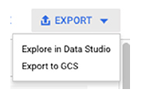
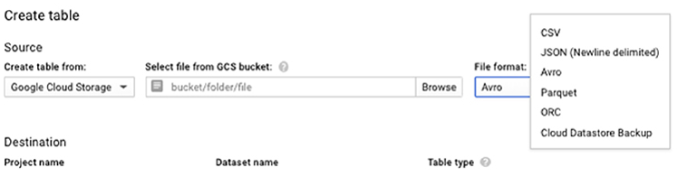

# Chapter 13 스토리지에서 데이터 로드

**이 챕터는 구글 Associate Cloud Engineer 인증 시험 과목 중, 아래 내용을 다룬다.**
* 3.4 데이터 솔루션 배포 및 구현

이 챕터에서는 GCP의 다양한 스토리지와 처리 시스템에 데이터를 가져오고, 이동하는 상세정보를 확인할 것이다. 콘솔과 커맨드라인을 사용하여 Cloud Storage에서 데이터를 가져오고 이동하는 방법을 설명한다.

챕터의 대부분은 Cloud SQL, Cloud Datastore, BigQuery, Cloud Spanner, Cloud Bigtable, Cloud Dataproc을 포함하여 데이터 스토리지와 분석 서비스에 데이터를 입력 및 추출하는 방법을 설명할 것이다. Cloud Pub/Sub로 스트리밍 데이터를 살펴본다.

## Cloud Storage에 데이터 로딩 및 이동

Cloud Storage는 장기간 스토리지, 보관, 파일 전송, 데이터 공유를 포함한 다양한 사례를 위해 사용된다. 이 섹션은 스토리지 버킷을 생성하고, 스토리지 버킷에 데이터를 가져오고, 스토리지 버킷간 object를 이동하는 방법을 설명한다.

### 콘솔을 사용하여 Cloud Storage 데이터 로딩 및 이동

Cloud Storage에 데이터를 로딩하는 것은 공통적인 업무이고, Cloud Console을 사용하여 쉽게 동작한다. 

Cloud Console의 Cloud Storage 페이지를 연다. 기존 버킷의 리스트나 신규 버킷을 생성하는 옵션을 확인할 수 있다. (그림 13.1)


**그림 13.1** Cloud Storage에 데이터를 가져오는 첫번째 단계는 버킷을 생성하는 것이다.

버킷을 생성할 때, 버킷의 스토리지 클래스와 저장할 region을 지정해야 한다.(그림 13.2)


**그림 13.2** us-west1에 regional 버킷을 정의

**Notice**

> 시험을 위해, 버킷이 regional 리소스라는 것을 기억해야 한다. 버킷은 region의 znoe에 걸쳐서 복제된다.

버킷을 생성한 후, Bucket Details 페이지를 확인한다. (그림 13.3) 여기에서, 개별적인 파일이나 폴더를 업로드할 수 있다.


**그림 13.3** Bucket Details 페이지에서, 파일과 폴더를 업로드할 수 있다.

파일을 업로드할 때, 클이언트 디바이스 파일 시스템을 사용하여 입력한다. 그림 13.4는 파일 업로드를 위한 macOS Finder 창을 보여준다. Windows나 리눅스 OS에서도 유사하다.


**그림 13.4** File Upload 옵션을 선택하면, 클라이언트 디바이스 파일 시스템 도구를 사용하여 파일을 입력한다.

폴더를 업로드 할 때도 로컬 OS 도구로 입력한다.(그림 13.5)


**그림 13.5** Folder Upload 옵션을 선택하면 File Upload와 유사하게 작업한다. 클라이언트 디바이스 파일 시스템 도구를 사용하여 폴더를 입력한다.

버킷간 데이터를 이동하는 것은 쉽다. object 끝에 있는 3개 점 아이콘을 클릭하면 이동을 포함한 작업 목록이 표시된다. 이동은 그림 13.6과 같은 양식이 표시된다.


**그림 13.6** object는 작업 메뉴에서 move 명령을 사용하여 이동할 수 있다.

Object를 이동할 때, 그림 13.7처럼 목적지 버킷과 폴더를 입력한다.


**그림 13.7** 콘솔에서 object를 이동할 때, 목적지 버킷과 폴더를 입력한다.

**Notice**

> 팝업 메뉴의 Move 동작을 사용하여 object를 이동할 수 있지만, 같은 방식으로 폴더를 이송할 수 없다. Move는 폴더를 선택할 때 팝업 메뉴에서 옵션이 아니다.

### 커맨드라인을 사용하여 Cloud Storage로 데이터 로딩 및 이동

데이터를 로딩하고 이동하는 것은 `gsutil` 명령을 사용하여 커맨드라인에서 동작될 수 있다.

버킷을 생성하기 위해 `gsutil` 명령을 사용한다. `mb`는 `make bucket`의 약자이다.

```bash
gsutil mb gs://[BUCKET_NAME]/
```

버킷의 이름은 글로벌로 유니크해야 한다는 것을 기억해야한다. `ace-exam-bucket` 이름의 버킷을 생성하기 위해 다음 명령을 사용한다.

```bach
gsutil mb gs://ace-exam-bucket1/
```

로컬 디아비스나 GCP VM에서 파일을 업로드하기 위해, `gsutil cp` 명령을 사용하여 파일을 복사할 수 있다. 

```bash
gsutil cp [LOCAL_OBJECT_LOCATION] gs://[DESTINATION_BUCKET_NAME]
```

예를 들어, `/home/mydir/`에서 `ace-exam-bucket1`로 `README.txt` 파일을 복사하기 위해, 클라이언트 디바이스 커맨드라인에서 다음 명령을 실행한다.

```bash
gsutil cp /home/mydir/README.txt gs://ace-exam-bucket1
```

유하사게, Cloud Storage 버킷에서 VM 디렉토리로 데이터의 복사본을 다운로드하고 싶으면, SSH를 사용하여 VM에 접속하고 다음 커맨드를 실행한다.

```bash
gsutil cp gs://ace-exam-bucket1/README.txt /home/mydir/
```

이 예시에서, 원본 object는 Cloud Storage에 있고, 타겟 파일은 커맨드를 실행하는 VM에 있다.

`gsutil` 툴은 `move` 명령을 갖고 있다. 

```bash
gsutil mv gs://[SOURCE_BUCKET_NAME]/[SOURCE_OBJECT_NAME] \ gs://[DESTINATION_BUCKET_NAME]/[DESTINATION_OBJECT_NAME]
```

`ace-exam-bucket`에서 `ace-exam-bucket2`로 `README.txt` 이동하고 같은 파일이름을 유지하기 위해, 다음 명령을 사용한다.

```bash
gsutil mv gs://ace-exam-bucket1/README.txt gs://ace-exam-bucket2/
```

## 데이터 입력 및 추출

클라우드 엔지니어로서, 데이터베이스로 데이터를 입력하고, 추출하는 것과 같이 대량 데이터 작업을 수행해야 할 수 있다. 이런 동작은 커맨드라인과 때때로 콘소레서 수행한다. 데이터베이스에 데이터를 프로그래밍으로 입력하는 방법을 살펴보진 않을 것이다. 그 것은 어플리케이션 개발자와 데이터베이스 관리자 업무이다.

### 데이터 입력 및 추출: Cloud SQL

콘솔을 사용하여 Cloud SQL 데이터베이스를 추출하기 위해, 콘솔의 Cloud SQL 페이지를 열면, 데이터베이스 인스턴스가 조회된다. (그림 13.8)


**그림 13.8** 콘솔의 Cloud SQL 페이지에서 데이터베이스 인스턴스 리스트

인스턴스의 이름을 더블클릭하여 Instance Detail 페이지를 연다. (그림 13.9)


**그림 13.9** Instance Detail 페이지는 Import와 Export 탭이 있다.

Export 탭을 선택하면 데이터베이스 추출 화면을 확인할 수 있다. 백업파일을 저장할 버킷을 지정해야 한다. (그림 13.10)


**그림 13.10** 데이터베이스를 추출하는 것은 추출 파일을 저장할 버킷과 파일 포맷 지정이 필요하다.

SQL이나 CSV 포맥을 선택해야 한다. SQL은 다른 관계형 데이터베이스에 데이터를 입력할 계획이면 유용하다. CSV는 비관계형 데이터베이스에 데이터를 이동할 경우 좋은 선택이다.

추출 파일을 생성한 후, 그 파일을 입력할 수 있다.

추출과 동일한 과정이지만, Export 탭 대신 Import 탭을 선택한다. 그림 13.11과 같은 양식이 보여질 것이다. 원본 파일, 파일 포맷, 데이터를 입력할 데이터베이스를 지정한다.


**그림 13.11** 데이터베이스를 입력하는 것은 버킷 경로와 추출 파일을 저장할 object, 파일 포맷, 인스턴스 내의 타겟 데이터베이스가 필요하다.

또한, 커맨드라인을 사용하여 데이터베이스를 생성, 입력, 추출할 수 있다. 다음과 같이, `gsutil` 명령을 사용하여 버킷을 생성한다.

```bash
gsutil mb gs://ace-exam-bucket1
```

service account가 버킷에 쓸 수 있는지 확인해야 한다. 그래서 다음 명령을 통해 인스턴스를 설명하여 service account의 이름을 가져온다.

```bash
gcloud sql instances describe [INSTANCE_NAME]
```

이 예시에서 다음 명령을 사용한다.

```bash
gcloud sql instances describe ace-exam-bucket1
```

이것은 service account 이메일을 포함하여, 인스턴스에 대한 상세 리스트를 처리한다. 그림 13.12는 예시의 출력이다.


**그림 13.12** `gcloud sql instances describe` 명령으로 생성된 데이터베이스 인스턴스에 대한 상세정보

`gsutil acl ch` 명령을 사용하여 service account가 버킷에 접근할 수 있도록 버킷의 접근 제어를 변경할 수 있다. 

```bash
gsutil acl ch -u [SERVICE_ACCOUNT_ADDRESS]:W gs://[BUCKET_NAME]
```

`gsutil acl ch` 명령은 접근 권한을 변경한다. `-u` 파라미너튼 사용자를 지정한다. `:W` 옵션은 사용자가 버킷에 쓰기 접근할 수 있다는 것을 가리킨다. 이 예시에서는 다음 명령을 사요한다.

```bash
gsutil acl sh -u tnkknzut25bezoq72bjbfmo5hu@spe-umbra-30.iam.gserviceaccount.com / :W gs://ace-exam-bucket1
```

service account가 버킷에 쓰기 권한을 갖고 있으면, 다음 명령을 사용하여 데이터베이스의 추출을 생성할 수 있다.

```bash
gcloud sql export sql [INSTANCE_NAME] gs://[BUCKET_NAME]/[FILE_NAME] --database=[DATABASE_NAME]
```

예를 들어, 다음 명령은 MySQL 데이터베이스를 `ace-exam-bucket1` 버킷에 SQL 덤프 파일로 추출한다.

```bash
gcloud sql export sql ace-exam-mysql1 gs://ace-exam-bucket1/ace-exam-mysqlexport.sql --database=mysql
```

CSV 파일로 추출하려면, 위 명령에서 sql을 csv로 변경한다.

```bash
gcloud sql export csv ace-exam-mysql1 gs://ace-exam-bucket1/ace-exam-mysql-export.csv --database=mysql
```

데이터베이스를 가져오는 것은 비슷한 구조의 명령을 사용한다.

```bash
gcloud sql import sql [INSTANCE_NAME] gs://[BUCKET_NAME]/[IMPORT_FILE_NAME] --database=[DATABASE_NAME]
```

예시 데이터베이스, 버킷, 추출 파일을 사용하려면, 다음 명령을 사용하여 파일을 가져올 수 있다.

```bash
gcloud sql import sql ace-exam-mysql1 gs://ace-exam-bucket1/ace-exam-mysql-export.sql --database=mysql
```

### 데이터 입력 및 추출: Cloud Datastore

Datastore에서 데이터를 입력하고 추출하는 것은 커맨드라인을 통해 수행한다. Datastore는 추출된 엔티티를 그룹화하는 namespace 데이터 구조를 사욯한다. 추출하는 엔티티가 사용하는 namespace의 이름을 지정해야 한다. 디폴트 namespace는 단순하다. (`dafault`)

Cloud Datastore `export` 명령은 다음과 같다.

```bash
gcloud datastore export --namespace="(dafault)" gs://${BUCKET}
```

다음 명령을 사용하여 `ace-exam-datastore1` 버킷을 추출할 수 있다.

```bash
gcloud datastore export --namespaces="(dafault)" gc://ace-exam-datastore1
```

Cloud Datastore `import` 명령은 다음과 같다.

```bash
gcloud datastore import gs://${BUCKET}/[PATH]/[FILE].overall_export_metadata
```

추출 프로세스는 추출 날짜와 시간을 사용하여 `ace-exam-datastore1` 폴더를 생성한다. 폴더는 메타데이터 파일과 추출된 데이터를 포함하는 폴더를 포함한다. 메타데이터 파일이름은 포함한 폴더에 사용된 것과 동일한 날짜와 시간을 사용한다. 데이터 폴더는 추출된 Datastore 데이터베이스의 namespace의 이름을 따서 명명한다. 예시 import 명령은 다음과 같다.

```bash
gcloud datastore import gs://ace-exam-datastore1/2018-12-20T19:13:55_64324/ 2018-12-20T19:13:55_64324.overall_export_metadata
```

### 데이터 입력 및 추출: BigQuery

BigQuery 사용하는 Cloud Console과 커맨드라인을 사용하여 테이블을 추출하고 입력할 수 있다.

콘솔을 사용하여 추출하기 위해, BigQuery 콘솔 인터페이스를 연다. Resource 아래에, 추출하기 원하는 테이블을 포함한 데이터 셋을 연다. 그림 13.13처럼 테이블 이름을 클릭하여 데이블 dexcription을 조회한다. Export 옵션을 오른쪽 위에 있다.


**그림 13.13** BigQuery 테이블 리스트의 상세정보

가장 오른쪽에, Export를 클릭하면 2개의 추출 장소 리스트가 표시된다: Google Cloud Storage, GCP의 분석 도구인 Data Studio. (그림 13.14)



**그림 13.14** BigQuery 추출을 위한 타겟 장소 선택

Cloud Storage를 선택하면 그림 13.15같은 양식이 표기횐다. 추출 파일을 저장할 버킷 이름을 입력한다. 파일 포맷을 선택한다. 옵션은 CSV, Avro, JSON이 있다. 압축 타입을 선택한다. 옵션은 None이나 CSV를 위한 Gzip, "deflate", Avro를 위한 "snappy"가 있다.


**그림 13.15** BigQuery 추출 옵션을 위한 출력 파라미터 지정

커맨드라인으로 데이터를 추출하기 위해, `bq extract` 명령을 사용한다. 구조는 다음과 같다.

```bash
bq extract --destination_format [FORMAT] --compression [COMPRESSION_TYPE] --field_delimiter [DELIMITER] --print_header [BOOLEAN] [PROJECT_ID]:[DATASET].[TABLE] gs://[BUCKET]/[FILENAME]
```

아래는 예시이다.

```bash
bq extract --destination_formet CSV --compression GZIP 'mydataset.mytable' gs://example-bucket/myfile.zip
```

**Notice**
> BigQuery 작업을 위한 커맨드라인은 `bq`이다. `gcloud`가 아니다.

BigQuery에 데이터를 입력하기 위해, BigQuery 콘솔 페이지를 열고, 데이터를 입력하고싶은 데이터 셋을 선택한다. 데이터 셋을 클릭하면 Create Table 탭을 선택한다. (그림 13.16)


**그림 13.16** 데이터 셋을 확인할 때, 테이블을 생성하는 옵션이 있다.

Create Table 형식은 optional 원본 테이블, 타겟 프로젝트, 데이터셋 이름, 테이블 타입, 테이블 이름을 포함한 몇몇 파라미터를 받는다. (그림 13.17)


**그림 13.17** BigQuery에서 테이블 생성

Create Table 양식에서 field는 원본 데이터가 있는 위치를 나타낸다. 이것은 기존 테이블의 데이터를 기반으로 테이블을 생성하는 방법을 제공하지만, 빈 테이블이 기본 값이다. (그림 13.18)


**그림 13.18** 데이터는 다양한 종류의 위치에서 가져올 수 있다.

또한, 가져올 파일의 포맷을 지정해야 한다. 옵션을 CSV, JSON, Avro, Parquet, PRC, Cloud Store 백업을 포한한다. (그림 13.19)



**그림 13.19** 가져오기 위한 파일 포맷 옵션

프로젝트, 데이터셋 이름, 테이블 타입, 테이블 이름을 포함한 타겟 정보를 제공한다. 테이블은 native 타입이나 external 테이블일 수 있다. 테이블이 external이면, 데이터는 원본 위치에 유지되고, 테이블에 대한 메타데이터만 BigQuery에 저장된다. 큰 데이터 셋을 갖고 모두 BigQuery에 로드하지 않으려는 경우에 사용된다.

모든 파라미터를 지정한 후, Create Table을 클릭하면 테이블이 생성되고 데이터를 로드할 수 있다.

커맨드라인으로 데이터를 로드하기 위해, `bq load` 명령을 사용한다. 구조는 다음과 같다.

```bash
bq load --autodetect --source_format=[FORMAT] [DATASET].[TABLE] [PATH_TO_SOURCE]
```

`--autodetect` 파라미터는 `bq load`가 자동적으로 원본파일에서 테이블 스키마를 검출한다. 예시 명령은 다음과 같다.

```bash
bq load --autodetect --source_format=CSV mydataset.mytal gs://ace-exam-bigquery/mydata.csv
```

### 데이터 입력 및 추출: Cloud Spanner

Cloud Spanner 사용자는 Cloud Console을 사용하여 데이터를 입력하고 추출할 수 있다.

Cloud Spanner에서 데이터를 추출하기 위해, 콘솔의 Cloud Spanner 섹션을 연다. 그림 13.20처럼 Spanner 인스턴스의 리스트를 확인할 것이다.


**그림 13.20** Spanner 인스턴스의 리스트

추출할 데이터의 원본인 인스턴스의 이름을 클릭한다. Instance Detail 페이지를 확인할 것이다. (그림 13.21)


**그림 13.21** Spanner 인스턴스의 상세정보, Import와 Export 탭이 있다.

그림 13.22에서 보여지는 것처럼, Export를 클릭하면 Export 양식이 보여진다. 타겟 버킷, 추출할 데이터베이스, job을 실행할 region을 입력해야 한다. Cloud Dataflow를 실행하기 위해 요금이 부과되는지 확인하고, region간 젠송된 데이터에 대한 데이터 요금이 부과될 수 있다.


**그림 13.22** Cloud Spanner를 위한 Export 양식

데이터를 입력하기 위해, Import 탭을 클릭하면 Import 양식이 표시된다. (그림 13.23) 원본 버킷, 타겟 데이터베이스, job을 실행할 region을 지정해야 한다. 

Cloud Spanner는 데이터를 추출하기 위해 `gcloud` 명령을 사용하지 않지만, Dataflow를 사용하여 데이터를 추출할 수 있다. Dataflow job을 위한 상세 정보는 이 섹션의 포함되어있지 않다. 상세한 정보는 [https://cloud.google.com/dataflow/docs](https://cloud.google.com/dataflow/docs)의 Cloud Dataflow 문서를 확인한다.


**그림 13.23** Cloud Spanner를 위한 Import 양식

### 데이터 입력 및 추출: Cloud Bigtable

다른 GCP 데이터베이스와 다르게, Cloud Bigtable은 Cloud Console이나 `gcloud`의 Export와 Import 옵션이 없다. 입력과 추출을 위한 Java어플리케이션이나 HBase 인터페이스를 사용하여 HBase 명령을 실행하는 2가지 옵션이 있다. HBase 명령은 구글 문서에 포함되어있지 않고, 여기에서 설명하지 않는다. 더 많은 정보는 [https://hbase.apache.org/book.html](https://hbase.apache.org/bookg.html)에서 HBase 문서를 확인한다.

Bigtable 테이블을 추출하기 위해, Java VM을 위해 컴파일된 프로그램인 JAR 파일을 다운로드해야 한다. 파일을 다운로드 하는 명령은 다음과 같다.

```bash
curl -f -O http://repo1.maven.org/maven2/com/google/cloud/bigtable/bigtable-beam-import/1.6.0/bigtable-beam-import-1.6.0-shaded.jar
```

추출 프로그램을 실행하기 위해, 다음 형식의 명령을 실행한다.

```bash
java -jar bigtable-beam-import-1.6.0-shaded.jar export \
    --runner=dataflow \
    --project=[PROJECT_ID] \
    --bigtableInstanceId=[INSTANCE_ID] \
    --bigtableTableId=[TABLE_ID] \
    --destinationPath=gs://[BUCKET_NAME]/[EXPORT_PATH] \
    --tempLocation=gs://[BUCKET_NAME]/[TEMP_PATH] \
    --maxNumWorkers=[10x_NUMBER_OF_NODES] \
    --zone=[DATAFLOW_JOB_ZONE]
```

적절한 `project_id, table_id`, 버킷 정보, Dataflow job을 실행할 zone, 추출을 위한 워커의 최대 수를 지정해야 한다.

`export` 명령의 예는 다음과 같다.

```bash
java -jar bigtable-beam-import-1.6.0-shaded.jar export \
    --runner=dataflow \
    --project=my-project \
    --bigtableInstanceId=ace-exam-instance \
    --bigtableTableId=ace-exam-table1 \
    --destinationPath=gs://ace-exam-bucket1/ace-exam-table1 \
    --tempLocation=gs://my-export-bucket/jar-temp \
    --maxNumWorkers=30 \
    --zone=us-west2-a
```

데이터를 입력하기 위해, 동일한 JAR 파일을 사용할 수 있지만, `export` 대신 `import` 명령을 지정해야 한다.

```bash
java -jar bigtable-beam-import-1.6.0-shaded.jar import \
    --runner=dataflow \
    --project=[PROJECT_ID] \
    --bigtableInstanceId=[INSTANCE_ID] \
    --bigtableTableId=[TABLE_ID] \
    --sourcePattern='gs://[BUCKET_NAME]/[EXPORT_PATH]/part-*' \
    --tempLocation=gs://[BUCKET_NAME]/[TEMP_PATH] \
    --maxNumWorkers=[3x_NUMBER_OF_NODES] \
    --zone=[DATAFLOW_JOB_ZONE]
```

`export` 명령에 지정되는 파라미터 이외에도, `import` 명령은 import하는 파일을 설명하는 filename 패턴을 설명하는 파라미터를 받는다. Bigtable 추출은 모든 데이터를 저장하는 다수의 파일이 필요할 정도로 충분히 클 수 있다. import하는 동안 임시 저장소로 사용될 수 있는 버킷을 지정해야 한다.

다음은 `import` 명령의 예시이다.

```bash
java -jar bigtable-beam-import-1.6.0-shaded.jar import \
    --runner=dataflow \
    --project=my-project \
    --bigtableInstanceId= ace-exam-instance \
    --bigtableTableId= ace-exam-table1 \
    --sourcePattern='gs://my-export-bucket/my-table/part-*' \
    --tempLocation=gs://my-export-bucket/jar-temp \
    --maxNumWorkers=10 \
    --zone=us-west2-a
```

### 데이터 입력 및 추출: Cloud Dataproc

Cloud Dataproc은 Cloud SQL이나 Bigtable같은 데이터베이스가 아니다. 오히려, 데이터 분석 플랫폼이다. 이런 플랫폼은 데이터 저장 및 조회보다 데이터 조작, 통계 분석, 머신 러닝, 다른 복잡한 동작을 위해 설계되었다. Cloud Dataproc은 데이터의 persistent store로 설계되지 않았다. 분석하고자하는 데이터 파일을 저장하는데 Cloud Storage와 persistent disk를 사용해야 한다.

Cloud Dataproc은 클러스터 설정 데이터를 저장하고 복원하는 Import와 Export 명령을 갖고 있다. 이런 명령은 `gcloud`를 사용하여서 이용할 수 있다.

`gcloud`에서 명령에 접근할수 있도록 하려면, 다음 명령을 실행한다.

```bash
gcloud components install
```

Dataproc 클러스터 설정을 추출하는 명령어는 다음과 같다.

```bash
gcloud dataproc clusters export [CLUSTER_NAME] --destination=[PATH_TO_EXPORT_FILE]
```

다음은 에시이다.

```bash
gcloud dataproc clusters export ace-exam-dataproc-cluster --destination=gs://ace-exam-bucket1/mydataproc.yaml
```

설정 파일을 import하기 위해 `import` 명령을 사용한다.

```bash
gcloud dataproc clusters import [SOURCE_FILE]
```

예를 들어, 이전에 `export` 예시에서 생성된 파일을 import하기 위해, 다음 명령을 사용할 수 있다.

```bash
gcloud dataproc clusters import gs://ace-exam-bucket1/mydataproc.yaml
```

데이터 importing과 exporting은 일반적인 작업이다. GCP는 대부분 데이버테이스 서비스를 위해 콘솔과 커맨드라인을 제공한다. 

## Pub/Sub에 데이터 스트리밍

지금까지 이 챕터에서는 데이터베이스의 데이터를 importing하고 exporting과 함께 Cloud Storage 안팍으로 데이터를 이동하는데 시간을 소비했다. 메시지 큐인 Cloud Pub/Sub 작업을 살펴보자.

클라우드 엔지니어로서, 어플리케이션 개발자를 위한 메시지 큐를 생성해야 할 수 있다. 개발자가 Pub/Sub을 사용하여 서비스를 작성할 것이지만, 클라우드 엔지니어는 Pub/Sub 토픽과 구독을 테스트할 수 있어야 한다. 챕터 12에서 메시지큐를 생성하는 방법을 설명했다. 여기에서는 토픽으로 메시지를 생성하고, 구독으로 메시지를 수신하는 것에 초점을 둔다.

`gcloud pubsub` 명령은 `create`, `publish`, `pull`을 사용한다. 다음과 같이 명령을 사용한다.

```bash
gcloud pubsub topics create [TOPIC_NAME]
```

구독을 생성하는 명령은 다음과 같다.

```bash
gcloud pubsub subscriptions create --topic [TOPIC_NAME] [SUBSCRIPTION_NAME]
```

예를 들어, `ace-exam-topic1`이라는 토픽을 생성하고, `ace-exam-sub1`이라는 토픽으로 구독한다.

```bash
gcloud pubsub topics create ace-exam-topic1
gcloud pubsub subscriptions create --topic=ace-exam-topic1 ace-exam-sub1
```

이제, 메시지가 큐가 정확히 동작하는지 테스트하기 위해, 다음 명령을 사용하여 토픽에 데이터를 전송한다.

```bash
gcloud pubsub topics publish [TOPIC_NAME] --message [MESSAGE]
```

그런 다음, 구독으로 메시지를 읽는다.

```bash
gcloud pubsub subscriptions pull --auto-ack [SUBSCRIPTION_NAME]
```

토픽으로 메시지를 작성하고, 생성된 구독으로 메시지를 읽기 위해, 다음과 같이 사용한다.

```bash
gcloud pubsub topics publish ace-exam-topic1 --message "first ace exam messgae"
gcloud pubsub subscriptions pull --auto-ack ace-exam-sub1
```

## Summary

이 챕터에서, 스토리지, 데이터베이스, 메시지 큐 시스템에서 데이터를 가져올 수 있는 다양한 방법을 살펴봤다. Cloud Storage는 버킷에 object로 구성된다. `gsutil` 명령와 Cloud Console은 데이터를 업로드할 뿐만 아니라 버킷간 데이터를 이동하는데 사용될 수 있다. `gsutil cp` 명령은 Cloud Storage와 VM에 파일을 복사하는데 사용될 수 있다.

데이터베이스 서비스는 import와 export 유틸리티를 제공한다. Cloud SQL과 BigQuery같은 일부는 Cloud Console과 커맨드라인 모두 사용할 수 있다. Bigtable과 Cloud Dataproc과 같은 다른 것들은 커맨드라인 옵션만 가능하다.

Cloud Pub/Sub은 어플리케이션을 분리하고, 로드 급증에 대한 복원력을 향상시킬 수 있다. 토픽과 구독을 생성하는 방법과 구독자가 읽을 수 있도록 메시지큐에 데이터를 push하는 방법을 살펴봤다.

Cloud Spanner는 importing과 exporting을 위해 Dataflow 서비스를 사용한다. Dataflow를 사용하고 regions간 데이터를 이동할 때 추가 비용이 발생할 수 있다. Cloud Spanner 데이터베이스로 importing하고 exporting하기 위한 `gcloud` 명령은 없다.

## 시험 요소

**Cloud Storage에 데이터를 가져오고, 데이터를 이동하는 방법을 알아야 한다.** Cloud Storage는 장기간 저장소, 보관, 파일전송, 데이터 공유를 포함하여 다양한 사례에서 넓게 사용된다. `gcloud`와 다르게 `gsutil` 명령의 구조를 이해해야 한다. `gsutil` 명령은 `copu`나 `make bucket`과 같은 동작이 뒤에 붙는다. copy(`cp`), move(`mv`), make bucket(`mb`) 명령의 문법을 알아야 한다. Cloud Storage에서 VM으로 파일을 복사할 수 있다. 또한, `gsutil ace ch -u` 명령은 object의 권한을 변경하는데 사용된다.

**Cloud SQL에서 어떻게 import와 export 작업을 하는지 이해해야 한다.** 데이터베이스에서 데이터를 가져오고 추출하는 것은 일반적인 작업이다. Cloud Storage 버킷의 권한을 변경하기 위해 `gsutil acl ch` 명령을 사용할 수 있다. 콘솔과 커맨드라인에서 import와 export를 수행할 수 있다.

**Cloud Datastore에서 엔티티를 추출할 수 있다.** export와 import는 namespace 수준에서 수행한다. Cloud Console에는 Datastore에서 exporting와 importing을 위한 옵션이 없다.

**BigQuery에서 데이터를 추출하고 가져오는 방법을 이해해야 한다.** BigQuery는 import하는 데이터의 원본을 위한 다양한 옵션이 있다. 데이터는 공간을 절약하기 위해 추출될 때 압축될 수 있다. BigQuery는 CSV, JSON, Avro를 포함한 다양한 포맷으로 데이터를 추출할 수 있다. `bq` 명령은 커맨드라인에서 importing과 exporting을 위해 사용된다.

**Bigtable과 Cloud Dataproc은 import와 export 기능이 다르다.** Bigtable은 데이터 import나 export를 위한 콘솔이나 커맨드라인 기능이 없다. Java 프로그램은 Bigtable에서 데이터를 import/export하기 위해 커맨드라인에서 실행된다. Cloud Dataproc은 persistent 데이터 저장소로 설계되지 않았다는 점에서 다르다. Cloud Dataproc은 데이터 분석 도구이다. Dataproc에서 추출할 때, 클러스터에 있는 데이터가 아닌 클러스터 설정을 추출한다.

**Pub/Sub은 서비스간 메시지를 전송하는데 사용된다.** Pub/Sub은 로드 변동에 대한 복원력이 향상된다. 하나의 서비스가 지연되면, 해당 데이터를 생성하는 서비스가 강제로 대기하지 않고 해당 작업이 Pub/Sub 대기열에 누적된다.

[맨 위로](#chapter-13-%ec%8a%a4%ed%86%a0%eb%a6%ac%ec%a7%80%ec%97%90%ec%84%9c-%eb%8d%b0%ec%9d%b4%ed%84%b0-%eb%a1%9c%eb%93%9c)