# Chapter 14 Cloud 네트워크: VPC(Virtual Private Cloud)와 VPN(Virtual Private Networks)

**이 챕터는 구글 Associate Cloud Engineer 인증 시험 과목 중, 아래 내용을 다룬다.**
* 2.4 네트워크 리소스 기획 및 구성
* 4.5 네트워킹 리소스 관리

이 챕터에서 Virtual Private Clouds(VPCs)로 시작하여 네트워킹에 집중한다. 디폴트와 커스텀 서브넷으로 VPCs를 생성하는 방법을 배울 것이다. 디폴트 네트워크 구성이 필요하지 않을 때를 위해 Compute Engine에서 커스텀 네트워크 설정을 생성하는 방법을 배울 것이다. 다음으로, 방화벽 규칙을 설정하고 Virtual Private Networks(VPNs)를 생성하는 방법을 확인할 것이다.

## 서브넷으로 VPC 생성

VPCs는 프로젝트의 리소스와 연결되는 물리 네트워크의 소프트웨어버전이다. GCP는 프로젝트를 생성할 때 VPC를 자동적으로 생성한다. GCP에 의해서 추가 VPC를 생성하고 생성된 VPC를 수정할 수 있다.

VPC는 글로벌 리소스이다. 그래서 region이나 zone에 연결되어있지 않다. Compute Engine VM과 Kubernetes Engine 클러스터와 같은 리소스는 트래픽이 방화벽 규칙에 의해서 제한되지 않는다는 가정하에 서로 통신할 수 있다. 

VPC는 *subnets*이라고 부르는 regional 리소스인 서브네트워크를 포함한다. 서브넷은 연결된 IP 주소 범위가 있다. 서브넷은 개인 사설 주소를 제공한다. 리소스는 이 주소를 사용하여 서로서로 및 구글 API와 서비스와 통신한다.

프로젝트와 연관된 VPC 이외에도, organization 내에 공유 VPC를 생성할 수 있다. 공유 VPC는 공통 프로젝트에 호스팅된다. 충분한 권한을 갖는 다른 프로젝트의 사용자는 공유 VPC에 리소스를 생성할 수 있다. 또한, Organization이 정의되지 않은 경우에도 내부 프로젝트간 연결을 위해 VPC Peering을 사용할 수 있다. 

이 섹션에서, Cloud Console과 `gcloud`를 사용하여 서브넷이 있는 VPC를 생성하고, 공유 VPC를 생성하는 것에 집중한다.

### Cloud Console로 VPC 생성

Cloud Console에서 VPC를 생성하기 위해 그림 14.1처럼 VPC 페이지를 연다.

Create VPC를 클릭하여 그림 14.2처럼 VPC를 생성하는 양식을 연다. 그림 14.2는 새로운 VPC를 위한 이름과 description을 지정하는 것을 보여준다. 또한, VPC에 성성될 서브넷의 리스트를 보여준다. VPC가 생성되면, 서브넷은 각 region에 생성된다. GCP는 auto mode 네트워크를 생성할 때 각 서브넷을 위한 IP 주소 범위를 선택한다.

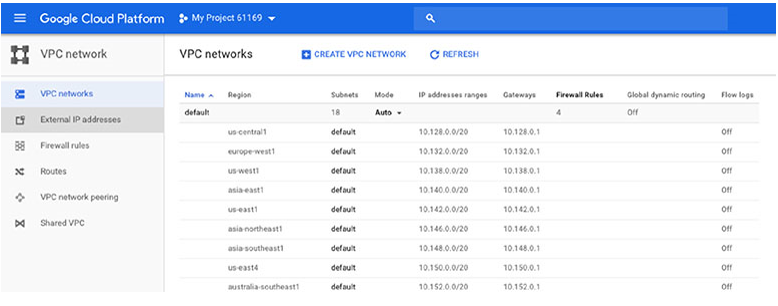

**그림 14.1** Cloud Console의 VPC 섹션

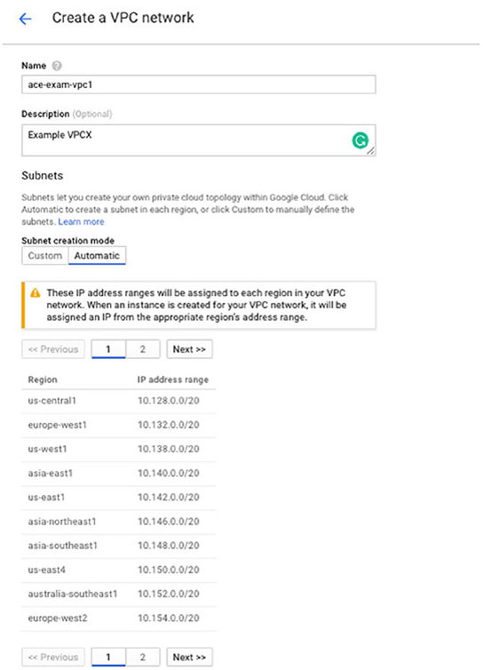

**그림 14.2** Cloud Console에서 VPC를 생성하는 양식의 첫번쨰 부분

대체로, Subnet 섹션에서 Custom 탭을 선택하여 하나 이상의 커스텀 서브넷을 생성할 수 있다.(그림 14.3) 이 것은 region과 IP 주소 범위를 지정할 수 있는 다른 양식이다. IP 범위는 Classless Inter-Domain Routing(CIDR) 표기법으로 지정된다. (표기법을 사용하여 IP주소를 지정하는 방법의 상세 정보를 위해 아래 내용 중의 "CIDR Notation Overview"를 확인한다.) Private Google Access를 중지할 수 있다. 서브넷의 VM은 VM에 외부 IP주소를 할당하지 않아도 구글 서비스레 접근할 수 있다. 또한, Flow Logs 옵션을 설정하여 네트워크 트래픽의 로깅을 실행할 수 있다.

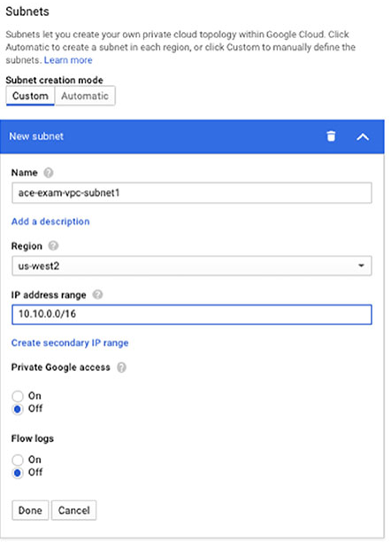

**그림 14.3** 커스텀 서브넷 생성

그림 14.4는 방화벽 규칙, 동적 라우팅 설정, DNS 서버 정책을 포함한 VPC 양식의 두 번째 부분을 보여준다. 방화벽 규칙 섹션은 VPC에 적용될 수 있는 규칙을 나열한다. 그림 14.4 예시에서 규칙은 SSH 접근을 허용하는 포트 22의 TCP 트래픽이 인입되는 ingress를 허용한다. 0.0.0.0/0의 IP 범위는 모든 소스 IP 주소로부터 트래픽을 허용한다.

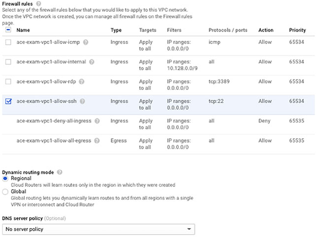

**그림 14.4** Cloud Console에서 VPC를 생성하는 양식의 두번쨰 부분

동적 라우팅 옵션은 학습할 경로를 결정한다. Regional 라우팅은 구글 Cloud Routers가 해당 지역 내 경로를 학습하게 한다. Global 라우팅은 VPC의 모든 서브네트워크의 경로를 학습하는 구글 Cloud Routers를 활성화한다.

optional DNS 서버 정책은 GCP에 의해서 제공되는 DNS 이름 확인을 활성화하거나 이름 확인 순서를 변경하는 DNS 정책을 선택할 수 있다. (챕터 15에 더 많은 정보가 있다.)

파라미터를 지정하고, VPC를 생성하면, VPC 리스트가 나타나고, VPC와 서브넷에 대한 정보가 그림 14.5처럼 보여진다.

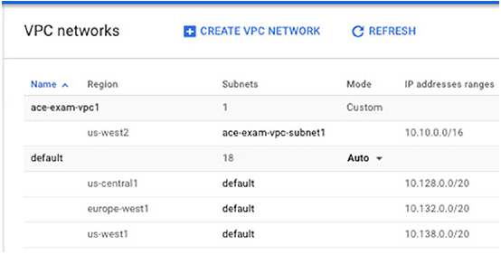

**그림 14.5** VPC와 서브넷 리스트

### gcloud로 VPC 생성

VPC를 생성하는 `gcloud` 명령은 `gcloud compute network create` 이다. 예를 들어, 자동적으로 생성되는 서비넷을 갖는 기본 프로젝트에 VPC를 생성하기 위해 다음 명령을 사용한다.

```bash
gcloud compute networks create ace-exam-vpc1 --subnet-mode=auto
```

또한 커스텀 옵션을 지정하고, VPC에 서브넷을 생성하여 VPC 네트워크를 생성하는 커스텀 서브넷을 설정할 수 있다. `ace-exam-vpc1`이라는 커스텀 VPC를 생성하는 첫 번째 명령은 다음과 같다.

```bash
gcloud compute networks create ace-exam-vpc1 --subnet-mode=custom
```

다음, `gcloud compute networks subnet create` 명령을 사용하여 서브넷을 생성할 수 있다. 이 명령은 VPC, region, IP range를 지정해야 한다. 적절한 플래그를 추가하여 Private Google Access와 Flow Logs를 선택적으로 설정할 수 있다.

`ace-exam-vpc1` VPC에 `ace-exam-vpc-subnet1`의 서브넷을 생성하는 예시이다. 이 서브넷은 10.10.0.0/16의 IP 범위로 us-west2 region에 생성된다. Private IP Access와 Flow Log 설정은 적용되었다.

```bash
gcloud compute networks subnet create ace-exam-vpc-subnet1 --network=ace-exam-vpc1 --region=us-west1 --range=10.10.0.0/16 --enable-private-ip-google-access --enable-flow-logs
```

**CIDR 표기법**

> IP주소의 범위를 지정할 때, *Classless Inter-Domain Routing(CIDR)" 일부를 사용한다. 이름은 A, B, C의 고정된 클래스로 정의된 IP 네트워크에서 유래한다. A 클래스 네트워크 주소 구조는 클래스 기반 라우팅 구조의 한계, 특히 다른 크기의 서브넷을 생성할 때 유연성이 부족하다는 한계를 극복하기위해 생성되었다.  
> CIDR은 네트워크 관리자가 이전 클래스 모델 도메인간 할당된 고정 번호가 아닌 필요한 주소의 수를 갖는 네트워크를 정의할 수 있는 Variable-Length Subnet Masking(VLSM)을 사용한다.  
> CIDR 주소는 서브넷 식별을 위한 네트워크 주소와 호스트 식별자의 2개의 숫자 세트로 구성된다. 이런 숫자는 네트워크 주소와 네트워크 마스트로 구성된 CIDR 표기법을 사용하여 작성된다. RFC1918에 따른 네트워크 주소를 예로:  
>> 10.0.0.0  
>> 172.16.0.0  
>> 192.168.0.0  
>
> CIDR 표기법은 슬래쉬(/)와 네트워크 마스트에 할당할 IP주소의 비트 수를 나타내는 숫자를 추가하여 주소 블록 내에 있는 주소와 그렇지 않은 주소를 결정한다.  
> 예를 들어, 192.186.0.0/16은 IP주소의 32비트 중 16비트가 네트워크를 지정하는 데 사용되고, 16비트는 호스트 주소를 지정하는데 사용된다는 것을 의미한다. 16비트로 2^16 혹은 65,536 주소를 생성할 수 있다.  
> CIDR 블록 172.16.0.0/12는 12비트는 네트워크를 지정하는데 사용되고, 20비트는 호스트 어드레스를 지정하는데 사용된다. 20비트로 1,048,576 주소까지 생성할 수 있다. 일반적으로, 슬래쉬 뒤 숫자가 낮을 수록 더 많은 주소를 사용할 수 있다. [www.subnet-calculator.com/cidr.php](www.subnet-calculator.com/cidr.php)에 하나와 같이 CIDR 계산기를 사용하여 CIDR 블록 옵션을 실험해볼 수 있다.

### gcloud를 사용하여 공유 VPC 생성

공유 VPC를 생성하려면, `gcloud compute shared-vpc`를 사용할 수 있다.

공유 VPC를 생성하는 명령을 실행하기 전에, 조직 수준 또는 폴더 수준에서 조직 구성원에게 Shared VPC Admin role을 할당해야 한다. `roles/compute.xpnAdmin`을 사용하여 Shared VPC Admin role을 할당하기 위해, 다음 명령을 실행한다.

```bash
gcloud organizations add-iam-policy-binding [ORG_ID] --member='user:[EMAIL_ADDREDS]' --role="roles/compute.xpnAdmin"
```

[ORG_ID]는 정책을 사용하는 조직의 조직 식별자이다. `gcloud organizations list` 명령으로 조직 ID를 확인할 수 있다. Shared VPC Admin role를 폴더에 할당하고자 하면, 다음 명령을 사용한다.

```bash
gcloud resource-manager folders add-iam-policy-binding [FOLDER_ID] --member='user:[EMAIL_ADDRESS]' --role="roles/compute.xpnAdmin"
```

[FOLDER_ID]는 정책의 폴더 식별자이다. 다음 명령으로 폴더 ID를 확인할 수 있다.

```bash
gcloud resource-manager folders list --organization=[ORG_ID]
```

더 많은 role과 권한은 챕터 17을 확인한다.

조직 수준으로 Shared VPC Admin role이 설정되면, `shared-vpc` 명령을 실행할 수 있다.

```bash
gcloud compute shared-vpc enable [HOST_PROJECT_ID]
```

폴더 수준으로 VPC를 공유하려면, 다음 명령을 사용한다.

```bash
gcloud compute shared-vpc enable [HOST_PROJECT_ID]
```

공유 VPC가 생성되면, `gcloud compute shared-vpc associate-projects` 명령을 사용하여 프로젝트에 연결할 수 있다. 조직 수준에서 다음 명령을 사용할 수 있다.

```bash
gcloud compute shared-vpc associated-projects add [SERVICE_PROJECT_ID] --host-project [HOST_PROJECT_ID]
```

폴더 레벨에서, 폴더를 연결하는 명령은 다음과 같다.

```bash
gcloud compute shared-vpc associated-projects add [SERVICE_PROJECT_ID] --host-project [HOST_PROJECT_ID]
```

대체로, VPC peering은 조직이 존재하지 않을 때, 내부 프로젝트 트래픽을 위해 사용될 수 있다. VPC peering은 `gcloud compute networks peerings create` 명령을 사용하여 구현될 수 있다. 예를 들어, 각 네트워크에 peering을 지정하여 두 VPC를 peer한다.

```bash
gcloud compute networks peerings create peer-ace-exam-1 \
    --network ace-exam-network-A \
    --peer-project ace-exam-project-B \
    --peer-network ace-exam-network-B \
    --auto-create-routes
```

그 다음, 다음을 사용하여 다른 네트워크에 피어링을 만든다.

```bash
gcloud compute networks peerings create peer-ace-exam-1 \
    --network ace-exam-network-B \
    --peer-project ace-exam-project-A \
    --peer-network ace-exam-network-A \
    --auto-create-routes
```

이 피어링을 통해 사설 트래픽이 두 VPC간 흐를 수 있다.

## 커스텀 네트워크로 Compute Engine 배포

콘솔과 커맨드라인을 사용하여 커스텀 네트워크 설정으로 VM을 배포할 수 있다.

콘솔의 Compute Engine 섹션을 열고, Create Instance 양식을 연다. (그림 14.6)

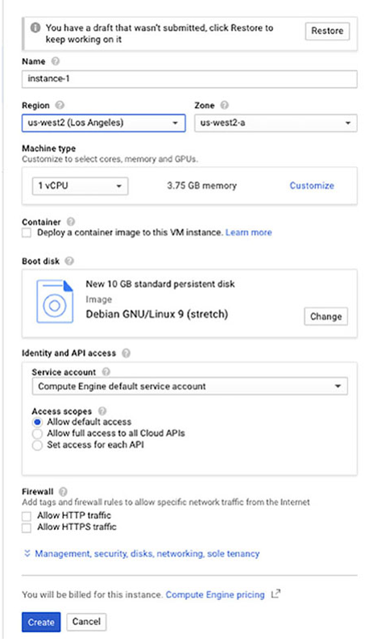

**그림 14.6** Cloud Console에서 인스턴스르 생성하는 예비 양식

Management, Security, Disk, Networking, Sole Tenency를 클릭하면 추가 양식을 확장할 수 있고, Networking 탭을 클릭하면 그림 14.7과 유사한 양식이 표시된다.

이 양식에서, 네트워크 태그를 설정할 수 있다. Add Network Interface를 클릭하면 그림 14.8과 같은 양식이 표시된다. 이 양식에서 커스텀 네트워크를 선택할 수 있다. 이 예시에서는 이전 챕터에서 만들었던 ace-exam-vpc1을 선택한다. 또한 서브넷을 선택한다.

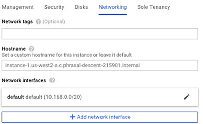

**그림 14.7** 네트워킹 설정 양식

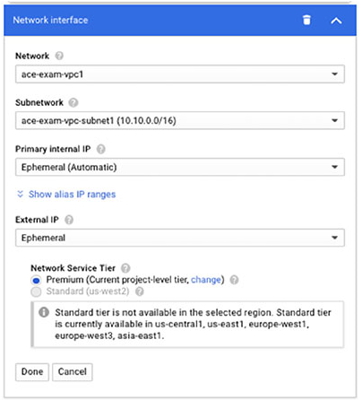

**그림 14.8** 커스텀 네트워크 인터페이스를 추가하는 양식

이 양식에서, static IP 주소를 지정하거나 Primary Internal IP 설정을 사용하여 커스텀 임시 주소를 선택할 수 있다. External IP 메뉴는 임시 외부 IP를 허용한다.

또한 Subnet, Zone 파라미터와 함께 `gcloud compute instances create` 명령을 사용하여 특정 서브넷에서 실행되는 인스턴스를 생성할 수 있다.

```bash
gcloud compute instances create [INSTANCE_NAME] --subnet [SUBNET_NAME] --zone [ZONE_NAME]
```

## VPC를 위한 방화벽 규칙 생성

방화벽 규칙은 네트워크 수준에서 정의되고, VM에 네트워크 트래픽 흐름을 제어하는데 사용된다.

방화벽 규칙은 port의 여러 트래픽을 허용하거나 거부한다. 예를 들어, 정책은 22 포트에 TCP 트래픽을 허용할 수 있다. 또한, incoming(ingress), outgoing(egress) 중 한 방향으로 트래픽에 적용된다. 방화벽은 stateful 이므로, 트래픽이 한 방향으로 허용되고, 연결이 맺어지면, 다른 방향도 허용된다. 방화벽 규칙 셋은 stateful이다. 그래서 22번 포트에 SSH 연결이 맺어진 것 처럼 연결이 허용되면, 규칙과 일치하는 이후 모든 트래픽은 연결이 활성화되어있는 한 허용된다. 활성화된 연결은 10분마다 하나이상의 패킥이 교환되는 연결이다. 

### 방화벽 규칙의 구조

방화벽 규칙은 몇몇 컴포넌트로 구성된다.

* **Direction**: ingess나 egress 중 하나
* **Priority**: 최우선 규칙이 적용된다. 우선 순위가 낮은 규칙은 적용되지 않는다. 우선순위는 0에서 65535까지 숫자로 지정된다. 0은 최상위 우선순위, 65535는 최하위.
* **Action**: 허용이나 거부. 오직 하나만 선택할 수 있다.
* **Target**: 규칙이 적용될 인스턴스. 타겟은 네트워크의 모든 인스턴스, 특정 네트워크 태그를 갖는 인스턴스, 특정 서비스 계정을 사용하는 인스턴스가 될 수 있다.
* **Source/Destination**: source는 ingress 규칙을 적용하고, source IP 범위, 특정 네트워크 태그를 갖는 인스턴스, 특정 서비스 계정을 사용하는 인스턴스를 지정한다. 또한, source IP 주소와 네트워크 태그의 조합, source IP 범위와 인스턴스에 의해 사용되는 서비스계정의 조합을 사용할 수 있다. IP주소 0.0.0.0/0은 모든 IP 주소를 가리킨다. Destination 파라미터는 오직 IP 범위를 사용한다.
* **Protocol and Port**: TCP, UDP, ICMP 같은 네트워크 프로토콜과 port 번호. 프로토콜이 지정되지 않으면, 규칙은 모든 프로토콜에 적용된다.
* **Enforcement Status**: 방화벽 규칙은 enabled나 disabled 중 하나이다. 비활성화된 규칙은 일치해도 적용되지 않는다. 비활성화하는 것은 때때로 트래픽이 통과하지 않아야 할 때 통과하거나 통화해야할 때 통과하지 않는 문제를 해결하는데 사용된다.

모든 VPC는 2가지 암시적 규칙이 있다: 하나는 모든 destinations(IP 주소 0.0.0.0/0)에 egress 트래픽을 하용한다. 다른 하나는 모든 source(IP주소 0.0.0.0/0)으로부터 들어오는 모든 트래픽을 거부한다. 두가지 암시적 규칙은 모두 우선순위 65535이다. 그래서 더 높은 deny를 갖는 다른 규칙을 생성하거나 필요한 트래픽을 허용할 수 있다. 암시적 규칙을 삭제할 수 없다.

VPC가 자동적으로 생성될 때, 디폴트 네트워크는 4가지 네트워크 규칙을 갖고 생성된다. 
* 동일한 네트워크의 모든 VM 인스턴에서 트래픽인 인입되는 것
* SSH를 허용하기 위해 22번 포트로 TCP 트래픽이 인입되는 것
* Microsoft Remote Desktop Protocol(RDP)를 허용하기 위해 3389번 포트로 TCP 트래픽이 인입되는 것 
* 네트워크의 모든 source로부터 Internet Control Message Protocol(ICMP)가 인입되는 것

기본 규칙은 모두 우선순위 65534이다.

### Cloud Console을 사용하여 방화벽 규칙 생성

방화벽 규칙을 생성하거나 수정하기 위해, 콘솔에서 VPC 섹션을 열고, VPC메뉴에서 Firewall 옵션을 선택한다. (그림 14.9)

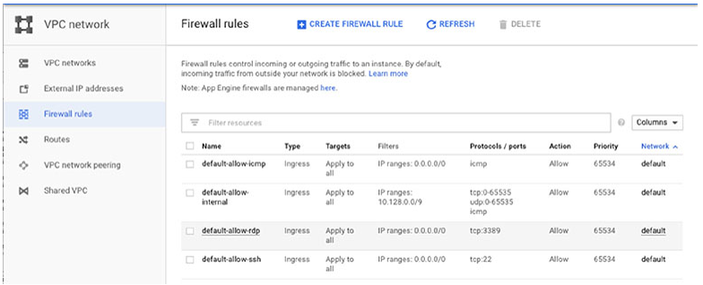

**그림 14.9** Cloud Console에서 VPC 섹션의 방화벽 규칙 리스트

Create Firewall Rule을 클릭하면 신규 방화벽 규칙을 생성할 수 있다. 그림 14.10과 유사한 양식을 확인할 수 있다.

이 양식에서, 방화벽 규칙의 이름과 설명을 지정한다. 로깅을 활성화하거나 비활성화 중 선택할 수 있다. 로깅 정보는 Stackdriver에 캡쳐된다. (Stackdriver 로깅의 더 많은 정보는 챕터 18에서 확인한다.) 또한, 규칙을 적용할 VPC의 네트워크를 지정해야 한다.

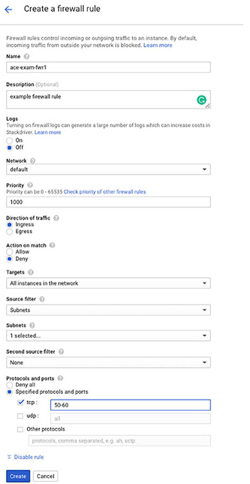

**그림 14.10** 방화벽 규칙 생성 양식

다음, 우선순위, 방향, 동작, 타겟, 소스를 지정해야 한다. 우선순위는 0에서 65535 범위에서 숫자가 될 수 있다. 방향은 igress이거나 egress가 될 수 있다. 동작은 허용하거나 거부가 될 수 있다. 타겟은 드롭다운 메뉴에서 선택한다. 옵션은 그림 14.11과 같다.

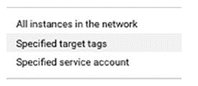

**그림 14.11** 타켓 타입의 리스트

태그나 서비스 계정을 선택하면, 태그나 서비스 계정의 이름을 지정할 수 있다. 또한, IP 범위, 서브넷, 소스 태그, 서비스 계정 중 하나로 source filter를 지정할 수 있다. GCP는 조건을 조합하여 사용하려는 경우 두 번째 source filter를 허용한다. source filter의 리스트는 그림 14.12와 같이 보여준다.

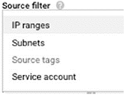

**그림 14.12** source filter 타입의 리스트

마지막으로, 모두 허용 및 지정된 프로토콜, 포트 옵션 중에서 선택하여 프로토콜 및 포트를 지정한다. 후자일 경우, 프로토콜과 포트를 지정할 수 있다.

그림 14.13은 그림 14.10에서 지정된 파라미터를 사용하여 생성된 방화벽 규칙의 리스트를 보여준다.

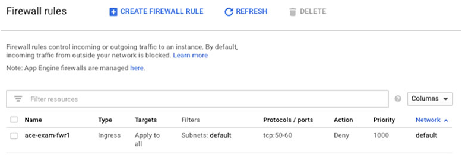

**그림 14.13** 이전 설정을 사용하여 생성된 방화벽 규칙의 리스트

### gcloud를 사용하여 방화벽 규칙 생성

커맨드라이능로 방화벽 규칙을 작업하기위한 명령은 `gcloud compute firewall-rules`이다. 이 명령으로 생성, 삭제, 업데이트, 조회할 수 있다.

`gcloud compute firewall-rules create`와 사용되는 다양한 파라미터가 있다.
* `--action`
* `--allow`
* `--description`
* `--destination-ranges`
* `--direction`
* `--network`
* `--priority`
* `--source-ranges`
* `--source-service-accounts`
* `--source-tags`
* `--target-service-accounts`
* `--target-tags`

예를 들어, 20000에서 25000 포트에 모든 TCP 트래픽을 허용하기 위해 다음과 같이 실행한다.

```bash
gcloud compute firewall-rules create ace-exam-fwr2 --network ace-exam-vpc1 --allow tcp:20000-25000
```

## VPN 생성

VPN은 구글 네트워크에서 자체 네트워크로 네트워크 트래픽을 안전하게 보낼 수 있다. Cloud Console이나 커맨드라인을 사용하여 VPN을 생성할 수 있다.

### Cloud Console로 VPN 생성

Cloud Console을 사용하여 VPN을 생성하기 위해, 콘솔에서 Hybrid Connectivity 섹션을 연다.(그림 14.14)

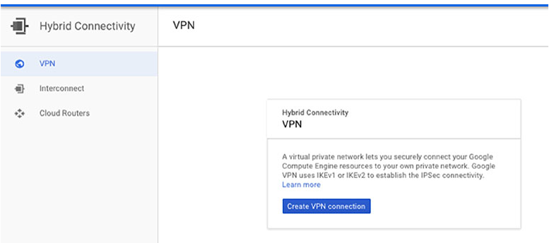

**그림 14.14** Cloud Console의 Hybrid Connectivity 섹션

Create VPN Connection을 클릭하면 그림 14.15와 같은 양식이 표시된다.

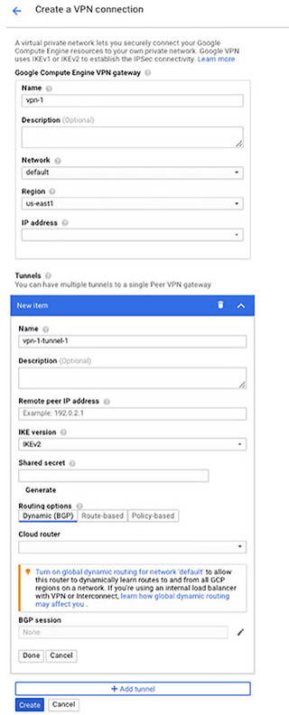

**그림 14.15** VPN 연결 양식 작성

이 양식에서 VPN의 이름과 설명을 지정한다. 구글 Compute Engine VPN Gateway 섹션에서, VPN 연결의 GCP 끝단을 설정한다. 이것은 네트워크, 네트워크를 포함한 region, static IP 주소를 지정한다. IP 주소를 생성하지 않았다면, IP Address 파라미터를 위한 드롭다운 메뉴에서 Create IP Address를 선택하여 생성할 수 있다. (그림 14.16)

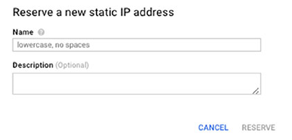

**그림 14.16** static IP주소 생성

Tunnels 섹션에서, VPN의 다른 네트워크 엔드포인트를 설정한다. 자체 네트워크의 VPN 게이트웨이의 이름, 설명, IP주소를 지정한다. 사용할 Internet Key Exchange(IKE)의 버전을 지정할 수 있다. Generate를 생성하면, 브라우저에서 생성할 수 있는 secret 문자열인 공유 secret을 지정해야 한다. VPN 엔드포인트를 구성할 때 이 공유 secret가 필요하다.

Routing Options 섹션에서, Dynamic, Route-Based, Policy-Based Routing을 선택할 수 있다.

Dynamic 라우팅은 네트워크에서 경로를 학습하는 BGP 프로토콜을 사용한다. cloud router를 선택하거나 생성해야 한다. 생성되어있지 않다면, Cloud Router 파라미터의 드롭다운 메뉴에서 Create Cloud Router를 선택할 수 있다. 그림 14.17과 같은 양식이 표시될 것이다.

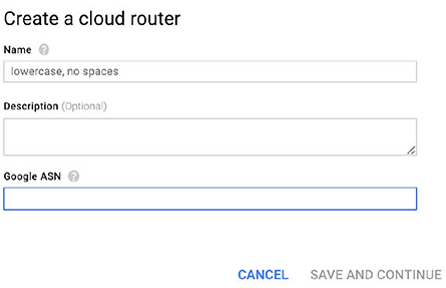

**그림 14.17** cloud router 생성

이 양식에서 이름과 설명을 입력한다. 또한 BGP 프로토콜에서 사용되는 private Autonomous System Number(ASN)을 지정해야 한다. ASN은 64512-65534이거나 4000000000–4294967294 범위의 숫자이다. 각 cloud router는 유니크한 ASN이 필요하다.

route-based 라우팅을 선택하면, 원격 네트워크의 IP 범위를 입력해야 한다. policy-based 라우팅을 선택하면, 원격 IP 범위, VPN을 사용하는 로컬 서브네트워크, 로컬 IP 범위를 입력해야 한다.

### gcloud를 사용하여 VPN 생성

커맨드라인에서 VPN을 생성하기 위해 다음 명령을 사용할 수 있다.
* `gcloud compute target-vpn-gateways`
* `gcloud compute forwarding-rule`
* `gcloud compute vpn-tunnels`

`gcloud compute target-vpn-gateways` 명령의 포맷은 다음과 같다.

```bash
gcloud compute vpn-tunnels create NAME --peer-address=PEER_ADDRESS --shared-secret=SHARED_SECRET --target-vpn-gateway=TARGET_VPN_GATEWAY
```

NAME은 tunnel의 이름이다. PEER_ADDRESS는 원격 tunnel 엔드포인트의 IP~v~4 주소이다. SHARED_SECRET은 secret 문자열이다. TARGET_VPN_GATEWAY는 타겟 VPN 게이트웨이 IP에 대한 참조이다.

`gcloud compute forwarding-rule`의 포맷은 다음과 같다.

```bash
gcloud compute forwarding-rules create NAME --TARGET_SPECIFICATION=VPN_GATEWAY
```

NAME은 forwarding rule의 이름이다. TARGET_SPECIFICATION은 `target-instance`, `target-http-proxy`, `target-vpn-gateway`를 포함한 타겟 타입 중 하나이다. 추가 상세 정보는 [https://cloud.google.com/sdk/gcloud/reference/compute/forwarding-rules/create](https://cloud.google.com/sdk/gcloud/reference/compute/forwarding-rules/create)의 문서를 확인한다.

`gcloud compute vpn-tunnels`의 포맷은 다음과 같다.

```bash
gcloud compute vpn-tunnels create NAME --peer-address=PEER_ADDRESS --shared-secret=SHARED_SECRET --target-vpn-gateway=TARGET_VPN_GATEWAY
```

NAME은 VPN tunnel의 이름이다. PEER_ADDRESS는 원격 tunnel의 IPv4 주소이다. SHARED_SECRET은 secret 문자열이고, TARGET_VPN_GATEWAY는 VPN 게이트웨이에 대한 참조이다.

## Summary

이 챕터는 VPC와 VPN을 생성하는 방법을 확인했다. VPC는 GCP 리소스를 연결하기 위해 구글 클라우드에서 네트워크를 정의한다. GCP의 VPN은 GCP 네트워크와 자체 내부 네트워크를 연결하는데 사용된다. VPC, shared VPC, subnets을 생성하는 방법을 논의했다. CIDR 표기법의 설명도 있다. 또한, 커스텀 네트워크 연결과 함께 VM을 설정하는 방법을 배웠다. 다음으로 방화벽 규칙과 규칙을 생성하는 방법을 배웠다. 이 챕터는 VPN을 생성하는데 필요한 단계를 설명하고 마무리했다.

## 시험 요소

**VPC는 클라우드에서 논리적 데이터 센터이고, VPN은 VPC 서브넷과 자체 내부 네트워크간 보안 연결이다.** 클라우드 리소스는 VPC내에 있다. VPC는 서브넷과 서브넷간 트래픽을 라우팅하기 위한 라우팅 규칙이 있다. 방화벽 규칙을 사용하여 트래픽의 흐름을 제어한다.

**VPC는 auto 모드에 있을 때, 각 region에 서브넷을 생성한다.** 추가적으로 서브넷을 생성할 수 있다. 각 서브넷은 IP 주소의 범위를 갖고 있다. 방화벽 규칙은 네트워크라고도 하는 서브넷에 적용된다. 라우터는 regional 경로나 global 경로만 학습하도록 설정될 수 있다.

**CIDR 표기법을 읽고 계산하는 방법을 이해해야한다.** CIDR 표기법은 서브넷 마스크와 IP 주소 범위에서 사용할수 있는 IP 주소의 크기를 표현한다. CIDR 블록에서 슬래쉬 뒤에 있는 숫자인 서브넷 마스크 사이즈가 작을수록, 더 많은 IP 주소를 사용할 수 있다. CIDR 주소의 포맷은 IP 주소 위에 슬래쉬가 있고, 그 뒤에 서브넷 마스크의 사이즈가 있다. 예를 들어, 10.0.0.0/8

**VPC는 `gcloud` 명령을 사용하여 생성될 수 있다.** VPC는 `gcloud compute networks create`로 생성될 수 있다. shared VPC는 `gcloud compute shared-vpc`를 사용하여 생성될 수 있다. Shared VPC는 조직이나 폴더 수준에서 공유된다. Shared VPC Admin roles을 활성화하는 조직이나 폴더 수준에서 IAM 정책을 할당해야 한다. VPC peering은 내부 프로젝트간 연결을 위해 사용된다.

**VM에 네트워크 인터페이스를 추가할 수 있다.** 특정 서브넷을 사용하여 인터페이스를 설정할 수 있다. 임시 혹은 static IP주소를 할당할 수 있다.

**방화벽 규칙은 네트워크 트래픽의 흐름을 제어한다.** 방화벽 규칙은 direction, priority, action, target, source/destination, protocols, port, enforcement status로 구성된다. 방화벽 규칙은 서브넷에 적용된다.

**Cloud Console로 VPN을 생성하는 방법을 알아야 한다.** VPN은 클라우드 리소스와 자체 내부 네트워크간 트래픽을 라우팅한다. VPN은 gateway, forwarding ruls, tunnels을 포함한다.

[맨 위로](#chapter-14-cloud-%eb%84%a4%ed%8a%b8%ec%9b%8c%ed%81%ac-vpcvirtual-private-cloud%ec%99%80-vpnvirtual-private-networks)