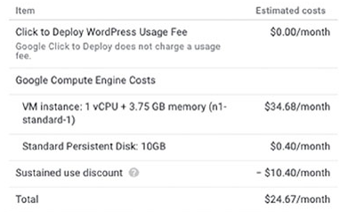

# Chapter 16 Cloud Launcher와 Deployment Manager로 어플리케이션 배포

**이 챕터는 구글 Associate Cloud Engineer 인증 시험 과목 중, 아래 내용을 다룬다.**
* 3.6 Cloud Launcher를 사용하여 솔루션 배포
* 3.7 Deployment Manager를 사용하여 어플리케이션 배포

시험 가이드문서에서 computing, storage, networking 리소스를 배포하는 방법을 배웠고, 이제는 어플리케이션을 배포하는 것에 중점을 둔다. Cloud Launcher는 구글 클라우드에서 배포할 준비가 된 어플리케이션을 찾을 수 있는 GCP의 마켓플레이스이다.

구글은 Cloud Launcher에 Marketplace라는 새로운 이름을 부여했다. Associate Cloud Engineer Certification 가이드는 서비스를 Cloud Launcher라고 부른다. 그래서 이 챕터에서는 계속 Cloud Launcher라고 한다. 구글 클라우드에서 보유한 커스텀 어플리케이션을 실행할 수 있도록 템플릿을 구성하는 Deployment Manager를 사용하는 방법을 확인한다. Cloud Launcher와 Deployment Manager는 사용자가 어플리케이션과 리소스 구성 없이 필요 compute, storage, network 리소스를 배포할 수 있다. 

## Cloud Launcher를 사용하여 솔루션 배포

Cloud Launcher는 GCP 환경에 배포될 수 있는 어플리케이션과 데이터 셋의 중앙 저장소이다. Cloud Launcher로 작업하는 것은 2단계 프로세스가 있다. 필요한 솔루션을 찾고, 솔루션을 배포

### Cloud Launcher를 탐색하고 솔루션 조회

Cloud Launcher에서 사용할 수 있는 솔루션을 조회하기 위해, Marketplae 세션을 연다. Marketplace는 Cloud Console에서 Cloud Launcher 페이지를 위한 또다른 이름이다. 그림 16.1과 같은 페이지가 표시된다.


**그림 16.1** Cloud Launcher 메인 페이지

Cloud Launcher의 메인 페이지는 몇몇 추천 솔루션을 보여준다.

그림 16.1에서 보여지는 솔루션은 SAP HANA, NVDIA 딥 러닝 어플리케이션, Palo Alto networks firewall package를 포함한다. 또한 Linux, Apache, MySQL, PHP(LAMP) 스택과 워드프레스 블로그 플랫폼을 포함하여 유명한 오픈소스 시스템이 있다. 

솔루션의 리스트를 확인하기 위해 필터로 탐색하거나 검색할 수 있다. 그림 16.2는 사용할 수 있는 솔루션의 카테고리를 보여준다.


**그림 16.2** 카테로기 필터링

특정 카테고리를 선택하여 메인 페이지에 표시된 솔루션 범위를 좁힐 수 있다. 예를 들어, 데이터 셋만 확인하려고 필터하면 그림 16.3같은 데이터셋의 리스트를 확인할 수 있다.


**그림 16.3** Cloud Launcher에서 사용할 수 있는 데이터 셋

그림 16.4는 사용가능한 OS의 리스트이다.


**그림 16.4** Cloud Launcher에서 이용할 수 있는 OS

더 나아가 라이센스 타입으로 OS 리스트를 필터할 수 있다. 라이센스 타입은 free, paid, Bring Your Own License(BYOL)이 있다. Free OS는 Linux, FreeBSD 옵션을 포함한다. paid OS는 Windows OS와 Enterprise Linux를 포함한다. 사용량을 기반으로 비용이 부과되고, 비용은 GCP billing에 포함될 것이다. BYOL 옵션은 소프트웨어를 실행하기 위한 유효한 라이센스를 필요로하는 2개의 지원되는 Linux OS가 포함된다. 소프트웨어를 실행하기 전에 라이센스를 취득할 책임이 있다.

그림 16.5는 Cloud Launcher에서 사용할 수 있는 개발도구의 샘플을 보여준다. 워드프레스, 백업 및 복구 어플리케이션, 문서 관리 시스템을 포한한다.


**그림 16.5** Cloud Launcher에서 사용할 수 있는 개발자 도구

**Notice**

> 2개의 워드프레스 옵션이 있다. Cloud Launcher는 다양한 벤더에 의해서 제동되는 동일한 어플리케이션을 갖을 수 있다. 필요에 가장 적합한 하나를 찾아서 각 옵션의 설명을 검토하는 것이 좋다.

Cloud Launcher에서 조회된 솔루션과 함께 제공되는 여러 정보를 살펴보자. 그림 16.6은 사용가능한 정보의 묶음을 보여준다. overview, 가격 정보, 패키지 내용에 대한 상세 정보를 포함한다. 또한 솔루션이 GCP 내에서 실행될 위치에 대한 정보가 있다.


**그림 16.6** 워드프레스 솔루션의 Overview 페이지

페이지의 왼쪽에는 솔루션 내용의 상세 정보가 나열된다. 그림 16.7은 Apache 웹 서버, MySQL, PHP 컴포넌트를 포함한 워드프레스 패키지의 내용을 보여준다. 또한 리스트는 OS와 사용할 리소스의 타입을 지정한다.


**그림 16.7** 솔루션 패키지의 내용 상세정보

페이지의 오른쪽에는 가격 정보가 있다. (그림 16.8) VM, persistent disk, 다른 리소스의 비용을 포함하여 구성된 대로 한달동안 실행하기 위한 예상 비용이다. 또한 예상 가격은 사용된 리소스의 시간을 기반으로 임계치에 도달할 때 적용되는 GCP 리소스의 지속적인 사용에 대한 할인이 포함된다.



**그림 16.8** 워드프레스 솔루션을 위해 예상되는 가격

### Cloud Launcher 솔루션 배포

필요한 솔루션을 식별한 후, Cloud Launcher에서 실행할 수 있다.

실행할 제품의 overview 페이지로 간다. (그림 16.9)


**그림 16.9** 제품의 overview 페이지에서 Cloud Launcher 솔루션을 실행한다.

그림 16.10과 같은 양식이 표시된다.


**그림 16.10** Cloud Launcher에서 워드프레스 솔루션을 위한 실행 양식

양식의 내용을 어플리케이션마다 다르다. 하지만, 많은 파라미터는 솔루션 전반적으로 공통적이다. 이 양식에서, deployment를 위한 이름, zone, 사전에 정의된 machine type을 지정한다. 또한, 관리자 이메일을 반드시 지정해야 한다. 선택적으로 워드프레스와 다른 PHP 어플리케이션의 관리를 도와주는 phpMyAdmin이라고 불리는 PHP 툴을 설치할 수 있다.

persistent disk의 타입과 사이즈를 선택할 수 있다. 이 예시에서, 솔루션은 3.75GB의 메모리를 갖는 1 vCPU 서버와 standard persistent disk를 사용하는 10GB의 부트 디스크를 배포한다. 원한다면, 부트디스크로 SSD 디스크를 선택할 수 있다. 또한 부트 디스크의 사이즈를 변경할 수 있다.

Networking 섹션에서, VM을 실행하기 위한 네트워크와 서브넷을 지정할 수 있다. 또한 HTTP와 HTTPS 트래픽을 허용하는 방화벽 규칙을 설정할 수 있다.

Networking 섹션 아래에 More link를 확장하면, IP 주소 구성을 위한 옵션을 확인할 수 있다. (그림 16.11) ehpemeral external IP나 no external IP를 선택할 수 있다. 웹사이트를 호스팅하려면, external 주소를 선택하면 사이트는 GCP 프로젝트 외부에서 접근할 수 있다. Static IP는 옵션이 아니다. 또한 HTTP와 HTTPS 트래픽을 위한 source IP 범위를 지정할 수 있다.


**그림 16.11** IP 구성을 위한 추가 파라미터

이전에 설명한 파라미터 이외에도, 실행 페이지는 overview 정보를 표시한다. (그림 16.12)


**그림 16.12** 솔루션 overview는 실행 양식을 보여준다.

Deploy 버튼을 클릭하여 deployment를 실행한다. Deployment Manager가 오픈되고, deployment의 진행상황을 보여준다. (그림 16.13)


**그림 16.13** 워드프레스를 실행하는 Cloud Deployment Manager

실행 프로세스가 완료되면, deployment에 대한 요약 정보를 확인할 수 있고, 어드민 페널을 실행하는 버튼이 있다. (그림 16.14)


**그림 16.14** 배포된 워드프레스 인스턴스에 대한 정보

Log Into The Admin Panel 버튼을 클릭하면 워드프레스 로그인 페이지가 표시된다. (그림 16.15) deployment가 완료된 후 정보 양식에서 제공된 username과 임시 비밀번호를 사용하여 로그인한다.


**그림 16.15** 워드프레스 로그인

## Deployment Manager를 사용하여 어플리케이션 배포

Cloud Launcher에서 조회된 솔루션을 실행하는 것 이외에도, 자체 솔루션 구성 파일을 생성해서 사용자가 사전 정의된 솔루션을 실행할 수 있다.

### Deployment Manager 구성 파일

Deployment Manager 구성 파일은 YAML 문법으로 작성된다. 구성 파일은 resource로 시작하여 3개의 필드를 사용하여 정의된 리소스 엔티티가 있다.

* `name`, 리소스의 이름
* `type`, compute.v1.instance와 같은 리소스의 타입
* `properties`, 리소스를 위한 구성 파라미터를 지정하는 key-value 쌍. 예를 들어, VM은 machine type, disk, network 인터페이스를 지정하는 프로퍼티를 갖는다.

**Notice**

> YAML 문법에 대한 정보를 위해 공식 문서를 참고해라. [https://yaml.org/start.html](https://yaml.org/start.html)

`ace-exam-deployment-vm` VM을 구성하는 단순한 예시

```yaml
resource:
- type: compute.v1.instance
  name: ace-exam-deployment-vm
```

다음, machine type, disk 구성, network 인터페이스 같은 프로퍼티를 추가한다.

구성파일의 프로퍼티 센션은 properties로 시작한다. 각 프로퍼티는 key-value 쌍이나 key-value 쌍의 리스트이다. machine type 프로퍼티는 하나의 key로 machineType을 갖는 key-value 쌍이다. Disk는 다양한 프로퍼티를 갖는다. 그래서 disks 용어 뒤에 key-value 쌍의 리스트가 있다. 계속해서 ace-exam-deployment-vm의 예시의 구조는 다음과 같다.

```yaml
resource:
- type: compute.v1.instance
  name: ace-exam-deployment-vm
  properties:
    machineType: [MACHINE_TYPE_URL]
    disks:
      [KEY]:[VALUE]
      [KEY]:[VALUE]
```

이 예시에서, machine type은 Google API 리소스 사양의 URL이다. 

```
https://www.googleapis.com/compute/v1/projects/[PROJECT_ID]/zones/us-central1-f/machineTypes/f1-micro
```

[PROJECT_ID]에 대한 참조가 있으며, 구성파일에서 실제 프로젝트 ID로 대체된다. Disk는 `deviceName`, `type`, 디스크가 부스 디스크인지, autodeleted가 되어야하는지 가리지는 Booleans과 같은 프로퍼티를 갖는다. machine type 사양과 일부 disk 프로퍼티를 추가하여 이전 예시를 살펴보자

```yaml
resources:
- type: compute.v1.instance
  name: ace-exam-deployment-vm
  properties:
     machineType: https://www.googleapis.com/compute/v1/projects/[PROJECT_ID]/zones/us-central1-f/machineTypes/f1-micro
     disks:
     - deviceName: boot
       type: PERSISTENT
       boot: true
       autoDelete: true
```

Listing 16.1은 구글 Deployment Manager 문서에서 완전한 구성 파일을 보여준다. 다음 코드는 [https://cloud.google.com/deployment-manager/docs/quickstart](https://cloud.google.com/deployment-manager/docs/quickstart) (source: [https://github.com/GoogleCloudPlatform/deploymentmanager-samples/blob/master/examples/v2/quick_start/vm.yaml](https://github.com/GoogleCloudPlatform/deploymentmanager-samples/blob/master/examples/v2/quick_start/vm.yaml))에서 사용할 수 있다.

**Listing 16.1**: examples/v2/quick_start/vm.yaml

```yaml
# Copyright 2016 Google Inc. All rights reserved.#
# Licensed under the Apache License, Version 2.0 (the "License");
# you may not use this file except in compliance with the License.
# You may obtain a copy of the License at
#
#     http://www.apache.org/licenses/LICENSE-2.0

#
# Unless required by applicable law or agreed to in writing, software
# distributed under the License is distributed on an "AS IS" BASIS,
# WITHOUT WARRANTIES OR CONDITIONS OF ANY KIND, either express or implied.
# See the License for the specific language governing permissions and
# limitations under the License.


# Put all your resources under 'resources:'. For each resource, you need:
# - The type of resource. In this example, the type is a Compute VM instance.
# - An internal name for the resource.
# - The properties for the resource. In this example, for VM instances, you add
#   the machine type, a boot disk, network information, and so on.
#
# For a list of supported resources,
# see https://cloud.google.com/deployment-manager/docs/configuration/supported-resource-types


resources:
- type: compute.v1.instance
  name: quickstart-deployment-vm
  properties:
    # The properties of the resource depend on the type of resource. For a list
    # of properties, see the API reference for the resource.
    zone: us-central1-f
    # Replace [MY_PROJECT] with your project ID
    machineType: https://www.googleapis.com/compute/v1/projects/[MY_PROJECT]/zones/us-central1-f/machineTypes/f1-micro
    disks:
    - deviceName: boot
      type: PERSISTENT
      boot: true
      autoDelete: true
      initializeParams:
      # Replace [FAMILY_NAME] with the image family name.
      # See a full list of image families at
      # https://cloud.google.com/compute/docs/images#os-compute-support

      sourceImage: https://www.googleapis.com/compute/v1/projects/debian-cloud/global/images/family/[FAMILY_NAME]
    # Replace [MY_PROJECT] with your project ID
    networkInterfaces:
    - network: https://www.googleapis.com/compute/v1/projects/[MY_PROJECT]/global/networks/default
      # Access Config required to give the instance a public IP address
      accessConfigs:
      - name: External NAT
        type: ONE_TO_ONE_NAT
```

이 구성은 `us-central1-f` zone에서 실행되는 `quickstart-deployment-vm` 이름의 deployment를 지정한다. deployment는 리눅스의 Debian 배포판를 실행하는 `f1-micro`를 사용한다. external IP 주소가 할당된다.

템플릿을 실행하기 전에, [MY_PROJECT]를 프로젝트 ID로 대체하고, [FAMILY_NAME] debian-9와 같은 Debian 이미지 family의 이름으로 대체한다. Cloud Console의 Compute Engine 섹션의 Images 탭에서 image의 리스트를 확인할 수 있다. 또한 `gcloud compute images list` 명령을 사용하여 이미지를 조회할 수 있다.

### Deployment Manager 템플릿 파일

deployment 구성이 복잡해지고 있다면, deployment 템플릿을 사용할 수 있다. 템플릿은 리소스를 정의하고, 해당 리소스를 구성 파일로 가져오는 데 사용하는 또 다른 텍스트 파일이다. 다양한 곳에서 리소스 정의를 재사용할 수 있다. 템플릿은 Python이나 Jinja2로 작성된다.

**Notice**

> Jinja2 문법에 정보를 위해서는 공식 문서를 확인한다. [http://jinja.pocoo.org/docs/2.10/](http://jinja.pocoo.org/docs/2.10/)

Associate Cloud Engineer로서, 템플릿이 비교적 단순하지 않은 경우, Python을 사용하여 템플릿 파일을 만드는 것이 좋다. 어떤 경우에는 Jinja2를 사용하는 것이 좋다.

### Deployment Manager 템플릿을 실행

`gcloud deployment-manager deployments create` 명령을 사용하여 deployment 템플릿을 실행할 수 있다. 예를 들어, Google 문서에서 템플릿을 배포하기 위해 다음과 같이 사용한다.

```bash
gcloud deployment-manager deployments create quickstart-deployment --config vm.yaml
```

또한 `describe` 명령으로 deployment의 상태를 설명할 수 있다.

```bash
gcloud deployment-manager deployments describe quickstart-deployment
```

## Summary

Cloud Launcher와 Cloud Deployment Manager는 GCP에 리소스를 배포하는데 쉽게 만든다. Cloud Launcher는 3rd 파티 벤더가 독점 또는 오픈소스 소프트웨어 기반으로 배포할 수 있는 어플리케이션을 제공할 수 있는 장소이다. 어플리케이션이 Cloud Launcher에 배포되었을 때, VM, storage buckets, persistent disk와 같은 리소스는 추가 동작 없이 자동적으로 생성된다. Deployment Manager는 클라우드 엔지니어에게 배포하려는 자원을 설명하는 구성 파일을 정의하는 기능을 제공한다. 정의되면, 클라우드 엔지니어는 리소스를 배포하고 상태를 조회하기 위해 `gcloud` 명령을 사용할 수 있다. Deployment Manager는 GCP 리소스를 구성하는 방법의 상세 정보를 이해하기 위해 해당 리소스의 사용자를 요구하지 않고 리소스를 쉽게 배포하기 원하는 조직에서 특히 유용하다.

## 시험 요소

**Cloud Console의 Cloud Launcher 섹션을 사용하여 솔루션을 찾는 방법을 이해해야 한다.** OS와 개발자 도구와 같은 특정 솔루션의 검색으로 좁히기 위해 필터를 사용할 수 있다. 워드프레스와 같은 하나의 어플리케이션을 위한 다양한 옵션이 있다. 다양한 벤터가 구성을 제공하기 때문이다. 각각의 설명을 검토하여 요구에 가장 적합한 것을 이해해야 한다.

**Cloud Launcher에서 솔루션을 배포하는 방법을 알아야 한다.** Cloud Console에서 Cloud Launcher deployment를 구성하는 방법을 이해해야 한다. 솔루션을 실행할 때, 어플리케이션 별로 구성을 요구하는 메시지가 표시될 수도 있다. 예를 들어, 워드프레스에 phpMyAdmin을 설치하는 메시지가 표시될 수 있다. machine type과 부트 디스크 타입과 같이 공통 구성 속성을 구성하는 기회일 수 있다.

**deployment를 모니터링하기 위해 콘솔의 Deployment Manager 섹션을 사용하는 방법을 이해해야 한다.** 구성을 실행한 후 사용 준비가 될 때까지 몇 분이 걸릴 수 있다. 어플리케이션이 준비되면, username과 password와 같은 추가 정보를 제공할 수도 있다.

**Deployment Manager는 어플리케이션과 함께 사용할 리소스를 정의하는 구성 파일을 생성하기 위한 GCP 서비스이다.** 이러한 설정 파일은 YAML 문법을 사용한다. 리소스의 프로퍼티를 정의하는 key-value 쌍을 사용하여 리소스 명세서를 작성한다.

**구성 파일의 리소스는 name, type, properties set을 사용하여 정의된다.** 프로퍼티는 타입이 다양하다. machine type은 region에서 사용할 수 있는 machine의 타입을 지정하는 URL만 사용하여 정의될 수 있다. Disk는 device name, type, disk가 부트 디스크인지 아닌지를 포함한 다양한 프로퍼티를 갖는다.

구성 파일이 너무 길거나 복잡하면, 템플릿을 사용하여 모듈화할 수 있다. 템플릿은 리소스를 정의하고 다른 템플릿을 가져올 수 있다. 템플릿은 Jinja2나 Python으로 작성된 텍스트 파일이다.

`gcloud deployment-manager deployments create`**를 사용하여 deployment 구성 파일을 실행할 수 있다.** `gcloud deployment-manager deployments-describe`를 사용하여 deployment의 상태를 확인할 수 있다.

[맨 위로](#chapter-16-cloud-launcherd%ec%99%80-deployment-manager%eb%a1%9c-%ec%96%b4%ed%94%8c%eb%a6%ac%ec%bc%80%ec%9d%b4%ec%85%98-%eb%b0%b0%ed%8f%ac)