# Chapter 17 접근 및 보안 구성

**이 챕터는 구글 Associate Cloud Engineer 인증 시험 과목 중, 아래 내용을 다룬다.**
* 5.1 Identity and Access Management(IAM) 관리
* 5.2 service accounts 관리
* 5.3 프로젝트와 관리 서비스를 위한 감시로그 조회

구글 클라우드 엔지니어는 접근 제어 작업에 상당한 양의 시간을 소비할 수 있다. 이 챕터는 IAM 할당 관리, 커스텀 roles 생성, service account 관리, 감시 로그 조회를 포함하여 몇가지 일반적인 작업을 수행하는 방법에 대한 지침을 제공한다.

사용자, 그룹, 서비스계정에 수행 권한을 할당하는 기본 방법은 IAM 시스템을 통하는 것이다. 그러나, 구글 클라우드에 항상 IAM이 있는 것은 아니다. 그 전에, 수행 권한은 primitive roles로 알려진 것을 사용하여 할당 받으며, 상당히 coarse-grained(큰 단위로 수행)이다. Primitive roles은 사용자가 원하는 것보다 더 많은 수행 권한이 있을 수 있다. scopes를 사용하여 수행 권한을 제한할 수 있다. 이 챕터에서는 primitive roles과 scopes뿐만 아니라 IAM을 사용하는 방법을 설명한다. 앞으로, 접근 제어를 위한 IAM를 사용하는 것이 가장 좋다.

## IAM 관리

IAM을 작업할 때, 수행해야할 몇 가지 공통 업무가 있다.
* IAM 할당 계정 조회
* IAM roles 할당
* 커스텀 roles 정의

각 업무를 수행하는 방법을 살펴보자

### IAM 할당 계정 조회

Cloud Console에서 IAM & Admin 섹션을 열어서 IAM 할당 계정을 조회할 수 있다. 이 섹션에서, 메뉴에서 IAM을 선택하면 그림 17.1과 같은 양식이 표시된다. 그림의 예시는 member 이름으로 필터링된 ID의 리스트를 보여준다.

이 예시에서, dan@gcpcert.com 사용자는 3개의 roles을 갖고 있다: App Engine Admin, BigQuery Admin, Owner. App Engine Admin과 BigQuery Admin은 사전 정의된 IAM roles이다. Owner는 primitive role이다.


**그림 17.1** member로 필터링된 수행관한 리스트

Primitive roles는 IAM 이전에 사용된다. 3가지 primitive roles이 있다: owner, editor, viewer. Viewer는 read-only 동작을 수행하는 권한이다. Editor는 viewer 권한과 엔티티를 수정하는 권한을 갖는다. Owner는 editor 권한을 갖고, 엔티티의 role과 수행 권한을 관리할 수 있다. Owner는 프로젝트의 billing도 설정할 수 있다.

IAM roles는 수행 권한의 집합이다. 작업을 수행하는 데 필요한 권한만으로 ID를 제공하도록 맞춰져있다. role이 할당된 사용자의 리스트를 확인하기 위해서, IAM 양식에서 Roles 탭을 클릭한다. (그림 17.2)

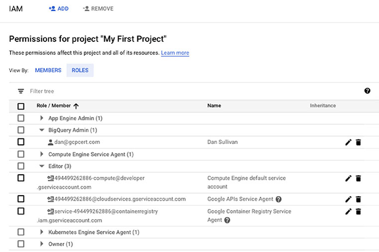

**그림 17.2** App Engine Admin과 Editor가 할당된 ID의 리스트

이 양식은 괄호 안에 role이 할당된 ID의 수와 함께 role의 리스트를 보여준다. role 이름 옆에 화살표를 클릭하면 role과 함께 ID의 리스트가 표시된다. primitive와 IAM 사전 정의 role은 모두 리스트에 포함된다.

또한 `gcloud projects get-iam-policy` 명령을 사용하여 프로젝트에 할당된 사용자와 role의 리스트를 확인할 수 있다. 예를 들어, `ace-exam-project` 프로젝트 ID와 함께 프로젝트에서 사용자에게 할당된 role을 확인하려면, 다음과 같이 사용한다.

```bash
gcloud projects get-iam-policy ace-exam-project
```

사전 정의된 role은 서비스와 그룹화된다. 예를 들어, App Engine은 5가지 role이 있다.
* App Engine Admin, 어플리케이션과 구성 설정을 읽고, 쓰고, 수정하는 권한. `gcloud` 명령에서 사용되는 role 이름은 `roles/appengine.admin` 이다.
* App Engine Service Admin, 구성 설정에 대한 read-only 접근 권한과, 모듈과 버전 수준의 설정에 대한 write 접근 권한을 부여한다. `gcloud` 명령에서 사용되는 role 이름은 `roles/appengine.serviceAdmin`이다.
* App Engine Deployer, 어플리케이션 구성 및 설정에 read-only 접근 권한과 신규 버전을 생성하기 위한 write 접근 권한을 부여한다. App Engine Deployer만 갖는 사용자는 기존 버전을 수정하거나 삭제할 수 없다. `gcloud` 명령에서 사용되는 role 이름은 `roles/appengine.deployer` 이다.
* App Engine Viewer, 어플리케이션 구성 및 설정에 read-only 접근 권한을 부여한다. `gcloud` 명령에서 사용되는 이름은 `roles/appengine.appViewer`이다.
* App Engine Code Viewer, 모든 어플리케이션 구성, 설정, 배포된 소스코드에 대한 read-only 접근 권한을 부여한다. `gcloud` 명령에서 사용되는 이름은 `roles/appengine.codeViewer`이다.

**Notice**

> 모두를 알아야하진 않지만, 어떻게 정의되는지 이해하기 위해 사전 정의된 roles을 확인해 보는 것을 도움이 된다. 더 상세한 정보는 구글 클라우드 문서를 확인한다. ([https://cloud.google.com/iam/docs/understanding-roles](https://cloud.google.com/iam/docs/understanding-roles))

### 계정 및 그룹에 IAM roles 할당

계정과 그룹에 IAM role을 추가하기 위해 콘솔의 IAM & Admin 섹션을 연다. 메뉴에서 IAM을 선택하고, 뒤쪽에 Add 링크를 클릭하면 그림 17.3과 같은 양식이 표시된다.

New Member 파라미터에 사용자나 그룹의 이름을 입력한다. Select A Role을 클릭하면 role을 추가할 수 있다. 다수의 role을 추가할 수 있다. Role 파라미터의 화살표를 클릭하면, 서비스의 리스트와 관련 role을 확인할 수 있다. 리스트에서 role을 선택할 수 있다. 그림 17.4는 BigQuery의 role을 보여주는 리스트의 예시이다.

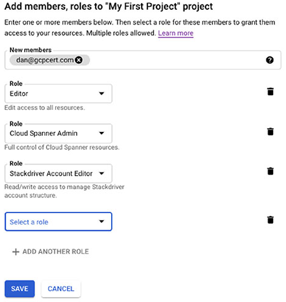

**그림 17.3** IAM에서 Add 옵션은 하나 이상의 role을 사용자나 그룹에 할당할 수 있는 곳이다.

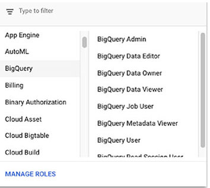

**그림 17.4** Role 파라미터의 드롭다운 메뉴는 서비스에 그룹화된 사용할 수 있는 role을 보며준다.

역할을 할당할 때 부여되는 최소 단위의 권한을 알고 싶다면, 커맨드라인이나 콘솔에서 권한을 조회할 수 있다. 또한 `gcloud iam roles describe` 명령을 사용하여 role이 할당된 수행권한을 확인할 수 있다. 예를 들어, 그림 17.5는 App Engine Deployer role의 수행 권한 리스트를 보여준다.

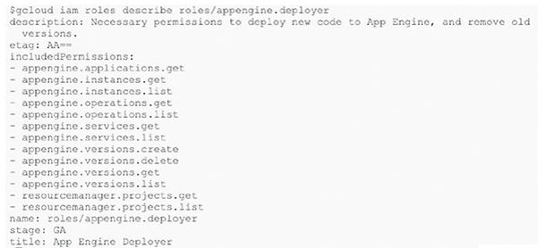

**그림 17.5** `gcloud iam roles describe` 명령을 사용하여 수행 권한 조회 예시

또한 수행 권한을 확인하기 위해 Cloud Console을 사용할 수 있다. IAM & Admin 섹션을 열고 메뉴에서 Roles을 선택한다. role의 리스트가 표시된다. role 이름 옆에 체크박스를 클릭하면 오른쪽에 수행권한의 리스트가 표시된다. 그림 17.6은 App Engine Deployer를 보여준다.

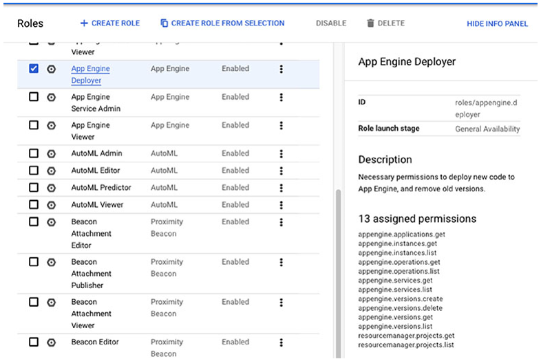

**그림 17.6** Cloud Console을 사용하여 App Engine Deployer를 위해 사용할 수 있는 수행 권한 리스트 예시

다음 명령을 사용하여 프로젝트 멤버에게 role을 할당할 수 있다.

```bash
gcloud projects add-iam-policy-binding [RESOURCE_NAME] --member user:[USER_EMAIL] --role [ROLE_ID]
```

예를 들어, jane@aceexam.com ID 사용자에게 App Engine Deployer role을 부여하려면 다음과 같이 사용한다.

```bash
gcloud projects add-iam-policy-binding ace-exam-project --member user:jane@aceexam.com --role roles/appengine.deployer
```

>> **실 사용 시나리오**  
>> **IAM roles은 최소 권한과 업무 분리를 지원한다.**  
>
> 두 가지 보안 사례는 최소 권한을 할당하고, 업무의 분리를 유지하는 것이다. 최소 권한의 원힉은 필요한 업무를 수행하는 사용자나 서비스 계정을 위해 요구되는 수행 권한의 가장 작은 집합만 부여하는 것이다. 예를 들어, 사용자가 데이터베이스 read 권한만 필요한데 모든 작업을 할 수 있으면, write 권한이 없어야 한다.

업무 분리 경우, 단일 사용자는 위험을 초래할 수 있는 여러가지 민감한 작업을 수행할 수 없어야 한다. 금융이나 방위같이 높은 위험의 도메인에서는 개발자가 어플리케이션을 수정하고, 리뷰없이 제품의 변경을 배포하는 것을 원하지 않는다. 예를 들어, 악의적인 엔지니어는 자금이 악의적인 엔지니어가 제어하는 은행 계좌로 이체될 때, 어플리케이션의 로깅을 막도록 어플리케이션을 수정할 수 있다. 그 엔지니어가 상용에서 코드를 입력하면, 로깅이 막혀있고, 사기적인 거래가 있었다는 것을 발견하기 전까지 어느정도 시간이 걸리 수 있다.

IAM role은 사전 정의된 role에 최소한의 권한을 할당하는 최소 권한을 지원한다. 또한 일부 사용자가 코드를 변경하고, 다른 사람이 코드를 배포할 수 있는 업무 분리도 지원한다.

또다른 일반적인 보안 방법은 심층적인 방어이며, 여러 개의 겹치는 보안 제어를 적용한다. 또한 채택되어야하는 관행이다. IAM은 방어의 레이어 중 하나로 적용될 수 있다.

### 커스텀 IAM role 정의

사전 정의된 IAM role이 요구를 충족하지 않는다면, 커스텀 role을 정의할 수 있다.

Cloud Console에서 커스텀 role을 정의하기 위해, 콘솔의 IAM & Admin 섹션에서 Roles 옵션을 연다. 페이지 위쪽에 Create Role 링크를 클릭하면 그림 17.7과 같은 양식이 표시된다.

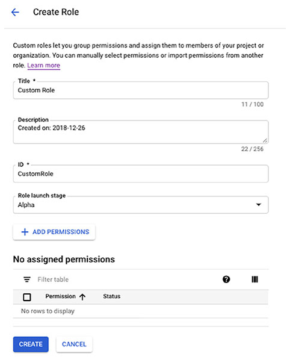

**그림 17.7** Cloud Console에서 role 생성

이 양식에서 커스텀 role의 이름, description, identifier, launch stage, set of permissions를 지정할 수 있다. launch stage 옵션은 다음과 같다: Alpha, Beta, General Availability, Disabled.

Add Permissions를 클릭하면 permission의 리스트가 표시된다. 그림 17.8은 App Engine Admin role 권한만 포함하도록 필터링되었다.

리스트에 role의 모든 수행 권한이 포함하지만, 모든 수행 권한이 커스텀 role에서 사용할 수 있는 것은 아니다. 예를 들어, `appengine.runtimes.actAsAdmin`은 커스텀 role에서 사용할 수 없다. 수행 권한을 사용할 수 없을 때, 상태가 Not Supported로 표시된다. 사용할 수 있는 수행권한은 Supported로 표시된다. 이 예시에서 모든 수행권한은 사용할 수 있다. 수행 권한 옆에 체크박스를 클릭하면 커스텀 role에 포함된다. Add를 클릭하여 Create Role 양식으로 돌아가면, 수행권한 리스트에 선택한 권한이 포함된다. (그림 17.9)

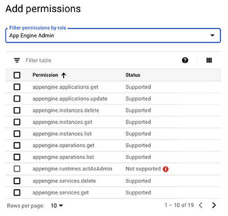

**그림 17.8** role로 필터링된 사용할 수 있는 수행권한 리스트

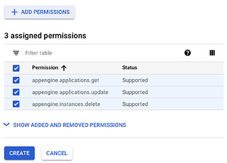

**그림 17.9** 추가된 수행권한이 있는 Create Role 양식의 수행권한 섹션

또한 `gcloud iam roles create` 명령을 사용하여 커스텀 role을 정의할 수 있다. 명령의 구조는 다음과 같다.

```bash
gcloud iam roles create [ROLE-ID] --project [PROJECT-ID] --title [ROLE-TITLE] \
--description [ROLE-DESCRIPTION] --permissions [PERMISSIONS-LIST] --stage [LAUNCH-STAGE]
```

예를 들어, App Engine 어플리케이션 업데이트 권한만 갖는 role을 생성하기 위해, 다음 명령을 사용할 수 있다.

```bash
gcloud iam roles create customAppEngine1 --project ace-exam-project --title='Custom Update App Engine' \
--description='Custom update' --permissions=appengine.applications.update --stage=alpha
```

## 서비스 계정 관리

서비스 계정은 사용자의 독립적인 ID를 제공하는데 사용한다. 서비스 계정은 role을 부여할 수 있는 ID이다. 서비스 계정은 VM에 할당된 다음, 작업을 수행하는 서비스 계정에 사용할 수 있는 권한을 사용한다.

클라우드 엔지니어는 scope 작업, VM에 서비스계정 할당, 다른 프로젝트에 서비스 계정에 대한 접근 권한 부여를 수행하는 방법을 알고 있어야 한다.

### Scope가 있는 서비스 계정 관리

scopes는 일부 동작을 수행하는 VM에 부여된 권한이다. Scopes는 API 메소드에 접근을 승인한다. VM에 할당된 서비스 계정은 관련된 role이 있다. VM에 대한 접근 제어를 구성하기 위해, IAM roles과 scope 둘다 구성해야 한다. IAM roles를 관리하는 방법을 살펴봤다. 그래서 scope에 중점을 둔다.

scope는 [https://www.googleapis.com/auth/](https://www.googleapis.com/auth/)로 시작하는 URL을 사용하고, 뒤에 리소스의 권한이 온다. 예를 들어, VM이 BigQuery에 데이터를 삽입할 수 있는 scope는 다음과 같다.

[https://www.googleapis.com/auth/bigquery.insertdata](https://www.googleapis.com/auth/bigquery.insertdata)

Cloud Storage의 데이터를 조회할 수 있는 scope는 다음과 같다.

[https://www.googleapis.com/auth/devstorage.read_only](https://www.googleapis.com/auth/devstorage.read_only)

Compute Engine 로그를 쓸 수 있는 scope는 다음과 같다.

[https://www.googleapis.com/auth/logging.write](https://www.googleapis.com/auth/loggine.write)

인스턴스는 오직 서비스계정에 할당된 IAM roles과 인스턴스에 정의된 scopes에 따라서 동작을 수행할 수 있다. 예를 들어, role이 Cloud Storage에 read-only 접근 권한만 부여하고, scope가 write 접근을 허용하는 경우, 인스턴스는 Cloud Storage에 write를 할 수 없다.

인스턴스에 scope를 설정하기 위해 Cloud Console에서 VM instance 페이지를 연다. 인스턴스가 실행 중이면 중지한다. Instance Detail 페이지에서 Edit 링크를 클릭한다. Edit 페이지 아래쪽에 Access Scopes 섹션을 확인할 수 있다. (그림 17.10)

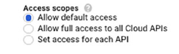

**그림 17.10** VM instance details edit 페이지에서 Access Scopes 섹션

옵션은 Allow Default Access, Allow Full Access To All Cloud APIs, Set Access For Each API가 있다. Default 접근은 보통 충분하다. 무엇을 설정해야하는지 모르면, Allow Full Access를 선택할 수 있다. 하지만, 인스턴스가 무엇을 할 수 있는지 제한하기 위해 IAM role을 할당해야 한다. 개별적으로 scopes를 선택하려면, Set Access For Each API를 선택한다. 서비스와 scopes의 리스트가 표시된다. (그림 17.11)

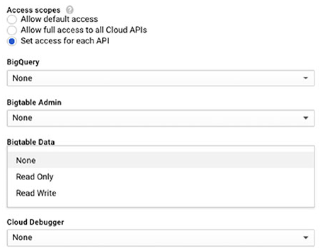

**그림 17.11** 개별적으로 구성될 수 있는 서비스와 scopes 리스트의 일부분

또한 `gcloud compute instances set-service-account` 명령을 사용하여 scope를 설정할 수 있다. 명령의 구조는 다음과 같다.

```bash
gcloud compute instances set-service-account [INSTANCE_NAME] \
     [--service-account [SERVICE_ACCOUNT_EMAIL] | [--no-service-account] \
     [--no-scopes | --scopes [SCOPES,...]]
```

`gcloud`를 사용하여 scope 할당 예시는 다음과 같다.

```bash
gcloud compute instances set-service-account ace-instance \
     --service-account examadmin@ace-exam-project.iam.gserviceaccount.com \
     --scopes compute-rw,storage-ro
```

### VM 인스턴스에 서비스계정 할당

VM 인스턴스에 서비스 계정을 할당할 수 있다. 첫번째, 콘솔의 IAM & Admin 섹션의 Service Account 섹션을 열어 서비스 계정을 생성한다. Create Service Account를 클릭하면 그림 17.12와 같은 양식이 표시된다.

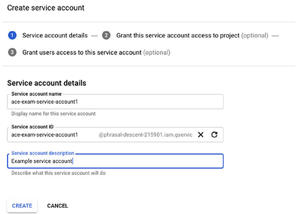

**그림 17.12** 콘솔에서 서비스 계정 생성

name, identifier, description을 입력한 후, Create를 클릭한다. 다음, 콘솔이나 `gcloud` 명령을 사용하여 이전에 설명한 role을 할당한다. 서비스 계정에 부여할 role을 할당하면, VM 인스턴스에 할당할 수 있다.

콘솔의 Compute Engine 섹션에서 VM Instance 페이지를 연다. VM Instance를 선택하고, Edit을 클릭한다. 인스턴스의 파라미터가 포함된 양식이 표시된다. 아래로 내려가면 Service Account로 표시된 파라미터가 있다. (그림 17.13)

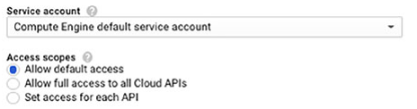

**그림 17.13** Service Account 파라미터를 보여주는 Edit Instance 페이지

드롭다운 리스트에서 인스턴스에 할당할 서비스 계정을 선택한다. (그림 17.14)

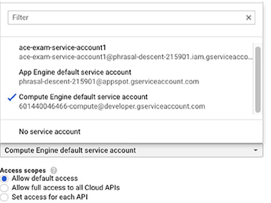

**그림 17.14** 인스턴스에 할당될 수 있는 서비스 계정 리스트


`gcloud compute instance create` 명령을 사용하여 인스턴스를 생성할 때 커맨드라인에서 서비스 인스턴스를 지정할 수 있다. 구조는 다음과 같다.

```bash
gcloud compute instances create [INSTANCE_NAME] --service-account [SERVICE_ACCOUNT_EMAIL]
```

프로젝트에 대한 접근 권한을 부여하기 위해, 콘솔의 IAM 페이지를 열고, member를 추가한다. 서비스 계정 이메일을 추가할 엔티티로 사용한다.

## 감시 로그 조회

감시 로그를 조회하기 위해, Cloud Console에서 Stackdriver Logging 페이지를 연다. 그림 17.15과 같은 리스트가 표시된다.

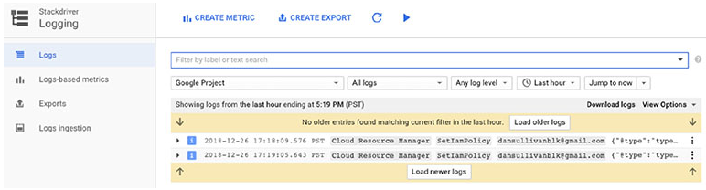

**그림 17.15** Stackdriver Logging 페이지의 기본 리스트

리소스, 표시할 로그 타입, 로그 레벨, 엔티티를 표시할 기간을 선택할 수 있다.

Logging에 대한 추가 정보는 [챕터 18](Chapter_18.md)을 확인한다.

## Summary

GCP의 접근 제어는 IAM, primitive roles, scopes를 사용하여 관리된다. 3가지 primitive role은 owner, editor, viewer이다. 이들은 리소스에 대한 대략적인 접근 제어를 제공한다. Scopes는 VM 인스턴스에 적용되는 접근 제어이다. 인스턴스에서 수행될 수 있는 동작을 제한하는데 사용된다. 인스턴스가 수행할 수 있는 동작의 집합은 할당된 scope와 인스턴스에 사용되는 서비스계정에 할당된 roles로 결정된다. IAM은 사전 정의된 role을 제공한다. 이러한 role은 서비스에 그룹화된다. role은 버킷에 쓰기나 App Engine 어플리케이션 배포같은 논리적 업무를 수행하는데 필요한 권한의 최소 집합을 제공하도록 설계되었다. 사전 정의된 role이 요구에 충족되지 않으면, 커스텀 role을 정의할 수 있다.

서비스 계정은 VM이 일련의 권한으로 작업을 수행할 수 있도록 하는 데 사용된다. 권한은 서비스계정에 할당된 role을 통해 서비스 계정에 부여된다. 인스턴스에 대해 GCP에서 제공되는 디폴트 서비스 계정을 사용할 수 있거나 직접 할당할 수 있다.

## 시험 요소

**role의 3가지 타입: primitive, predefined, custom** Primitive role은 owner, editor, viewer를 포함한다. 이들은 IAM이 출시되기 전에 개발되었다. Predefined roles는 IAM roles이다. Permission은 이러한 role에 할당되고, role은 user, group, service account에 할당된다. 커스텀 roles는 커스텀 rol을 생성하는 사용자에 의해서 선택된 permission을 포함한다.

**scope는 VM 인스턴스에 적용되는 접근 제어의 타입이다.** VM은 인스턴스의 서비스 계정에 할당된 IAM role과 scope에 의해 허용된 작업만 수행할 수 있다. scope을 제한하는 IAM role을 사용하고 IAM role을 제한하는 scope을 사용할 수 있다.

**ID에 할당된 role을 조회하는 방법을 알아야 한다.** 특정 role이 할당된 ID를 조회하기 위해 콘솔의 IAM & Admin 섹션에서 Role 탭을 사용할 수 있다. 또한 프로젝트에서 사용자에게 할당된 role을 조회하기 위해 `gcloud projects get-iam-policy`를 사용할 수 있다.

**IAM roles는 업무 분리와 최소 권한 원칙을 지원한다.** Primitive roles는 너무 대략적이기 때문에 최소 권한과 업무 분리를 지원하지 않는다. 업무 분리는 민감한 작업을 완료하기 위해 2명 이상의 사람이 필요하다.

**role에 할당된 권한을 포함하여 role의 상세 정보를 확인하기 위해 `gcloud iam roles describe`를 사용하는 방법을 알아야 한다.** 콘솔의 IAM & Admin 섹션의 Roles 페이지에서 role의 드릴다운 메뉴에서 role이 부여된 사용자를 확인할 수 있다. IAM을 작업할 때, 커맨드라인에서 작업할 때 `gcloud` 명령을 사용할 수 있다.

**인스턴스를 생성할 때 scope를 접근하기 위한 다양한 옵션을 이해해야 한다.** 옵션은 Default Access, Full Access, Set Access for Each API가 있다. 어떤 것을 사용해야할지 모르면, Full Access 권한을 부여한다. 허용된 작업을 제한하는 role을 할당하여 인스턴스가 수행할 수 있는 작업을 제한해야 한다.

**Stackdriver Logging은 로깅 이벤트를 수집한다.** Cloud Console의 Logging 섹션에서 필터링과 조회할 수 있다. 리소스, 로그타입, 로그레벨, 조회 기간으로 필터링할 수 있다.

[맨 위로](#chapter-17-%ec%a0%91%ea%b7%bc-%eb%b0%8f-%eb%b3%b4%ec%95%88-%ea%b5%ac%ec%84%b1)