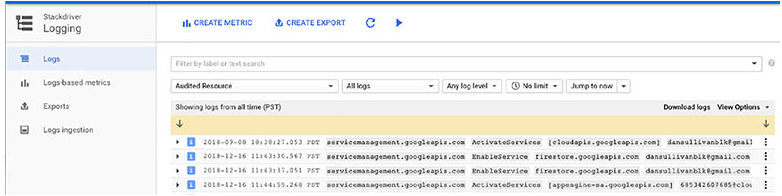
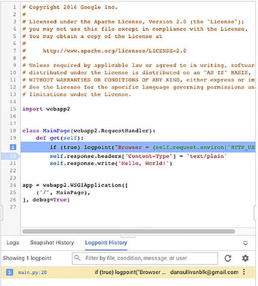
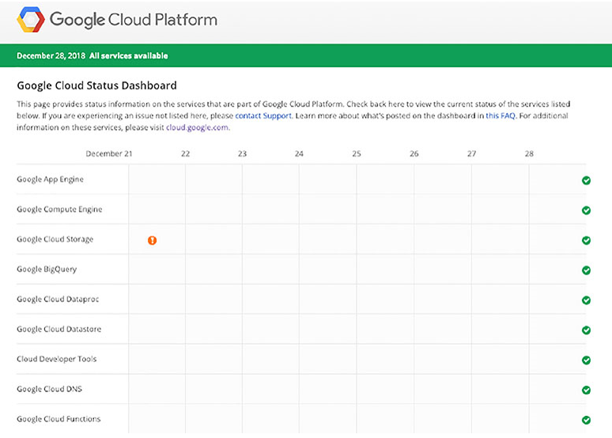

# Chapter 18 모니터링, 로깅, 비용 예측

**이 챕터는 구글 Associate Cloud Engineer 인증 시험 과목 중, 아래 내용을 다룬다.**
* 4.6 모니터링 및 로깅
* 2.1 Pricing Calculator를 사용하여 사용할 GCP 제품 계획 및 예측

모니터링 시스템 성능은 클라우드 엔지니어링의 필수 요소이다. 이 챕터에서는 리소스 모니터링, 로깅, 트레이싱, 디버깅을 위한 GCP 서비스인 Stackdriver에 대해서 배울 것이다. 리소스 메트릭과 커스텀 메트릭을 기반으로 알람을 생성하는 것으로 시작한다. 다음, Log sink를 생성하여 Stackdriver 외부에 로깅 데이터를 저장하는 방법에 대해 설명한다. 또한 로그 데이터를 조회하고 필터하는 방법을 확인한다. Stackdriver는 Cloud Trace와 Cloud Debugger와 같은 진단 도구를 포함한다. GCP 리소스와 서비스의 비용을 예측하기 위한 Pricing Calculator의 확인으로 챕터를 마무리한다.

## Stackdriver로 모니터링

Stackdriver는 리소스의 성능 지표, 로그, 이벤트 데이터를 수집하기 위한 서비스이다. 지표에는 지난 1분동안 CPU 사용의 평균 퍼센트와 지난 1분동안 스토리지 디바이스에 쓰여진 byte 양과 같은 측청을 포함한다. Stackdriver는 사전 정의된 지표를 많이 포함한다. 리소스의 상태를 평가하고, 필요하면 서비스 수준 목표를 충족하지 않는 리소스나 서비스에 주의를 기울이도록 알람을 트리거하는데 사용될 수 있는 일부 예시가 표 18.1에 있다.

**표 18.1** Stackdriver 지표 예시

|**GCP 제품**|**지표**|
|---|---|
|Compute Engine|CPU utilization|
|Compute Engine|Disk bytes read|
|BigQuery|Execution times|
|Bigtable|CPU load|
|Cloud Functions|Execution count|

Stackdriver는 GCP, AWS, 온프레미스 리소스를 지원하는 하이브리드 환경에서 작동한다.

### 리소스 지표를 기반으로 알람 생성

지표는 정기적으로 수집되는 리소스의 측정치이다. 지표는 최대값, 최소값, 측정된 아이템의 평균 값 같은 집계 값을 리턴한다. CPU 사용률, 사용된 메모리 양, 네트워크 인터페이스에 쓰여진 바이트 수일 수 있다.

이 예시에서, Apache Server와 PHP가 설치된 VM에서 작업한다고 가정하자. 지표를 모니터링하고 수집하기 위해, 모니터링을 위한 Stackdriver agent를 설치해야 한다. 모니터링 에이전트를 설치하면, 나중에 필요하기 때문에 동시에 로깅 에이전틀르 설치한다. 리눅스 VM에 Stackdriver 모니터링과 로깅 에이전트를 설치하기 위해, 쉘 스크립트에서 다음 명령을 실행한다.(gcloud 명령이 아니다.)

```bash
curl -sSO https://dl.google.com/cloudagents/install-monitoring-agent.sh
sudo bash install-monitoring-agent.sh
curl -sSO https://dl.google.com/cloudagents/install-logging-agent.sh
sudo bash install-logging-agent.sh --structured
```

에이전트가 설치된 VM은 모니터링과 로깅을 수칩하고 Stackdriver로 전송한다. Stackdriver는 데이터를 저장하는 Workspace가 필요하다.

Workspace를 생성하고 초기화하기 위해, Cloud Console의 Stackdriver Monitoring 섹션을 연다. 프로젝트에 Workspace가 존재하지 않으면, 그림 18.1과 같은 양식이 나타난다.


**그림 18.1** Stackdriver에서 Workspace를 생성하는데 사용하는 초기 양식

다음, 모니터링하는 프로젝트를 선택하면 그림 18.2가 보여진다.


**그림 18.2** Workspace를 위한 프로젝트 선택

Workspace에서 다수의 프로젝트를 모니터링하려면, 선택적으로 다른 프로젝트를 선택할 수 있다. (그림 18.3)


**그림 18.3** 선택적으로 모니터링하는 다른 프로젝트를 추가

Workspace에서 AWS 리소스를 모니터링하려면, 선택적으로 선택할 수 있다. (그림 18.4)


**그림 18.4** 선택적으로 AWS 리소스 모니터링

초기화 절차에서 다음 단계는 에이전트를 설치하는 명령이 나열된다. (그림 18.5)


**그림 18.5** 모니터링 되는 서버에 에이전트를 설치하는 명령의 리스트

Stackdriver는 이메일을 보내도록 이메일을 선택한 경우 매일 또는 매주 보고서를 발송한다. (그림 18.6)


**그림 18.6** 이베일 보고 옵션 리스트

초기화 절차를 완료하면, 그림 18.7과 유사한 양식이 나타난다. 지표 추가, 릴리즈 노트 조회와 같은 일반적이 작업이 조회된다.


**그림 18.7** Stackdriver Workspace 초기화 완료

Workspace가 초기화된 후, Stackdriver Monitoring을 열면 Monitoring Overview 페이지가 표시된다. (그림 18.8)


**그림 18.8** Stackdriver의 Monitoring Overview 페이지

이제, Stackdriver 에이전트는 설치되고, 사용할 수 있는 Workspace를 갖는다.

다음으로, 지표를 모니터링하는 정책을 생성한다. 정책은 알람이나 경고가 발생할 시기를 결정하는 조건(예를 들어, CPU 사용률이 5분이상 80%를 초과하는 경우)으로 구성된다. 또한 정책은 알람 채털과 선택적으로 문서를 포함한다. (그림 18.9) 이 양식은 Monitoring Overview 페이지에서 Create Policy를 클릭할 때 표시된다.


**그림 18.9** 지표 모니터링을 위한 신규 정책 생성

Add Condition을 클릭하면 조건 파라미터를 지정할 수 있는 양식이 표시된다. 그림 18.10은 CPU 사용률을 선택하기 전의 Metric Condition 양식을 보여준다.

CPU 사용률을 선택한 후, 추가적인 파라미터가 표시된다.(그림 18.11) 조건은 CPU 사용률 상태를 확인한다. 필터 기준과 일치하는 VM(예를 들어, 필터에 label이 포함된 VM)에 적용된다. 필터 기준은 zone, region, projectID, instance ID, labels과 같은 VM 기능을 포함한다. Group By 파라미터는 시간열이나 정기적으로 생성되는 데이터를 그룹화할 수 있고, zone 별로 고정된 포맷을 갖고, 값을 집계하여 표시할 시계열이 줄어든다. 예를 들어 클러스터에서 VM의 그룹을 하나의 시계열로 표시하려는 경우에 특히 유용하다.


**그림 18.10** CPU 사용률 지표 선택


**그림 18.11** CPU 사용률 모니터링을 구성하는 추가적인 파라미터

에이전트는 모니터링된 리소스에서 Stackdriver로 스트림으로 데이터를 전송한다. 스트림 데이터를 확인하기 위해, 데이터 포인트는 특정 시간 간격으로 집계되어야한다. 예를 들어, 데이터 포인트는 20초마다 수신하지만 모니터링 목적을 위해 분당 평균 CPU 사용률을 확인한다. 1분 간격으로 Stackdriver에 들어오는 CPU 사용률 지표의 스트림을 고려한다. 해당 측정 값을 평균 값, 최대값, 최소값처럼 하나의 값으로 통합하는 것이 유용하다. 데이터를 일정한 사이즈의 버킷으로 그룹화하는 프로세스를 정렬(aligning)이라고 한다. 그림 18.12는 버킷에 들어오는 데이터에 적용될 수 있는 min, max, mean을 포함한 함수의 일부를 보여준다.


**그림 18.12** 정렬을 위한 optional 집계

시계열로 정렬하는 것 이외에, 집계할 때 시계열로 그룹화된 값을 하나의 값으로 생성하기 위한 함수인 reducer를 지정할 수 있다. reducer는 sum, min, max, count와 같은 일반적인 통계를 포함한다. (그림 18.13)


**그림 18.13** 다수의 값을 하나의 값으로 줄이기 위한 집계 함수

다음으로, 그림 18.14처럼 조건이 트리거되어야하는 시기를 지정해야 한다. 특정 임계치를 초과하는 값이 표시되거나 측정된 값이 장기간동안 임계치를 초과하는 경우에만 가능하다. 예를 들어, CPU 사용률이 5분이상 임계치를 초과한 경우 알람이 트리거되길 원할 수 있다. 이렇게 하면 CPU 사용률이 가끔 급증하기 때문에, 너무 많은 알람을 방지하는데 도움이 된다.


**그림 18.14** 알람이 트리거되는 임계치를 지정

정책은 하나 이상의 알림 채널을 갖을 수 있다. 채널은 이메일뿐만 아니라 Slack, Google Cloud Console(mobile), PagerDuty, HipChat, Campfire와 같은 유명한 DevOps 도구를 포함한다. (그림 18.15)


**그림 18.15** 알림 채널 지정

그림 18.16처럼 documentation 파라미터는 optional이지만 추천하지 않는다. documentation은 알림에 포함한다. DevOps 엔지니어가 문제를 이해하고, 이슈를 해결하는 방법에 대한 정보를 제공하는데 도움이 된다.


**그림 18.16** 조건, 알람 스펙에 따라서 documentation과 정책 이름을 추가

정책이 정의된 후, 정책이 정의되었을 때의 시간으로 돌아가서 최근 지표 기록의 요약을 확인할 수 있다. 이것은 그림 18.17과 같은 시각화를 포함한다.


**그림 18.17** 최근 정책의 상태와 CPU 부하를 표시

### 커스텀 지표 생성

모니터링하려는 어플리케이션별 지표가 있다면, 커스텀 메트릭을 생성할 수 있다. 커스텀 메트릭은 사전 정의된 메트릭과 비슷하지만, 생성한 측정 항목을 제외한다. 커스텀 메트릭의 이름은 custom.googleapis.com으로 시작한다. 그래서 이름으로 구분하기 쉽다. 가장 중요한 차이점은 커스텀 메트릭에 쓸 시계열 데이터를 결정할 수 있다는 것이다.

커스텀 메트릭을 생성하는 2가지 방법이 있다. 오픈소스 모니터링 라이브러리인 OpenCensus([https://opencensus.io](https://opencensus.io/))나 Stackdriver의 Monitoring API를 사용하는 것. OpenCensus는 higher-level, monitoring-focused API를 제공한다. 반면, Stackdriver Monitoring API는 lower-level이다.

커스텀 메트릭을 정의할 때, 다음 항목을 지정해야 한다.
* 프로젝트 내에서 유니크한 타입 이름
* 프로젝트
* 표시되는 이름과 설명
* gauge, delta, cumulative metric 같은 메트릭 종류. Gauges는 특정 시점에 측정하고, delta는 간격에 따른 변화를 캡쳐하고, cumulative는 간격에 걸쳐 누적된 값이다.
* 메트릭 labels
* 시계열 데이터 포인트에 포함할 모니터링된 리소스 object. 측정 값의 맥락을 제공한다. 예를 들어, 어플리케이션별 메트릭과 함께 어플리케이션 인스턴스 ID를 포함할 수 있다.

커스텀 메트릭을 정의하기 위해, monitoring API를 호출하는 프로그램이 필요하거나 OpenCensus 라이브러리를 사용해야 한다. 이 작업을 수행하는 방법은 사용할 프로그래밍 언어에 따라 다양하다. 구글의 Stackdriver 문서를 확인한다. ([https://cloud.google.com/monitoring/custom-metrics/creating-metrics](https://cloud.google.com/monitoring/custom-metrics/creating-metrics))

## Stackdriver 로깅

Stackdriver Logging은 GCP와 AWS에서 생성되는 로그와 이벤트 데이터를 수집하고, 저장하고, 필터링하고, 조회하기위한 서비스이다. 로깅은 관리형 서비스이다. 그래서 서비스를 사용하기 위한 서버를 구성하거나 배포할 필요가 없다.

Associate Cloud Engineering 시험 가이드는 클라우드 엔지니어가 친숙해야할 3개의 로깅 작업을 설명한다.
* log sinks 구성
* 로그 조회 및 필터링
* 메시지 상세정보 조회

이 섹션에서 위의 각각을 설명한다.

### Log Sinks 구성

Stackdriver 로깅은 로그 데이터를 30일동안 유지한다. 이것은 운영적인 이슈를 진단하기 위해 로그를 사용하는 경우에 충분하지만, 며칠 뒤에 로그를 거의 볼 수 없다. 이것은 종종 충분하지 않다. 조직은 정부나 산업 규제를 준수하기위해 로그를 오래 유지해야할 수도 있다. 또한 어플리케이션 성능에서 인사이트를 얻기 위해 로그를 분석하기 원할 수 있다. 이러한 사례의 경우, Cloud Storage나 BigQuery와 같은 장기간 스토리지 시스템에 로깅 데이터를 추출하는게 가장 좋다.

Logging에서 스토리지 시스템으로 데이터를 복사하는 프로세스를 exporting이라고 부르고, 로그 데이터를 작성하는 위치를 sink라고 부른다. 그림 18.18처럼 Cloud Console에서 Logging 섹션을 열고, Logging 메뉴에서 Export 옵션을 선택하여 log sink를 생성할 수 있다.


**그림 18.18** Cloud Console에서 Logging Export 양식

Create Export를 클릭하여 log sink를 생성하는 양식을 연다. 3가지 파라미터를 입력한다.
* Sink name
* Sink Service
* Sink Destination

그림 18.19처럼 sink name을 만들 수 있다. sink service는 다음 중 하나이다.
* BigQuery
* Cloud Storage
* Cloud Pub/Sub
* Custom Destination


**그림 18.19** BigQuery log sink 생성

서비스로 BigQuery로 선택하면, sink destination은 기존 BigQuery 데이터 셋이나 새로운 데이터 셋이 될 수 있다. (그림 18.19) 로그 데이터가 BigQuery로 추출될 때, 로그 이름과 타임스탬프를 기반으로 테이블이 구성된다. 예를 들어, 2019년 1월 1일에 추출된 syslog는 syslog_20190102 이름을 갖는다. 테이블은 타임스탬프, 로그 이름, 텍스트 페이로드나 로그 메시지를 저장하는 컬럼을 갖는다.

Cloud Storage를 선택하면, 기존 버킷에 로그를 추출할 수 있거나 새로운 버킷을 생성할 수 있다. (그림 18.20) 로그 데이터가 Cloud Storage에 추출될 때, Logging은 파일 셋을 sink bucket에 작성한다. 파일은 로그 타입과 날짜의 계층으로 구성된다. 예를 들어, syslog가 ace-exam-log-sink1 이름의 버킷으로 2019년 1월 2일에 추출되면, 파일의 경로는 `ace-exam-log-sink1/syslog/2019/01/02/`이 될 것이다.


**그림 18.20** Cloud Stoarge log sink 생성

Cloud Pub/Sub을 선택하면, 토픽을 생성하거나 기존 토픽을 사용하여 선택할 수 있다. (그림 18.21) 로그 데이터가 Cloud Pub/Sub에 추출될 때, 데이터는 LogEctry로 알려진 오브젝트 구조에 base64로 인코딩된다. Log Entriy는 `type`, `instance_id`, `zone`, `project_id`와 같은 로그이름, 타임스탬프, 텍스트페이로드, 리소스 프로퍼티를 포함한다.


**그림 18.21** Pub/Sub log sink 생성

custom destination은 sink를 호스팅하는 현재 프로젝트 이외의 프로젝트의 이름을 지정하는데 사용된다. sink로 새로운 오브젝트를 생성하도록 선택하면, 그림 18.22처럼 새로운 sink의 이름을 입력해야 할 것이다.


**그림 18.22** 신규 BigQuery 데이터 셋의 이름을 지정

sink가 생성된 후, 그림 18.23처럼 새롭게 생성된 sink의 상세정보 메시지를 수신할 것이다. 


**그림 18.23** 새로운 sink가 생성되었다는 확인 메시지

### 로그 조회와 필터링

로그의 내용을 확인하기 위해, console의 Stackdriver Logging 섹션을 열고, Logging 메뉴에서 Logs를 선택한다. (그림 18.24)



**그림 18.24** Cloud Console의 로그 항목 리스트

해당 양식 위쪽에 로그 메시지 필터링을 위한 아래와 같은 몇몇 옵션이 있다. 
* Label or test 검색
* Resource type
* Log type
* Log level
* Time limit

또한, Jump To Now를 선택하여 최신 항목으로 이동하는 옵션이 있다.

로그 메시지의 문자열이나 label로 필터링하는 label or text serch를 사용할 수 있다. 예를 들어, 그림 18.25는 Monitoring 문자로 필터링되는 로그 항목을 보여준다. Stackdriver는 text:[항목] 으로 추가할 수 있다.


**그림 18.25** Monitoring 문자열을 포함한 로그 항목

resource type 메뉴(그립 18.26)은 감시중인 resource, VM instance, subnetworks, project, databases를 포함한 GCP 리소스 타입의 리스트를 제공한다.


**그림 18.26** 로그 필터링을 위한 resource type의 리스트 일부분

All Logs라고 표시된 메뉴는 로그 유형별로 필터링할 수 있다. (그림 18.27)


**그림 18.27** Stackdriver Logging에서 항목을 생성하는 로그 리스트의 예

다음 옵션인 Any Log Level은 Error, Info, Warning, Debug와 같은 로그 메시지 레벨을 보여준다. (그림 18.28)


**그림 18.28** 표시된 로그 항목을 필터링하는데 사용될 수 있는 로그 레벨의 리스트

시간 선택 필터는 기본적으로 No Limit을 보여준다. 그림 18.29와 같은 메뉴는 여러 기간을 포함하고, 커스텀 시간 제한을 선택할 수 있다.


**그림 18.29** 로그 항목을 필터링하기 위한 사전 정의된 시간 간격 옵션

Custome을 선택하면 시작과 끝 날짜를 선택할 수 있다. (그림 18.30)


**그림 18.30** 로그 항목 필터링을 위해 커스텀 시간 범위를 지정하는 양식

### 메시지 상세정보 조회

각 로그 항목은 로그 내용을 조회할 때 한 줄로 표시된다. 라인 왼쪽 끝에 삼각형 아이콘을 확인한다. 해당 아이콘을 클릭하면, 라인은 추가 정보를 표시하기 위해 확장된다. 예를 들어, 그림 18.31은 한 단계 확장된 로그 항목을 보여준다.


**그림 18.31** 한 단계 확장된 로그 항목

한 단계 확장된 경우, insertID, logName, receiveTimestamp와 같은 상위 레벨의 정보를 확인할 수 있다. 또한 protoPayload, resource와 같은 다른 구조의 데이터 요소를 확인할 수 있다. 그림 18.32는 확장된 protoPayload 구조를 보여준다.


**그림 18.32** 확장된 protoPayload 구조의 로그 항목

각 구조별로 왼쪽에 삼각형이 있으면 계속 확장할 수 있다. 예를 들어, protoPayload 구조에서 authenticationInfo, authoricationInfo, requestMetadata 등을 확장할 수 있다. 대체로, 모든 구조를 확장하기 위해 로그 항목 리스트의 오른쪾 위에 있는 Expand All를 클릭할 수 있다.


**그림 18.33** 확장된 로그 항목의 일부분

Stackdriver Logging은 로그 데이터와 이벤트를 수집하고, 30일동안 저장하는데 사용된다. 로그는 Cloud Storage, BigQuery, Cloud Pub/Sub으로 추출될 수 있다. Cloud Console은 로그 항복을 필터링하고 검색하기 위한 다양한 방법을 제공하는 로깅 인터페이스를 제공한다.

## Cloud 진단 사용

GCP는 소프트웨어 개발자가 어플리케이션의 성능과 작동에 대한 정보를 수집할 수 있는 진단 툴을 제공한다. 구체적으로, 개발자는 어플리케이션이 실행될 때 데이터를 수집하는 Cloud Trace와 Cloud Debug를 사용할 수 있다.

### Cloud Trace overview

Cloud Trace는 어플리케이션으로 부터 데이터 지연시간을 수집하기위한 분산 추적 시스템이다. 이것은 개발자가 어플리케이션이 시간을 소비하는 장소를 이해하고, 성능이 저하되는 사례를 식별하는데 도와준다. 그림 18.34는 Cloud Trace 서비스의 overview 페이지를 보여준다.


**그림 18.34** Cloud Trace의 overview

Cloud Trace 콘솔에서 프로젝트에서 실행 중인 어플리케이션에서 생성되는 trace를 나열할 수 있다. Traces는 특히 개발자가 어플리케이션에서 Cloud Trace를 호출할 때 생성된다. trace 리스트를 조회하는 것 이외에, 리포트 기준에 따라서 trace 데이터를 필터링하는 리포트를 생성할 수 있다. (그림 18.35)


**그림 18.35** Cloud Trace 데이터를 사용하여 리포트 생성

시간과 추적 쿼리에 대한 필터링 이외에, HTTP 메소트와 리턴되는 상태로 필터링할 수 있다. (그림 18.36. 18.37)


**그림 18.36** HTTP 메소드로 trace 데이터 필터링


**그림 18.37** 응답 코드로 trace 데이터 필터링

Associate Cloud Engineering 시험의 목적으로, Cloud Trace는 개발자와 DevOps 엔지니어가 병목현상이 발생하는 코드 영역을 식별하는데 도움을 주는 분산 추적 어플리케이션이라는 것을 기억하자.

### Cloud Debug overview

Cloud Debug는 실행 중인 프로그램의 상태를 점검하기 위한 어플리케이션 디버거이다. Cloud Trace처럼 소프트웨어 개발자에 의해서 사용되는 툴이지만, 클라우드 엔지니어가 Cloud Debug의 기능에 친숙해지는데 도움이 된다.

Cloud Debug는 개발자가 로그 상태를 입력하거나 어플리케이션의 상태의 스냅샷을 만들 수 있다. 이 서비스는 기본적으로 App Engine에 적용되고, Compute Engine과 Kubernetes Engine에 적용될 수 있다.

Cloud Debug를 조회하기 위해, Cloud Console에서 Cloud Debug를 열면, 그림 18.38과 같은 페이지가 표시된다.


**그림 18.38** Cloud Debug의 overview 페이지

프로그램 파일을 선택하면 파일의 내용이 표시된다. 예를 들어, 그림 18.39는 `main.py` 파일의 내용을 보여준다.


**그림 18.39** 구글에 의해서 제공되는 파이썬 프로그램의 코드

이 인터페이스에서, 라인이 실행될 때 스냅샷을 만들기 위해 코드의 라인을 클릭할 수 있다. 그림 18.40에서 20번 라인에 파란색 화살표는 Cloud Debug가 스냅샷을 생성해야하는 장소를 가리킨다.


**그림 18.40** 20번 라인이 실행될 때 생성되는 스냅샷 설정

코드가 실행될 때 로그를 작성할 수 있는 log statement로 logpoint를 입력할 수 있다. 그림 18.41에 있는 코드의 라인은 logpoint를 생성하고 메시지를 출력하기위해 추가되었다. 

Associate Cloud Engineer 시험의 목적으로, Cloud Debug는 프로그램이 실행되는 동안 상태의 스냅샷을 생성하는데 사용되고, logpoint는 소스코드 변경 없이 로그 메시지를 입력할 수 있다는 것을 기억하자.



**그림 18.41** 입력된 logpoint 코드

### GCP 상태 조회

어플리케이션과 서비스의 상태를 이해하는 것 이외에, 클라우드 엔지니어는 GCP 서비스의 상태를 인지하는 것이 필요하다. Google Cloud Status 대쉬보드에서 이 상태를 확인할 수 이따.

Google Cloud 서비스의 상태를 조회하기 위해, Cloud Console의 홈페이지를 열고, Google Cloud Platrogm Status 카드를 확인한다. (그림 18.42) 또한, [https://status.cloud.google.com/](https://status.cloud.google.com/)의 대쉬보드에서 확인할 수 있다.


**그림 18.42** Cloud Console 홈페이지는 Cloud Status Dashboard로 연결되는 카드를 갖고 있다.

Go To Cloud Status Dashboard 링크를 클릭하면 대쉬보드가 표시된다. 그림 18.43은 예시를 보여준다.



**그림 18.43** Google Cloud Status Dashboard의 리스트 일부분

대쉬보드는 왼쪽에 GCP 서비스를 나열한다. 열은 최근 과거날짜를 표시한다. 각 셀의 내용은 상태를 가리킨다. 초록색 체크 마크가 있다면, 서비스는 실행 중이다. 주황색 아이콘이 있다면, 예를 들어, Cloud Storage 행과 12월 21일 열에, 서비스에 장애를 나타낸다. 주황색 아이콘을 클릭하면 추가 정보가 표시된다. (그림 18.44)


**그림 18.44** 서비스 중단의 설명 예시

## Pricing Calculator 사용

구글은 GCP 사용자가 선택한 서비스의 리소스 설정과 관련된 비용을 이해하는데 도와주는 Pricing Calculator를 제공한다. Pricing Calculator는 온라인 도구이다. [https://cloud.google.com/products/calculator](https://cloud.google.com/products/calculator)

Pricing Calculator를 사용하면, 리소스 구성, 리소스 사용 기간, 스토리지의 경우 저장할 데이터의 양을 지정할 수 있다. 다른 파라미터도 지정될 수 있다. 요금은 계산하는 서비스에 따라 다르다.

예를 들어, 그림 18.45는 Pricing Calculator에서 사용될 수 있는 서비스의 일부분을 보여준다. 현재, Pricing Calculator에서 40개의 서비스를 이용할 수 있다.


**그림 18.45** 이용할 수 있는 서비스의 일부를 보여주는 Pricing Calculator 배너

그림 18.46은 VM의 비용을 측정하기 위한 양식의 일부를 보여준다. 이 양식에서 다음을 지정할 수 있다.
* instance 수
* Machine type
* OS
* 일, 주별 평균 사용량
* Persistent disks
* Load Balancing
* Cloud TPUs(머신러닝 어플리케이션을 위한)


**그림 18.46** VM을 위한 가격 양식의 일부 리스트

양식에서 데이터를 입력한 후, Pricing Calculator는 그림 18.47처럼 예상 금액을 생성할 것이다.


**그림 18.47** 2개의 n1-standard-1 VM을 위한 가격 예측의 예시

다양한 리소스틑 측정을 위해 다양한 파라미터가 필요하다. 예를 들어, 그림 18.48은 Kubernetes 클러스터의 가격 예측을 보여주고, VM, persistent disk, load balancer에 대한 상세 정보가 필요하다.

그림 18.49는 다른 예를 보여주고, BigQuery이다. 해당 서비스를 위해서, 데이터의 위치와 저장되는 데이터의 양, 스트리밍 양, 쿼리를 실행할 때 스캔되는 데이터의 양을 지정해야 한다. 테이블 파라미터는 쿼리할 BigQuery 테이블을 가리킨다. Storage Pricing과 Query Pricing은 모두 테이블에 저장된 양(GBs)과 쿼리하는 동안 스캔되는 양(TBs)을 위한 숫자를 허용한다. 또한, 한 달에 40,000달러 이상 사용하는 경우 정액 요금을 위한 옵션이 있다.


**그림 18.48** Kubernetes 클러스터의 가격을 측정하기 위한 양식


**그림 18.49** 파라미터는 BigQuery 데이터를 저장하고 쿼리하는 비용을 측정하기 위해 필요하다.

Pricing Calculator는 다양한 서비스의 가격을 측정할 수 있고, 모든 서비스를 위한 전체 측정치를 생성한다.

## Summary

클라우드 엔지니어는 어플리케이션과 클라우드 서비스의 상태와 성능을 모니터링하는 책임을 가져야 한다. GCP는 monitoring, logging, debugging, tracing 서비스를 포함한 다양한 툴을 제공한다.

Stackdriver Monitoring은 CPU 사용량 같은 메트릭으로 알람을 정의할 수 있고, 인프라의 일부가 예상대로 수행하지 않을 경우 알림을 받을 수 있다. Stackdriver Logging은 로그 항복을 수집, 저장, 관리한다. 30일 이상 저장되어야하는 로그 데이터는 Cloud Storage, BigQuery, Cloud Pub/Sub에 추출될 수 있다. Cloud Trace는 코드의 부분이 느려지는 것을 식별하는 분산 추적 서비스를 제공한다. Cloud Debug는 실행 중이 코드의 스냅샷을 생성하고, 원본 코드 변경 없이 로그 메시지를 입력하기 위해 제공된다.

항상 [https://status.cloud.google.com/](https://status.cloud.google.com/)의 Google Cloud Status Dashboard에서 GCP 서비스의 상태를 확인할 수 있다.

Pricing Calculator는 40개의 GCP 서비스의 비용을 측정하는데 도움이 되도록 설계되었다.

## 시험 필수요소

**모니터링을 위한 요구와 메트릭의 역할을 이해한다.** 메트릭은 어플리케이션과 인프라의 상태 데이터를 제공한다. 알람이 동작하는 CPU가 5분동안 80퍼센트를 초과한 것 같은 조건을 생성한다. 알람은 알림 채널로 전달된다. GCP는 사전 정의된 메트릭의 실질적인 수를 갖지만, 커스텀 메트릭을 생성할 수 있다.

**Stackdriver Logging은 로그 데이터를 수집, 저장, 필터링, 표시한다.** 로그는 가상의 소스에서부터 온다. Logging은 로그 데이터를 30일동안 유지한다. 더 오래 로그 데이터가 유지되어야 한다면, log sink로 데이터를 추출해야 한다. Log sink는 Cloud Storage 버킷, BigQuery 데이터 셋, Cloud Pub/Sub 토픽일 수 있다.

**로그 필터링 방법을 알아야 한다.** 로그는 데이터의 많은 양을 포함한다. 텍스트나 라벨을 위한 검색, 로그 타입, 관심있는 기간 간격에 의한 로그 항목 제한을 사용한다.

로그 항목은 계층 구조이다. Stackdriver Logging은 기본적으로 로그 항목을 한 줄로 요약하여 보여주지만, 로그 항목의 상세정보를 위하 확장할 수 있다. Expand All와 Collapse All 옵션을 사용하여 로그 항목의 전체 정보를 조회하거나 숨길 수 있다.

**Cloud Trace는 분산 추적 서비스이다.** 소프트웨어 개발자는 trace 데이터를 기록하기 위해 어플리케이션에 Cloud Trace 코드를 포함시킨다. Trace 데이터는 개별적으로 조회할 수 있거나 포함할 trace의 서브셋을 지정하는 파라미터가 포함된 리포트를 생성할 수 있다.

**Cloud Debug는 스냅샷을 생성하거나 logpoint를 입력하여 실행 중인 코드를 분석하는데 사용된다.** 스냅샷은 프로그램의 실행 포인트에서 스택이나 실행 문맥을 보여준다. Logpoint는 실행 중인 코드에 입력된 log 문이지만, 원본 소스를 수정할 필요는 없다.

**GCP는 Google Cloud Platform Status 페이지에서 서비스의 상테를 제공한다.** 이것은 모든 서비스의 리스트, 현재 상태, 최근 과거의 상태를 포함한다. 서비스에 장애가 있다면, 문제의 근본 원인과 영향에 대한 추가 정보를 확인할 수 있다.

**Pricing Calculator는 GCP의 리소스와 서비스의 비용을 예측하는데 사용된다.** [https://cloud.google.com/products/calculator](https://cloud.google.com/products/calculator)에서 이용할 수 있다.

각 서비스를 위한 계상기가 있다. 각 서비스는 비용 측정을 위한 파라미터 셋을 갖는다. Pricing Calculator는 다양한 서비스의 비용을 측정하고, 모든 서비스를 위한 전체 비용 측정을 생성할 수 있다.

[맨 위로](#chapter-18-%eb%aa%a8%eb%8b%88%ed%84%b0%eb%a7%81-%eb%a1%9c%ea%b9%85-%eb%b9%84%ec%9a%a9-%ec%98%88%ec%b8%a1))