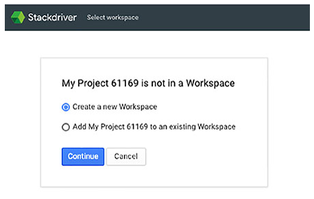

# Chapter 18 모니터링, 로깅, 비용 예측

**이 챕터는 구글 Associate Cloud Engineer 인증 시험 과목 중, 아래 내용을 다룬다.**
* 4.6 모니터링 및 로깅
* 2.1 Pricing Calculator를 사용하여 사용할 GCP 제품 계획 및 예측

모니터링 시스템 성능은 클라우드 엔지니어링의 필수 요소이다. 이 챕터에서는 리소스 모니터링, 로깅, 트레이싱, 디버깅을 위한 GCP 서비스인 Stackdriver에 대해서 배울 것이다. 리소스 메트릭과 커스텀 메트릭을 기반으로 알람을 생성하는 것으로 시작한다. 다음, Log sink를 생성하여 Stackdriver 외부에 로깅 데이터를 저장하는 방법에 대해 설명한다. 또한 로그 데이터를 조회하고 필터하는 방법을 확인한다. Stackdriver는 Cloud Trace와 Cloud Debugger와 같은 진단 도구를 포함한다. GCP 리소스와 서비스의 비용을 예측하기 위한 Pricing Calculator의 확인으로 챕터를 마무리한다.

## Stackdriver로 모니터링

Stackdriver는 리소스의 성능 지표, 로그, 이벤트 데이터를 수집하기 위한 서비스이다. 지표에는 지난 1분동안 CPU 사용의 평균 퍼센트와 지난 1분동안 스토리지 디바이스에 쓰여진 byte 양과 같은 측청을 포함한다. Stackdriver는 사전 정의된 지표를 많이 포함한다. 리소스의 상태를 평가하고, 필요하면 서비스 수준 목표를 충족하지 않는 리소스나 서비스에 주의를 기울이도록 알람을 트리거하는데 사용될 수 있는 일부 예시가 표 18.1에 있다.

**표 18.1** Stackdriver 지표 예시

|**GCP 제품**|**지표**|
|---|---|
|Compute Engine|CPU utilization|
|Compute Engine|Disk bytes read|
|BigQuery|Execution times|
|Bigtable|CPU load|
|Cloud Functions|Execution count|

Stackdriver는 GCP, AWS, 온프레미스 리소스를 지원하는 하이브리드 환경에서 작동한다.

### 리소스 지표를 기반으로 알람 생성

지표는 정기적으로 수집되는 리소스의 측정치이다. 지표는 최대값, 최소값, 측정된 아이템의 평균 값 같은 집계 값을 리턴한다. CPU 사용률, 사용된 메모리 양, 네트워크 인터페이스에 쓰여진 바이트 수일 수 있다.

이 예시에서, Apache Server와 PHP가 설치된 VM에서 작업한다고 가정하자. 지표를 모니터링하고 수집하기 위해, 모니터링을 위한 Stackdriver agent를 설치해야 한다. 모니터링 에이전트를 설치하면, 나중에 필요하기 때문에 동시에 로깅 에이전틀르 설치한다. 리눅스 VM에 Stackdriver 모니터링과 로깅 에이전트를 설치하기 위해, 쉘 스크립트에서 다음 명령을 실행한다.(gcloud 명령이 아니다.)

```bash
curl -sSO https://dl.google.com/cloudagents/install-monitoring-agent.sh
sudo bash install-monitoring-agent.sh
curl -sSO https://dl.google.com/cloudagents/install-logging-agent.sh
sudo bash install-logging-agent.sh --structured
```

에이전트가 설치된 VM은 모니터링과 로깅을 수칩하고 Stackdriver로 전송한다. Stackdriver는 데이터를 저장하는 Workspace가 필요하다.

Workspace를 생성하고 초기화하기 위해, Cloud Console의 Stackdriver Monitoring 섹션을 연다. 프로젝트에 Workspace가 존재하지 않으면, 그림 18.1과 같은 양식이 나타난다.



**그림 18.1** Stackdriver에서 Workspace를 생성하는데 사용하는 초기 양식

다음, 모니터링하는 프로젝트를 선택하면 그림 18.2가 보여진다.


**그림 18.2** Workspace를 위한 프로젝트 선택

Workspace에서 다수의 프로젝트를 모니터링하려면, 선택적으로 다른 프로젝트를 선택할 수 있다. (그림 18.3)


**그림 18.3** 선택적으로 모니터링하는 다른 프로젝트를 추가

Workspace에서 AWS 리소스를 모니터링하려면, 선택적으로 선택할 수 있다. (그림 18.4)


**그림 18.4** 선택적으로 AWS 리소스 모니터링

초기화 절차에서 다음 단계는 에이전트를 설치하는 명령이 나열된다. (그림 18.5)


**그림 18.5** 모니터링 되는 서버에 에이전트를 설치하는 명령의 리스트

Stackdriver는 이메일을 보내도록 이메일을 선택한 경우 매일 또는 매주 보고서를 발송한다. (그림 18.6)


**그림 18.6** 이베일 보고 옵션 리스트

초기화 절차를 완료하면, 그림 18.7과 유사한 양식이 나타난다. 지표 추가, 릴리즈 노트 조회와 같은 일반적이 작업이 조회된다.


**그림 18.7** Stackdriver Workspace 초기화 완료

Workspace가 초기화된 후, Stackdriver Monitoring을 열면 Monitoring Overview 페이지가 표시된다. (그림 18.8)


**그림 18.8** Stackdriver의 Monitoring Overview 페이지

이제, Stackdriver 에이전트는 설치되고, 사용할 수 있는 Workspace를 갖는다.

다음으로, 지표를 모니터링하는 정책을 생성한다. 정책은 알람이나 경고가 발생할 시기를 결정하는 조건(예를 들어, CPU 사용률이 5분이상 80%를 초과하는 경우)으로 구성된다. 또한 정책은 알람 채털과 선택적으로 문서를 포함한다. (그림 18.9) 이 양식은 Monitoring Overview 페이지에서 Create Policy를 클릭할 때 표시된다.


**그림 18.9** 지표 모니터링을 위한 신규 정책 생성

Add Condition을 클릭하면 조건 파라미터를 지정할 수 있는 양식이 표시된다. 그림 18.10은 CPU 사용률을 선택하기 전의 Metric Condition 양식을 보여준다.

CPU 사용률을 선택한 후, 추가적인 파라미터가 표시된다.(그림 18.11) 조건은 CPU 사용률 상태를 확인한다. 필터 기준과 일치하는 VM(예를 들어, 필터에 label이 포함된 VM)에 적용된다. 필터 기준은 zone, region, projectID, instance ID, labels과 같은 VM 기능을 포함한다. Group By 파라미터는 시간열이나 정기적으로 생성되는 데이터를 그룹화할 수 있고, zone 별로 고정된 포맷을 갖고, 값을 집계하여 표시할 시계열이 줄어든다. 예를 들어 클러스터에서 VM의 그룹을 하나의 시계열로 표시하려는 경우에 특히 유용하다.


**그림 18.10** CPU 사용률 지표 선택


**그림 18.11** CPU 사용률 모니터링을 구성하는 추가적인 파라미터

에이전트는 모니터링된 리소스에서 Stackdriver로 스트림으로 데이터를 전송한다. 스트림 데이터를 확인하기 위해, 데이터 포인트는 특정 시간 간격으로 집계되어야한다. 예를 들어, 데이터 포인트는 20초마다 수신하지만 모니터링 목적을 위해 분당 평균 CPU 사용률을 확인한다. 1분 간격으로 Stackdriver에 들어오는 CPU 사용률 지표의 스트림을 고려한다. 해당 측정 값을 평균 값, 최대값, 최소값처럼 하나의 값으로 통합하는 것이 유용하다. 데이터를 일정한 사이즈의 버킷으로 그룹화하는 프로세스를 정렬(aligning)이라고 한다. 그림 18.12는 버킷에 들어오는 데이터에 적용될 수 있는 min, max, mean을 포함한 함수의 일부를 보여준다.


**그림 18.12** 정렬을 위한 optional 집계

시계열로 정렬하는 것 이외에, 집계할 때 시계열로 그룹화된 값을 하나의 값으로 생성하기 위한 함수인 reducer를 지정할 수 있다. reducer는 sum, min, max, count와 같은 일반적인 통계를 포함한다. (그림 18.13)


**그림 18.13** 다수의 값을 하나의 값으로 줄이기 위한 집계 함수

다음으로, 그림 18.14처럼 조건이 트리거되어야하는 시기를 지정해야 한다. 특정 임계치를 초과하는 값이 표시되거나 측정된 값이 장기간동안 임계치를 초과하는 경우에만 가능하다. 예를 들어, CPU 사용률이 5분이상 임계치를 초과한 경우 알람이 트리거되길 원할 수 있다. 이렇게 하면 CPU 사용률이 가끔 급증하기 때문에, 너무 많은 알람을 방지하는데 도움이 된다.


**그림 18.14** 알람이 트리거되는 임계치를 지정

정책은 하나 이상의 알림 채널을 갖을 수 있다. 채널은 이메일뿐만 아니라 Slack, Google Cloud Console(mobile), PagerDuty, HipChat, Campfire와 같은 유명한 DevOps 도구를 포함한다. (그림 18.15)


**그림 18.15** 알림 채널 지정

그림 18.16처럼 documentation 파라미터는 optional이지만 추천하지 않는다. documentation은 알림에 포함한다. DevOps 엔지니어가 문제를 이해하고, 이슈를 해결하는 방법에 대한 정보를 제공하는데 도움이 된다.


**그림 18.16** 조건, 알람 스펙에 따라서 documentation과 정책 이름을 추가

정책이 정의된 후, 정책이 정의되었을 때의 시간으로 돌아가서 최근 지표 기록의 요약을 확인할 수 있다. 이것은 그림 18.17과 같은 시각화를 포함한다.


**그림 18.17** 최근 정책의 상태와 CPU 부하를 표시

### 커스텀 지표 생성

모니터링하려는 어플리케이션별 지표가 있다면, 커스텀 메트릭을 생성할 수 있다. 커스텀 메트릭은 사전 정의된 메트릭과 비슷하지만, 생성한 측정 항목을 제외한다. 커스텀 메트릭의 이름은 custom.googleapis.com으로 시작한다. 그래서 이름으로 구분하기 쉽다. 가장 중요한 차이점은 커스텀 메트릭에 쓸 시계열 데이터를 결정할 수 있다는 것이다.

커스텀 메트릭을 생성하는 2가지 방법이 있다. 오픈소스 모니터링 라이브러리인 OpenCensus([https://opencensus.io](https://opencensus.io/))나 Stackdriver의 Monitoring API를 사용하는 것. OpenCensus는 higher-level, monitoring-focused API를 제공한다. 반면, Stackdriver Monitoring API는 lower-level이다.

커스텀 메트릭을 정의할 때, 다음 항목을 지정해야 한다.
* 프로젝트 내에서 유니크한 타입 이름
* 프로젝트
* 표시되는 이름과 설명
* gauge, delta, cumulative metric 같은 메트릭 종류. Gauges는 특정 시점에 측정하고, delta는 간격에 따른 변화를 캡쳐하고, cumulative는 간격에 걸쳐 누적된 값이다.
* 메트릭 labels
* 시계열 데이터 포인트에 포함할 모니터링된 리소스 object. 측정 값의 맥락을 제공한다. 예를 들어, 어플리케이션별 메트릭과 함께 어플리케이션 인스턴스 ID를 포함할 수 있다.

커스텀 메트릭을 정의하기 위해, monitoring API를 호출하는 프로그램이 필요하거나 OpenCensus 라이브러리를 사용해야 한다. 이 작업을 수행하는 방법은 사용할 프로그래밍 언어에 따라 다양하다. 구글의 Stackdriver 문서를 확인한다. ([https://cloud.google.com/monitoring/custom-metrics/creating-metrics](https://cloud.google.com/monitoring/custom-metrics/creating-metrics))

## Stackdriver 로깅

Stackdriver Logging은 GCP와 AWS에서 생성되는 로그와 이벤트 데이터를 수집하고, 저장하고, 필터링하고, 조회하기위한 서비스이다. 로깅은 관리형 서비스이다. 그래서 서비스를 사용하기 위한 서버를 구성하거나 배포할 필요가 없다.

Associate Cloud Engineering 시험 가이드는 클라우드 엔지니어가 친숙해야할 3개의 로깅 작업을 설명한다.
* log sinks 구성
* 로그 조회 및 필터링
* 메시지 상세정보 조회

이 섹션에서 위의 각각을 설명한다.

### Log Sinks 구성

Stackdriver 로딩은 로그 데이터를 30일동안 유지한다. 