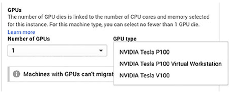
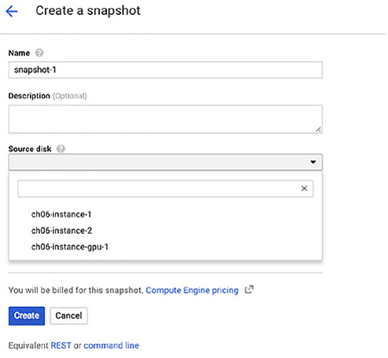
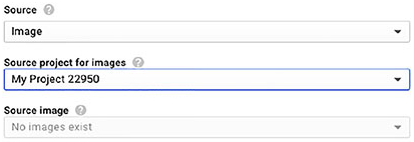

# Chapter 6 VM 관리

**이 챕터는 구글 Associate Cloud Engineer 인증 시험 과목 중, 아래 내용을 다룬다.**
* 4.1 Compute Engine 리소스 관리

VM을 생성한 후에, 클라우드 엔지니어는 VM 단일 인스턴스와 동일한 설정으로 실행되는 VM 그룹 모두 작업해야 한다. 이후에는 *instance group*으로 불리고, 이 챕터에서 소개된다.

이 챕터는 공통적인 관리 업무의 설명과 콘솔에서 업무를 완료하는 방법으로 시작하고, 그 뒤에 Cloud Shell이나 Cloud SDK CLI를 이용한 업무를 완료한느 방법의 설명이 있다. 다음, 인스턴스 그룹을 구성하고 관리하는 방법을 배운다. 이 챕터는 VM을 관리하기위한 가이드라인의 논의로 결론을 맺는다.

## 단일 VM 인스턴스 관리

VM의 단일 인스턴스를 관리하는 방법을 논하는 것으로 시작한다. 단일 인스턴스란, 인스턴스 그룹이나 다른 유형의 클러스터가 아닌 자체로 생성된 인스턴스를 의미한다. 인스턴스 작업을 위한 3가지 방법이 있는 이전 챕터를 기억해보자: Cloud Console, Cloud Shell, Cloud SDK CLI. Cloud Shell와 Cloud SDK CLI는 모두 `gcloud` 명령어를 사용한다. 그래서 같은 섹션에서 Cloud Shell와 Cloud SDK를 같이 설명한다.

### 콘솔에서 단일 VM 인스턴스 관리

클라우드 엔지니어가 친숙해야하는 기본 VM 관리 업무는 인스턴스 생성, 중지, 삭제이다. 이전 챕터에서 인스턴스를 생성하는 것을 다뤘다. 그래서 여기서는 다른 업무에 대해 초점은 둔다. 또한 VM을 나열하고, GPU을 추가하고, 스냅샷과 이미지를 작업하는 것에 친숙해야 한다.

#### 인스턴스 기동, 중지, 삭제

작업을 시작하기 위해 콘솔을 열고 Compute Engine을 선택한다. 다음 VM Instance를 선택한다. 그림 6.1처럼 페이지가 보일 것이다. 하지만 다른 VM이 나열되어있다.


**그림 6.1** Cloud Console의 Compute Engine 섹션에서 VM 인스턴스 페이지

그림 6.1은 3개의 인스턴스가 모두 동작하고 있다. VM 속성 라인에서 오른쪽의 3개의 점으로된 아이콘을 클릭하면 인스턴스를 중단할 수 있다. 아이콘을 클릭하면 명령어의 리스트가 표시된다. 그림 6.2는 `instancech06-instance-1`에 사용할 수 있는 명령어의 리스트를 보여준다.


**그림 6.2** VM의 상태를 변경하기 위해 콘솔에서 이용할 수 있는 명령어 리스트

명령어 메뉴에서 Stop을 선택하면, 인스턴스는 중지될 것이다. 인스턴스가 중지될 때, compute 리소스를 사용하지 않는다. 그래서 비용이 청구되지 않을 것이다. 인스턴스가 존재하고, 필요할 때 다시 시작할 수 있다. 그림 6.3은 VM 중단하는 것에 대해 경고 표시를 보여준다. 해당 경고의 왼쪽 아래에서 메시지를 무시할 수 있다.


**그림 6.3** VM을 중지하는 것에 대해 나타날 수 있는 경고 메시지

VM을 중지할 때, 왼쪽에 있는 초록색 체크 마크는 하얀 네모가 있는 회색 원으로 변경되고, SSH 옵션은 비활성화된다. (그림 6.4)


**그림 6.4** VM이 중지될 때, 왼쪽 아이콘이 변하고, SSH는 더 이상 이용할 수 없다.

중지된 VM을 시작하기 위해 오른쪽의 3개의 점 아이콘을 클릭한다. 그림 6.5처럼 Start를 이용할 수 있지만, Stop과 Reset은 이용할 수 없다.


**그림 6.5** VM이 중지될 때, Stop과 Reset은 더이상 이용할 수 없지만, Start는 이용할 수 있다.

Reset 명령어는 VM을 재시작한다. VM의 properties는 변경되지 않지만, 메모리에 있는 데이터는 잃는다.

> VM이 재시작되었을 때, 메모리에 있는 컨텐츠를 잃는다. 재부팅이나 다른 VM에 사용하기 위해서 데이터를 보관해야한느 경우, Persistent disk나 Cloud Storage에 데이터를 저장해야 한다.

인스턴스로 작업을 완료하고, 더이상 필요하지 않을 때, 삭제할 수 있다. VM을 삭제하는 것은 클라우드 콘솔에서 VM을 제거하고, 중지했을 때 VM 이미지를 유지하는데 사용되는 스토리지같은 리소스를 떼어낸다. 클라우드 콘솔에서 인스턴스를 삭제하면 그림 6.6과 같은 메시지가 표시될 것이다.


**그림 6.6** 콘솔에서 인스턴스를 삭제하면 그림과 같은 경고 메시지가 표시된다.

#### VM 인벤토리 확인

현재 프로젝트가 존재한다면, Cloud Console의 VM 인스턴스 페이지는 VM의 리스트를 보여준다. 인스턴스의 수가 많다면, 관심있는 인스턴스만 확인하는 리스트 필터를 사용할 수 있다. VM 리스트위에 VM 인스턴스 필터를 사용하는 것은 그림 6.7에서 보여준다.


**그림 6.7** 검색 기준에 의해서 인스턴스의 리스크가 필터링된다.

이 예시에서, `ch06-instance-2` 이름의 인스턴스만 보기 위해서 해당 이름을 입력했다. 인스턴스 이름을 지정하는 것 이외에도, 아래와 같은 필터를 적용할 수 있다.
* Labels
* Internal IP
* External IP
* Status
* Zone
* Network
* Deletion protection
* Member of managed instance group
* Member of unmanaged instance group

다양한 필터 조건을 설정하는 경우, OR 연산자를 명시적으로 입력하지 않으면 모든 조건이 true여야 해당 VM 목록을 볼 수 있다.

#### 인스턴스에 GPU 할당하기

GPU는 가상화와 머신러닝같은 계산 집중의 어플리케이션을 위해 사용된다. GPU는 수학 계산을 수행하고, 일부 작업을 CPU에서 GPU로 이관한다.

인스턴스에 GPU를 추가하기 위해, GPU 라이브러리가 설치되어있거나 설치될 인스턴스를 시작해야한다. 예를 들어, 그림 6.8에서 보여지는 것처럼 딥 러닝 이미지를 포함한 GPU 라이브러리가 설치된 GCP 이미지 중 하나를 사용할 수 있다. 인스턴스가 GPU를 사용할 수 있는 zone에서 동작되는지 반드시 확인해야 한다.


**그림 6.8** GPU를 추가할 때, 필요한 라이브러리가 설치된 이미지를 사용하는게 가장 좋다. GPU에서 제공하는 이미지나 필요 라이브러리를 포함한 커스텀 이미지를 사용할 수 있다.

또한, 머신 타입 설정을 커스터마이즈 해야한다. 그림 6.9는 해당 양식을 보여준다.


**그림 6.9** 머신타입을 설청하기 위한 Cloud Console 양식

Customaize를 클릭한다. 그림 6.10에서 보여지는 것처럼 머신 타입 파라미터를 설정하기 위한 화면으로 확장된다.


**그림 6.10** 이 양식은 커스터마이즈된 머신 타입을 생성할 때 사용된다.

추가할 GPU 수를 선택한다. 옵션은 None, 1, 2, 4이다.(그림 6.11) 그런 다음, GPU 타입을 선택한다. (그림 6.12)


**그림 6.11** VM에 추가할 GPU의 수를 선택



**그림 6.12** VM에 추가할 GPU의 타입을 선택

GPU 사용에는 몇 가지 제한이 있다. CPU는 선택된 GPU와 반드시 호환되어야 한다. 예를 들어, Intel Skylake나 이후 CPU의 서버에서 VM이 동작 중이라면, Tesla K80 GPU를 사용할 수 없다. GPU는 공유 메모리 머신에 추가될 수 없다. GPU 제약조선와 GPU의 zone 리스트의 최신 문서는 [https://cloud.google.com/compute/docs/gpus/](https://cloud.google.com/compute/docs/gpus/)에서 확인할 수 있다.

또한, VM에 GPU를 추가한다면, 유지보수 중에 종료되도록 인스턴스를 설정해야 한다. 이 것은 VM 설정 페이지의 Availability Policies 영역에서 설정한다. (rmfla 6.13)


**그림 6.13** GPU가 추가된 VM을 위한 추천 availability policies

#### 스냅샷 작업

스냅샷은 persistent disk의 데이터 복사본이다. 데이터를 복구하기 위해 디스크에 데이터를 저장하는 스냅샷을 사용한다. 이 것은 동일한 데이터로 다양한 persistent disk를 생성하는 편리한 방법이다. 

처음 스냅샷을 생성할 때, GCP는 persistent disk에 데이터의 전체 복사본을 
생성한다. 다음에 디스크에서 스냅샷을 생성하면, GCP는 이전 스냅샷에서 변경된 데이터만 복사할 것이다. 
이 것은 마지막으로 스냅샷이 발생된 디스크에 있는 데이터를 최신의 스냅샷으로 유지하면서 스토리지를 최적화한다.

디스크에 쓰기 전에 메모리에 버퍼 데이터 갖는 데이터베이스나 다른 어플리케이션이 동작 중이라면, 스냅샷을 생성하기 전에 디스크 버퍼를 비워야한다. 그렇지 않으면, 디스크에 쓰여져야하는 메모리 데이터를 잃을 수 있다. 디스크 버서를 비우는 방법은 어플리케이션마다 다양하다. 예를 들어, MySQL은 `FLUSH` 조건을 갖는다.

스냅샷을 작업하하려면, 사용자는 Compute Storage Admin role을 할당받아야 한다. IAM 페이지에 가서 Roles을 선택하고, role을 부여할 사용자의 이메일 주소를 지정한다. role 리스트에서 roleㅇ르 선택한다. (그림 6.14)


**그림 6.14** 스냅샷을 작업하려면, 사용자는 Cloud Storage Admin role을 가져야 한다.

Cloud Console에서 스냅샷을 생성하기 위해, Compute Engine 페이지의 왼쪽 패널에서 Snapshots을 선택한다. (그림 6.15)


**그림 6.15** Cloud Console을 사용하여 스냅샷을 생성

그 다음, 그림 6.16에서 Snapshot을 클릭하여 양식을 표시한다. 이름과 선택적으로 설명을 입력한다. 뿐만아니라 스냅샷에 Label을 추가할 수 있다. 모든 리소스에 일관된 라벨링 규칙을 부여하는 것은 좋은 방법이다. 스냅샷의 경우에서, Label은 디스크의 데이터 유형과 데이터를 사용하는 어플리케이션을 가리킬 수 있다.



**그림 6.16** 스탭샷을 생성하는 양식

Windows 서버 디스크에 스냅샷을 만드는 경우, 인스턴스를 중단해야하는 것 없이 어플리케이션에 일관된 스냅샷을 생성하는 Enable VSS를 체크한다.

#### 이미지 작업

이미지는 디스크 컨텐츠의 복사본이라는 것에서 스냅샷과 유사하다. 차이점은 스냅샷은 디스크에 이용할 수 있는 데이터를 만드는데 사용되고, 이미지는 VM을 생성하는데 사용된다. 이미지는 다음 항목에서 생성될 수 있다.
* 디스크
* 스냅샷
* Cloud storage 파일
* 다른 이미지

이미지를 생성하려면, Cloud Console의 Compute Engine 페이지에서 Iamage 옵션을 선택한다. (그림 6.17) 이용할 수 있는 이미지가 나열된다.


**그림 6.17** 이용할 수 있는 이미지, 여기에서 추가적인 이미지를 생성할 수 있다.

그림 6.18의 양식에서 Create Image를 선택한다. 이름, 설명, label을 지정하여서 새로운 이미지를 생성할 수 있다. 이미지는 그룹 이미지를 만들 수 있는 Family 선택 속성을 갖고 있다. family가 지정될 때, family의 최신, nondeprecated 이미지를 사용한다. 


**그림 6.18** 이미지를 생성`하기 위한 Cloud Console 양식

양식은 이미지의 source를 위한 옵션으로 드롭다운 리스트를 제공한다.


**그림 6.19** 이미지의 Source를 위한 옵션

source로 디스크가 선택되었을 때, VM의 디스크에서 선택할 수 있다.


**그림 6.20** 이미지의 source로 디스크를 사용할 때 옵션

source type으로 이미지를 선택하면, 현재 프로젝트나 다른 프로젝트에서 이미지를 선택할 수 있다.



**그림 6.21** source로 이미지를 사용할 때, 다른 프로젝트에서 source 이미지를 선택할 수 있다.

source로 Cloud Storage 파일을 선택하면, Cloud Storage 버킷을 탐색하여 source로 사용할 파일을 탐색할 수 있다.


**그림 6.22** source로 Cloud Storage 파일을 사용할 때, 파일을 위해 storage 버킷을 탐색한다.

이미지가 생성된 후에, 이미지 이름 옆에 체크박스를 선택하고 목록 위에 Delete나 Deprecate를 선택해서 삭제하거나 사용하지 않을 수 있다. (그림 6.23) 오직 커스텀 이미지만 삭제하고 사용하지 않을 수 있고, GCP 제공 이미지는 할 수 없다.


**그림 6.23** Delete나 Deprecate 명령은 커스텀 이미지 중 하나를 선택했을 때 이용할 수 있다.

Delete는 이미지를 제거하고, Derecated는 이미지를 더이상 지원하지 않는 다는 것으로 표시하고, 앞으로 사용할 대체 이미지를 지정할 수 있다. Google의 deprecated 이미지는 사용할 수 있지만, 보안 결함이나 다른 업데이트를 위해 패치되지 않을 수 있다. Deprecation은 더이상 지원되지 않는 이미지를 사용자에게 알리고, 새로운 이미지나, 지원되는 이미지로 어플리케이션을 테스트할 계획은 잡아야 한다고 알리는데 좋은 방법이다. 결국, Deprecated 이미지는 더 이상 이용할 수 없고, deprecated 이미지의 사용자는 다른 버전을 사용해야 할 것이다.

이미지를 생성한 후에, 이미지 리스트 위에 명령어 라인에서 Create Instance 옵션을 선택해 이미지를 사용하여 인스턴스를 생성할 수 있다.

콘솔을 통해 VM을 관리하는 것 이외에도, CLI를 사용하여 compute 리소스를 관리할 수 있다.

### Cloud Shell과 CLI로 단일 VM 인스턴스 관리하기

콘솔을 통해 VM을 관리하는 것 이외에도, CLI를 사용하여 compute 리소스를 관리할 수 있다. 콘솔과 동일한 명령어는 Cloud Shell이나 챕터 5에서 다뤘던 구글 Cloud SDK가 설치된 로컬 환경에서 사용될 수 있다.

이 섹션은 인스턴스와 작업하기 위한 가장 중요한 명령어를 설명한다. 명령어는 고유한 파라미터 집합을 갖고 있다. 그러나, 모든 `gcloud` 명령어는 flag의 집합을 지원한다. 이러한 집합은 gcloud global flags라고 부르며, 다음을 포함한다.
* `--account`는 기본 계정을 재지정를 사용하기위해 GCP 계정을 지정한다.
* `--configuration`은 key-value 쌍을 포함하는 이름이 있는 설정 파일을 사용한다.
* `--flatten`은 CSV(기본), JSON, YAML, text, 다른 가능한 옵션과 같은 출력 포맷을 지정한다.
* `--help`는 상세 도움 메시지를 표시한다.
* `--project`는 기본 프로젝트를 재정의하는데 사용할 GCP 프로젝트를 지정한다.
* `--quiet`는 대화형 프롬프트를 비활성화하고 기본 값를 사용한다.
* `--verbosity`는 상제 출력 메시지의 레벨을 지정한다. 옵션은 `debug`, `info`, `warning`, `error`가 있다.

이 섹션 내내, 명령어는 optional `--zone` 파라미터를 사용할 수 있다. 기본 값 zone은 `gcloud init`을 실행할 때 설정된다.

#### 인스턴스 기동

인스턴스를 기동하기 위해 `gcloud` 명령어를 사용하여 compute 서비스와 인스턴스를 구체적으로 사용하도록 지정한다. 또한, `start`를 지정하고, 그 뒤에 하나 이상의 인스턴스의 이름을 지정하여 인스턴스를 기동할 것이라고 명시해야 한다.

명령어 문법은 다음과 같다.

```bash
gcloud compute instance start INSTANCE_NAMES
```

다음은 예시이다.

```bash
gcloud compute instances start ch06-instance-1 ch06-instance-2
```

`instances start` 명령어는 Opional 파라미터이다. `--async` 파라미터는 `start` 동작에 대한 정보를 표시한다. 대부분 리눅스 명령어에서 `--verbose` 옵션은 유사한 기능을 제공한다. 다음은 예시이다.

```bash
gcloud compute instances start ch06-instance-1 ch06-instance-2 --async
```

GCP는 인스턴스를 생성할 zone을 알 필요가 있다. 이 것은 `--zone` 파라미터로 지정될 수 있다.

```bash
gcloud compute instances start ch06-instance-1 ch06-instance-2 --zone us-coentral1-c
```

아래 명령어를 이용하여 zone의 리스트를 확인할 수 있다.

```bash
gcloud compute zones list
```

zone을 지정하지 않으면, 커맨드는 zone을 위해 프롬프트를 실행한다.

#### 인스턴스 중지

인스턴스를 중지하기 위해 `gcloud compute instances`를 사용하고 `stop` 뒤에 하나 이상의 인스턴스 이름을 지정한다. 다음은 명령어 구문이다.

```bash
gcloud compute instances stop INSTANCE_NAMES
```

다음은 예시이다.

```bash
gcloud compute instance stop ch06-instance-3 ch06-instance-4
```

`instance start` 명령어 처럼, `stop` 명령어도 optional 파라미터이다. `--async` 파라미터는 stop 동작에 대한 정보를 표시한다.

```bash
gcloud compute instances stop ch06-instance-1 ch06-instance-2 --async
```

GCP는 중지하는 인스턴스를 포함하는 zone을 알아야 한다. `--zone` 파라미터를 이용하여 지정될 수 있다.

```bash
gcloud compute instance stop ch06-instance-1 ch06-instance-2 --zone us-central1-c
```

아래 명령어로 zone의 리스트를 확인할 수 있다.

```bash
gcloud compute zones list
```

#### 인스턴스 삭제

VM으로 작업이 완료되었을 때, `delete` 명령어로 VM을 삭제할 수 있다. 

```bash
gcloud compute instances delete ch06-instance-1
```

`delete` 명령어는 삭제할 VM의 위치를 지정하는 파라미터가 있다. 

```bash
gcloud compute instances delete ch06-instance-1 --zone us-central2-b
```

인스턴스가 삭제되었을 때, VM에 있는 디스크는 `--delete-disks`와 `--keep-disks` 파라미터를 사용하여 삭제하거나 저장할 수 있다. 모든 디스크를 유지하기 위해 `all`, 루트 파일 시스템의 파티션을 지정하는 `boot`, 부팅되지 않는 디스크를 지정하는 `data`를 지정할 수 있다.

예를 들어, 모든 디스크를 유지하는 명령어 예시이다.

```bash
gcloud compute instances delete ch06-instance-1 --zone us-central2-b --keep-disks=all
```

반면에 모든 부틸되지않는 디스크를 삭제하는 것

```bash
gcloud comptue instance delete ch06-instance-1 --zone us-central2-b --delete-disks=data
```

#### VM 인벤토리 확인

인벤토리에 있는 VM의 집합을 확인하는 명령어는 다음과 같다.

```bash
gcloud compute instances list
```

이 명령어는 인스턴스의 이름이 optional이다. 특정 zone의 VM 리스트를 확인하기 위해 , 다음과 같이 사용한다.

```bash
gcloud compute instances list --filter="zone:ZONE"
```

`ZONE`은 zone의 이름이다. 콤마(,)로 분리횐 리스트를 사용하여 다양한 zone을 조회할 수 있다. 

`--limit` 파라미터는 나열되는 VM의 수를 제한한느데 사용되고, `--sort-by` 파라미터는 리소스 필드를 지정하는 VM의 리스트를 정리하는데 사용된다. 다음은 실행 중인 VM의 리소스 필드를 확인할 수 있다.

```bash
gcloud compute instances describe
```

#### 스냅샷 작업

다음 명령어를 사용하여 디스크의 스냅샷을 생성할 수 있다.

```bash
gcloud compute disks snapshot DISK_NAME --snapshot-names=NAME
```

`DISK_NAME`은 디스크의 이름이고, `NAME`은 스냅샷의 이름이다. 스냅샷의 리스트를 확인하기 위해 다음과 같이 사용한다.

```bash
gcloud compute snapshots list
```

스냅샷에 대한 상세 정보를 위해 다음과 같이 사용한다.

```bash
gcloud compute snapshots describe SNAPSHOT_NAME
```

`SNAPSHOT_NAME`은 설명할 스냅샷의 이름이다. 디스크를 생성하기 위해, 다음과 같이 사용한다.

```bash
gcloud compute disks create DISK_NAME --source-snapshot=SNAPSHOT_NAME
```

또한, `--size`와 `--parameters`를 사용하여 디스크의 사이즈와 디스크 타입을 지정할 수 있다. 

```bash
gcloud compute disks create ch06-disk-1 --source-snapshot=ch06-snapshot --size=100 --type=pd-standard
```

standard persistent disk를 사용하는 `ch06-snapshot`을 사용하여 100GB 디스크를 생성할 것이다.

#### 이미지 작업

GCP는 VM을 생성할 떄 사용하는 넓은 범위의 이미지를 제공한다. 그러나, 자신이 보유한 이미지를 생성할 필요가 있을 수도 있다. 이 것은 아래 명령어로 할 수 있다.

```bash
gcloud compute images create IMAGE_NAME
```

`IMAGE_NAME`은 이미지에 주어진 이름이다. 이미지의 source는 source 파라미터 중 하나를 사용하여 지정된다. 다음은 source 파라미터이다.
* `--source-disk`
* `--source-image`
* `--source-image-family`
* `--source-snapshot`
* `--source-uri`

`source-disk`, `soutce-image`, `source-snapshot` 파라미터는 각각 디스크, 이미지, 스냅샷을 사용하여 이미지를 생성할 때 사용된다.`source-image-family` 파라미터는 family의 이미지 중 최신 버전을 사용한다. Families는 관련된 이미지의 그룹이며, 일반적으로 동일한 이미지의 다른 버전이다. `source-uri` 파라미터는 웹 주소를 사용하여 이미지를 지정할 수 있다.

이미지는 description과 label 집합을 갖을 수 있다. `--description`과 `--labels` 파라미터를 사용하여 설정한다.

다음은 디스크로부터 새로운 이미지를 생성하는 예시이다.

```bash
gcloud compute images create ch06-image-1 --source-disk ch06-disk-1
```

다음을 사용하여 이미지가 더이상 필요하지 않을 때, 이미지를 삭제할 수 있다.

```bash
gcloud compute images delete IMAGE_NAME
```
이 것은 Cloud Storage에 이미지를 저장하는데 유용하다. 아래 명령어로 Cloud Storage에서 이미지를 추출할 수 있다.

```bash
gcloud compute images export --destination-uri DETINATION_URI --image IMAGE_NAME
```
`DESTINATION_URI`는 이미지를 저장할 Cloud Storage 버킷의 주소이다.

## 인스턴스 그룹 소개

인스턴스 그룹은 단일 엔티티로서 관리되는 VM의 집합이다. 인스턴스 그룹에 적용되는 `gcloud`나 콘솔 명령은 인스턴스 그룹의 모든 멤버에 적용된다. 구글은 인스턴스 그룹의 2가지 유형을 제공한다: 관리형, 비관리형.

관리형 그룹은 동일한 그룹으로 구성된다. 머신타입, 부트 디스크 이미지, zone, labels, 인스턴스의 다른 파라미터를 포함한 VM 설정의 사향이 포함된 인스턴스 템플릿을 사용하여 생성된다. 관리형 인스턴스 그룹은 자동적으로 그룹의 인스턴스 수를 확장할 수 있고, 인스턴스 그룹 전반적으로 워크로드를 분산하는 로드 밸런싱이 사용될 수 있다. 그룹의 인스턴스가 충돌하면, 자동적으로 재생성된다. 관리형 그룹은 선호하는 인스턴스 그룹이다. 

비관리형 그룹은 그룹 내의 다른 VM 내에서 다른 설정으로 작업해야할 때만 사용되어야 한다.

### 인스턴스 그룹과 템플릿을 생성하고 제거

인스턴스 그룹을 생성하기 위해, 처음으로 인스턴스 그룹 템플릿을 생성해야 한다. 인스턴스 템플릿을 생성하기 위해 아래 명령어를 사용한다.

```bash
gcloud compute instance-template create INSTANCE
```

`--source-instance` 파라미터를 사용하여 인스턴스 템플릿의 source로 기존 VM을 지정할 수 있다. (GCP는 디폴트로 n1-standard1 이미지를 사용한다.)

```bash
gcloud compute instance-templates create ch06-instance-template-1 --source-instance=ch06-instance-1
```

인스턴스 그룹 템플릿은 그림 6.24처럼 콘솔의 Instance Groups Template 페이지에서 생성될 수 있다.


**그림 6.24** 인스턴스 그룹 템플릿은 콘솔에서 create instance 양식과 비슷한 양식을 사용하여 생성될 수 있다.

인스턴스 그룹은 단일 zone이나 region 전반적으로 인스턴스를 포함할 수 있다. 첫 번째는 *zonal* 관리형 인스턴스 그룹이고, 두 번째는 *regional* 관리형 인스턴스 그룹이다. Regional 관리형 인스턴스 그룹은 회복력을 증가시키기 위해 zone 전반적으로 워크로드가 분산되기 때문에 권장된다.

콘솔에서 Instance Group Template 페이지에서 인스턴스 템플릿을 삭제할 수 있다. 템플릿 리스트에서 체크하여 인스턴스 그룹을 선택하고, delete 아이콘을 클릭해서 삭제한다. (그림 6.25)


**그림 6.25** 인스턴스 그룹 템플릿은 콘솔에서 삭제될 수 있다.

또한 아래 명령어를 사용하여 인스턴스 그룹 템플릿을 삭제할 수 있다.

```bash
gcloud compute instance-templates delete INSTACE-TEMPLATE-NAME
```

`INSTANCE-TEMPLATE-NAME`은 삭제할 템플릿의 이름이다.

콘솔에서 인스턴스 그룹을 삭제하기 위해 인스턴스 리스트에서 삭제할 인스턴스 그룹을 선택하고 delete 아이콘을 클릭한다. (그림 6.26)


**그림 6.26** 인스턴스 그룹은 콘솔에서 삭제될 수 있다.

아래 명령어를 사용하여 CLI에서 인스턴스 그룹을 삭제한다.

```bash
gcloud compute instance-groups managed delete-instances INSTANCE-GROUP-NAME
```

`INSTANCE-GROUP-NAME`은 삭제할 인스턴스 그룹의 이름이다.

템플릿과 인스턴스 그룹 리스트를 확인하기 위해 아래 명령을 사용한다.

```bash
gcloud compute instance-templates list
gcloud compute instance-groups managed list-instances
```

인스턴스 그룹의 인스턴스를 확인하기 위해 아래 명령을 사용한다.

```bash
gcloud compute instance-groups managed list-instances INSTANCE-GROUP-NAME
```

### 인스턴스 그룹 로드 밸런싱과 오토스케일링

확장 가능하고, 고가용성의 어플리케이션을 배포하기 위해서는 로드 밸런싱된 인스턴스의 세트에서 어플리케이션을 실행해야 한다. GCP는 여러 종류의 로드밸런싱을 제공하고, 모두 인스턴스 그룹을 사용해야 합니다.

로드밸런싱 이외에도, 관리형 인스턴스 그룹은 오토스케일을 구성할 수 있다. CPU 사용량, 모니터링 메트릭, 로드밸런싱 조정량, 큐기반 워크로드를 기반으로 인스턴스를 추가나 제거를 트리거하는 오토스케일링 정책을 구성할 수 있다.

#### 실 사례
**더이상 최대 용량 기획을 하지 않음**
> 클라우드가 도입되지 전에, IT 조직은 예측되는 최대 부하로 하드웨어 구배를 계획해야 했다. 이 것은 *peak capacity planning*이라고 한다. 부하의 변화가 적으면, peak capacity planning은 안전한 접근이다. 미국에서 1년의 마지막 2달 동안 최대 요구가 발생하는 유통업계와 같이 높은 변화의 워크로드를 갖는 비즈니스는 1년에 몇달동안 사용하지 않는 용량을 갖고 잇어야 한다. 리소스가 필요하지 않을 때, 이 리소스는 중지된다. 인스턴스 그룹은 클라우드 엔지니어가 VM이 언제 추가되고 제거되어야할지 설정하는 것이 따라서 VM의 추가와 제거 프로세스를 자동화한다.

**Notice**

> 오토스케일링될 때, 클러스터 설정에서 또 다른 변경 트리거가 발생하기 전에 VM을 부팅하거나 종료할 수 있는 충분한 시간을 둔다. 확인 간격이 너무 작으면, 최근에 추가한 VM이 다른 VM이 추가되지 전에 완전히 시작되지 않을지도 모른다. 이로 인해 실제로 필요한 것 보다 많은 VM이 추가될 수 있다.

## VM 관리를 위한 가이드라인

다음은 VM을 관리하기 위한 몇 가지 가이드라인이다.
* Label과 descriptions를 사용해라. 이 것은 인스턴스의 목적을 확인하는데 도움을 주고, 인스턴스의 리스트를 필터링할 때 도음을 준다.
* 오토스케일링과 로드밸런싱이 적용되는 관리형 인스턴스 그룹(managed instance group)을 사용해라. 이는 확장 가능하고 고가용성 서비스를 배포하는데 핵심이다.
* 머신 러닝이나 고성능 컴퓨팅과 같은 계산 집약적인 처리를 위해 GPU를 사용해라. 일부 어플리케이션에서 GPU는 다른 CPU를 추가하는 것 보다 성능적으로 더 큰 이점을 준다.
* 디스크의 상태를 저장하거나 복사본을 만들기 위해 스냅샷을 사용해라. 이들은 Cloud Storage에 저장되어 백업 역할을 할 수 있다.
* 장애에도 문제가 없는 워크로드를 위해서 Preemptible 인스턴스를 사용해라. 이 것은 인스턴스의 비용을 80%까지 절약한다.

## Summary

이 챕터에서는 관리형 단일 VM 인스턴스와 인스턴스 그룹에 대한 방법을 배웠다. 단일 VM 인스턴스는 Cloud Console이나 Cloud Shell이나 SDK가 설치된 로컬 장치에서 `gcloud` 명령어를 사용하여 생성하고, 설정하고, 중지하고, 기동하고, 제거할 수 있다. 

스냅샷은 디스크의 복사본이고, 백업 및 다른 인스턴스에 데이터를 복사하는데 유용하다. 이미지는 VM을 생성하기 위해 적절한 포맷의 디스크 복사본이다. 

VM을 관리하는데 사용되는 주요 명령어는 `gcloud compute instance` 명령어이다. `gcloud`는 계층 구조를 사용하여 명령어 요소를 정렬한다. 명령어는 `gcloud`로 시작하고, 뒤에 Compute Engine을 위한 `compute`와 같은 GCP 리소스가 오고, 그 뒤에 `instances`나 `snapshots`같은 엔티티 타입이 온다. 그런 다음에 `create`, `delete`, `list`, `describe`와 같은 액션이 지정된다.

GPU는 OS에 GPU 라이브러리가 설치된 인스턴스에 추가될 수 있다. GPU는 머신러닝 모델을 구축하는 것과 같은 계산 집약적인 업무를 위해 사용된다.

인스턴스 그룹은 같이 관리되는 인스턴스의 그룹이다. 관리형 인스턴스 그룹은 동일한 인스턴스를 갖는다. 이러한 그룹은 로드 밸런싱과 오토스케일링을 지원한다.

## 시험 요소

**Cloud Console을 탐색하는 방법을 이해한다.** Cloud Console은 GCP 작업을 위한 GUI이다. 콘솔의 Compute Engine 영역에서 VM 인스턴스를 생성, 설정, 삭제, 조회할 수 있다. 

**Cloud SDK를 설치하는 방법을 이해한다.** Cloud SDK는 커맨드라인으로 선호하는 zone과 같은 기본 환경 변수를 설정하고, 명령을 실행할 수 있다. Cloud Shell을 사용하면 Cloud SDK가 설치되어있다.

**콘솔과 커맨드라인에서 VM을 생성하는 방법을 안다.** 콘솔로 머신 타입을 지정하고, 이미지를 선택하고, 디스크를 구성할 수 있다. 커맨드 라인에서 리스트를 나열하고, 상세정보를 확인하는 명령어를 사용할 수 있고, 콘솔에서 같은 정보를 확인할 수 있다. 커스터마이즈된 이미지를 사용하는 시기와 사용하지 않는 방법을 이해한다. 이미지는 디스크 컨텐츠의 복사본이고, VM을 생성하는데 사용된다. 이미지가 더이상 지원되지 않으면 Deprecated 마크가 표시된다.

**GPU가 사용되는 이유와 VM에 이를 연결하는 방법을 이해한다.** GPU는 계산 집약적인 동작을 위해서 사용된다; GPU를 사용하기 위한 공통적인 사례는 머신러닝이다. GPU 라이브러리가 설치된 이미지를 사용하는 것이 가장 좋다. 몇 가지 제약조건이 있기 때문에 GPU를 사용할 수 있는 위치를 확인하는 방법을 이해한다. CPU는 선택된 GPU와 반드시 호환되어야 하고, GPU는 공유 메모리 머신에 연결될 수 없다. 어떻게 GPU 비용이 발생되는지 알아야 한다.

**이미지와 스냅샷을 이해한다.** 스냅샷은 백업과 데이터 공유를 목적으로 디스크의 컨텐츠를 저장한다. 이미지는 OS와 관련된 설정을 저장한다. 그래서 인스턴스의 동일한 복사본을 생성할 수 있다.

**인스턴스 그룹과 인스턴스 그룹 템플릿을 이해한다.** 인스턴스 그룹은 단일 엔티티로 관리되는 인스턴스의 그룹이다. 인스턴스 그룹은 인스턴스 그룹과 그룹 내 인스턴스의 구성을 지정한다. 관리형 인스턴스 그룹은 오토 스케일링과 로드 밸런싱을 지원한다.

[맨 위로](#chapter-6-vm-%ea%b4%80%eb%a6%ac)