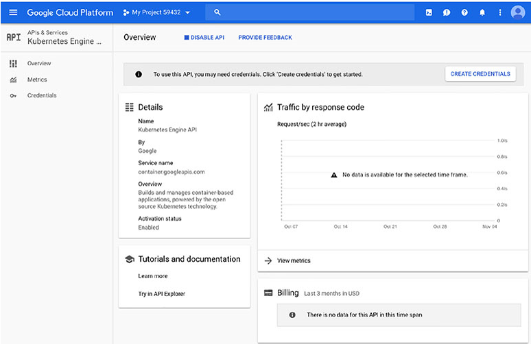
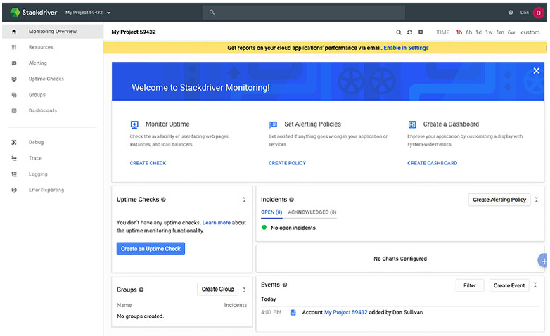
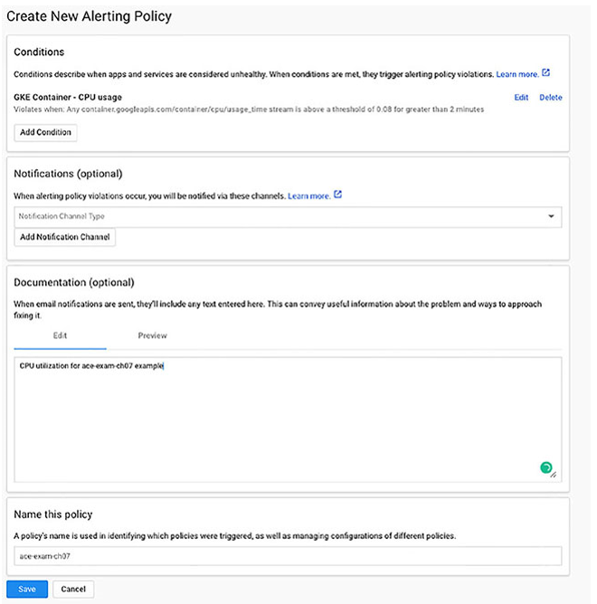

# Chapter 7 Computing with Kubernetes

**이 챕터는 구글 Associate Cloud Engineer 인증 시험 과목 중, 아래 내용을 다룬다.**
* 3.2 Kubernetes Engine 리소스 배포 및 구현

이 챕터는 구글에 의해서 생성되고 오픈소스화된 컨테이너 오케스트레이션 시스템인 Kubernetes를 소개한다. Kubernetes 아키텍처와 클러스터 내 노드 전반적으로 워크로드를 관리하는 방법을 배울 것이다. 또한, Cloud Console, Cloud Shell, Cloud SDK로 Kubernetes 리소스를 관리하는 방법을 배울 것이다. 이 챕터는 또한 어플리케이션 pods(Kubernetes 구조)를 배포하고, Kubernetes 리소스를 모니터링하고, 로깅하는 방법을 다룬다.

## Kubernetes Engine 소개

Kubernetes Engine은 GCP에서 관리하는 Kubernetes 서비스이다. 이 서비스로 GCP 사용자는 Kubernetes 플랫폼을 관리할 필요 없이 자체 Kubernetes 클러스터를 생성하고 유지보수할 수 있다.

Kubernetes는 VM의 클러스터에서 컨테이너를 실행한다. Kubernetes는 컨테이너를 실행할 곳을 결정하고, 컨테이너의 상태를 모니터링하고, VM의 완전한 lifecycle을 관리한다. 이 업무의 집합은 *container orchestration*이라고 알려졌다.

Kubernetes 클러스터는 [챕터 6](Chapter_6.md)에서 논의된 인스턴스 그룹과 유사하다. 둘 다 그룹으로서 관리될 수 있는 VM의 집합이다. 그러나, 인스턴스 그룹은 더 많이 제한된다. 일반적으로 모든 VM은 인스턴스 그룹에서 같은 이미지를 실행한다. Kubernetes는 그렇지 않다. 또한, 인스턴스 그룹은 컨테이너의 배포를 지원하는 메커니즘이 없다. 컨테이너는 게스트 OS를 복제하지 않고도 VM처럼 어플리케이션이나 워크로드를 분산하고 확장할 수 있는 높은 이식성과 가벼운 수단을 제공한다. 컨테이너는 아주 빠르게(보통 몇 초) 기동 및 중지될 수 있고, 아주 적은 리소스를 사용한다. 컨테이너는 어플리케이션과 워크로드를 위한 배의 컨테이너와 유사하다고 생각할 수 있다. 재구성할 필요 없이 배, 기차, 트럭에서 운반될 수 있는 컨테이너처럼, 어플리케이션 컨테이너는 재구성할 필요없이 개발 노트북에서 검증 및 운영 서버로 이동될 수 있다. 이는 수동적으로 완료해야 한다. 인스턴스 그룹은 일부 모니터링을 갖고 실패한 인스턴스를 재시작할 수 있지만, Kubernetes는 유지보수와 관련하여 더 많은 융통성를 갖는다.

몇몇 오브적트와 컨트롤러의 집합으로 구성되는 Kubernetes 아키텍처를 살펴보자.

명심해야 한다. Kubernetes Engine 를 사용할 때, Kubernetes 플랫폼의 컨테이너에서 실행되는 Kubernetes와 어플리케이션과 워크로드를 관리할 것이다.

### Kubernetes 클러스터 아키텍쳐

Kubernetes 클러스터는 클러스터 마스터와 클러스터의 워커인 하나 이상의 노드로 구성된다. 클러스터 마스터는 클러스터를 제어하고, 고가용성과 장애대응을 위한 replicated와 분산될 수 있다.

클러스터 마스터는 Kubernetes API, Controllers, Schedulers와 같이 Kubernetes에서 제공되는 서비스를 관리한다. 클러스터와의 모든 상호작용은 Kubernetes API를 사용하여 마스터를 통해 동작된다. 클러스터 마스터는 노드에서 동작을 수행하는 명령어를 실행한다. 또한 사용자는 `kubectl`명령어를 사용하여 클러스터와 상호작용할 수 있다.

노드는 클러스터에서 실행하는 워크로드를 실행한다. 노드는 어플리케이션을 실행하도록 설정된 컨테이너를 실행하는 VM이다. 노드는 클러스터 마스터에 의해 주로 제어되지만, 일부 명령어는 수동적으로 실행될 수 있다. 노드는 `kubelet`이라고 불리는 에이전트를 실행한다. 이는 클러스터 마스터와 통신하는 서비스이다. 

클러스터를 생성할 때, 머신 타입을 지정할 수 있다. 기본 값은 1개의 vCPU와 3.75GB의 메모리를 갖는 n1-standard-1이다. 이 VM들은 컨테이너를 실행하는데 최적화된 특별한 OS를 실행한다. 메모리와 CPU의 일부는 Kubernetes를 위해 선점된다. 그래서 노드에서 실행하는 어플리케이션이 이용할 수 없다.

Kubernetes는 처리를 워크로드로 구성합니다. Kubernetes가 워크로드를 처리하는 방법의 핵심 기능을 구성하는 몇 가지 구성 Objects가 있다.

### Kubernetes Objects

워크로드는 Kubernetes 클러스터에서 노드 전반적으로 분산된다. 어떻게 작업이 분산되는지 이해하기 위해, 몇 가지 기본 개념을 이해하는게 중요하다.
* Pods
* Services
* Volumes
* Namespaces

이러한 각 object은 워크로드의 논리적인 구성에 기여한다.

#### Pods

Pods는 클러스터에서 실행 중인 프로세스의 단일 인스턴스이다. Pods는 최소 하나의 컨테이너를 포함한다. 보통 단일 컨테이너를 실행하지만, 다수의 컨테이너를 실행할 수 있다. 다수의 컨테이너는 2개 이상의 컨테이너가 리소스를 반드시 공유해야할 때 사용된다. Pods는 컨테이너 전반적으로 네트워크와 스토리지를 공유한다. 각 Pod는 유니크한 IP 주소와 port의 집합을 얻는다. 컨테이너는 port에 연결한다. pod 내에 다수의 컨테이너는 다른 포트에 연결하고, 서로 localhost로 통신할 수 있다. 이 구조는 클러스터내의 하나의 어플리케이션 인스턴스를 pod로서 실행하는 데 지원하도록 설계되었다. pod는 컨테이너가 마치 독립된 VM에서 실행중인 것처럼, 공용 스토리지, 하나의 IP주소, 포트 집합을 공유하는 것처럼 작동할 수 있다. 이렇게 하면, 구성을 변경하지 않고도 동일한 어플리케이션의 여러 인스턴스나 다른 어플리케이션의 다른 인스턴스를 동일한 노드나 다른 노드에 배포할 수 있다.

Pods는 관리 목적으로 다수의 컨테이너를 하나의 엔티티로 취급한다.

Pods는 일반적으로 그룹으로 생성된다. Replicas는 Pods의 복사본이고, 유닛으로 관리되는 Pods의 그룹을 구성한다. 뿐만 아니라 Pods는 오토 스케일링을 지원한다. Pods는 임시로 간주된다. 즉, Pods는 종료될 것으로 간주된다. Pod가 unhealthy 상태(예를 들어, waiting 모드에서 멈추거나 반복적으로 충돌되는 경우)이면, 종료된다. 확장과 상태 모니터링을 관리하는 메커니즘은 *controller*로 알려져있다.

pods는 Compute Engine 관리형 인스턴스 그룹과 유사하다. 핵심 차이점으로 pods는 컨테이너에서 어플리케이션을 실행하기 위한 것이고, 클러스터에서 다양한 노드에 위치될 수 있다. 반면에 관리형 인스턴스 그룹은 각 노드에 동일한 어플리케이션 코드를 실행한다. 또한, Cloud Console에서 명령을 실행하거나 커맨드라인을 통해서 스스로 인스턴스 그룹을 관리한다. Pods는 보통 controller에 의해서 관리된다.

#### Sevices

Pods가 임시적이고, controller에 의해서 종료될 수 있기 때문에, pods에 의존하는 다른 서비스는 특정 pods에 밀접하게 결합되지 않아야 한다. 예를 들어, pods가 유니크한 IP 주소를 갖더라도, 어플리케이션은 해당 IP 주소에 의존하지 않아야 한다. 해당 IP 주소를 갖는 pod가 종료되고 다른 pods가 생성되면, 다른 IP 주소를 갖을 수도 있다. IP 주소는 다른 컨테이너를 실행하는 다른 pod에 재지정될지도 모른다.

Kubernetes는 pods에서 실행 중인 어플리케이션과 이를 호출하는 다른 어플리케이션 사이의 간접적인 수준을 제공한다. 이를 *service*라고 부른다. Kubernetes에서 service는 API 엔드포인트에 안정적인 IP 주소를 제공하여 어플리케이션이 특정 어플리케이션을 실행하는 pods를 찾을 수 있도록 하는 객체이다. Services는 pods가 변경될 때 업데이트 된다. 그래서 어플리케이션을 실행하는 최신 pods의 리스트를 유지한다.

#### ReplicaSet

ReplicaSet은 동일한 수의 pods가 실행 중이라는 것을 보장하는 deployment에 의해서 사용되는 controller이다. 예를 들어, pod가 unhealthy 상태라고 결정되면, controller는 pod를 종료할 것이다. ReplicaSet은 어플리케이션나 워크로드를 위해 충분한 pods가 실행 중이지 않은 것을 감지하고, 다른 pods를 생성할 것이다. 또한 ReplicaSet은 pods를 업데이트하고 삭제하는데 사용된다.

#### Deployment

Kubernetes에서 또 다른 중요한 개념은 deployment이다. Deployments는 동일한 pods의 세트이다. 세트의 멤버는 일부 pods가 종료되고 다른 pods가 실행되면 변경될 수 있지만, 모두 동일한 어플리케이션을 실행하고 있다. pods는 동일한 pod 템플릿을 사용하여 생성되기 때문에, 모두 동일한 어플리케이션을 실행한다. 

pod 템플릿은 pod를 실행하는 방법에 대한 정의이다. pod를 정의하는 방법의 설명은 *pod specification*이라고 부른다. Kubernetes는 템플릿에서 정의된 상태로 pod를 유지하기위해 이 정의를 사용한다. 즉, 이 명세서는 deployment에 포함되어야하는 pods의 최소 수가 있고, 그 수에 미치지 못하면, ReplicaSet을 호출하여 추가적인 pods가 Deployment에 추가될 것이다.

#### StatefulSet

Deployments는 stateless 어플리케이션에 적합하다. stateless 어플리케이션은 상태를 추적할 필요가 없는 어플리케이션이다. 예를 들어, 입력 값으로 계산하는 API를 호출하는 어플리케이션은 이전 호출이나 계산을 추적할 필요가 없다. 해당 API를 호출하는 어플리케이션은 호출할 때마다 다른 pod에 도달할지도 모른다. 그러나, 단일 세션 동안 단일 pod가 클라이언트의 모든 호출에 응답하도록하는 것이 유리한 경우가 있다. 

StatefulSets는 deployment와 같지만, pod에 유니크한 ID를 지정한다. 이를 통해 Kubernetes는 어떤 클라이언트가 어떤 pod를 사용하는지 추적하고 함께 유지할 수 있다. StatefulSets는 어플리케이션이 유니크한 네트워크 ID나 안정적인 persistenct 스토리지가 필요할 때 사용된다.

#### Job

Job은 워크로드에 대한 추상화이다. Job은 pods를 생성하고, 어플리케이션이 워크로드를 완료할때까지 pods를 실행한다. Job 명세서는 설정파일에 지정되고, 사용할 컨테이너에 대한 명세서와 실행할 명령어를 포함한다.

Kubernetes가 어떻게 구성되고, 워크로드를 어떻게 실행하는지 다뤘다. 앞으로 Kubernetes Engine을 사용하여 Kubernets 클러스터를 배포하는 방법을 다룰 것이다.

## Kubernetes 클러스터 배포

Kubernetes 클러스터는 Cloud Console이나 Cloud Shell이나 Cloud SDK가 설치된 로컬 환경에서 커맨드 라인을 사용하여 배포될 수 있다.

### Cloud Console을 사용하여 Kubernetes 클러스터 배포

Kubernetes Engine을 사용하기 위해, Kubernetes Engine API를 활성화해야 한다. API를 활성화하면, Cloud Console에서 Kubernetes Engine 페이지를 이동할 수 있다. 그림 7.1은 Overview 페이지의 예를 보여준다.



**그림 7.1** Cloud Console의 Kubernets Engine 섹션의 Overview 페이지

Kubernetes Engine을 처음 사용하면, credentials을 만들어야 한다. Overview 페이지 위쪽에 Create Credentials 버튼을 클릭해서 생성할 수 있다. 그림 7.2에서 보여지는 양식이 나타날 것이다. 사용할 API를 지정한 다음 credentials을 생성한다.


**그림 7.2** Kubernetes Engine을 사용하는 데 필요한 credential을 생성하기 위한 양식

credentials을 생성한 후, 클러스터를 생성할 수 있다. 그림 7.3은 클러스터 생성 단계의 첫번째 단계를 보여준다.


**그림 7.3** Cloud Console에서 Kubernetes 클러스터를 생성하기 위한 첫 번째 양식

Create Cluster를 클릭하면, 그림 7.4에서 보여지는 것처럼 몇몇 템플릿을 선택하는 옵션이 표시될 것이다. 템플릿은 vCPU 수, 메모리, GPU 사용에 따라 다르다. 예를 들어, Standard Cluster 템플릿은 1 개의 vCPU와 3.75GB의 메모리를 갖는 3개의 노드를 사용한다. 반면에, CPU Intensive 템플릿은 4개의 vCPU와 3.6GB의 메모리를 사용한다.


**그림 7.4** Kubernetes 클러스터를 생성하기 위한 템플릿

템플릿에서 제공되는 파라미터를 수정할 수 있다. 예를 들어, 가용성을 향상시키기 위해 다른 zone에서 VM을 실행하려면, multiple node pool을 지정할 수 있다. Node pools은 Kubernetes 클러스터에서 인스턴스 그룹이다. 관리형 인스턴스 그룹과 매우 유사하지만, 같지 않다.

클러스터를 생성하는데 몇 분이 소요되다. 클러스터가 생성되면, 그림 7.5처럼 클러스터의 리스트가 표시된다.


**그림 7.5** 클러스터의 리스트는 인스턴스의 수, 전체 코어(vCPU), 전체 메모리를 보여준다.

클러스터 리스트에서 클러스터를 수정하고, 삭제하고, 클러스터에 연결할 수 있다. Connect를 클릭하면, 커맨드 라인에서 클러스터에 연결하는 `gcloud` 명령어를 수신된다. 또한 그림 7.6처럼 워크로드 페이지를 볼 수도 있다.


**그림 7.6** 커맨드라인에서 `gcloud` 커맨드를 사용하거나 워크로드 페이지를 확인하는 것으로 클러스터에 연결할 수 있다.

Kubernetes는 클러스터를 관리하기위해 많은 워크로드를 실행한다. Cloud Console의 Kubernetes Engine 섹션에서 Workloads 페이지에서 현재 실행 중인 워크로드를 확인할 수 있다. 그림 7.7은 새로 생성된 클러스터에서 실행 중인 워크로드의 일부를 보여준다.


**그림 7.7** Workloads 페이지는 현재 실행 중인 워크로드를 리스트화 한다.

### Cloud Shell과 Cloud SDK를 사용하여 Kubernetes 클러스터 배포

다른 GCP 서비스처럼, Kubernetes Engine은 커맨드라인을 사용하여 관리될 수 있다. Kubernetes Engine을 작업하기 위한 기본 명령어는 다음 `gcloud` 커맨드를 사용한다.

```bash
gcloud container
```

`gcloud` 명령어는 많은 파라미터를 갖는다. 
* Project
* Zone
* Machine type
* Image type Disk type
* Disk size
* Number of nodes

클러스터를 생성하기 위한 기본 명령어는 아래와 같다.

```bash
gcloud container clusters create ch07-cluster --num-nodes=3 --region=us-central1
```

클러스터를 생성하기 위한 명령어는 꽤 길다. 예를 들어, 아래는 기본 템플릿을 사용하여 클러스터를 생성하는 명령어이다.

```bash
gcloud container --project "ferrous-depth-220417" clusters create  "standard-cluster-2" --zone "us-central1-a" --username "admin"  --cluster-version "1.9.7-gke.6" --machine-type "n1-standard-1"  --image-type "COS" --disk-type "pd-standard" --disk-size "100" --scopes  "https://www.googleapis.com/auth/compute","https://www.googleapis.com/auth/devstorage.read_only","https://www.googleapis.com/auth/logging.write", "https://www.googleapis.com/auth/monitoring","https://www.googleapis.com/auth/servicecontrol","https://www.googleapis.com/auth/service.management.readonly", "https://www.googleapis.com/auth/trace.append" --num-nodes "3" --enable-cloud-logging --enable-cloud-monitoring --network "projects/ferrous-depth-220417/global/networks/default" --subnetwork "projects/ferrous-depth-220417/regions/us-central1/subnetworks/default" --addons HorizontalPodAutoscaling, HttpLoadBalancing,KubernetesDashboard --enable-autoupgrade --enable-autorepair
```

이런 종류의 명령어를 처음부터 작성하는 대신, Cloud Console을 사용하여 템플릿을 선택한 다음, Create Cluster 양식에서 동일한 커맨드라인을 생성하는 옵션을 사용할 수 있다.

## 어플리케이션 Pods 배포

클러스터를 생성했으므로 어플리케이션을 배포해보자.

Cloud Console에서 Kubernetes Engine의 Cluster 페이지에서 Create Deployment를 선택한다. 그림 7.8같은 양식이 나타난다. 이 양식에서 다음 내용을 지정할 수 있다.
* Container image
* Environment variables
* Initial command
* Application name
* Labels
* Namespace
* Cluster to deploy to


**그림 7.8** Create Deployment 옵션은 실행할 컨테이너와 실행할 어플리케이션을 기동할 때 초기 명령어를 지정하는 양식을 제공한다.

deployment를 지정하면, 그에 맞는 YAML 명세서가 표시된다. 이 명세서는 커맨드 라인에서 deployment를 생성하는데 저장되고, 사용된다. 그림 7.9는 deployment YAML 파일의 예시를 보여준다. 아웃풋은 항상 YAML 포맷으로 표시된다.


**그림 7.9** Kubernetes deployment를 위한 YAML 명세서

Cloud SDK를 설치하는 것 이외에도, 커멘드라인에서 클러스터 작업을 하는 Kubernetes command-line tool `kubectl`을 설치해야 한다. 아래 명령어를 동작할 수 있다.

```bash
gcloud compunents install kubectl
```

**Notice**
> Cloud SDK Manager가 비활성화되면, `gcloud components install kubectl`을 실행할 때 에러를 수신할 수 있다. 이 현상이 발생하면, [https://cloud.google.com/sdk/install](https://cloud.google.com/sdk/install)에 따라서 component manager를 사용할 수 있다. <br>
> Cloud SDK component manager는 SDK를 설치하지 못한 경우 다른 패키지 매니저를 통해서 작업한다. component manager를 사용하려면, 아래 방법 중 하나를 사용하여 설치할 수 있다.
>> [https://cloud.google.com/sdk/downloads#versioned](https://cloud.google.com/sdk/downloads#versioned) <br>
>> [https://cloud.google.com/sdk/downloads#interactive](https://cloud.google.com/sdk/downloads#interactive) <br>
> 추가적인 패키지는 deb과 yum 저장소에서 이용할 수 있다; 동일한 components를 모두 이용할 수 있고, 기존 패키지 매니저를 사용하여 설치하면 된다.<br>
>>[https://cloud.google.com/sdk/downloads#apt-get](https://cloud.google.com/sdk/downloads#apt-get) <br>
>> [https://cloud.google.com/sdk/downloads#yum](https://cloud.google.com/sdk/downloads#yum)

`kubectl run` 명령어를 사용하여 클러스터에 Docker 이미지를 실행할 수 있다. 

```bash
kubectl run ch07-app-deploy --image=ch07-app --port=8080
```

이 것은 `ch07-app` 이름의 Docker 이미지를 실행하고, 8080포트로 네트워크 접근할 수 있게 한다. 얼마 후에 deployment에서 replicas의 수를 확장하고 싶다면, `kubectl scale` 명령어를 사용할 수 있다.

```bash
kubectl scale deployment ch07-app-deploy --replicas=5
```

위 예시는 5개의 replicas를 생성한다.

## Kubernetes 모니터링

Stackdriver는 GCP의 포괄적인 모니터링, 로깅, 알림 제품이다. Kubernetes 클러스터를 모니터링하는 데 사용될 수 있다.

클러스터를 생성하면, Cloud Console의 Create Cluster 양식에서 Advanced Options를 선택하여 Stackdriver 모니터링과 로깅을 활성화 할 수 있다. Additional Features 아래에 Enable Logging Service와 Enable Monitoring Service를 선택한다.


**그림 7.10** Create Cluster 양식에서 Advanced Options를 확장하면 Stackdriver 로깅과 모니터링을 활성화하는 2가지 체크박스가 나타난다.

Cloud Console에서 Stackdriver를 세팅하기 위해, 왼쪽에 있는 메뉴에서 Stackdriver를 선택한다. 처음에, 새로운 workspace를 선택하고, 프롬프트가 표시되면 모니터링을 시작하여 프로젝트에 workspace를 생성해야 한다. (그림 7.11) workspace가 생성되면, Kubernetes 클러스터를 포함하여 GCP 리소스를 모니터링 할 수 있다.

Workspace는 모니터링을 위한 리소스이고, 모니터링하는 프로젝트를 100개까지 지원할 수 있다. Workspace는 dashboards, alerting policies, group definitions, notification checks를 포함한다.


**그림 7.11** Stackdriver에서 workspace를 생성하는 초기 화면

workspace를 생성한 후에, Stackdriver를 열면, Monitoring Overview 페이지가 표시된다.



**그림 7.12** Stackdriver Monitoring Overview 페이지

Overview 페이지에서, Resource를 클릭하고, 클러스터의 인스턴스를 조회하는 Instances를 선택한다. 그림 7.13과 같은 리스트가 표시된다.


**그림 7.13** Kubernetes 클러스터의 인스턴스 리스트

인스턴스의 이름을 클릭하여 모니터링 상세 정보 페이지를 볼 수 있다.


**그림 7.14** Kubernetes 클러스터에서 실행 중인 인스턴스의 전형적인 상세 모니터링 페이지

상세 페이지에서, 인스턴스에 대한 상세 overview를 확인하고, CPU 사용량, 디스크 I/O, 네트워크 트래픽을 확인할 수 있다. 또한, CPU 사용량 초과 같은 조건이 인스턴스에서 발생한 경우 알림을 받을 수 있는 alerting 정책을 생성할 수 있다. alerts를 생성하면, 클러스터 인스턴스 별로나 클러스터 인스턴스 전체에 적용될 수 있다.

Stackdriver 상제 페이지에서, Create Alerting Policy 버튼을 클릭하여 alert를 생성할 수 있다. 조건, 알림, 글을 생성할 수 있는 화면이 표시된다.(그림 7.15) 또한 policy의 이름을 부여할 수 있다.


**그림 7.15** alerting 정책을 생성하면, 정책의 컴포넌트를 지정할 수 있다.

조건을 추가하면, 그림 7.16고 같은 양식이 표시된다.


**그림 7.16** Stackdriver는 다양한 타입의 조건을 지원한다.

Metric Threshold를 선택하면 그림 7.17같은 양식이 표시된다. 그림은 5분동안 CPU 사용량이 80%를 넘으면 알림을 보내도록 지정하는 방법을 보여준다.


**그림 7.17** Stackdriver metric threshold 조건은 CPU 사용량 같은 모니터링되는 리소스의 집합을 기반으로 한다.

Stackdriver는 알림이 동작된 경우 notify를 보내는 방법을 알아야 한다. 그림 7.18처럼 Create New Alerting Policy 양식에서 notification 채널을 선택할 수 있다. 채널은 이메일, webhooks, SMS 문자를 포함하고, 뿐만 아니라 PagerDuty, Campfire, Slack과 같은 3rd 파티 툴을 포함한다.

Stackdriver는 process health, uptime checks, group aggregate thresholds, metric rates of change를 포함한 더 많은 고급 alerting을 지원한다.

CPU 사용량을 모니터링하는 정책을 생성하는 예로 얘기해보자


**그림 7.18** Stackdriver는 다양한 타입의 notification 채널을 지원한다.

**Notice**

> 모니터링의 더 많은 상제 정보는 챕터 18을 확인해라. CPU 사용량을 모니터링하는 정책을 생성하기 위해 Stackdriver에서 모니터링 페이지를 열고, Create Policy를 클릭한다. 정책을 생성하는 양식이 표시되고 4가지 단계가 있다. 조건 생성, notification 채널 지정, 설명 추가, 정책 이름 부여(그림 7.19)


**그림 7.19** CPU 사용량을 모니터링하는 정책 생성

Add Condition을 클릭하면 그림 7.20같은 양식이 표시된다.


**그림 7.20** 정책 조건 추가

Filter 파라미터에서 **GKE Container**와 **CPU Usage**를 입력한다. Configuration 섹션에서, threshold로 80%와 시간 간격으로 2분을 지정한다. 그러면 Create Policy 양식으로 돌아간다. Notification 파라미터에서 그림 7.21처럼 이메일을 선택한다.


**그림 7.21** notification 채널을 선택

description과 policy 이름을 추가한다.



**그림 7.22** 완성된 policy 생성 양식

policy specification을 저장하면 모니터랑 summary가 표시된다.


**그림 7.23** CPU 사용량 정책의 모니터링 결과

## Summary

Kubernetes Engine은 클러스터에서 실행되는 어플리케이션을 배포하기 위한 컨테이너 오케스트레이션 시스템이다. Kubernetes는 하나의 클러스터 매니저와 워커 노드로 구성된다.

Kubernetes는 Pods라는 개념을 사용하여 컨테이너를 실행하는 인스턴스이다. pod에 다수의 컨테이너를 실행하는 것이 가능하지만, 하나의 컨테이너를 갖는 pod보다 덜 자주 발생한다. ReplicaSet은 실행 중인 pod의 정확한 수를 보장하는 컨트롤러이다. Deployment는 동일한 pods의 집합이다. StatefulSet은 stateful 어플리케이션을 위해 사용되는 deployment의 유형이다.

Kubernetes 클러스터는 Cloud Console이나 `gcloud` 명령어를 사용하여 배포될 수 있다. 컨테이너에 어플리케이션을 번들로 제공하고, `kubectl` 명령어를 사용하여 클러스터에서 어플리케이션을 실행하는 deployment를 생성하기 위해 콘솔이나 어플리케이션을 배포할 수 있다.

Stackdriver는 클러스터의 인스턴스를 모니터링하기 위해 사용된다. alert을 생성하고, 다양한 채널로 notification을 받을 수 있다.

## 시험 요소

**Kubernetes가 컨테이너 오케스트레이션 시스템이라는 것을 이해한다.** Kubernetes Engine은 GCP 사용자에게 Kubernetes를 제공하는 GCP 제품이다. Kubernetes는 VM 인스턴스 집합에서 실행되는 컨테이너를 관리한다.

**Kubernetes는 워크로드를 실행하는 노드를 제어하는 하나의 클러스터 마스터를 사용한다는 것을 이해한다.** Kubernetes는 실행을 조정하고, pods의 상태를 모니터링하는 마스터를 사용한다. pod에 문제가 있으면, 마스터는 문제를 수정하고, 멈춘 job을 reschedule 한다.

**pods를 설명할 수 있다.** Pods는 실행 중인 프로세스의 단일 인스턴스이고, Service는 pods와 pods에서 서비스를 호출하는 클라이언트 사이에 간접적인 수준을 제공한다. ReplicaSet은 실행 중인 pod의 수를 보장하는 컨트롤러의 종류이고, deployment는 동일한 pods의 집합이다.

**Kubernetes는 Cloud Console이나 `gcloud` 명령어를 사용하여 배포될 수 있다.** `gcloud` 명령어는 Kubernetes Engine 서비스를 처리한다. `kubectl` 명령어는 커맨드라인에서 클러스터의 내부 상태를 관리하는 데 사용된다. Kubernetes Engine을 작업하기 위한 기본 명령어는 `gcloud container`이다. `gcloud`와 `kubectl`은 다른 명령어 문법을 갖는다는 것을 기억해라. `kubectl` 명령어는 `kubectl scale deployment`과 같은 동사(scale)와 리소스(deployment)를 지정한다. `gcloud`는 `gcloud container clusters create`처럼 동사 전에 리소스를 지정한다. Deployments는 Cloud Console을 사용하거나 YAML 명세서를 사용한 커맨드 라인에서 생성된다.

**Deployment는 동일한 pods의 집합이다. StatefulSet은 stateful 어플리케이션을 위해 사용되는 deployment 타입이다. Kubernetes는 Stackdriver를 사용하여 모니터링된다.** Stackdriver는 alert를 생성하고, 다양한 채널에서 notify를 받을 수 있다. 클러스터의 상태를 모니터링하기 위해 CPU 사용량 같은 metric을 모니터링하는 정책을 생성하고 이메일이나 다른 채널로 notification을 보낼 수 있다.

[맨 위로](#chapter-7-computing-with-kubernetes)