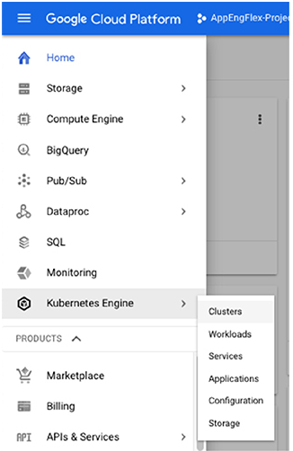

# Chapter 8 Kubernetes 클러스터 관리

**이 챕터는 구글 Associate Cloud Engineer 인증 시험 과목 중, 아래 내용을 다룬다.**
* 4.2 Kubernetes Engine 리소스 관리

이 챕터는 기본적인 Kubernetes 관리 업무를 수행하는 방법을 설명한다.
* Kubernetes 클러스터 상태 확인
* 이미지 repositories와 이미지 정보 확인
* nodes 추가, 수정, 삭제
* pods 추가, 수정, 삭제
* services 추가, 수정, 삭제

구글 Cloud Console과 개발 머신, GCP VM, Cloud Shell에서 사용할 수 있는 Cloud SDK를 사용하여 이러한 작업을 수행하는 방법을 확인할 것이다. 

## Kubernetes 클러스터 상태 확인

챕터 7에서 설명된 단계를 사용하여 클러스터를 생성한다고 가정하면, 구글 Cloud Console이나 `gcloud` 명령어 중 하나를 사용하여 Kubernetes 클러스터의 상태를 확인할 수 있다.

### Cloud Console을 사용하여 Kubernetes 클러스터의 상태를 확인

Cloud Console 홈 페이지에서 왼쪽 위에 3개의 선으로된 아잍콘을 클릭하여 메뉴를 연다. 그림 8.1에서 보여지는 것 처럼 GCP 서비스의 리스트가 표시된다.


**그림 8.1** 구글 Cloud Console의 메뉴

서비스 리스트에서 Kubernetes Engine을 선택한다.



**그림 8.2** 메뉴에서 Kubernetes Engine을 선택

#### 메뉴의 위에 서비스를 고정

그림 8.2에서, Kubernetes Engine은 "pinned"을 선택하면 메뉴 위쪽에 표시된다. (그림 8.3) 이 기능에서, Compute Engien과 Kubernetes Engine은 이미 고정되어있다. Cloud Functions은 회색 핀 아이콘을 클릭하여 고정될 수 있다.


**그림 8.3** 메뉴의 위에 서비스를 고정

메뉴에서 Kubernetes Engine을 클릭한 후, 그림 8.4처럼 실행 중인 클러스터의 리스트를 확인할 수 있다. `standard-cluster-`이라는 하나의 클러스터가 보여진다.


**그림 8.4** Kubernetes Engine에서 클러스터 리스트의 예

그림 8.5처럼 마우스를 올리면 클러스터가 강조된다. 그림 8.6처럼 이름을 클릭하면 클러스터의 상세 정보가 표시된다.


**그림 8.5** 클러스터의 이름을 클릭하면 상세 정보가 표시된다.


**그림 8.6** 클러스터 상세 페이지의 첫번째 부분은 클러스터의 설정을 설명한다.

Add-ons와 Permissions을 클릭하면 그림 8.7처럼 정보가 표시된다. Add-ons 섹션은 클러스터의 optional 추가 기능의 상태를 표시한다. Permission 섹션은 클러스터에 활성화된 GCP Service API가 표시된다.


**그림 8.7** 클러스터를 위한 Add-on과 permission 상세 정보

그림 8.8은 node pool의 상세 정보 예를 보여준다. node pool은 Kubernetes 클러스터에 실행 중인 개별 인스턴스 그룹이다. 이 섹션에서 상세 정보는 node에서 실행 중인 node 이미지, 머신 타입, 전체 vCPU의 수, 디스크 타입, node가 preemptible인지 아닌지를 포함한다.

클러스터 이름 아래에는 3가지 옵션이 있다: Detals, Storage, Nodes. 지금 까지 상세 정보 페이지의 컨텐츠를 설명했다. Storage를 클릭하여 그림 8.9와 같이 정보를 표시한다. 클러스터에서 사용되는 persistent volumes과 storage classes를 표시한다.

클러스터는 persistent volumes을 갖지 않지만 standard storage를 사용한다. Persistenct volumes은 Kubernetes에 의해서 관리되는 영속성이 있는 디스크이고, Compute Engine persistenct disk를 사용하여 구현된다. storage class는 서비스의 품질, 정책 백업, provisioner(스토리지를 구현하는 서비스)를 지정하는 정책의 집합인 스토리지 유형이다.


**그림 8.8** 클러스터의 node pool에 대한 상세 정보


**그림 8.9** 클러스터에 대한 스토리지 정보

클러스터 상태 메뉴의 Nodes 옵션 아래에, 그림 8.10처럼 클러스터에서 실행 중인 nodes나 VMs의 리스트를 확인할 수 있다. nodes 리스트는 기본적인 설정 정보를 보여준다.


**그림 8.10** 클러스터의 nodes 리스트

node 중 하나를 클릭하면 그림 8.11처럼 상세한 상태 정보를 확인할 수 있다. node 상세 정보는 CPU 사용량, 메모리 소모, 디스크 I/O를 포함한다. node에서 실행 중인 pods의 리스트도 확인할 수 있다.


**그림 8.11** Kubernetes 클러스터에서 실행 중인 node의 상세 정보

pod의 이름을 클릭하면 상세 정보를 확인할 수 있다. pod 화면은 CPU, 메모리, 디스크 통계를 확인하는 node 화면과 유사하다. 설정 상제 정보는 pod가 언제 생성되고, 지정된 labels, 로그 링크, 상태(그림 8.12에는 Running으로 표시된다.)를 포함한다.

가능한 다른 상태(status)는 pod가 이미지를 다운로드 중이라는 것을 가리키는 Pending, pod가 성공적으로 종료되었다는 것을 가리키는 Secceeded, 최소 하나의 컨테이너가 장애인 경우를 가리키는 Failed, 마스터가 node에 도달할 수 없고, 상태를 결정할 수 없는 경우인 Unknown이 있다.


**그림 8,12** pod 상태가 Running으로 표시된다. 

pod 화면 아래에 실행 중인 컨테이너의 리스트가 있다. 컨테이너의 이름을 클릭하여 상세 정보를 확인할 수 있다. 그림 8.13은 `event-exporter` 이름의 컨테이너의 상세정보를 보여준다. 정보에는 상태, 기동 시간, 실행 중인 명령어, 마운트된 volume을 포함한다.


**그림 8.13** pod에서 실행 중인 컨테이너의 상세 정보

Cloud Console을 사용하여, 모든 클러스터를 조회할 수 있고, 클러스터의 설정과 상태의 상세 정보를 확인할 수 있다. 각 node, pod, container를 선택하여 상세 정보를 확인할 수 있다.

### Cloud SDK와 Cloud Shell을 사용하여 Kubernetes 클러스터의 상태를 확인

클러스터의 상태를 확인하기 위해 커맨드 라인을 사용할 수 있다. `gcloud container cluster list` 명령어는 상세정보를 확인하는 데 사용한다.

모든 클러스터의 이름과 기본 정보를 조회하기 위해 아래 명령어를 사용한다.

```bash
gcloud container cluster list
```

그림 8.14와 같은 output을 확인할 수 있다.


**그림 8.14** `gcloud container cluster list` 명령어의 output 예시

**왜 `gcloud kubernetes` 명령어를 사용하지 않을까?**

> `gcloud` 명령어는 `gcloud` 단어로 시작하고 뒤에 service의 이름이 온다. 예를 들어, Compute Engine 명령을 위한 `gcloud compute`, Cloud SQL 명령을 위한 `gcloud sql`. Kubernetes Engine 명령은 `gcloud kubernetes`로 시작한다고 예상할 수도 있지만, service는 기본적으로 구글 Container Engine이다. 2017년 11월에 구글은 Kubernetes Engine이라고 다시 명명했지만, `gcloud` 명령은 동일하게 유지한다.

클러스터의 상세 정보를 확인하기 위해서는, `gcloud container cluster describe` 명령어를 사용한다. `--zone`이나 `--region` 파라미터를 사용하여 zone이나 region의 이름을 전달해야 한다. 예를 들어, `us-central1-a` zone에 위치한 `standard-cluster-`이름의 클러스터 상세 정보를 확인하기 위해서는, 아래 명령어를 사용해야 한다.

```bash
gcloud container cluster describe --zone us-central1-a standard-cluster-1
```

그림 8.15와 8.16에서 보여지는 것처럼 상세 정보를 확인할 수 있다. `describe` 명령어는 클라이언트 인증서, username, password와 같은 인증 정보를 표시할 수도 있다. 정보는 그림에서 보여주지 않는다.

**그림 8.15** `gcloud container cluster describe` 명령에 의해서 표시되는 정보의 첫 번째 부분


**그림 8.16** `gcloud container cluster describe` 명령에 의해서 표시되는 정보의 두 번째 부분

nodes와 pods에 대한 정보를 조회하기 위해서, `kubectl` 명령을 사용한다.

첫 번째, 클러스터 API와 통신하는 방법에 대한 정포가 포함되어있는 `kubeconfig` 파일을 정확하게 설정했는지 확인해야 한다. zone이나 region의 이름과 클러스터의 이름을 `gcloud container cluster get-credentials` 명령과 함께 실행한다. 아래는 예시이다.

```bash
gcloud container cluster get-credentials --zone us-central1-a standard-cluster-1
```

위 예시는 `us-central1-a` zone에 있는 `standard-cluster-1` 클러스터에 `kubeconfig` 파일을 설정할 것이다. 그림 8.17은 fetching의 상태와 인증 데이터를 설정하는 것을 포함한 해당 명령의 output 예시를 보여준다. 


**그림 8.17** `get-credentials` 명령의 output 예시

아래 명령으로 클러스터의 nodes 리스트를 조회 할 수 있다.

```bash
kubectl get nodes
```

위 예시는 그림 8.18과 같이 3개의 nodes의 상태를 보여주는 output을 출력한다.


**그림 8.18** `kubectl get nodes` 명령어의 output 예시

유사하게, pods의 리스트를 조회하기 위해서 아래 명령을 사용한다.

```bash
kubectl get pods
```

위 예시는 그림 8.19와 같이 pods 리스트와 상태를 보여주는 output을 출력한다.


**그림 8.19** `kubectl get pods` 명령의 output 예시

nodes와 pods에 대한 더 자세한 정보는 아래 명령을 사용한다.

```bash
kubectl describe nodes
kubectl describe pods
```

그림 8.20과 8.21은 위 명령의 결과 리스트 중 일부분을 보여준다. `kubectl describe pods` 명령은 name, labels, conditions, network address, system information과 같은 컨테이너에 대한 정보도 포함한다는 것을 기억해라.


**그림 8.20** `kubectl describe nodes` 명령에 의해서 보여지는 상세 정보의 일부분


**그림 8.21** `kubectl describe pods` 명령에 의해서 보여지는 상세 정보의 일부분

## Nodes 추가, 수정, 삭제

Cloud Console이나 로컬 환경, GCP VM, Cloud Shell의 Cloud SDK 중 하나를 사용하여 클러스터의 nodes를 추가, 수정, 삭제할 수 있다. 

### Cloud Console로 Nodes 추가, 수정, 삭제

Cloud Console에서 Kubernetes Engine 페이지를 열고, 클러스터의 리스트를 확인한다. 클러스터의 이름을 클릭하여 상세 정보를 확인한다. (그림 8.22) 화면 위쪽에 Edit 옵션을 클릭하여 Edit 양식을 연다.


**그림 8.22** Cloud Console에서 클러스터의 상세 정보

Node Pools 섹션에서 아래로 내리면, name, size, node image, machine type, 클러스터에 대한 다른 정보가 조회된다. size 파라미터는 optional이다. 그림 8.23에서 보여지는 예시에서, 클러스터는 3개의 nodes를 갖고 있다.


**그림 8.23** Cloud Console에서 node pool의 상세 정보

nodes를 추가하기 위해서 size를 원하는 node의 수로 올린다. node를 삭제하기 위해서 size를 원하는 nodes의 수로 내린다.

### Cloud SDK와 Cloud Shell 추가, 수정, 삭제

nodes를 추가하거나 수정하는 명령은 `gcloud container cluster resize` 이다. 이 명령은 3가지 파라미터를 갖는다.
* `cluster` name
* `node pool` name
* `cluster` size

예를 들어, `default-pool`이라는 node pool에서 실행 중인 `standard-cluster-1` 이름의 클러스터가 있다고 가정하자. 클러스터의 수를 3에서 5로 증가시키려면, 아래 명령을 사용한다.

```bash
gcloud container clusters resize standard-cluster-1 --node-pool default-pool --size 5 --region=us-central1
```

클러스터가 생성되면, `gcloud container cluster update` 명령을 사용하여 수정할 수 있다. 예를 들어, 오토 스케일링을 적용하려면 node의 최소 수와 최대 수를 지정하는 `update` 명령을 사용한다. `default-pool`이라는 node pool에서 실행 중인 `standard-cluster-1` 이름의 클러스터를 업데이트하는 명령은 다음과 같다.

```bash
gcloud container cluster update standard-cluster-1 --enable-autoscaling --min-nodes 1 --max-nodes 5 --zone us-central1-a --node-pool default-pool
```

## Pods 추가, 수정, 삭제

Cloud Console이나 로컬 환경, GCP VM, Cloud Shell의 Cloud SDK 중 하나를 사용하여 클러스터의 pods를 추가, 수정, 삭제할 수 있다.

pods를 직접 조작하지 않는 것이 가장 좋다. Kubernetes는 deployment에 지정된 pods의 수를 유지한다. pods의 수를 변경하고 싶다면, deployment 설정을 바꿔야 한다.

### Cloud Console로 Pods 수가, 수정, 삭제

pods는 deployment를 통해 관리된다. deployment는 *replicas*라고 불리는 설정 파라미터를 포함한다. 이는 deployment에 지정된 어플리케이션을 실행할 pods의 수이다. 이 섹션은 Cloud Console을 사용하여 pods의 수가 차례로 변경되는 replicas의 수를 변경하는 방법을 설명한다.

Cloud Console에서 왼쪽 메뉴에서 Workloads 옵션을 선택한다. 그림 8.24처럼 deployments의 리스트가 표시된다.


**그림 8.24** 클러스터의 deployments 리스트

수정하고자 하는 deployment의 이름을 클릭한다. 그림 8.25와 같은 상세 정보가 표시된다. 위쪽의 가로 메뉴에서 Actions 옵션을 확인할 수 있다.


**그림 8.25** 화면은 deployment의 상세 정보를 포함하고, deployment에서 수행할 수 있는 action의 메뉴를 포함한다.

Actions를 클릭하면, Autoscale, Expose, Rolling Update, Scale 옵션을 조회할 수 있다.


**그림 8.26** deployment에서 이용할 수 있는 acion 리스트

Scale을 선택하면 워크로드를 위한 새로운 사이트를 설정하는 화면이 표시된다.(그림 8.27) 이 예시에서, replicas의 수는 2로 변경된다.


**그림 8.27** deployment의 replicas의 수를 설정한다.

또한, 오토 스케일링을 지정하여 Kubernetes가 필요한 replicas(and pods)를 추가하고 삭제할 수 있다. 메뉴에서 Autoscaling을 선택하면 그림 8.28에서 보여지는 양식이 표시된다. 여기에서 실행할 replicas의 최소와 최대 수를 지정할 수 있다.


**그림 8.28** 오토스케일링을 활성화면 부하에 따라서 자동적으로 replicas를 추가하고 삭제한다.

또한 Action 메뉴는 그림 8.29처럼 port에 service를 노출하고, 8.30처럼 배포되는 코드를 rolling updates하는 파라미터를 지정하는 것을 제공한다. 파라미터는 pod를 업데이트를 파려고 판단하기 전에 대기하는 최소 시간, 허용된 목표 크기를 초과하는 pods의 최대 수, 사용할 수 없는 pods의 최대 수를 포함한다.


**그림 8.29** pod에 실행중인 service를 노출하는 양식


**그림 8.30** pods에서 실행 중인 코드릐 rolling update를 위한 파라미터 지정 양식

### Cloud SDK와 Cloud Shell로 Pods를 추가, 수정, 삭제

Cloud SDK와 Cloud Shell에서 pods를 작업하는 것은 deployment 작업을 통해 수행된다; deployments는 "[Cloud Console로 Pods 추가, 수정, 삭제](###-Cloud-Console로-Pods-수가,-수정,-삭제)" 섹션에서 설명되었다. `kubectl` 명령을 사용하여 deployment 작업을 할 수 있다.

deployment를 조회하기 위해 아래 명령을 사용한다.

```bash
kubectl get deployments
```

그림 8.31처럼 deployment의 리스트가 조회된다.


**그림 8.31** 커맨드 라인에서 deployments의 리스트

pods를 추가하고 삭제하기 위해, `kubectl scale deployment` 명령을 사용하여 deployments의 설정을 변경한다. 이 명령을 위해 deployment의 이름과 replicas의 수를 지정해야 한다. 예를 들어, `nginx-1` 이름의 deployment에 replicas 수를 5개로 설정한다.

```bash
kubectl scale deployment nginx-1 --replicas 5
```

deployment를 삭제하기 위해 `delete deployment` 명령을 사용한다.

```bash
kubectl delete deployment nginx-1
```

## Service 추가, 수정, 삭제

Cloud Console이나 로컬 환경, GCP VM, Cloud Shell의 Cloud SDK 중 하나를 사용하여 클러스터의 service를 추가, 수정, 삭제할 수 있다.

Service는 pods의 집합을 하나의 리소스로 그룹화하는 추상화이다.

### Cloud Console에서 Service 추가, 수정, 삭제

Service는 deployment를 통해 추가된다. Cloud Console의 왼쪽 메뉴에서 Workload 옵션을 선택하면 deployments의 리스트가 표시된다.(그림 8.32) 페이지 위쪽 가로 메뉴에 Deploy 옵션을 기억하자.


**그림 8.32** 신규 service를 생성하기 위한 Deploy 명령과 함께 deployments의 리스트

Deploy를 클릭하면 deployment 양식이 보여진다.


**그림 8.33** service를 위한 신규 deployment를 지정하는 양식

Container Image 파라미터에서, 이미지의 이름을 지정하거나 Google Container Repository에서 하나를 선택할 수 있다. 직접 이름을 지정하기 위해, 아래와같은 URL을 사용하여 이미지 path를 지정한다.

```bash
gcr.io/google-samples/hello-app:2.0
```

어플리케이션을 위한 labels, 실행할 초기 명령, 이름을 지정할 수 있다.

앞에 그림 8.32에서 조회된 것처럼 deployment의 이름을 클릭하면, service의 리스트를 포함한 deployment의 상세정보를 확인할 수 있다. (그림 8.34)


**그림 8.34** deployment에서 실행 중인 service의 상세 정보

service의 이름을 클릭하는 것은 그럼 8.35에서 보여지는 것처럼 가로 메뉴에 Delete 옵션을 포함한 service의 상세 정보 양식이 열린다.


**그림 8.35** Service 상세 정보 페이지를 열면, 가로 메뉴에서 Delete 옵션을 사용하여 service를 삭제할 수 있다.

### Cloud SDK와 Cloud Shell로 Service 추가, 수정, 삭제

`kubectl get services` 명령을 사용하면 services를 조회할 수 있다. 그림 8.36은 조회의 예시를 보여준다.


**그림 8.36** `kubectl get services` 명령에 의해서 표시되는 service의 리스트

service를 추가하기 위해, sercive를 시작하는 `kubectl run`을 사용한다. 예를 들어, 구글에서 제공되는 동일한 이름으로 샘플 어플리케이션을 사용하여 `hello-server` service를 추가하기 위해서는 아래 명령을 사용한다.

```bash
kubectl run hello-server --image=gcr.io/google/samples/hello-app:1.0 --port 8080
```

이 명령은 `gcr.io/google-samples` path에서 찾은 버전 1.0의 `hello-app` 이미지를 다운로드하고 실행한다. 8080 포트로 접근할 수 있다. Service는 클러스터 외부에서 리소스에 접근될 수 있도록 노출할 필요가 있다. 이 것은 `expose` 명령을 사용하여 설정할 수 있다.

```bash
kubectl expose deployment hello-server --type="LoadBalancer"
```

이 명령은 service에 연결하는 외부 리소스를 위해 엔드포인트 역할을 하도록 로드 밸런서를 service로 노출시킨다.

Service를 삭제하기 위해, `delete service` 명령을 사용한다.

```bash
kubectl delete service hello-server
```

## 이미지 Repository와 이미지 상세정보 확인

Container Repository는 컨테이너 이미지를 저장하기 위한 GCP 서비스이다. registry를 생성하고 이미지를 저장하면, Cloud Console과 Cloud SDK와 Cloud Shell을 사용하여 register의 컨텐츠와 이미지 상세정보를 확인할 수 있다.

### Cloud Console로 이미지 Repository와 이미지 상세정보 확인

Cloud Console의 왼쪽 메뉴에서 Container Registry를 선택하면 registry 컨텐츠가 표시된다. 그림 8.37은 Nginx, Redis, WordPress를 위한 3가지 이미지를 갖는 리스트 예시를 보여준다.


**그림 8.37** Container Registry에서 이미지 리스트

이미지의 상세정보를 확인하기 위해서 이미지 이름을 클릭한다. 예를 들어, 그림 8.38은 Nginx 이미지를 위한 리스트를 보여준다. 이 리스트는 각 버전의 이미지마다 하나의 항목이 나열된다. 이미지의 한 버전만 있다면, 오직 하나만 나열된다.


**그림 8.38** 이미지의 버전 리스트

해당 버전의 상세 정보를 확인하기 위해 버전 이름을 클릭한다. 그림 8.39와 같이 리스트가 표시되고, 이미지 타입, size, 생성 시간이 포함된다.


**그림 8.39** 이미지의 한 버전의 상세 정보

### Cloud SDK와 Cloud Shell로 이미지 Repository와 이미지 상세정보 확인

커맨드 라인에서 `gcloud container images` 명령을 사용하여 registry의 이미지 작업을 한다. 예를 들어, registry의 컨텐츠를 조회하기 위해서 다음을 사용한다.

```bash
gcloud container images list
```

이 명령은 그림 8.40처럼 이미지의 리스트를 조회한다. 또한 `gcloud container images list --repository gcr.io/google-container`를 사용하여 구글 컨테이너를 조회할 수 있다.


**그림 8.40** 컨테이너 repository에서 이미지 리스트

이미지의 상세정보를 확인하기 위해 `describe` 명령을 사용하고 argument로 이미지의 이름을 입력한다. 예를 들어, 다음과 같다.

```bash
gcloud container images describe gcr.io/appengflex-project-1/nginx
```

위 예시는 그림 8.41처럼 리스트를 출력한다. 또한, `gcloud container images describe gcr.io/google-containers/toolbox` 같은 명령으로 구글 이미지의 describe를 조회할 수 있다


**그림 8.41** `describe image` 명령에 의해서 조회되는 이미지 상세정보

Kubernetes Engine은 Container Repository에 저장된 컨테이너 이미지를 사용한다. Container Repository의 컨텐츠는 Cloud Console과 Cloud Shell에 포함된 Cloud SDK 커맨드 라인을 사용하여 요약과 상세정보를 확인할 수 있다.

## Summary

이 챕터에서, Kubernetes 클러스터, nodes, pods, services 위한 기본 관리 업무를 수행하는 방법을 배웠다. 또한, 컨테이너 이미지 repositories의 컨텐츠를 조회하는 방법을 설명했다. Cloud Console 메뉴에서 서비스를 고정하고, Kubernetes 클러스터의 상태를 확인하고, `gcloud` 명령을 사용하여 이미지 repository와 이미지 상세정보를 확인하는 방법을 배웠다. 또한 이 챕터는 nodes와 pods를 수정하고 삭제하는 방버을 설명했다. 실제 시나리오를 통해서 오토스케일링의 장점을 확인했다.

Cloud Console과 Cloud Shell에 포함된 Cloud SDK는 둘 다 nodes, pods, services를 추가, 수정, 삭제하는데 사용될 수 있다. Cloud Console과 Cloud SDK는 모두 이미지 repository의 컨텐츠를 확인하는데 사용될 수 있다. 가장 유용한 명령의 일부는 `gcloud container cluster craete`와 `gcloud container clusters resize`를 포함한다. `kubectl` 명령은 deployments와 pods와 같은 Kubernetes 리소스를 수정하는데 사용된다.

## 시험 요소

**Kubernetes 클러스터의 상태를 확인하는 방법을 안다.** Cloud Console을 사용하면 클러스터를 나열하고, node, pod, container 상세정보를 포함한 클러스터의 상세정보를 확인하기 위해 클러스터에서 선택할 수 있다. `gcloud container clusters` 명령와 이 명령의 옵션을 안다.

**nodes를 추가, 수정, 삭제하는 방법을 이해한다.** Cloud Console을 사용하면 nodee를 수정할 수 있고, deployments를 변경하여 node를 추가하고 삭제하는 방법을 알아야 한다. `gcloud container clusters resize` 명령을 사용하면 nodes를 추가하고 삭제할 수 있다.

**pods를 추가, 수정, 삭제하는 방법을 이해한다.** Cloud Console을 사용하면, pods를 수정할 수 있고, deployments를 변경하여 pods를 추가하고 삭제할 수 있다. `kubectl get deployments`를 사용하면 deployments를 조회할 수 있고, `kubectl scale deployment`를 사용하면 deployment의 수를 수정할 수 있고, `kubectl autoscale deployment`를 사용하면 오토스케일링을 활성화할 수 있다.

**service를 추가, 수정, 삭제하는 방법을 이해한다.** Cloud Console을 사용하면 service를 수정할 수 있고, deployments르 변경하여 service를 추가하고 삭제할 수 있다. `kubectl run`을 사용하면 service를 시작할 수 있고, `kubectl expose deployment`를 사용하면 클러스터 외부에서 service를 접근할 수 있다. `kubectl delete service` 명령을 사용하여 service를 삭제할 수 있다.

**Container Registry 이미지와 상세정보를 확인하는 방법을 안다.** Cloud Console에서 Container Registry 페이지를 연다. `gcloud container images list`와 `gcloud container images describe` 명령을 안다.

[맨 위로](#chapter-8-kubernetes-%ed%81%b4%eb%9f%ac%ec%8a%a4%ed%84%b0-%ea%b4%80%eb%a6%ac)